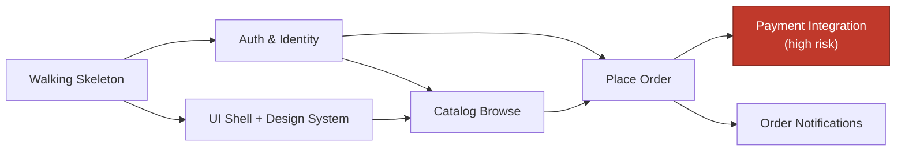
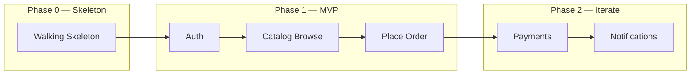

# Diagram Guide

The plan's main diagram is a **dependency graph** showing the build order — which
slices/epics must precede which. Optionally, a **phase/milestone view** for larger
plans. Embed both as Mermaid in the document so it stays one portable artifact.

## Reliability rules (read first)

Same rules that keep the other skills' diagrams from breaking:

- **Quote any node text** with spaces or punctuation: `auth["Auth & Identity"]`.
- **Keep edge labels short and quoted:** `auth -->|"needed by"| orders`.
- Prefer plain `graph` / `flowchart` for portability.
- Never use the bare word `end` as an id or unquoted label — it breaks the
  parser. Write `"End"` or use a different id.

---

## Dependency graph

Nodes are epics or features; edges mean "must come before". Read left-to-right as
build order. Put the walking skeleton as the root everything descends from.

Highlighting the high-risk nodes (as above) makes the "pull risk forward"
reasoning visible at a glance.

## Phase / milestone view (optional, for larger plans)

A simple grouped view of which slices land in which milestone. Subgraphs read as
phases; keep the flow left-to-right.

## Timeline (optional)

If the user wants calendar framing, a Mermaid `gantt` works, but it's more
finicky to render than the graphs above and invites false precision on dates.
Prefer the phase view unless real dates are required; if you do use `gantt`, keep
it to a few bars and avoid over-committing to durations.

---

## Diagram checklist

- A dependency graph rooted at the walking skeleton, reading as build order.
- High-risk / high-uncertainty nodes visually marked.
- All node text with spaces/punctuation quoted; no bare `end`.
- Edge labels short and meaningful where they add clarity.
- The graph matches the written build sequence and the first-slice choice.
