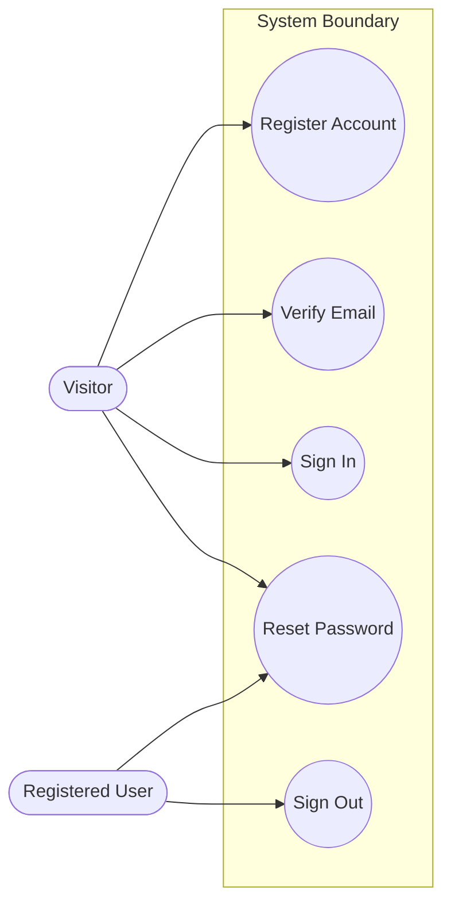

# Use-Case Guide

The use-case document (`docs/use-cases.md`) is **use-case-centric**: detailed
textual specifications are the substance, and a light **Mermaid approximation**
diagram provides the visual. No user stories — this is the traditional use-case
form. Use cases are derived from the functional requirements and trace back to
them by ID.

## Textual use-case specification (the substance)

Write one specification per use case. Cover the standard fields:

```markdown
### UC-001: Register a new account

- **ID:** UC-001
- **Actors:** Visitor (primary)
- **Description:** A new visitor creates an account so they can access the system.
- **Preconditions:** The visitor is not authenticated; the email is not already
  registered.
- **Postconditions (success):** An unverified account exists; a verification
  email has been sent.
- **Traces to:** FR-AUTH-001, FR-AUTH-002

**Main success scenario**
1. Visitor opens the registration page.
2. Visitor submits name, email, and password.
3. System validates the input (email format, password policy, email uniqueness).
4. System creates the account in an unverified state.
5. System sends a verification email.
6. System shows a "check your email" confirmation.

**Alternate flows**
- 3a. Email already registered → System shows an error and offers sign-in / reset.

**Exception flows**
- 5a. Email service unavailable → System queues the email and informs the user
  verification may be delayed.
```

Guidance:
- **Derive from FRs, don't duplicate them.** A use case shows the actor's
  goal-oriented journey across steps; the FRs are the atomic shall-statements it
  realizes. Always fill the **Traces to** field — it's what feeds the RTM.
- **Cover the consequential alternates and exceptions**, not just the happy path —
  validation failures, permission denials, unavailable dependencies. This is
  where use cases earn their value over a bare requirement list.
- **One goal per use case.** "Manage account" is too broad; split into register,
  sign in, reset password, etc.
- **Checkpoint per use case** — append each finished spec to `docs/use-cases.md`
  and update the progress tracker.

## Use-case diagram (Mermaid approximation)

Mermaid has no native UML use-case diagram, so approximate it: **actors** as
stadium nodes, **use cases** as circular nodes, the **system boundary** as a
subgraph. Group related use cases per diagram (one per major area) rather than
one giant diagram. Keep the reliability rules: quote text with spaces, no bare
`end`.



Notes:
- Use `(["..."])` (stadium) for actors and `(("..."))` (circle) for use cases —
  this reads as the closest Mermaid approximation to UML actors and ovals.
- For `<<include>>` / `<<extend>>` relationships, use a labeled dashed edge
  between use cases: `uc1 -.->|"«include»"| uc2`. Use sparingly; only where it
  genuinely clarifies.
- One diagram per capability area keeps each readable; reference each diagram
  from the corresponding section.

## Right-sizing

Specify a use case for each meaningful actor-goal in the functional
requirements. Simple CRUD on a minor entity doesn't each need a full use case —
group trivial ones or cover them by the FR list. Reserve full specifications for
flows with real branching, multiple actors, or business significance.
