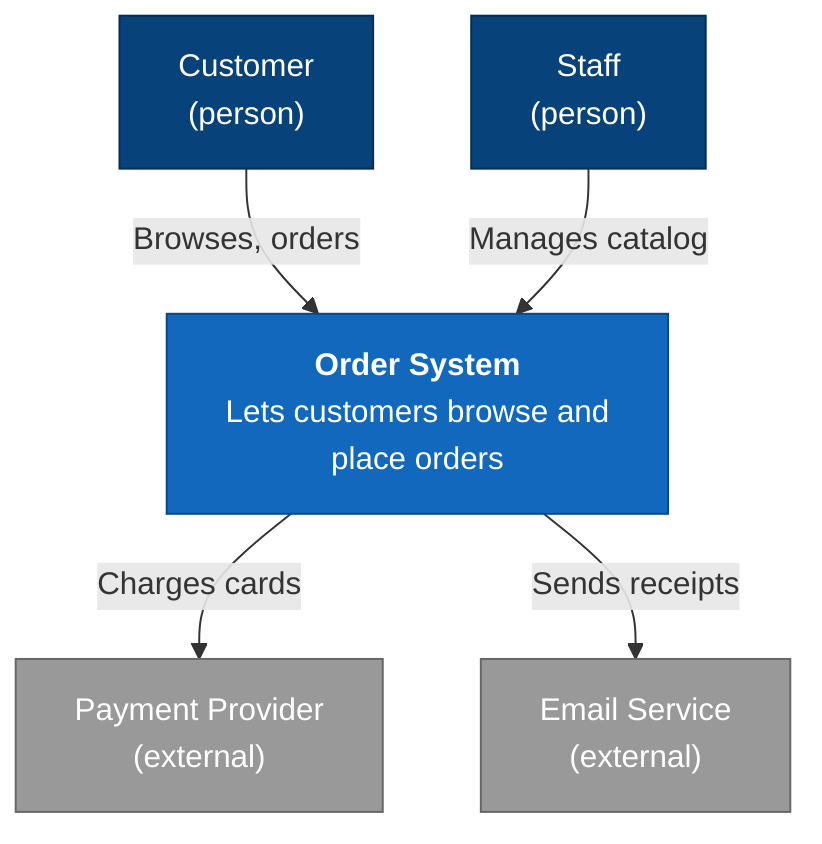
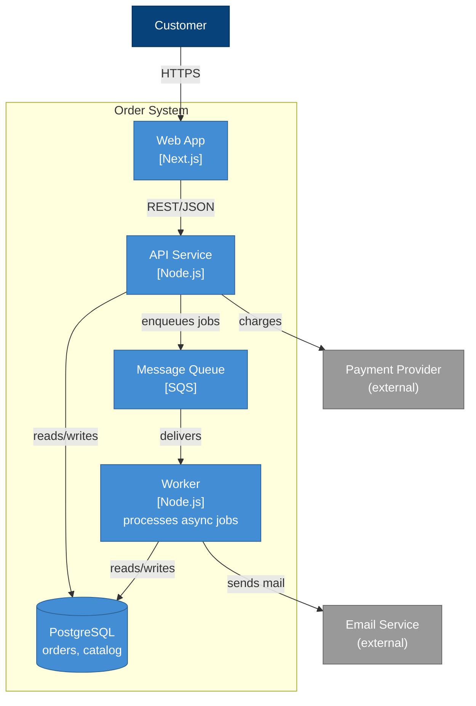
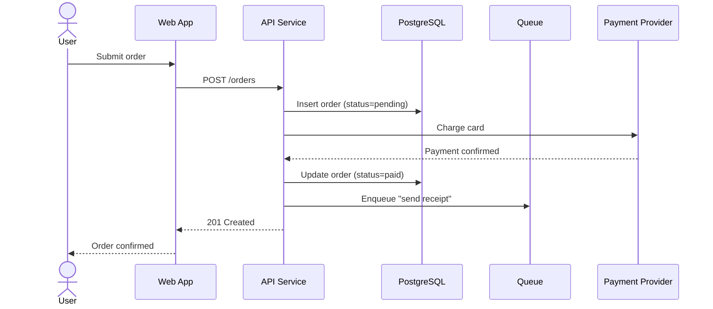
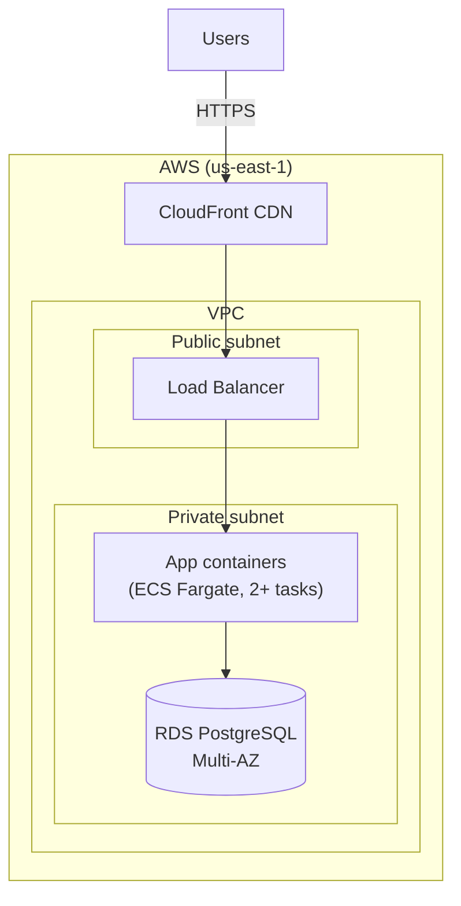
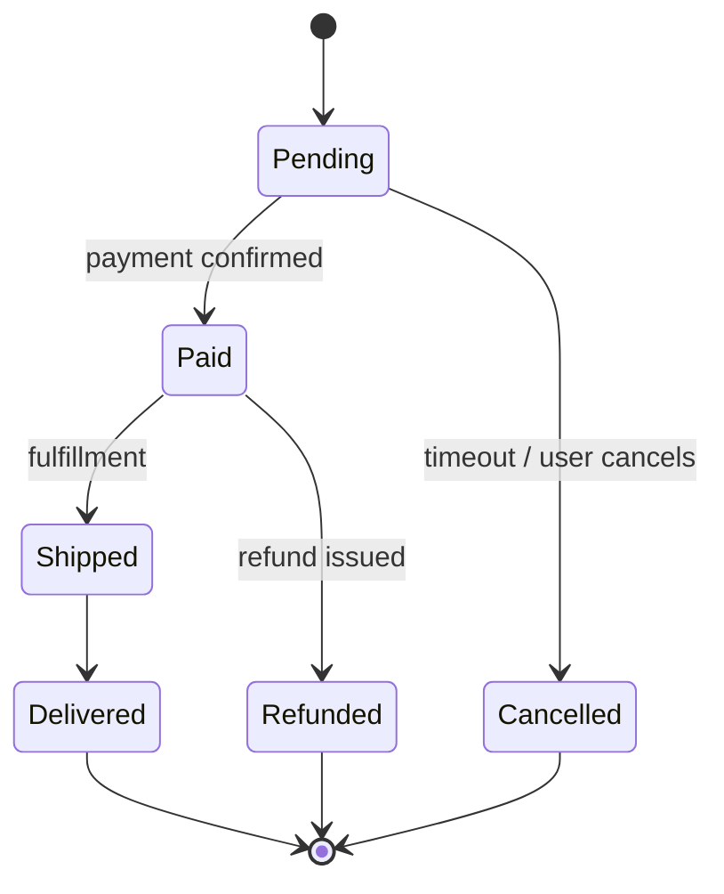

# Diagram Guide

Diagrams go **inline in the document as Mermaid code blocks**, so the document
stays a single portable artifact that renders on GitHub, GitLab, and most
Markdown viewers. Use the **C4 model** as the mental framework for *what* to
draw, and (by default) plain `flowchart`/`graph` syntax for *how* to draw it.

## The C4 model in one minute

C4 is a set of nested zoom levels. You rarely need all four:

1. **System Context** — the system as one box, surrounded by its users and the
   external systems it talks to. Answers "what is this and who/what does it
   interact with." *Almost always worth drawing.*
2. **Container** — zoom into the system to show its deployable/runnable units
   (web app, API, database, queue, etc.) and how they communicate. "Container"
   here means a runtime unit, not a Docker container specifically. *The single
   most useful architecture diagram; almost always draw this.*
3. **Component** — zoom into one container to show its internal parts. Draw only
   for containers complex enough to need it.
4. **Code** — class-level. Almost never worth maintaining by hand; skip.

Draw Level 1 and Level 2 by default. Add Level 3 only where a container is
genuinely intricate.

## Rendering reliability — read this first

Mermaid has dedicated `C4Context`/`C4Container` syntax, but its rendering is
still experimental and is **unreliable on GitHub and several common viewers**.
For a portable document, **default to `flowchart`/`graph` with subgraphs**,
styled to convey the C4 levels. It renders everywhere. Use the native C4 syntax
only if the user specifically wants it and you know their viewer supports it.

Two more reliability rules that prevent most broken diagrams:
- **Always quote node text** that contains spaces, punctuation, or special
  characters: `api["API Service"]`, `db[("PostgreSQL")]`.
- Keep edge labels short and quote them: `web -->|"REST/JSON"| api`.

---

## System Context (C4 Level 1) — reliable pattern

## Container (C4 Level 2) — reliable pattern

The workhorse. Show the runnable units inside the system boundary and the
external dependencies they touch.

## Runtime / sequence diagram

For the Runtime View. Sequence diagrams are well-supported and render reliably
everywhere — no special care needed beyond keeping them focused on one scenario.

## Deployment diagram

For the Deployment View, when topology is non-trivial. Group infrastructure with
subgraphs representing regions, zones, or networks.

---

## State diagram (optional)

When an entity has a meaningful lifecycle worth documenting (an order, a
subscription, a deployment), a state diagram earns its place:

---

## Diagram checklist

- Did you draw at least a Context and a Container diagram? (Default minimum.)
- Is every external system shown as external, and every internal unit inside the
  system boundary?
- Does every edge have a short, meaningful label (what flows, and how)?
- Did you quote all node text with spaces/punctuation?
- Will it render on the user's target viewer? (Default to `graph`/`flowchart`
  for portability; only use native `C4*` syntax when you know it's supported.)
- Is the diagram telling the same story as the prose around it?
