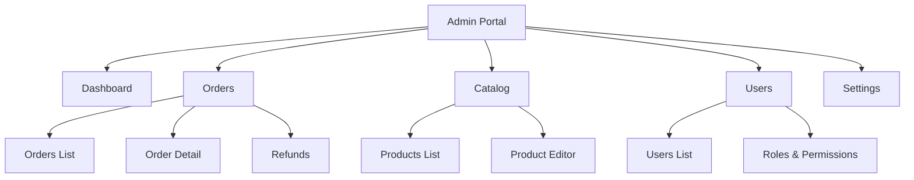
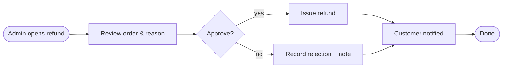
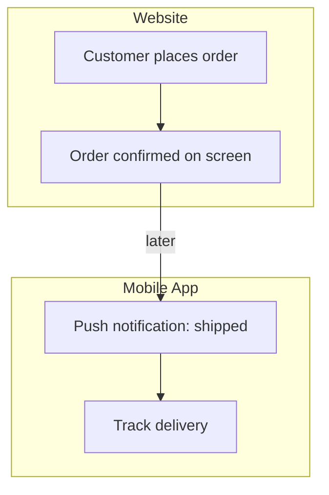

# Diagram Guide

Two diagram types carry most of the UX-foundations document: **sitemaps** (the IA
of each surface) and **user flows** (the critical journeys). Embed both as Mermaid
in the document so it stays one portable artifact that renders on GitHub.

## Reliability rules (read first)

The same rules that keep architecture diagrams from breaking apply here:

- **Quote any node text** with spaces or punctuation: `dash["Dashboard"]`,
  `orders["Orders List"]`.
- **Keep edge labels short and quoted:** `login -->|"success"| home`.
- Prefer plain `graph` / `flowchart` over experimental diagram types for
  portability.
- Don't use the literal word `end` as node text or an id (it breaks the parser);
  write `"End"` in quotes or use a different label like `done`.

---

## Sitemap (information architecture)

A top-down tree of a surface's sections and key screens. One sitemap per surface.

For a multi-surface product, give each surface its own sitemap rather than one
giant tree — they have different roots and navigation models.

## User flow

The end-to-end path for one important job, across screens, including the
consequential branches (errors, empty, permission). Use a left-to-right
`flowchart` with diamonds for decisions.

Keep each flow to a single job. If a flow sprawls, it's usually two flows.

## Cross-surface flow (optional)

When a journey hops between surfaces, show the surface as a lane using subgraphs,
so it's clear where the user is at each step.

## User-type / navigation map (optional)

When several roles see different navigation, a simple map of role to top-level
sections can clarify access at a glance — a plain `graph LR` from each role node
to the sections it reaches.

---

## Diagram checklist

- One sitemap per surface, rooted at that surface.
- A flow diagram for each critical job (happy path plus the edge cases that
  matter).
- All node text with spaces/punctuation quoted; no bare `end`.
- Labels on decision branches ("yes"/"no", "success"/"error").
- The diagrams say the same thing as the surrounding prose and the screen
  inventory.
