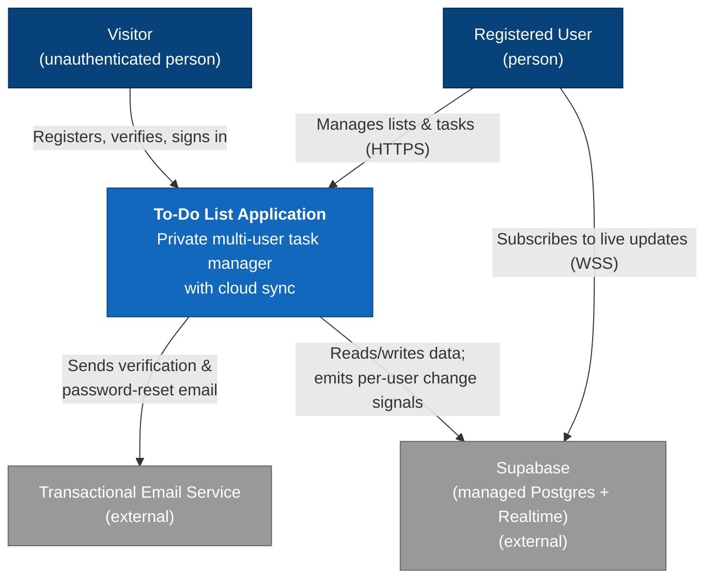
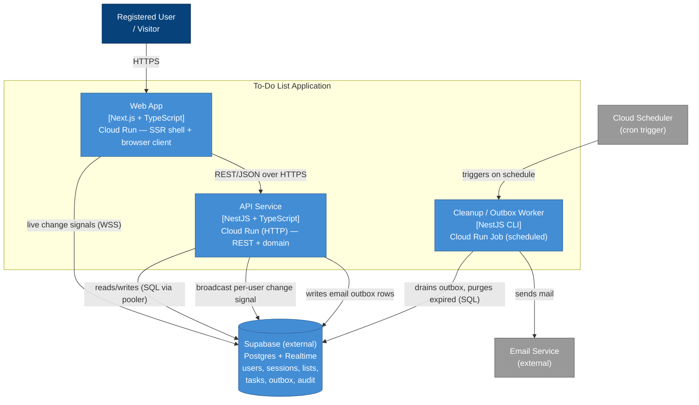
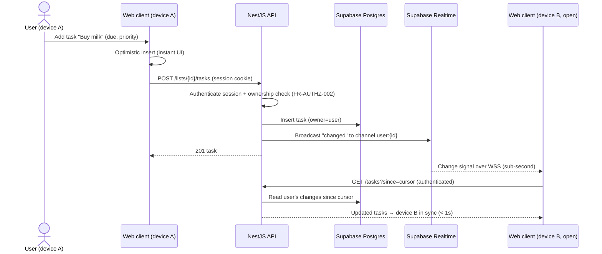
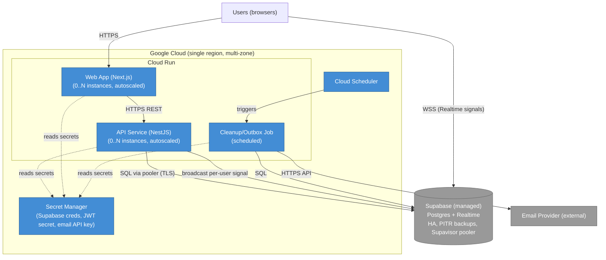

# Architecture: To-Do List Application

> Status: Draft · Last updated: 2026-07-15 (rev 2 — stack refinement: Next.js /
> NestJS / Supabase) · Author: Software Architecture
> Source of truth for requirements: [`docs/srs.md`](./srs.md) (v1.0). Use cases:
> [`docs/use-cases.md`](./use-cases.md). This document decides *how*; the SRS
> defines *what*.

## 1. Introduction and Goals

The To-Do List Application is a multi-user, web-based personal task manager: each
registered user privately manages tasks organized into named lists, with due
dates, priorities, search/filter, and cloud sync across their devices (see SRS
§1.2). This document specifies the technical architecture that realizes the SRS
requirements. It is intentionally right-sized for a lean MVP built by a very
small team.

**Top quality goals (ranked).** Every decision below traces to these:

1. **Simplicity / maintainability by a tiny team** — NFR-MAINT-001/002/003. A
   solo-to-pair team must be able to build, operate, and evolve this. This is the
   overriding driver and the reason we resist distributed complexity.
2. **Availability & durability** — NFR-REL-001 (99.9% uptime), NFR-REL-002 (RPO ≤
   1h / RTO ≤ 4h), NFR-REL-003 (no single-node data loss). It's a trust product
   (goal G5); losing tasks is unacceptable.
3. **Security** — NFR-SEC-001..010. Accounts, credentials, and personal data
   demand encryption, safe auth, OWASP coverage, and audit logging.
4. **Performance & elastic scale** — NFR-PERF-001 (p95 < 300 ms), NFR-PERF-004
   (sync < 5 s), NFR-SCAL-001/003 (10k users / 1k concurrent, stateless scale-out).

Portability (NFR-PORT-001) is a cross-cutting constraint applied throughout
rather than a ranked goal.

## 2. Constraints

| # | Constraint | Source | Architectural consequence |
| :- | :--------- | :----- | :------------------------ |
| C-1 | Web only; responsive; latest 2 versions of major browsers | SRS §2.5, NFR-COMPAT-001/002 | Web client (Next.js) + HTTP API; no native app tier |
| C-2 | HTTPS/TLS only | SRS §2.5, NFR-SEC-001 | TLS termination at the edge; HTTP→HTTPS redirect |
| C-3 | Very small team (solo / 1–2 devs) | Interview | Modular monolith, managed data store, minimal moving parts |
| C-4 | TypeScript full-stack: **Next.js** (web) + **NestJS** (API) | Interview | Two deployables — Next.js web tier, NestJS modular-monolith API; shared TS types |
| C-5 | **Cloud Run** for compute; **Supabase** for managed Postgres + Realtime | Interview | Stateless containers on Cloud Run; data and change-streams on Supabase (separate managed provider) |
| C-6 | Stay portable (avoid deep vendor lock-in) | Interview, NFR-PORT-001 | Standard Postgres (pg_dump-portable), provider-agnostic domain logic, thin adapters; Supabase Realtime is an accepted, isolated coupling |
| C-7 | One external dependency: transactional email | SRS §3.2 SW-001 | Email behind a swappable port; failures must not block user actions (SW-002) |
| C-8 | No formal compliance regime, but privacy good practice + export/delete | SRS NFR-COMP-001, FR-DATA | Data export/delete built in; no residency constraint |

## 3. Context and Scope

The system serves two human actors (Visitor, Registered User) and depends on two
external managed platforms: a transactional Email Service and Supabase (managed
Postgres + Realtime change-streams). It exposes no public API and has no inbound
integrations in the MVP (SRS SW-003).



**External interfaces.** Client ↔ system over HTTPS/JSON (SRS COM-001/002); client
↔ Supabase Realtime over a secure WebSocket for live update signals (see ADR-006);
system ↔ Supabase Postgres over TLS via a connection pooler; system ↔ email
provider over the provider's secure API or authenticated SMTP/TLS (COM-003).

## 4. Solution Strategy

The architecture in a nutshell — each item is expanded in an ADR (§9):

- **Modular monolith** — a single NestJS/TypeScript API application with clean
  internal module boundaries mirroring the SRS capability areas (auth, lists,
  tasks, search, account-data). *(ADR-001)*
- **TypeScript full-stack** — Next.js web tier + NestJS API, one language, shared
  types. *(ADR-002)*
- **PostgreSQL on Supabase** as the single system of record; relational data,
  transactional ownership, standard Postgres for portability. *(ADR-003)*
- **Containerized on Google Cloud Run** — stateless, auto-scaling Next.js and
  NestJS services; portable container images; Supabase Postgres reached through
  its connection pooler behind a standard driver. *(ADR-004)*
- **Server-side opaque session tokens** in Postgres for easy revocation (over
  JWT); Supabase Auth deliberately not used. *(ADR-005)*
- **Supabase Realtime** for cross-device sync — a per-user change signal pushes
  clients to refetch, keeping the API stateless and data authorization in NestJS.
  *(ADR-006)*
- **Transactional outbox + scheduled worker** for outbound email and periodic
  cleanup (soft-delete purge), so email failures degrade to delay, not error.
  *(ADR-007)*

## 5. Building Block View

The system is a Next.js web tier plus a NestJS API deployed as two runtime
entrypoints (an HTTP service and a scheduled job) that share the domain modules;
both use Supabase-managed Postgres as the system of record and Supabase Realtime
as the change-signal channel.



**Building blocks:**

- **Web App (Next.js/TS, Cloud Run).** Responsive app rendering lists, tasks, and
  smart views; a server-rendered shell (helping first paint, NFR-PERF-002) with an
  interactive browser client that does optimistic updates and subscribes to a
  per-user Supabase Realtime channel to trigger refetches (ADR-006). It calls the
  NestJS API for all data; it holds no business logic beyond presentation/BFF glue.
- **API Service (NestJS/TS, Cloud Run).** The heart. Stateless HTTP service that
  authenticates requests, enforces per-user ownership (SRS FR-AUTHZ), and exposes
  REST endpoints. NestJS modules (dependencies point inward toward the domain):
  - `auth` — registration, verification, sign-in/out, password reset/change,
    sessions, rate-limit/lockout (FR-AUTH-*).
  - `lists` — list CRUD, default Inbox, ordering (FR-LIST-*).
  - `tasks` — task CRUD, completion, due/priority, soft-delete/restore (FR-TASK-*).
  - `search` — keyword search, status/due filters, smart views (FR-SRCH-*).
  - `account-data` — export (JSON), account deletion (FR-DATA-*).
  - `profile` — display name, timezone, theme (FR-PROF-*).
  - Cross-cutting: `authz` (ownership guard), `audit` (security event log),
    `email` (port to the provider), `outbox` (writer), `realtime` (per-user change
    broadcaster).
- **Cleanup/Outbox Worker (NestJS CLI, Cloud Run Job).** Same codebase, batch
  entrypoint. Triggered by Cloud Scheduler (~every minute): drains the email
  outbox with retry/backoff, and purges soft-deleted tasks past the 30-day
  retention window (FR-TASK-015).
- **Supabase Postgres + Realtime (external managed platform).** Single relational
  store. Core tables: `users`, `sessions`, `lists`, `tasks`, `email_outbox`,
  `audit_log`. Standard Postgres — no proprietary extensions required, so the data
  layer stays pg_dump-portable (C-6). Reached via Supabase's connection pooler
  (Supavisor) to fit Cloud Run's many-short-lived-instances model. Realtime is used
  only as a per-user notification channel (ADR-006), not as a data-access path.

## 6. Runtime View

Two scenarios show the load-bearing behavior; both trace to use cases.

**6.1 Register a new account [UC-001] — async email via outbox.** Shows how email
failure becomes a delay, not a blocked action (SW-002).

```mermaid
sequenceDiagram
    actor V as Visitor
    participant SPA as Next.js Web
    participant API as NestJS API
    participant DB as Supabase Postgres
    participant WK as Worker (scheduled)
    participant EM as Email Service

    V->>SPA: Submit email + password
    SPA->>API: POST /auth/register
    API->>API: Validate format + password policy (NFR-SEC-003)
    API->>DB: BEGIN; insert user (unverified),<br/>create Inbox list, insert verification outbox row; COMMIT
    API-->>SPA: 201 "Check your email"
    Note over WK,EM: Later (within seconds), on schedule
    WK->>DB: Fetch pending outbox rows
    WK->>EM: Send verification email
    EM-->>WK: Accepted
    WK->>DB: Mark outbox row sent
    Note over WK,EM: If EM is down → row stays pending,<br/>retried with backoff (SW-002)
```

**6.2 Create a task and sync to another device [UC-009, NFR-PERF-004].** Supabase
Realtime pushes a per-user change signal; the client refetches through the API,
which stays the sole authority for data access.



## 7. Deployment View

Single region to start (adequate for 99.9%; multi-AZ within the region via
managed services). All compute is stateless and horizontally auto-scaled by Cloud
Run; all durable state lives in Supabase-managed Postgres with automated backups,
PITR, and HA; Supabase Realtime provides the live-update channel.



- **Environments:** dev, staging, prod (same container images, different
  config/secrets), each with its own Supabase project.
- **Scaling:** Cloud Run scales web and API instances on concurrency; statelessness
  (ADR-005/006) makes this safe. The Supabase connection pooler (Supavisor) absorbs
  the many short-lived Cloud Run connections; Supabase Postgres scales vertically
  with a read replica available if read load grows (NFR-SCAL-002).
- **Portability note:** compute maps 1:1 onto AWS (Fargate + EventBridge + Secrets
  Manager) or Azure; the Postgres data moves via `pg_dump`/`pg_restore` to RDS or
  any Postgres. The one non-portable piece is **Supabase Realtime** — on another
  provider it is replaced by a pub/sub + WebSocket gateway, or by the adaptive-poll
  fallback (see ADR-006). This is the coupling we consciously accept for a
  materially better sync experience.

## 8. Cross-cutting Concepts

**Security (NFR-SEC-*).**
- TLS 1.2+ everywhere; HTTP redirects to HTTPS (NFR-SEC-001).
- Passwords hashed with an adaptive algorithm (Argon2id or bcrypt), never stored
  reversibly (NFR-SEC-005); policy enforced with a breached-password check
  (NFR-SEC-003).
- **AuthN:** opaque session tokens (ADR-005) in an HTTP-only, Secure, SameSite
  cookie (NFR-SEC-007); CSRF protection via SameSite + token check.
- **AuthZ:** every data operation runs through an ownership guard that scopes
  queries to `owner_id = current_user` (FR-AUTHZ-002/003/005); "not found" is
  returned uniformly for missing-or-forbidden to prevent enumeration.
- **Rate limiting / lockout:** account-level failed-attempt counter + temporary
  lock in Postgres (FR-AUTH-019); per-IP throttling on auth endpoints via a
  DB-backed sliding window at MVP scale, offloadable to edge rate limiting
  (Cloud Armor / CDN) if abuse grows (FR-AUTH-018, NFR-SEC-006).
- **Audit log:** security-relevant events (sign-in success/failure, password
  change/reset, account deletion) appended to `audit_log`, retained ≥ 90 days
  (NFR-SEC-009).
- **Secrets:** DB credentials and the email API key in Secret Manager; nothing in
  source (NFR-MAINT-003). OWASP Top 10 addressed via parameterized queries, output
  encoding in React, security headers, and dependency scanning in CI (NFR-SEC-008/010).

**Data (NFR-REL-002/003).**
- Single Supabase-managed Postgres system of record; relational integrity via
  foreign keys (`lists.owner_id`, `tasks.list_id`, `tasks.owner_id`) and
  transactions. Standard Postgres only — no proprietary extensions (C-6).
- **Connection management:** the NestJS API and worker connect through Supabase's
  pooler (Supavisor) so Cloud Run's many short-lived instances don't exhaust
  Postgres connection limits.
- **Soft delete:** tasks carry `deleted_at`; normal queries filter it out; the
  worker hard-deletes rows past 30 days (FR-TASK-013/015).
- **Migrations:** versioned schema migrations run on deploy (e.g., Prisma/Knex
  migrate) against the environment's Supabase project.
- **Backup/recovery:** Supabase automated daily backups + point-in-time recovery
  meet RPO ≤ 1h / RTO ≤ 4h (NFR-REL-002) on a plan that includes PITR and HA,
  surviving a zone loss (NFR-REL-003). *Confirm the Supabase plan tier provides
  PITR + HA — a prerequisite for these targets.*

**Resilience and error handling (SRS §3.2, SW-002).**
- **Email** is fully decoupled via the outbox: user actions never block on it;
  sends retry with exponential backoff and a dead-letter threshold surfaced for
  ops (ADR-007).
- **Supabase Postgres** is the system of record and therefore a hard dependency;
  its managed HA/availability is part of the uptime budget (see Risks §11). The
  API applies query timeouts and retries transient pooler errors.
- **Supabase Realtime** is a best-effort *optimization*, not a source of truth: if
  a signal is missed or the WebSocket drops, the client still refetches on
  reconnect and on window focus, and can fall back to light polling — so a Realtime
  outage degrades sync latency, it does not lose or corrupt data (NFR-REL-004).
- API applies request timeouts and returns explicit, typed error responses; the
  web client renders clear loading/empty/error states (NFR-USE-003) and preserves
  unsent input where possible (NFR-REL-004).
- Writes are idempotent where retried (outbox rows keyed; task creation
  deduplicated by a client-supplied request id for optimistic retries).

**Observability (NFR-OBS-*).**
- Structured JSON logs to Cloud Logging (NFR-OBS-001); a `/healthz` endpoint for
  uptime checks (NFR-OBS-002); request-latency and error-rate metrics with alerts
  on p95 latency and error-rate thresholds (NFR-OBS-003).

**Performance and scaling (NFR-PERF-*, NFR-SCAL-*).**
- Stateless API → horizontal scale-out on Cloud Run (NFR-SCAL-003).
- Indexed queries: `(owner_id, list_id)`, `(owner_id, due_at)`, and a title index
  for search keep p95 < 300 ms and search < 500 ms at 5k tasks/user
  (NFR-PERF-001/003).
- Supabase Realtime push + `since`-cursor refetch gives sub-second cross-device
  sync well within the 5 s target (NFR-PERF-004), without server-side polling load.
- Next.js server-rendered shell plus CDN/edge caching of static assets gives fast
  first paint (NFR-PERF-002).

## 9. Architecture Decisions

### ADR-001: Modular monolith rather than microservices

**Status:** Accepted
**Date:** 2026-07-15
**Requirements addressed:** NFR-MAINT-001/002 (small-team maintainability),
NFR-SCAL-001/003 (modest, uniform load), constraint C-3 (solo/pair team)

**Context**
The SRS defines seven capability areas (auth, authz, profile, lists, tasks,
search, account-data), none with a materially different load or criticality
profile — it is one private-per-user CRUD domain. The team is one to two
engineers. Top goal is simplicity and speed with low ops burden.

**Decision**
We will build a single deployable modular monolith with strict internal module
boundaries aligned to the capability areas, dependencies pointing inward toward
the domain, and no shared mutable state across modules.

**Options considered**
- **Modular monolith (chosen)** — one service. Pro: trivial to build/operate, no
  network or distributed-consistency tax, clean seams allow a later split. Con:
  scales/deploys as one unit.
- **Microservices** — per-area services. Pro: independent scaling/deploy. Con:
  distributed-systems complexity a tiny team can't absorb, for scaling we don't
  need. Lost on C-3 and the uniform load profile.

**Consequences**
One thing to build, test, deploy, and monitor. If an area later diverges in load
or ownership, the enforced boundaries let us extract it without a rewrite. Cost
accepted: whole-app scaling (fine — the app is stateless and scales horizontally)
and the discipline to keep module seams clean (enforced via lint/dependency
rules).

### ADR-002: TypeScript full-stack — Next.js web + NestJS API

**Status:** Accepted
**Date:** 2026-07-15
**Requirements addressed:** Constraint C-4 (stated stack), NFR-COMPAT-001/002
(responsive web), NFR-MAINT-001/002 (maintainability), NFR-PERF-002 (first paint)

**Context**
A responsive web app (C-1) built by a small TypeScript team. Shared language
across tiers reduces context-switching and lets validation types/DTOs be shared.
The team has chosen Next.js for the web tier and NestJS for the API.

**Decision**
We will build the web tier in **Next.js** (server-rendered shell plus an
interactive browser client, with light BFF glue) and the API in **NestJS** as a
modular monolith (ADR-001), sharing TypeScript types across the boundary. The
NestJS API owns all domain logic and is the sole authority for data access.

**Options considered**
- **Next.js + NestJS (chosen)** — Next.js gives an SSR shell (helping first paint,
  NFR-PERF-002) and a rich client for the interactive task board; NestJS gives
  opinionated modules, DI, and first-class testing that map cleanly onto the SRS
  capability areas and keep the domain API reusable and independently deployable.
  Con: two deployables and two build pipelines.
- **Next.js full-stack (API routes, no separate NestJS)** — one app, but couples
  the domain API to the web framework and its runtime, and offers weaker structure
  for a growing modular domain. Rejected to keep the domain API isolated, testable,
  and portable.
- **Plain React SPA + Express** — lighter, but forgoes NestJS's module/DI/testing
  scaffolding that suits the capability-area boundaries. Lost on structure.
- **Python/other backend** — forces two languages and loses shared types. Lost on
  team preference and cohesion.

**Consequences**
Strong backend structure (NestJS) plus a fast, first-paint-friendly web tier
(Next.js), with shared contracts. We accept two services to build and deploy —
mitigated by one repo, one language, and one CI pipeline. The clean web/API split
also lets each scale independently on Cloud Run (ADR-004).

### ADR-003: PostgreSQL as the single system of record

**Status:** Accepted
**Date:** 2026-07-15
**Requirements addressed:** FR-LIST-*, FR-TASK-*, FR-AUTHZ-002/004 (ownership),
NFR-REL-002/003 (durability), NFR-PERF-003 (search), NFR-SCAL-002

**Context**
Data is clearly relational: users own lists, lists contain tasks, everything is
scoped by ownership with referential integrity and transactional updates (e.g.,
delete-list cascades to tasks, FR-LIST-007). Volume is modest (≤ 5k tasks/user).
Search is substring-on-title, not full-text-scale. Portability matters (C-6).

**Decision**
We will use a single PostgreSQL database, provisioned as **Supabase-managed
Postgres**, as the system of record, using standard Postgres features only and
connecting through Supabase's pooler (Supavisor).

**Options considered**
- **Postgres, provider = Supabase (chosen)** — relational integrity, transactions,
  good-enough search (`ILIKE`/trigram index) at this scale; managed backups/PITR/HA
  and a built-in connection pooler that suits Cloud Run; standard Postgres stays
  pg_dump-portable. Con: a second managed provider alongside GCP, and its
  availability enters the uptime budget (Risks §11).
- **Postgres on Cloud SQL** — keeps everything in GCP, but the team chose Supabase;
  Cloud SQL lacks the built-in pooler/Realtime niceties. (Either remains a drop-in
  Postgres if we ever migrate — the data is portable.)
- **Document store (e.g., Firestore/Mongo)** — easy scale, but the data is
  relational and ownership/cascade logic would fight a document model; Firestore
  also deepens single-vendor lock-in (against C-6). Lost.
- **Postgres + dedicated search engine** — unnecessary for substring title search
  at 5k tasks/user; adds a store to run. Deferred until search needs grow.

**Consequences**
One store to back up and reason about; strong consistency within a user's data
for free; managed pooler removes Cloud Run connection-exhaustion risk. The data
stays portable (pg_dump → any Postgres). We accept running migrations, a
trigram/index strategy for search, and a dependency on Supabase's managed
availability. Choosing Supabase Postgres also makes Supabase Realtime available at
no extra infrastructure (ADR-006).

### ADR-004: Containerized deployment on Google Cloud Run with a portability boundary

**Status:** Accepted
**Date:** 2026-07-15
**Requirements addressed:** NFR-SCAL-003 (stateless horizontal scale), NFR-REL-001
(99.9%), NFR-REL-005 (zero-downtime deploys), NFR-PORT-001 (portable),
constraints C-5, C-6

**Context**
Traffic for a personal to-do app is low-to-moderate and spiky (daytime bursts,
quiet nights). The team wants minimal ops and chose Cloud Run, but also wants to
avoid deep lock-in.

**Decision**
We will package the Next.js web tier and the NestJS API as standard container
images, run each as its own Cloud Run service (plus the worker as a Cloud Run
Job), against Supabase Postgres via its pooler — keeping domain logic free of
provider SDKs and isolating provider touchpoints (email, secrets, scheduler,
Realtime) behind thin adapters.

**Options considered**
- **Managed containers on Cloud Run (chosen)** — autoscaling incl. scale-to-zero,
  rolling zero-downtime deploys, pay-per-use, and — crucially — a *portable
  container* that runs on any container platform. Con: request-scoped compute
  discourages long-lived connections (shapes ADR-006) and in-process background
  work (shapes ADR-007).
- **Serverless functions (Cloud Functions/Lambda)** — fine-grained scale but more
  vendor-coupled and awkward for a cohesive monolith. Lost on portability and
  monolith fit.
- **Kubernetes (GKE)** — maximum control/portability, but a large ops commitment a
  tiny team shouldn't take on. Lost on C-3.

**Consequences**
Cheap, elastic, low-ops, and movable — the containers and standard Postgres port
to AWS/Azure with only manifest changes; the one isolated coupling is Supabase
Realtime (ADR-006). We accept Cloud Run's no-in-process-worker constraint (handled
by a scheduled Job, ADR-007). Notably, Cloud Run's aversion to long-lived server
sockets is *sidestepped rather than fought*: live push is provided by Supabase
Realtime, so clients hold the WebSocket to Supabase — not to our stateless Cloud
Run services (ADR-006).

### ADR-005: Server-side opaque session tokens rather than stateless JWTs

**Status:** Accepted
**Date:** 2026-07-15
**Requirements addressed:** FR-AUTH-011 (logout), FR-AUTH-016 (long-lived
sessions), FR-AUTH-017 (invalidate all sessions on password change/reset),
FR-DATA-005 (terminate sessions on delete), NFR-SEC-007

**Context**
Sessions are long-lived until logout (FR-AUTH-016), but must be *revocable*
server-side on logout, password change/reset, and account deletion. Stateless
JWTs are hard to revoke before expiry without extra machinery.

**Decision**
We will issue opaque random session tokens, store their hashes in a `sessions`
table (user_id, created_at, last_used_at), and validate each request against it.
The token is carried in an HTTP-only, Secure, SameSite cookie.

**Options considered**
- **Opaque server-side sessions (chosen)** — instant revocation (delete the row/
  all user rows), no token-secret rotation problem. Con: a DB lookup per
  authenticated request (cheap at this scale; cacheable later).
- **Stateless JWT** — no per-request lookup, but revocation requires a denylist or
  a per-user token-version column checked in the DB anyway — reintroducing the
  lookup while adding key-management burden. Lost on the revocation requirements.
- **Supabase Auth (GoTrue)** — would remove most auth code, but couples the exact
  FR-AUTH flows, emails, and session semantics defined in the SRS to Supabase's
  model and deepens provider lock-in (against C-6). Deliberately **not adopted**:
  the Supabase-scope decision is Postgres + Realtime only; authentication stays in
  NestJS for control and portability.

**Consequences**
Logout and "invalidate all sessions" are a one-line delete (FR-AUTH-017,
FR-DATA-005); no JWT key management. We accept one indexed DB read per request;
if it ever shows up in latency budgets we add a short-TTL cache. Keeps the API
stateless (no server-side session affinity), preserving ADR-004's scaling.

### ADR-006: Supabase Realtime for cross-device sync

**Status:** Accepted (supersedes the earlier adaptive-polling decision)
**Date:** 2026-07-15
**Requirements addressed:** NFR-PERF-004 (change visible on other online devices
< 5 s), UC-009/UC-010/UC-011, NFR-SCAL-001/003, constraints C-5, C-6

**Context**
A change on one device should appear on the user's other online devices within
5 s. Because the data layer is now Supabase (ADR-003), its **Realtime** service —
WebSocket delivery of change signals — is available at no extra infrastructure.
Cloud Run's request-scoped, multi-instance model makes *self-hosted* server push
awkward (a socket on one instance can't see a write on another without a shared
pub/sub), but Supabase hosts the socket, so that problem disappears. One wrinkle:
we deliberately don't use Supabase Auth or RLS (ADR-005, Supabase-scope decision),
so we cannot lean on RLS to authorize per-user subscriptions or stream raw
Postgres changes to clients (that would leak other users' rows).

**Decision**
Use Supabase Realtime as a **per-user change-notification channel, not a data
path**:
1. On every committed write, the NestJS API publishes a content-free "changed"
   signal (carrying only a change cursor) to a per-user Broadcast channel
   `user:{id}`.
2. The web client subscribes only to its own `user:{id}` channel, authorized by a
   short-lived Supabase-compatible JWT that NestJS mints (signed with the project
   JWT secret, carrying the user id) — clients cannot subscribe to others'
   channels.
3. On a signal, the client refetches the affected data **through the authenticated
   NestJS API**, which stays the sole enforcer of ownership (FR-AUTHZ). Since the
   signal carries no task content, even a mis-scoped channel would leak nothing.

The client keeps optimistic updates for its own actions and falls back to
refetch-on-focus / light polling if the socket drops.

**Options considered**
- **Realtime Broadcast + API refetch (chosen)** — sub-second sync, no self-hosted
  socket infra, no polling load, and data authorization stays entirely in NestJS.
  Con: a Supabase-specific client coupling, and NestJS must mint Realtime-scoped
  tokens.
- **Realtime "Postgres changes" streamed straight to clients** — simplest to wire,
  but needs RLS (which we're not using) to stop clients seeing others' row changes,
  and exposes the data model directly to the client. Rejected on security/scope.
- **Adaptive client polling (the previous decision, now the fallback)** — no
  coupling, fully portable, but ~5 s latency and constant poll load. Retained only
  as the degradation path and the portability substitute. Lost on sync quality now
  that Realtime comes free with Supabase.
- **Self-hosted WebSocket/SSE + pub/sub (Redis / LISTEN-NOTIFY)** — portable
  real-time, but adds a stateful component and ops we don't need when Supabase
  provides it managed. Deferred.

**Consequences**
True sub-second multi-device sync (comfortably meeting NFR-PERF-004) with no
polling load and a still-stateless API (preserving ADR-004 scaling). We accept a
Supabase-specific client coupling and the minor complexity of minting scoped
Realtime tokens in NestJS. Portability is preserved by design: the
signal-then-refetch pattern means Realtime can be swapped for another pub/sub +
socket gateway, or for the polling fallback, without touching domain logic or data
contracts. If real-time collaboration/sharing is ever added (out of scope today),
the per-user channel model extends naturally to shared-resource channels.

### ADR-007: Asynchronous outbound email via transactional outbox + scheduled worker

**Status:** Accepted
**Date:** 2026-07-15
**Requirements addressed:** SW-001/SW-002 (email integration; failures must not
block), FR-AUTH-005/013 (verification/reset emails), FR-TASK-015 (purge job),
UC-001/UC-005 exception flows

**Context**
Verification and reset emails must be sent reliably, but the email provider can be
slow or down, and SW-002 forbids blocking the user's primary action on it. Cloud
Run offers no always-on in-process worker (ADR-004). Soft-deleted tasks also need
periodic purging (FR-TASK-015).

**Decision**
API writes email intents to an `email_outbox` table in the same transaction as
the triggering action. A Cloud Run **Job**, triggered by Cloud Scheduler (~every
minute), drains the outbox (send → mark sent, with exponential backoff and a
dead-letter threshold) and purges tasks past the 30-day retention window. Email
delivery sits behind an `EmailPort` adapter (provider-swappable, C-6/C-7).

**Options considered**
- **Outbox + scheduled Job (chosen)** — atomic with the business write (no lost or
  phantom emails), simple, portable, no broker to run. Con: send latency bounded
  by the schedule interval (seconds–a minute) — acceptable for verification/reset.
- **Managed queue (Cloud Tasks/Pub-Sub)** — lower latency, but deepens GCP
  coupling (C-6) and adds a component; overkill at this volume. Available later if
  email latency becomes a concern.
- **Synchronous send in the request** — simplest, but violates SW-002 (a slow/down
  provider blocks or fails registration). Rejected.

**Consequences**
Email failures degrade to delay, not user-facing errors; the same worker handles
retention cleanup. We accept up-to-schedule-interval email latency and the need to
monitor the outbox dead-letter count (an ops alert). The `EmailPort` keeps the
provider swappable.

## 10. Quality Requirements (architecture-level scenarios)

| Scenario (derived from NFR) | Architectural mechanism |
| :-- | :-- |
| [NFR-PERF-001] p95 of create/complete/load-list < 300 ms | Indexed `(owner_id,...)` queries; stateless API near DB; connection pooling |
| [NFR-PERF-004] Change visible on other online device < 5 s | Supabase Realtime per-user broadcast signal + API refetch, sub-second (ADR-006) |
| [NFR-REL-001] ≥ 99.9% uptime | Cloud Run multi-instance autoscale + Supabase managed HA; rolling deploys (NFR-REL-005) |
| [NFR-REL-002/003] RPO ≤ 1h, RTO ≤ 4h, survive zone loss | Supabase automated backups + PITR + HA (plan tier permitting) |
| [NFR-SCAL-001] 10k users / 1k concurrent | Horizontal scale-out of stateless web/API; Supabase pooler + vertical scale + read replica headroom |
| [NFR-SEC-005/007] Safe credentials & sessions | Argon2id/bcrypt hashing; opaque revocable sessions in Secure/HTTP-only cookies (ADR-005) |
| [SW-002] Email provider down → no user-facing failure | Transactional outbox + retrying worker (ADR-007) |

## 11. Risks and Technical Debt

- **Realtime coupling & channel authorization (ADR-006).** Sync depends on
  Supabase Realtime and on NestJS correctly minting per-user-scoped Realtime
  tokens. A channel-scoping bug would at worst cause spurious refetches — no data
  leak, since signals are content-free and all data flows through the
  authenticated API — but the token-minting path must be explicitly tested. The
  polling fallback (former ADR-006 approach) remains the degradation/portability
  substitute.
- **Two managed providers in the availability budget.** Uptime now depends on both
  Cloud Run *and* Supabase. The 99.9% target (NFR-REL-001) must be reconciled with
  Supabase's SLA, and the chosen **Supabase plan tier must include PITR + HA** to
  satisfy NFR-REL-002/003. *Assumption to confirm before launch.*
- **Postgres connection pressure.** Even with the Supavisor pooler, high Cloud Run
  fan-out can pressure Postgres connections; monitor pool saturation and tune
  instance/concurrency limits.
- **Per-IP rate limiting in the DB.** A DB-backed sliding window is simple and
  portable but not the most efficient abuse defense at high volume; if abuse
  appears, move IP throttling to edge (Cloud Armor / CDN). *Assumption: MVP abuse
  volume is low.*
- **Session lookup per request (ADR-005).** Fine at target scale; if it becomes a
  latency/DB-load issue, add a short-TTL in-memory/edge cache with careful
  revocation semantics.
- **Single region.** Meets 99.9% via in-region multi-zone HA, but a full regional
  outage is unmitigated. Multi-region is out of scope for the MVP; revisit if the
  availability target rises.
- **Search via `ILIKE`/trigram.** Adequate for substring title search at stated
  volume; will not scale to full-text/faceted search — that would require a search
  engine (a known future fork, ADR-003).
- **Cost of scale-to-zero cold starts.** Cloud Run cold starts can add latency to
  the first request after idle; if it threatens NFR-PERF, set a minimum-instance
  floor (small cost trade-off).

## 12. Glossary

Domain terms (Task, List, Registered User, etc.) are defined in
[`docs/srs.md` Appendix A](./srs.md). Architecture terms used here — *outbox*
(a table of pending side-effects written transactionally with the business
change), *opaque token* (a random identifier meaningless without a server lookup),
*Supabase Realtime* (managed WebSocket service used here to broadcast content-free
per-user "changed" signals), *Broadcast* (a Realtime channel to which the server
publishes messages), *Supavisor* (Supabase's managed Postgres connection pooler),
*adaptive polling* (client refetch whose cadence adapts to tab visibility/focus —
here the fallback path).
