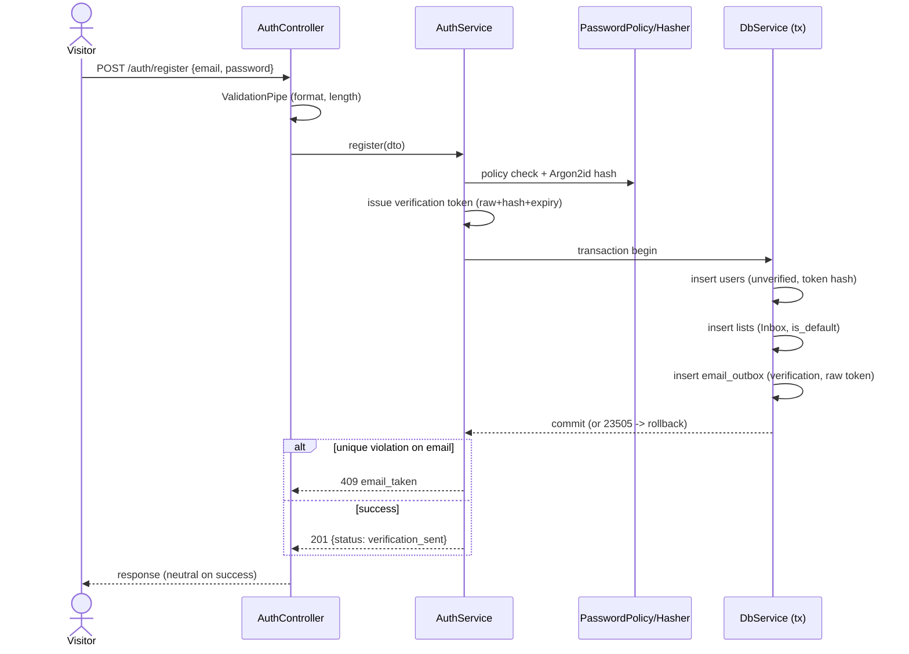

# Technical Design: FEAT-001 — Register account + bootstrap Inbox

> Feature from: docs/implementation-plan.md §5 · Epic: EPIC-A — Auth & Identity (`auth` module)
> Implements: FR-AUTH-001, FR-AUTH-002, FR-AUTH-003, FR-AUTH-004, FR-AUTH-005, FR-LIST-003 ·
> Binds NFR: NFR-SEC-003, NFR-SEC-004, NFR-SEC-005, NFR-LOC-001, NFR-MAINT-003 ·
> Realizes: UC-001 · Screens: SCR-WEB-001, SCR-WEB-002 (designed by ui-design)
> Status: Draft · Date: 2026-07-21

## 1. Intent

Let a Visitor create an account with an email and password. On valid, unique
input the system creates an **unverified** user, provisions their default **Inbox**
list, and enqueues a single-use, time-limited verification email — all in one
database transaction — then returns a neutral "check your email" result. This is
the first real slice: it stands up the `auth` module, request validation, the API
error envelope, password hashing, and the first domain tables, and it exercises
the transactional-outbox pattern (ADR-007) so its risk surfaces early. Email
*delivery* is out of scope here (FEAT-007 drains the outbox); this feature only
writes the outbox row.

## 2. Codebase context

Surveyed 2026-07-21 (walking skeleton state). The design conforms to:

- **Schema state:** only migration 001 (`skeleton_ping`) exists — no domain
  tables. This feature adds migration 002 creating `users`, `lists`, and
  `email_outbox`. Migrations are **node-pg-migrate** JS files in `migrations/`
  with `up`/`down` (see `migrations/1721480000000_skeleton-ping.js`).
- **DB access:** `DbService` (`apps/api/src/infra/db.service.ts`) wraps a `pg`
  `Pool` and exposes `query(text, params)`. It has **no transaction helper yet** —
  this feature adds `DbService.transaction()` (§5), since registration needs an
  atomic multi-table write (ADR-003).
- **Module layout:** NestJS modules under `apps/api/src/`. Capability modules live
  in `src/modules/<area>/` (see `src/modules/README.md`) and are **boundary-
  enforced** (`.dependency-cruiser.cjs`: no cross-module imports; modules may use
  `src/infra` and `@todo/shared`). This feature creates `src/modules/auth/`.
- **Contracts:** shared types/path-consts live in `@todo/shared`
  (`packages/shared/src/index.ts`); controllers return DTOs directly (see
  `health.controller.ts`). **No validation, error-envelope, hashing, or throttle
  infrastructure exists yet** — this feature establishes the first three as
  conventions (§7).
- **Config:** `loadConfig()` (`src/infra/config.ts`) reads `process.env`
  (NFR-MAINT-003). This feature adds auth config keys there.
- **Divergence found:** none — the skeleton has no auth code to conflict with.

**Prior features depended on:** none (first feature). **Downstream that extends
this feature's tables:** FEAT-007 extends `email_outbox`; FEAT-009 extends
`lists`; FEAT-002 consumes the verification-token columns on `users` (§8).

## 3. API contracts

### `POST /auth/register`

- **Auth:** none (public). Should sit behind the per-IP auth rate limiter —
  **foundations dependency, see §8.**
- **Request body** (`application/json`):
  ```jsonc
  { "email": "user@example.com", "password": "correct horse battery" }
  ```
  Validation (class-validator DTO + global `ValidationPipe`, §5/§7):
  - `email` — required, string, valid email format (`@IsEmail`), ≤ 254 chars.
    Normalized server-side to trimmed + lowercased before use (FR-AUTH-002/003).
  - `password` — required, string, length **≥ 10** and **≤ 128**, and **not** in
    the common/breached-password set (FR-AUTH-004, NFR-SEC-003). Max bounds the
    Argon2 cost (DoS guard).
  - Unknown properties stripped (`whitelist: true`).
- **Success — `201 Created`:**
  ```json
  { "status": "verification_sent" }
  ```
  Neutral: the same body whether or not the email provider later delivers
  (SW-002). Side effects (one transaction): insert `users` (unverified), insert
  default `lists` "Inbox", insert `email_outbox` verification row.
- **Errors** (error envelope, §7 — `{ statusCode, code, message, fields? }`):

  | Status | `code` | When | Trace |
  | :----- | :----- | :--- | :---- |
  | 400 | `validation_failed` | Missing/malformed email; password fails length/policy or breach check. `fields[]` names each offending field with the specific requirement (e.g., password → "Must be at least 10 characters" or "This password is too common"). | FR-AUTH-003, FR-AUTH-004, NFR-SEC-003; UC-001 alt 3b |
  | 409 | `email_taken` | Email already associated with an account (case-insensitive). Message: "This email is already in use." UI offers sign-in / reset. | FR-AUTH-002; UC-001 alt 3a |
  | 500 | `internal_error` | Transaction failure other than the unique violation. Registration did **not** succeed. | — |

- **Not idempotent.** Uniqueness is enforced by the DB constraint, not a
  check-then-insert (race-safe): the transaction attempts the insert and maps
  Postgres unique-violation `23505` on `users_email_key` → `409 email_taken` (§5).
- **Enumeration note:** the `409` reveals that an email is registered. This is a
  deliberate, requirement-driven trade-off (FR-AUTH-002 + UC-001 3a want an
  actionable "already in use"); sign-in (FR-AUTH-010) and forgot-password
  (FR-AUTH-012) stay neutral. Recorded in §7.

### Shared contract additions (`@todo/shared`)
```ts
export const REGISTER_PATH = "/auth/register";
export const PASSWORD_MIN_LENGTH = 10;   // NFR-SEC-003 (reused by web for a client hint)
export const PASSWORD_MAX_LENGTH = 128;
export interface RegisterRequest { email: string; password: string; }
export interface RegisterResponse { status: "verification_sent"; }
export interface ApiError {
  statusCode: number;
  code: string;
  message: string;
  fields?: Array<{ field: string; message: string }>;
}
```

## 4. Schema changes

Migration **002** (`migrations/<ts>_auth-register.js`), node-pg-migrate. Diff
against current schema (only `skeleton_ping`). All timestamps `timestamptz`
stored UTC (NFR-LOC-001). UUID PKs via `gen_random_uuid()` (core in Postgres 16 —
no extension, C-6; non-sequential ids support FR-AUTHZ-003 later).

**`users`** (conceptual entity: User — architecture §5):

| column | type | notes |
| :-- | :-- | :-- |
| `id` | uuid PK | default `gen_random_uuid()` |
| `email` | text NOT NULL | normalized (trim+lowercase) in app; **UNIQUE** index `users_email_key` |
| `password_hash` | text NOT NULL | Argon2id (NFR-SEC-005); never the plaintext |
| `verified_at` | timestamptz NULL | NULL = unverified (FR-AUTH-006/007 consume in FEAT-002) |
| `verification_token_hash` | text NULL | SHA-256 of the raw token; raw token only in the email (FR-AUTH-005) |
| `verification_token_expires_at` | timestamptz NULL | now()+24h (NFR-SEC-004) |
| `created_at` | timestamptz NOT NULL | default `now()` |
| `updated_at` | timestamptz NOT NULL | default `now()`; app-maintained |

**`lists`** (conceptual entity: List — minimal here; **FEAT-009 extends** with
ordering/rename rules, §8):

| column | type | notes |
| :-- | :-- | :-- |
| `id` | uuid PK | default `gen_random_uuid()` |
| `owner_id` | uuid NOT NULL | FK → `users(id)` ON DELETE CASCADE (FR-AUTHZ ownership) |
| `name` | text NOT NULL | "Inbox" for the default |
| `is_default` | boolean NOT NULL | default `false`; true for the Inbox (FR-LIST-003; FR-LIST-004 later) |
| `created_at`/`updated_at` | timestamptz NOT NULL | default `now()` |

Index: `lists_owner_id_idx` on `(owner_id)`.

**`email_outbox`** (conceptual entity: EmailOutbox — minimal here; **FEAT-007
extends** with `attempts`, `next_attempt_at`, `sent_at`, `last_error`,
dead-letter, §8):

| column | type | notes |
| :-- | :-- | :-- |
| `id` | uuid PK | default `gen_random_uuid()` |
| `type` | text NOT NULL | `'verification'` |
| `recipient` | text NOT NULL | the user's email |
| `payload` | jsonb NOT NULL | `{ token, userId }` — raw verification token for the link |
| `status` | text NOT NULL | default `'pending'` (`pending`\|`sent`\|`failed`) |
| `created_at` | timestamptz NOT NULL | default `now()` |

**Down:** drop `email_outbox`, `lists`, `users` (reverse FK order); `skeleton_ping`
untouched.

## 5. Component design

New module `apps/api/src/modules/auth/`:

- **`AuthController`** — `POST /auth/register`; validates `RegisterDto`, delegates
  to `AuthService`, returns `RegisterResponse`.
- **`AuthService.register(dto)`** — orchestration: normalize email → enforce
  password policy → hash password → generate verification token → run the atomic
  transaction (user + Inbox + outbox) → map unique-violation to `email_taken`.
- **`PasswordPolicyService`** — length bounds + membership test against a
  `CommonPasswordSet` (bundled newline list loaded into a `Set` at startup;
  offline, no external dependency — C-7). FR-AUTH-004 / NFR-SEC-003.
- **`PasswordHasher`** — Argon2id wrapper (`argon2` package). `hash()` / `verify()`.
  NFR-SEC-005.
- **`VerificationTokenService`** — `issue()` returns `{ raw, hash, expiresAt }`:
  32 random bytes base64url (raw, for the email link), SHA-256 (hash, stored),
  `now + VERIFICATION_TOKEN_TTL_HOURS`. NFR-SEC-004.
- **Repositories** (`UsersRepository`, `ListsRepository`, `EmailOutboxRepository`)
  — thin, execute parameterized SQL through a passed-in transaction client.
- **Infra additions:** `DbService.transaction<T>(fn)` (BEGIN/COMMIT/ROLLBACK via a
  pooled client); global `ValidationPipe` (main.ts) and `HttpExceptionFilter`
  (error envelope) — §7. Auth config keys in `config.ts`:
  `VERIFICATION_TOKEN_TTL_HOURS` (24), password bounds.

Skeleton stubs replaced: none removed (the skeleton `health`/`skeleton` code is
untouched); this feature is purely additive.



## 6. Acceptance criteria

- **AC-1 (FR-AUTH-001):** Given valid, unique email + policy-compliant password,
  When `POST /auth/register`, Then `201 {status:"verification_sent"}` and a `users`
  row exists with that normalized email and `verified_at IS NULL`.
- **AC-2 (FR-AUTH-002, UC-001 3a):** Given an email already registered (any case),
  When registering again, Then `409 email_taken`, no new user row, message "already
  in use". Case-insensitivity: `User@x.com` collides with `user@x.com`.
- **AC-3 (FR-AUTH-003, UC-001 3b):** Given a malformed email, When registering,
  Then `400 validation_failed` with a `fields[]` entry for `email`; no row created.
- **AC-4 (FR-AUTH-004, NFR-SEC-003):** A password < 10 chars **or** present in the
  common/breached set is rejected `400 validation_failed` with a `password` field
  message stating the specific requirement; a compliant password is accepted.
- **AC-5 (NFR-SEC-005):** The stored `password_hash` is an Argon2id hash (prefix
  `$argon2id$`), never the plaintext, and `PasswordHasher.verify(stored, plain)` is
  true for the registered password.
- **AC-6 (FR-LIST-003):** On successful registration exactly one `lists` row is
  created for the new user with `name='Inbox'`, `is_default=true`, `owner_id`=user.
- **AC-7 (FR-AUTH-005, NFR-SEC-004):** On success exactly one `email_outbox` row
  (`type='verification'`, `status='pending'`, recipient=email) is created carrying a
  raw token; `users.verification_token_hash` = SHA-256(raw) and
  `verification_token_expires_at` ≈ now()+24h.
- **AC-8 (atomicity, ADR-003):** If any insert fails, none persist (no orphan user
  without Inbox/outbox). The three writes share one transaction.
- **AC-9 (SW-002, UC-001 5a):** Registration success does not depend on email
  delivery — the outbox row persists for the worker; no delivery call happens in
  the request path.

## 7. Decisions

- **D1 — Argon2id for hashing.** Driver: NFR-SEC-005 ("strong adaptive algorithm";
  bcrypt/scrypt/Argon2). Argon2id is the current OWASP default. Rejected bcrypt
  (acceptable, but weaker memory-hardness). Consequence: adds `argon2` dependency.
- **D2 — Common-password set bundled offline, not a network breach API.** Driver:
  NFR-SEC-003 (NIST-aligned "commonly-used or compromised") + C-7 (keep external
  deps to email only). A bundled top-N list satisfies NIST without a second
  external call or a registration-time failure mode. Rejected HaveIBeenPwned range
  API (adds an external dependency + fail-open/closed dilemma). Consequence: a
  password-list data file ships in the repo; a `BreachCheckPort` can swap in HIBP
  later without contract change.
- **D3 — Email uniqueness via app-normalization + plain UNIQUE index, not
  `citext`.** Driver: C-6 (standard Postgres, pg_dump-portable, no extensions).
  Store trimmed-lowercased email; enforce with a UNIQUE index; rely on `23505`
  catch for race safety. Rejected `citext` (contrib extension).
- **D4 — Verification token stored hashed.** Driver: NFR-SEC (a DB leak must not
  expose live verification links). Store SHA-256(raw); email carries the raw token;
  FEAT-002 verifies by hashing the presented token. 24h TTL from NFR-SEC-004.
- **D5 — Duplicate-email reveals existence (409).** Driver: FR-AUTH-002 + UC-001
  3a explicitly want an actionable "already in use". Accepted enumeration trade-off
  scoped to registration only; neutral responses remain on sign-in/forgot-password.
- **D6 — Establish API conventions here (first real endpoint):** global
  `ValidationPipe` (`whitelist`, `transform`) + `HttpExceptionFilter` emitting
  `{statusCode, code, message, fields?}`; success returns the DTO directly (matches
  `health`). All later features inherit these. Driver: design-guide "convention
  inheritance" — someone has to set it; FEAT-001 does.

## 8. Escalations & open items

- **No architecture amendment needed.** `User`, `List`, `EmailOutbox` all exist in
  the conceptual model (architecture §5); verification-token columns are physical
  realization within `User`. No new entity, no boundary change.
- **OPEN — per-IP auth rate limiting (FR-AUTH-018, NFR-SEC-006).** The plan's
  first-slice spec places register behind "the foundations rate-limit
  infrastructure," which does not exist yet; the architecture (§8) specifies a
  **DB-backed sliding window** (not in-memory, because Cloud Run is multi-instance).
  This is cross-cutting foundations, **not** in FEAT-001's FR set. Recommendation:
  build the shared limiter as a foundations task (or with FEAT-003, the next auth
  endpoint) and place `POST /auth/register` behind it then. Tracked as a dependency;
  a task stub is noted in tasks.md but not a blocker for this slice's FRs.
- **NOTE — shared tables created minimally here.** `lists` and `email_outbox` are
  created with only the columns FEAT-001 needs. **FEAT-009** will `ALTER` `lists`
  (ordering/position, default-list constraints, FR-LIST-004/008); **FEAT-007** will
  `ALTER` `email_outbox` (`attempts`, `next_attempt_at`, `sent_at`, `last_error`,
  dead-letter). Those features add columns — they do not recreate the tables.
- **NOTE — audit logging (NFR-SEC-009)** is not applied to registration: the
  architecture's audit event list (§8) is sign-in / password change-reset /
  account deletion. Audit infra remains a foundations concern.
- **NOTE — common-password data file** must be added by implementation (D2); record
  its source in `docs/scaffold-notes.md` when added.
