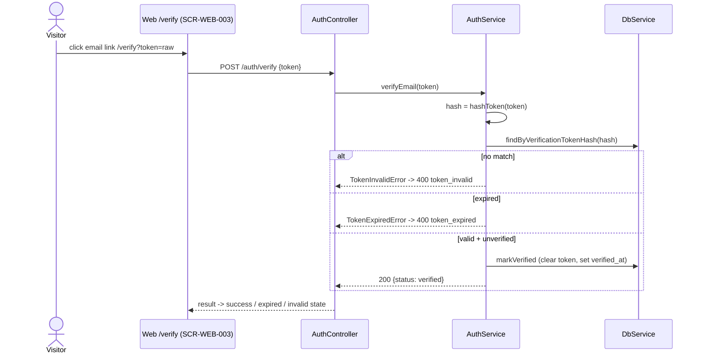

# Technical Design: FEAT-002 — Verify email + resend

> Feature from: docs/implementation-plan.md §3 (EPIC-A) · Epic: EPIC-A — Auth & Identity (`auth` module)
> Implements: FR-AUTH-006, FR-AUTH-007 (partial), FR-AUTH-008 ·
> Binds NFR: NFR-SEC-004 · Also touches FR-AUTH-018 (rate-limit — see §8) ·
> Realizes: UC-002 · Screens: SCR-WEB-003, SCR-WEB-002 (designed by ui-design)
> Status: Draft · Date: 2026-07-23

## 1. Intent

Close the loop that FEAT-001 opened. Registration creates an **unverified** user
and enqueues a verification email (FEAT-007 delivers it); this feature lets the
visitor **prove ownership** of that address by consuming the link, which flips the
account to verified — the state FEAT-003's sign-in gate will require — and lets a
visitor **request a fresh verification email** when the first link expired, was
lost, or never arrived. It adds no new tables: the verification-token columns and
the `email_outbox` writer already exist (FEAT-001 §4/§5). Delivery stays out of
scope — resend enqueues an outbox row exactly as registration does; the worker
(FEAT-007) sends it.

## 2. Codebase context

Surveyed 2026-07-23 @ repo head (post-FEAT-001, post-FEAT-007). The design
conforms to:

- **Schema state:** last migration is **003** (`outbox-retry`). `users`
  (migration 002) already carries `verified_at` (NULL = unverified),
  `verification_token_hash` (SHA-256 hex of the raw token), and
  `verification_token_expires_at`. **No new columns are needed** — this feature
  adds only a lookup index (migration 004, §4).
- **Token convention:** `VerificationTokenService`
  (`apps/api/src/modules/auth/verification-token.service.ts`) already exposes
  `hashToken(raw)` (SHA-256 hex) and `issue()` (`{ raw, hash, expiresAt }`) —
  **reused as-is** for verify (hash the presented token) and resend (rotate to a
  fresh token). FEAT-001 §5/D4.
- **Outbox writer:** `EmailOutboxRepository.enqueueVerification(tx, {recipient,
  userId, token})` (`email-outbox.repository.ts`) already writes a
  `type='verification'`, `status='pending'` row with `payload={token,userId}` —
  **reused unchanged** for resend. The worker is type-agnostic (FEAT-007 §2), so
  a resent row is delivered with no worker change.
- **Forward path contract (FEAT-007 §8 / D3):** the worker builds the link as
  `${PUBLIC_APP_URL}/verify?token=<payload.token>` — confirmed in
  `apps/worker/src/email/email-renderer.ts:18`. **FEAT-002 must serve the web
  `/verify` route (SCR-WEB-003).** The API itself builds no links.
- **Contract conventions (FEAT-001 §7/D6):** controllers throw Nest exceptions
  carrying `{ code, message, fields? }`; the global `HttpExceptionFilter`
  (`src/common/http-exception.filter.ts`) renders the `ApiError` envelope; the
  global `ValidationPipe` (`src/app-setup.ts`) turns DTO failures into
  `400 validation_failed` with `fields[]`. Success returns the DTO directly.
  **Inherited verbatim.**
- **DB access:** `DbService` exposes `query(text, params)` and `transaction(fn)`
  (added by FEAT-001). Repos take a passed-in client. Verify is a single UPDATE
  (no transaction); resend's rotate-token + enqueue share one transaction.
- **Auth module:** `apps/api/src/modules/auth/` (controller, service, repos,
  errors, DTOs under `dto/`). This feature **extends** it — no new module.
- **Web:** `apps/web/src/app/verify-email/page.tsx` is **SCR-WEB-002** (the "check
  your email" notice) and already reserves the Resend control for FEAT-002 (its
  own comment). The token-consuming **SCR-WEB-003** is a **new** `/verify` route.
- **Divergence found:** the SRS note on FR-AUTH-008 cross-references "FR-AUTH-017"
  for rate-limiting, but FR-AUTH-017 is *session invalidation*; the intended
  reference is **FR-AUTH-018** (rate-limit auth endpoints). Recorded in §8, not
  fixed here (SRS is requirements-engineering's to amend).

**Depends on:** FEAT-001 (verification-token columns, outbox writer, error/
validation conventions), FEAT-007 (delivers the resent rows; owns the `/verify`
link path). **Consumed later by:** FEAT-003 (sign-in enforces `verified_at`).

## 3. API contracts

Two new endpoints on the existing `AuthController`. Both are public (pre-session).
Both are auth endpoints and should sit behind the per-IP limiter — **foundations
dependency, see §8**; resend additionally carries a feature-local cooldown (D4).

### `POST /auth/verify`

Consumes a verification token and marks the account verified. **POST, not GET**
(D1): the email link targets the *web* `/verify` page, which calls this endpoint
on an explicit action — a state-mutating GET risks the single-use token being
spent by email scanners / link prefetchers (NFR-SEC-004).

- **Request body** (`application/json`), validated by `VerifyDto` + global pipe:
  ```jsonc
  { "token": "b8Jd…base64url" }
  ```
  - `token` — required, non-empty string, ≤ 512 chars (bounds the SHA-256 input).
- **Success — `200 OK`:**
  ```json
  { "status": "verified" }
  ```
  Side effect: `users.verified_at = now()` and the verification-token columns are
  **cleared** (single-use consumption, D2), guarded `WHERE verified_at IS NULL`
  (race-safe).
- **Errors** (`ApiError` envelope):

  | Status | `code` | When | Trace |
  | :----- | :----- | :--- | :---- |
  | 400 | `validation_failed` | Missing/empty/oversized `token`. `fields[]` names `token`. | pipe convention |
  | 400 | `token_expired` | Token matches a user but `verification_token_expires_at < now()`. Message invites requesting a new link. | NFR-SEC-004; UC-002 alt 2a |
  | 400 | `token_invalid` | No user matches the presented token's hash (never issued, already consumed, or rotated away by a later resend). Message offers **sign in** (covers already-verified, UC-002 exc-3a) or **resend**. | FR-AUTH-006; UC-002 alt 2a / exc-3a |

- **Idempotency:** not idempotent — the first valid call consumes the token; a
  replay yields `token_invalid`. Safe: verification grants no session.

### `POST /auth/verify/resend`

Requests a fresh verification email. **Neutral** (D3): the same `200` body
regardless of whether the address exists, is already verified, or is within the
resend cooldown — no account-existence disclosure (consistent with FEAT-001 D5
scoping enumeration to registration only).

- **Request body** (`application/json`), validated by `ResendVerificationDto`:
  ```jsonc
  { "email": "user@example.com" }
  ```
  - `email` — required, valid email format (`@IsEmail`), ≤ 254 chars; normalized
    (trim+lowercase) server-side, matching FEAT-001.
- **Success — `200 OK`** (always, on any well-formed email):
  ```json
  { "status": "verification_sent" }
  ```
  Side effect **only when** the email maps to an **existing, unverified** user
  **and** no verification email was enqueued within `RESEND_COOLDOWN_SECONDS`:
  rotate the user's verification token (fresh `raw`/`hash`/`expiresAt`) and enqueue
  a new `verification` outbox row — both in **one transaction**. Otherwise the
  request is a silent no-op (still `200`).
- **Errors:**

  | Status | `code` | When | Trace |
  | :----- | :----- | :--- | :---- |
  | 400 | `validation_failed` | Missing/malformed email. `fields[]` names `email`. | FR-AUTH-003 convention |

  Non-existent address, already-verified account, and cooldown-active all return
  the neutral `200` — never an error (D3/D4).

### Shared contract additions (`@todo/shared`)
```ts
export const VERIFY_PATH = "/auth/verify";
export const RESEND_VERIFICATION_PATH = "/auth/verify/resend";

export interface VerifyRequest { token: string; }
export interface VerifyResponse { status: "verified"; }

export interface ResendVerificationRequest { email: string; }
export interface ResendVerificationResponse { status: "verification_sent"; }
```
`ApiError` is reused (FEAT-001). New error `code` values introduced here:
`token_expired`, `token_invalid`.

## 4. Schema changes

Migration **004** (`migrations/<ts>_verify-email.js`), node-pg-migrate. Physical
realization within the existing **User** entity — **no new entity, no boundary
change, no escalation**. Diff against the current schema (last migration 003):

| change | detail | why |
| :-- | :-- | :-- |
| index | `CREATE INDEX users_verification_token_hash_idx ON users (verification_token_hash) WHERE verification_token_hash IS NOT NULL` | Verify looks a user up by token hash on every attempt; a partial index (only unverified/live rows carry a non-NULL hash) keeps it a point lookup as `users` grows. |

No columns are added — `verified_at`, `verification_token_hash`,
`verification_token_expires_at` already exist (migration 002).

**Down:** drop `users_verification_token_hash_idx`.

## 5. Component design

All additions land in the existing `apps/api/src/modules/auth/`:

- **`AuthController`** — two new handlers:
  - `verify(@Body VerifyDto)` → `AuthService.verifyEmail(token)` → `200
    {status:"verified"}`; maps `TokenExpiredError` → `400 token_expired`,
    `TokenInvalidError` → `400 token_invalid` (same throw-and-filter shape as
    register's `EmailTakenError`).
  - `resendVerification(@Body ResendVerificationDto)` →
    `AuthService.resendVerification(email)` → always `200
    {status:"verification_sent"}` (no error mapping beyond validation).
- **`AuthService.verifyEmail(rawToken)`** —
  `hash = tokens.hashToken(rawToken)` → `users.findByVerificationTokenHash(db,
  hash)`; if none → `TokenInvalidError`; if `expires_at < now()` →
  `TokenExpiredError`; else `users.markVerified(db, id)` (guarded update).
- **`AuthService.resendVerification(email)`** — normalize email →
  `users.findUnverifiedByEmail(db, email)`; if none (absent or already verified)
  → return (neutral). Else `outbox.lastVerificationEnqueuedAt(db, email)`; if
  within `RESEND_COOLDOWN_SECONDS` → return (neutral). Else `token =
  tokens.issue()` and `db.transaction(tx ⇒ { users.rotateVerificationToken(tx,
  id, token.hash, token.expiresAt); outbox.enqueueVerification(tx, {recipient:
  email, userId: id, token: token.raw}) })`.
- **`UsersRepository`** — new methods (each takes a `Queryable` = `DbService`
  \| `TxClient`, both exposing `query`):
  - `findByVerificationTokenHash(q, hash)` → `{ id, verifiedAt,
    verificationTokenExpiresAt } | null`.
  - `markVerified(q, id)` → `UPDATE users SET verified_at=now(),
    verification_token_hash=NULL, verification_token_expires_at=NULL,
    updated_at=now() WHERE id=$1 AND verified_at IS NULL` (single-use + race-safe).
  - `findUnverifiedByEmail(q, email)` → `{ id } | null` (`WHERE email=$1 AND
    verified_at IS NULL`).
  - `rotateVerificationToken(tx, id, hash, expiresAt)` → `UPDATE users SET
    verification_token_hash=$2, verification_token_expires_at=$3, updated_at=now()
    WHERE id=$1`.
- **`EmailOutboxRepository`** — reuse `enqueueVerification`; add
  `lastVerificationEnqueuedAt(q, recipient)` → `SELECT max(created_at) …
  WHERE recipient=$1 AND type='verification'` (for the cooldown, D4).
- **`auth.errors.ts`** — add `TokenInvalidError`, `TokenExpiredError` (framework-
  free, mirroring `EmailTakenError`).
- **`dto/verify.dto.ts`**, **`dto/resend-verification.dto.ts`** — class-validator
  DTOs (mirroring `RegisterDto`).
- **`config.ts`** — add `resendCooldownSeconds`
  (`RESEND_COOLDOWN_SECONDS`, default 60).
- **`auth.module.ts`** — no new providers (all reuse existing ones); the two
  handlers live on the already-registered `AuthController`.

**Skeleton stubs replaced:** none (purely additive to the auth module).



## 6. Acceptance criteria

- **AC-1 (FR-AUTH-006, UC-002 main):** Given an unverified user with a live token,
  When `POST /auth/verify` with the raw token, Then `200 {status:"verified"}` and
  the user row has `verified_at` set (non-NULL) with both verification-token
  columns cleared.
- **AC-2 (NFR-SEC-004 single-use, D2):** Given a token already consumed by a
  successful verify, When `POST /auth/verify` is called again with the same token,
  Then `400 token_invalid` and no state change.
- **AC-3 (NFR-SEC-004 time-limited, UC-002 alt 2a):** Given a token whose
  `verification_token_expires_at < now()`, When verifying, Then `400
  token_expired`; the account stays unverified.
- **AC-4 (FR-AUTH-006, UC-002 alt 2a):** Given a token that matches no user
  (never issued, or rotated away by a later resend), When verifying, Then `400
  token_invalid`.
- **AC-5 (FR-AUTH-007 partial):** Verification is the only transition that sets
  `verified_at` from NULL to a timestamp — the precondition FEAT-003's sign-in
  gate consumes. Before verify, `verified_at IS NULL`; after, it is set.
  (Sign-in *enforcement* is FEAT-003, not tested here.)
- **AC-6 (FR-AUTH-008):** Given an existing **unverified** user, When `POST
  /auth/verify/resend` with their email (past the cooldown), Then `200
  {status:"verification_sent"}`, a **new** `type='verification'` `pending`
  `email_outbox` row exists for that recipient carrying a fresh raw token, and the
  user's `verification_token_hash`/`_expires_at` are updated to that new token
  (the prior link no longer verifies — AC-4).
- **AC-7 (FR-AUTH-008 neutrality, D3):** Resend returns the same `200
  {status:"verification_sent"}` for (a) an unknown email and (b) an
  already-verified email, and in both cases **no** new outbox row is created and
  no token is rotated — no account-existence disclosure.
- **AC-8 (FR-AUTH-018 partial / D4 cooldown):** Given a verification email was
  enqueued for an unverified user within `RESEND_COOLDOWN_SECONDS`, When resend is
  called again, Then the response is still the neutral `200` but **no** additional
  outbox row is created and the token is not rotated.
- **AC-9 (validation):** `POST /auth/verify` with a missing/empty `token` and
  `POST /auth/verify/resend` with a malformed `email` each return `400
  validation_failed` with the offending field in `fields[]`.

## 7. Decisions

- **D1 — `POST /auth/verify`, refining the plan's informal `GET`.** Driver:
  NFR-SEC-004 (single-use). The FEAT-007 email link targets the *web* `/verify`
  page (not the API); a state-mutating GET on the API would be exposed to email
  security scanners and link prefetchers that issue GETs and could spend the
  single-use token before the human clicks. The web page POSTs on an explicit
  action. Rejected: GET mutation (RESTfully wrong + prefetch-unsafe).
- **D2 — Consume the token on verify (clear hash + expiry).** Driver: NFR-SEC-004
  "single-use". Consequence: a repeat click or an already-verified user finds no
  matching token and gets `token_invalid`, whose UI offers **sign in** — which is
  exactly what an already-verified visitor should do (covers UC-002 exc-3a without
  a dedicated "already verified" branch). Rejected: retaining the token to report
  "already verified" (violates literal single-use; adds a live-but-inert token).
- **D3 — Resend is neutral (no enumeration).** Driver: avoid account-existence
  disclosure, consistent with FEAT-001 D5 (enumeration confined to registration,
  where FR-AUTH-002 requires an actionable "already in use"). Rejected: distinct
  "no such account" / "already verified" responses (leak existence + status).
- **D4 — Feature-local resend cooldown, independent of the deferred IP limiter.**
  Driver: resend triggers outbound email, so it needs abuse protection *now*;
  the cross-cutting DB-backed per-IP limiter (FR-AUTH-018, NFR-SEC-006) is
  foundations work not yet built (FEAT-001 §8). A per-recipient cooldown
  (`RESEND_COOLDOWN_SECONDS`, default 60) computed from the latest verification
  outbox row's `created_at` blocks email-bombing without new schema. Applied
  *before* the neutrality check's side effect, so cooldown never leaks existence.
  Rejected: waiting for the IP limiter (leaves an open email-bomb window on a
  send-triggering endpoint).
- **D5 — Rotate the token on resend (invalidate the prior link).** Driver:
  single-use / one-live-link semantics — a fresh `issue()` replaces the stored
  hash+expiry, so only the newest email verifies. Consequence: an older
  verification email stops working after a resend (the visitor uses the newest, or
  resends again). Aligns with AC-4/AC-6.

## 8. Escalations & open items

- **No architecture amendment.** `User` and `EmailOutbox` are existing conceptual
  entities (architecture §5); this feature is physical realization (one index) +
  behavior only. No new entity, no boundary change.
- **OPEN — per-IP auth rate limiting (FR-AUTH-018, NFR-SEC-006).** Both endpoints
  are auth endpoints the SRS wants IP-throttled; the shared DB-backed sliding-
  window limiter (architecture §8) does not exist yet — same deferral as FEAT-001
  §8, targeted at foundations / FEAT-003. **Mitigated now** for resend by the
  feature-local cooldown (D4); verify carries no send side effect and only spends
  a high-entropy token, so brute-forcing it is infeasible. Place both endpoints
  behind the limiter when it lands (tracked in tasks.md, not a blocker for this
  feature's FRs — FR-AUTH-018 is delivered fully by that foundations work).
- **NOTE — SRS cross-reference defect.** FR-AUTH-008's SRS note says "Rate-limited
  per FR-AUTH-017", but FR-AUTH-017 is *session invalidation on password
  change/reset*; the intended target is **FR-AUTH-018**. Design follows
  FR-AUTH-018. Flagged for requirements-engineering to correct in the SRS; not
  amended here (out of this skill's ownership).
- **NOTE — web route split.** `/verify-email` (existing) = SCR-WEB-002 notice with
  the Resend control; `/verify` (new, this feature) = SCR-WEB-003 result page,
  honoring the FEAT-007 link path. Recorded so ui-design places screens correctly.
- **NOTE — FR-AUTH-007 is split.** FEAT-002 establishes the verified *state*;
  the sign-in *gate* that rejects unverified accounts (UC-003 alt 3b) is FEAT-003.
  The RTM lists both features on FR-AUTH-007 accordingly.
- **NOTE — API needs no `PUBLIC_APP_URL`.** Link construction stays in the worker
  (FEAT-007); the API only stores the raw token in the outbox payload.
</content>
</invoke>
