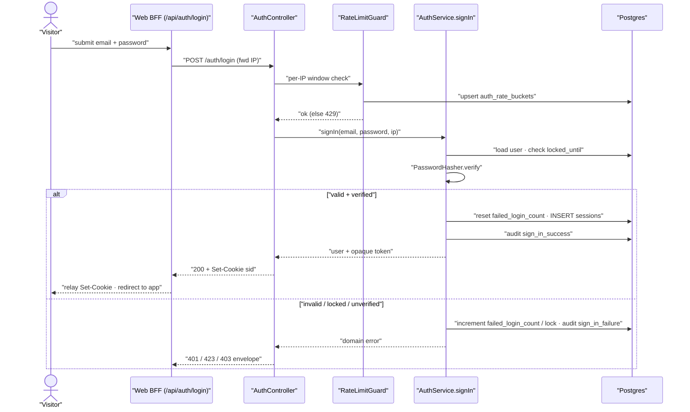

# Technical Design: FEAT-003 — Sign in (session, lockout, rate-limit)

> Feature from: docs/implementation-plan.md · Epic: EPIC-A — Auth & Identity (`auth` module)
> Implements: FR-AUTH-009, FR-AUTH-010, FR-AUTH-007 (partial), FR-AUTH-016,
> FR-AUTH-018, FR-AUTH-019, FR-AUTHZ-001 (partial) · NFR-SEC-006, NFR-SEC-007,
> NFR-SEC-009 (partial) · Realizes: UC-003 · Screens: SCR-WEB-004 (designed by ui-design)
> Status: Draft · Date: 2026-07-24

## 1. Intent

Let a verified user exchange their email + password for an authenticated,
long-lived, server-revocable session (ADR-005), and stand up the three security
foundations that first become real with the first authenticated slice: the
**session-authentication guard** (FR-AUTHZ-001 partial — the reusable primitive
every later data endpoint sits behind), **per-IP auth rate-limiting**
(FR-AUTH-018 — the shared limiter FEAT-002 explicitly deferred here), and the
**security audit log** (NFR-SEC-009 — sign-in is its first event producer).
This is the gate every authenticated flow in Phases 2–4 depends on.

## 2. Codebase context

Surveyed the live API before designing; the design conforms to what exists.

- **Error envelope (in force).** Every error is `ApiError`
  `{ statusCode, code, message, fields? }`, rendered by the global
  `HttpExceptionFilter` (`apps/api/src/common/http-exception.filter.ts`).
  Controllers throw Nest `HttpException`s carrying `{ code, message, fields? }`;
  the `ValidationPipe` `exceptionFactory` (`app-setup.ts`) emits
  `validation_failed` with `fields[]`. FEAT-003 reuses this verbatim.
- **Auth module today** (`apps/api/src/modules/auth/`). `AuthController` handles
  `POST /auth/register`, `POST /auth/verify`, `POST /auth/verify/resend`.
  `PasswordHasher.verify(hash, plain)` (Argon2id) **already exists** — sign-in
  reuses it directly. Domain errors are framework-free classes in
  `auth.errors.ts`, mapped to HTTP in the controller. Repositories take a
  `TxClient` (`infra/db.service.ts`) — the pool or a `transaction()` client.
- **Token-hashing convention.** `VerificationTokenService` issues a
  `randomBytes(32).base64url` raw token, persists only `SHA-256(raw)` hex, and
  matches by re-hashing. Session tokens follow the identical shape (opaque, only
  the hash stored).
- **Users table (migration 002).** `users(id uuid pk, email text unique,
  password_hash, verified_at, verification_token_*, created_at, updated_at)`.
  `verified_at IS NULL` = unverified — sign-in's verification gate reads it.
  Last applied migration is **004** (`users_verification_token_hash_idx`); this
  feature's migration is **005**.
- **Cross-cutting home.** `apps/api/src/common/README.md` already reserves
  `common/authz/` (session/ownership guard, FR-AUTHZ) and `common/audit/`
  (NFR-SEC-009) as **foundations landing with the auth slice**. The boundary
  rule `no-cross-module` (`.dependency-cruiser.cjs`) binds only
  `apps/api/src/modules/*`; `common/*` may be imported by any module. Placing
  session/guard/audit/rate-limit in `common/*` is therefore boundary-clean and
  avoids an `auth → common → auth` cycle (see D7).
- **Cookies.** No cookie middleware is wired yet. `main.ts` enables CORS with
  `credentials: true` for `webOrigin`. Reading the session cookie needs
  `cookie-parser` added in `app-setup.ts` (used by both runtime and contract
  tests, so behaviour is identical). Setting `Set-Cookie` uses Express
  `res.cookie` via a passthrough response.
- **Web BFF pattern.** The web tier proxies through Next route handlers
  (`apps/web/src/app/api/auth/*/route.ts`) that relay status + body verbatim.
  Sign-in extends this: the login proxy must additionally **relay `Set-Cookie`**
  to the browser, and authenticated proxies **forward the browser `Cookie`** to
  the API (see D6).
- **Tests.** Contract tests boot the real app (`AppModule` + `configureApp`) and
  drive it with `supertest` against local Postgres; domain/integration specs use
  `DbService` directly. FEAT-003 mirrors this. Architecture names **no** critical
  E2E flows / test frameworks → no mandatory Playwright task (legitimate skip,
  mirroring FEAT-001/002).

## 3. API contracts

All paths and DTO types are added to `@todo/shared` (T2) so web and API cannot
drift. Follows the established `ApiError` envelope exactly.

### 3.1 `POST /auth/login` — sign in (public; rate-limited)

- **Auth:** none (public). Behind the per-IP `RateLimitGuard` (§3.4).
- **Request** `SignInRequest`: `{ email: string, password: string }`.
  Validation: `email` non-empty + `@IsEmail`; `password` non-empty string.
- **Success `200`** `SignInResponse`: `{ status: "signed_in", user: { id, email } }`
  **plus** `Set-Cookie: <SESSION_COOKIE>=<opaque token>; HttpOnly; Secure;
  SameSite=Lax; Path=/; Max-Age=<session TTL>` (NFR-SEC-007). A `sessions` row is
  created (FR-AUTH-009, FR-AUTH-016; UC-003 main).
- **Errors** (each traced to a UC-003 branch / rule):
  | Status | code | When | Trace |
  | :-- | :-- | :-- | :-- |
  | `401` | `invalid_credentials` | Unknown email **or** wrong password — **identical body for both** (no enumeration) | FR-AUTH-010; UC-003 alt 3a |
  | `403` | `email_not_verified` | Credentials correct **but** `verified_at IS NULL` (revealed only after a correct password, so it is not an enumeration oracle) | FR-AUTH-007; UC-003 alt 3b |
  | `423` | `account_locked` | Account is within its lockout window; body carries `retryAfterSeconds` | FR-AUTH-019; UC-003 exc-3c |
  | `429` | `rate_limited` | Per-IP window limit exceeded; body carries `retryAfterSeconds` | FR-AUTH-018; UC-003 exc-2a |
  | `400` | `validation_failed` | Missing/malformed fields; `fields[]` | validation rule (AC-9) |

  Order of checks in the handler: rate-limit guard (per-IP, before any DB read)
  → lockout check (account) → password verify → verification check → issue
  session. Lockout is evaluated **before** password verification so a locked
  account cannot be probed further.

### 3.2 `GET /auth/session` — current session identity (authenticated)

- **Auth:** `SessionGuard` (§3.3). The first concrete consumer of the guard —
  makes FR-AUTHZ-001 demonstrable and gives the web its auth-state check.
- **Success `200`** `SessionResponse`: `{ user: { id, email } }`.
- **Error `401`** `unauthenticated` — no cookie, or an unknown/expired session
  token (FR-AUTHZ-001 partial). Uniform, no body detail.
- Side effect: resolving a live session **touches** `last_used_at` (ADR-005).

> Sign-out (`POST /auth/logout`, revoke the session) is **FEAT-004** — out of
> scope here. This feature only *creates* and *reads* sessions; the
> revoke-all-by-user path (FR-AUTH-017 / FR-DATA-005) is added by its owning
> feature against the same `sessions` table.

### 3.3 `SessionGuard` (cross-cutting, `common/authz`) — FR-AUTHZ-001 (partial)

A Nest `CanActivate` that reads the `<SESSION_COOKIE>` cookie, resolves it via
`SessionService.resolve` (§5), and on success attaches
`req.user = { id, email }` (exposed via a `@CurrentUser()` param decorator);
on failure throws `401 unauthenticated`. This is the **authentication half** of
the ownership guard — the *ownership scoping* half (FR-AUTHZ-002/003/005,
`owner_id = current_user`) has no data endpoints yet and lands with the first
data slice (FEAT-009), extending this same `common/authz` concern.

### 3.4 `RateLimitGuard` (cross-cutting, `common/rate-limit`) — FR-AUTH-018

A per-IP fixed-window limiter backed by Postgres (D8). Applied to `POST
/auth/login`, and **retrofitted** onto the existing `POST /auth/register`,
`POST /auth/verify`, `POST /auth/verify/resend` (closing the FEAT-002 deferral).
Over-limit → `429 rate_limited` with `retryAfterSeconds`. Client IP is taken
from the Express request (`X-Forwarded-For` left-most, trusting the Cloud Run
proxy; `req.ip` locally). Thresholds are config (§7 D8; NFR-SEC-006).
`POST /auth/forgot` / `POST /auth/reset` adopt the same guard when FEAT-005
builds them.

## 4. Schema changes — migration 005 (`1721520000000_sign-in.js`)

A diff against the current schema (last migration 004). All timestamps
`timestamptz`, UTC (NFR-LOC-001); UUID PKs via `gen_random_uuid()` (no extension,
C-6). `up`/`down` both provided (node-pg-migrate).

### 4.1 `sessions` — **conceptual entity: Session** (named in architecture §5 core
tables; ADR-005). New table, within the conceptual model — no escalation.

| Column | Type | Notes |
| :-- | :-- | :-- |
| `id` | uuid PK `gen_random_uuid()` | |
| `user_id` | uuid NOT NULL → `users(id)` ON DELETE CASCADE | delete-account terminates sessions (FR-DATA-005) |
| `token_hash` | text NOT NULL | `SHA-256(raw)` hex; raw never stored (NFR-SEC-007) |
| `created_at` | timestamptz NOT NULL default `now()` | |
| `last_used_at` | timestamptz NOT NULL default `now()` | touched on each resolve (ADR-005) |
| `expires_at` | timestamptz NOT NULL | `now()` + session TTL (FR-AUTH-016) |

Indexes: `UNIQUE (token_hash)` — `sessions_token_hash_key` (per-request lookup);
`(user_id)` — `sessions_user_id_idx` (revoke-all by user: FEAT-004/005/018).

### 4.2 `users` — lockout columns (**physical realization within the User
entity** — no new entity)

| Column | Type | Notes |
| :-- | :-- | :-- |
| `failed_login_count` | integer NOT NULL default `0` | consecutive failures (FR-AUTH-019) |
| `locked_until` | timestamptz NULL | NULL = not locked; else lockout expiry |

`failed_login_count` resets to 0 and `locked_until` clears on a successful
sign-in.

### 4.3 `audit_log` — **conceptual entity: audit_log** (named in architecture §5
core tables; NFR-SEC-009). New table, within the conceptual model.

| Column | Type | Notes |
| :-- | :-- | :-- |
| `id` | uuid PK `gen_random_uuid()` | |
| `user_id` | uuid NULL → `users(id)` ON DELETE SET NULL | NULL for failures on unknown email; SET NULL preserves the security log past account deletion (retention vs erasure tension — see §8) |
| `event` | text NOT NULL | `sign_in_success` \| `sign_in_failure` (extensible; later: password change/reset, deletion) |
| `ip` | text NULL | request IP |
| `detail` | jsonb NULL | reason category only — **never** credentials |
| `created_at` | timestamptz NOT NULL default `now()` | |

Indexes: `(created_at)` — retention sweeps (≥ 90 days); `(user_id)` — per-user
audit.

### 4.4 `auth_rate_buckets` — **infrastructure table** (per-IP fixed-window
counter; realizes architecture §8's prescribed "DB-backed sliding window").

| Column | Type | Notes |
| :-- | :-- | :-- |
| `ip` | text NOT NULL | client IP |
| `route` | text NOT NULL | e.g. `POST /auth/login` |
| `window_start` | timestamptz NOT NULL | floor(now / window) |
| `count` | integer NOT NULL default `0` | attempts in this window |

PK `(ip, route, window_start)`; upsert-increment per request. Stale rows
(`window_start` older than the window) are cleaned opportunistically and/or by
the cleanup worker (FEAT-020's job path) — no dependency for this feature. Not a
domain noun; flagged in §8 for the architecture's core-tables list.

## 5. Component design

New/changed units (skeleton stubs referenced by the `common/README.md`
placeholders become real here):

- **`common/authz/`** (cross-cutting; depends on `infra` only)
  - `SessionService` — `issue(userId): { rawToken; cookie attrs }` (opaque
    `randomBytes(32).base64url`, store `SHA-256` hex + expiry via
    `SessionsRepository.create`); `resolve(rawToken): { id, email } | null`
    (hash, load live non-expired session joined to the user, touch
    `last_used_at`); `hashToken(raw)` = `createHash('sha256')` (mirrors
    `VerificationTokenService`). Session TTL from config.
  - `SessionsRepository` — `create(userId, tokenHash, expiresAt)`,
    `findLiveByTokenHash(hash)` (join `users`, `expires_at > now()`),
    `touchLastUsed(id)`. (Revoke methods added by FEAT-004/005/018.)
  - `SessionGuard` (`CanActivate`) + `@CurrentUser()` decorator + session-cookie
    constants.
- **`common/audit/`** (cross-cutting; depends on `infra` only)
  - `AuditService.record(event, { userId?, ip?, detail? })` → append-only insert
    via `AuditRepository`. Never throws into the caller's critical path (a
    logging failure must not fail sign-in; wrapped best-effort).
- **`common/rate-limit/`** (cross-cutting; depends on `infra` only)
  - `RateLimitGuard` (`CanActivate`) reading client IP + route, calling
    `RateLimitRepository.hitAndCount(ip, route, windowStart)` (upsert-increment,
    returns the new count), throwing `429 rate_limited` when over the configured
    max. Config-driven window + max.
- **`modules/auth/`**
  - `AuthService.signIn({ email, password, ip })` — normalize email → load user
    (`UsersRepository.findByEmailForAuth`) → **lockout check** (`locked_until >
    now()` → `AccountLockedError`) → `PasswordHasher.verify` → on failure:
    increment `failed_login_count`, set `locked_until` when it reaches the
    threshold, audit `sign_in_failure`, throw `InvalidCredentialsError` (generic,
    even for unknown email) → on success: `verified_at` check
    (`EmailNotVerifiedError` if null) → reset failed counter →
    `SessionService.issue` → audit `sign_in_success` → return `{ user, rawToken,
    cookie }`. Unknown email path still returns `invalid_credentials` (no user
    row to lock; per-IP limiter is the abuse control there).
  - `UsersRepository` additions: `findByEmailForAuth(email)` (id, email,
    password_hash, verified_at, failed_login_count, locked_until),
    `recordFailedLogin(id, lockUntil?)`, `resetFailedLogin(id)`.
  - `auth.errors.ts` additions: `InvalidCredentialsError`,
    `EmailNotVerifiedError`, `AccountLockedError(retryAfterSeconds)`.
  - `AuthController` additions: `POST /auth/login` (maps the errors →
    401/403/423/429, sets the cookie via passthrough `res`), `GET /auth/session`
    (`@UseGuards(SessionGuard)`, `@CurrentUser()`); `@UseGuards(RateLimitGuard)`
    added to `login` + the three existing auth POSTs. `SignInDto`.
  - `AuthModule` imports the `common/*` providers.
- **`app-setup.ts`**: `app.use(cookieParser())` so the guard reads cookies in
  runtime and contract tests alike (add `cookie-parser` dep).

## 6. Acceptance criteria

- **AC-1 (FR-AUTH-009, UC-003 main).** Given a verified user, when
  `POST /auth/login` receives the correct email + password, then the response is
  `200 { status:"signed_in", user:{id,email} }`, a `Set-Cookie` for the session
  is present with `HttpOnly`, `Secure`, `SameSite`, and exactly one `sessions`
  row exists for that user.
- **AC-2 (FR-AUTH-010, UC-003 alt 3a).** An unknown email and a wrong password
  for an existing user each return `401 invalid_credentials` with a
  **byte-identical** envelope (no field, timing-class, or code difference that
  reveals whether the email exists). No session created.
- **AC-3 (FR-AUTH-007, UC-003 alt 3b).** Given an **unverified** account, when
  the correct password is supplied, then the response is `403 email_not_verified`
  and no session is created; a **wrong** password on the same account returns
  `401 invalid_credentials` (verification status is never revealed before a
  correct password).
- **AC-4 (FR-AUTH-016, NFR-SEC-007, ADR-005).** The session token is opaque and
  random; the database stores only its `SHA-256` hash (the raw token appears in
  no row); the cookie is `HttpOnly` + `Secure` + `SameSite`; the `sessions` row
  has `expires_at` ≈ `now()` + the configured long-lived TTL.
- **AC-5 (FR-AUTH-019, UC-003 exc-3c).** After `LOGIN_MAX_FAILED_ATTEMPTS`
  (default 5) consecutive failures, the account is locked: subsequent attempts —
  **including with the correct password** — return `423 account_locked` with a
  `retryAfterSeconds`, until `locked_until` passes. A successful sign-in (before
  lock) resets `failed_login_count` to 0.
- **AC-6 (FR-AUTH-018, NFR-SEC-006, UC-003 exc-2a).** Once per-IP attempts on an
  auth endpoint exceed the configured window limit, further attempts return
  `429 rate_limited` with `retryAfterSeconds`; the limiter guards `/auth/login`,
  `/auth/register`, `/auth/verify`, and `/auth/verify/resend`.
- **AC-7 (FR-AUTHZ-001 partial).** `GET /auth/session` with no cookie or an
  unknown/expired session token returns `401 unauthenticated`; with a valid
  session cookie it returns `200 { user:{id,email} }` and touches
  `last_used_at`.
- **AC-8 (NFR-SEC-009 partial).** A successful sign-in appends an `audit_log` row
  `event="sign_in_success"` with `user_id` + `ip`; a failed sign-in appends
  `event="sign_in_failure"`; no audit row contains the password or the raw
  token.
- **AC-9 (validation).** A missing/malformed email or missing password returns
  `400 validation_failed` with a `fields[]` entry naming the offending field, in
  the `ApiError` envelope.

## 7. Decisions

- **D1 — Opaque server-side session, hash-at-rest (ADR-005, NFR-SEC-007).**
  Random 256-bit token in an `HttpOnly`/`Secure`/`SameSite` cookie; only
  `SHA-256(token)` stored, so a DB leak yields no live sessions. Mirrors the
  verification-token pattern. Alternative (JWT) rejected upstream by ADR-005.
- **D2 — Verification revealed only after a correct password (FR-AUTH-007 vs
  FR-AUTH-010).** The `403 email_not_verified` branch is reachable only once the
  password verifies, so it is not an account-enumeration oracle. Driver: reconcile
  "prompt to verify" with "no enumeration."
- **D3 — Account lockout message is intentionally account-revealing
  (FR-AUTH-019).** `423 account_locked` discloses that an account exists under
  sustained failures. Accepted because FR-AUTH-019 / UC-003 exc-3c **require**
  informing the user how to proceed; the per-IP `429` (D8) is the
  enumeration-neutral first line of defence. Trade-off consciously taken.
- **D4 — Lockout = N consecutive failures → timed lock (FR-AUTH-019 + NFR-SEC-006).**
  `LOGIN_MAX_FAILED_ATTEMPTS` (default 5, per FR-AUTH-019) consecutive failures
  set `locked_until = now() + LOGIN_LOCKOUT_MINUTES` (default 15, consistent with
  NFR-SEC-006's per-account window). Consecutive-counter chosen over a rolling
  count for simplicity; NFR-SEC-006 thresholds are `*(confirm)*`/example in the
  SRS, so the values are config, not hard-coded.
- **D5 — Lockout state on `users`, not a new table.** `failed_login_count` +
  `locked_until` are account attributes → physical columns within the User
  entity (§4.2). No new domain noun; no escalation.
- **D6 — Session flows through the web BFF.** The `/api/auth/login` Next route
  relays the API's `Set-Cookie` to the browser (session cookie set on the web
  origin); authenticated proxies (`/api/auth/session`) forward the browser
  `Cookie` header to the API. Driver: the established BFF proxy pattern +
  `credentials:true` CORS. Keeps the API URL server-only.
- **D7 — Session/guard/audit/rate-limit live in `common/*`, not `modules/auth`.**
  They are cross-cutting (logout, password-change invalidation, delete-account,
  and every future data endpoint use them). Placing them in `modules/auth` and
  having `common` depend back on it would create an `auth → common → auth` cycle
  (tripping `no-circular`) and mis-scope a cross-cutting concern. `common/*` is
  importable by any module and depends only on `infra`. Matches
  `common/README.md`'s reserved `authz/` + `audit/`.
- **D8 — Per-IP rate limit: DB-backed fixed-window counter (FR-AUTH-018,
  NFR-SEC-006).** `auth_rate_buckets` keyed `(ip, route, window_start)`,
  upsert-increment. Chosen over an event-per-request log (less row churn, trivial
  cleanup) — a minor divergence from architecture §8's literal "sliding window,"
  preserving its intent (DB-backed per-IP throttle, offloadable to edge later).
  In-memory rejected: Cloud Run is multi-instance (architecture §8). Config:
  `AUTH_RATELIMIT_WINDOW_SECONDS`, `AUTH_RATELIMIT_MAX`.

## 8. Escalations & open items

- **No architecture amendment required.** `sessions` and `audit_log` are named
  core tables in architecture §5; the lockout columns are physical within User.
- **Minor, non-blocking — architecture core-tables list.** `auth_rate_buckets`
  is an infrastructure table realizing architecture §8's prescribed DB-backed
  per-IP throttle; it is not a domain entity. Flagged so the architecture's
  core-tables enumeration (§5) can note it on its next revision. Not a boundary
  or ownership change — proceeding without a blocking amendment.
- **Open item for FEAT-018 (delete account).** `audit_log.user_id ON DELETE SET
  NULL` preserves the security log past account deletion, which sits in tension
  with FR-DATA-006 ("permanently removed"). Reconciling audit retention (≥ 90
  days, NFR-SEC-009) against erasure is FEAT-018's call; recorded here, not
  resolved here.
- **Deferred to owning features (not gaps for FEAT-003):** session revocation —
  logout (FR-AUTH-011, FEAT-004), invalidate-all on password change/reset
  (FR-AUTH-017, FEAT-005/006), terminate on delete (FR-DATA-005, FEAT-018) — all
  operate on this feature's `sessions` table. The ownership-scoping half of the
  authz guard (FR-AUTHZ-002/003/005) lands with the first data slice (FEAT-009),
  extending `common/authz`. The rate-limit guard is added to `/auth/forgot` +
  `/auth/reset` by FEAT-005.

Verification: clean (self-check per Phase 5 — every FEAT-003 FR/NFR has ≥ 1
acceptance criterion and ≥ 1 task; all cited IDs resolve; schema within the
conceptual model with the one infra-table note above; contracts reuse the
existing envelope).
</invoke>
