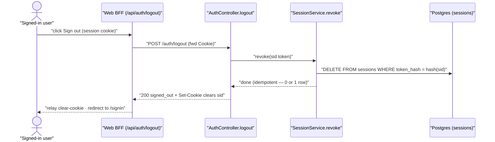

# Technical Design: FEAT-004 — Sign out

> Feature from: docs/implementation-plan.md · Epic: EPIC-A — Auth & Identity (`auth` module)
> Implements: FR-AUTH-011 · Realizes: UC-004 · Screens: SCR-WEB-007 (sign-out control; designed by ui-design)
> Status: Draft · Date: 2026-07-25

## 1. Intent

Let a signed-in user end their session: invalidate the current server-side
session (ADR-005 — a one-row delete) and clear the session cookie, returning
the user to the signed-out state. This is the counterpart to FEAT-003's session
issuance; FEAT-003's technical-design §8 already earmarked the revoke path for
this feature. Small, no-schema slice.

## 2. Codebase context

The design conforms to what FEAT-003 established (surveyed live):

- **Session store (`common/authz`, ADR-005).** `sessions(id, user_id,
  token_hash, created_at, last_used_at, expires_at)` already exists (migration
  005). `SessionsRepository` has `create`, `findLiveByTokenHash`,
  `touchLastUsed` — **no delete method yet**; FEAT-004 adds it (the revoke path
  FEAT-003 §8 deferred here). `SessionService` (`issue`, `resolve`, `hashToken`)
  is the session owner; `AuthService` already injects it (FEAT-003).
- **Cookie handling.** `SESSION_COOKIE` = `sid` (shared). Set at login via
  Express `res.cookie(name, token, sessionCookieOptions(cookieSecure, ttlMs))`
  (`common/authz/session.constants.ts` — HttpOnly + SameSite=Lax always, Secure
  env-gated). `cookie-parser` is wired in `app-setup.ts`, so handlers read
  `req.cookies[SESSION_COOKIE]`.
- **Contract/error conventions.** `ApiError` envelope via the global filter;
  controllers return typed responses from `@todo/shared`; success bodies are
  small status objects (`{ status: "…" }`). FEAT-004 follows these verbatim.
- **Web BFF.** `apps/web/src/app/api/auth/login/route.ts` relays the API's
  `Set-Cookie` to the browser and forwards the client IP; logout mirrors this to
  relay the **cookie-clearing** `Set-Cookie` and forward the session cookie.
- **Rate-limit / guards.** FR-AUTH-018 does not list logout among rate-limited
  endpoints; logout is not guarded (see D1). Architecture §8's audit-event list
  (sign-in/password/deletion) does **not** include logout → no audit write.

## 3. API contracts

### 3.1 `POST /auth/logout` — sign out (idempotent; not guarded)

- **Auth:** none enforced by a guard (D1). The handler reads the session cookie,
  revokes the matching session if one exists, and always clears the cookie.
- **Request:** no body.
- **Success `200`** `SignOutResponse`: `{ status: "signed_out" }` **plus** a
  `Set-Cookie` that clears `sid` (same name/path/SameSite/Secure/HttpOnly, with
  an expiry in the past). The `sessions` row for the presented token is deleted
  server-side (FR-AUTH-011; UC-004 main).
- **Errors:** none by design — logout is idempotent and graceful (D1). A missing
  or already-invalid cookie still returns `200` with the clear-cookie (nothing
  to revoke). Only an unexpected server fault yields `500 internal_error` via
  the filter.
- **Idempotency & side-effects:** deletes **only** the caller's current session
  row (matched by token hash); the user's other sessions are untouched
  (FR-AUTH-011 — *current* session; ADR-005). Safe to call repeatedly.

> Invalidate-**all**-sessions (FR-AUTH-017, on password change/reset) and
> terminate-on-delete (FR-DATA-005) are **not** this feature — they operate on
> the same `sessions` table via a by-user delete added by FEAT-005/006/018.

## 4. Schema changes

**None.** Logout reuses the `sessions` table from migration 005 (FEAT-003). No
migration is added by this feature. (The only new persistence operation is a
`DELETE … WHERE token_hash = $1`, a physical use of the existing Session entity.)

## 5. Component design

- **`common/authz/SessionsRepository`** — add `deleteByTokenHash(tokenHash):
  Promise<number>` → `DELETE FROM sessions WHERE token_hash = $1`, returning the
  deleted row count (0 when nothing matched — supports idempotency). This is the
  single-session revoke primitive; the by-user variant is a later feature's.
- **`common/authz/SessionService`** — add `revoke(rawToken): Promise<void>` →
  when a non-empty token is present, hash it and call `deleteByTokenHash`;
  otherwise a no-op. Idempotent by construction.
- **`modules/auth/AuthService`** — add `signOut(rawToken): Promise<void>`, a thin
  delegate to `SessionService.revoke` (keeps the controller depending only on
  `AuthService`, matching the established layering; `SessionService` is already
  injected into `AuthService` from FEAT-003).
- **`modules/auth/AuthController`** — add `POST /auth/logout`: read
  `req.cookies[SESSION_COOKIE]`, call `auth.signOut(token)`, clear the cookie via
  `res.clearCookie(SESSION_COOKIE, clearOptions)`, return `{ status: "signed_out" }`.
  A `clearSessionCookieOptions(cookieSecure)` helper in `session.constants.ts`
  returns the path/sameSite/secure/httpOnly matching the set-cookie (Express
  requires attribute match to clear).
- **`common/authz/session.constants.ts`** — add `clearSessionCookieOptions`.

## 6. Acceptance criteria

- **AC-1 (FR-AUTH-011, UC-004 main).** Given a signed-in user, when
  `POST /auth/logout` is called with their session cookie, then the response is
  `200 { status:"signed_out" }`, the `sessions` row for that token no longer
  exists, and the response carries a `Set-Cookie` that clears `sid` (past
  expiry). A subsequent `GET /auth/session` with the old cookie returns
  `401 unauthenticated`.
- **AC-2 (idempotent/graceful, D1).** `POST /auth/logout` with **no** cookie, or
  with an unknown/already-invalidated cookie, still returns `200
  { status:"signed_out" }` with the clear-cookie and raises no error.
- **AC-3 (current-session scope, FR-AUTH-011, ADR-005).** Given a user with two
  active sessions (two tokens), when one session logs out, then only that
  session's row is deleted — the other session still resolves via
  `GET /auth/session` (`200`).

## 7. Decisions

- **D1 — Logout is unguarded and idempotent.** `POST /auth/logout` carries no
  `SessionGuard`; it revokes the session matching the cookie (if any) and always
  clears the cookie + returns `200`. Driver: a `SessionGuard` would `401` an
  already-expired cookie, making "log out" fail exactly when the user most wants
  the client state cleared. Idempotent logout is the conventional, safer choice
  and still fully satisfies FR-AUTH-011 (server-side termination of the current
  session when one exists). CSRF is covered by the SameSite=Lax cookie (a
  cross-site POST won't send `sid`, so it can't force-logout).
- **D2 — Single-session revoke, not all-sessions.** FR-AUTH-011 terminates the
  *current* session; `deleteByTokenHash` scopes the delete to the presented
  token. The by-user "invalidate all" delete (FR-AUTH-017 / FR-DATA-005) is
  intentionally left to its owning features against the same table.
- **D3 — No audit event for logout.** Architecture §8 enumerates the audited
  security events (sign-in success/failure, password change/reset, account
  deletion); logout is not among them. No `audit_log` write is added, staying
  within the defined scope (NFR-SEC-009).

## 8. Escalations & open items

- **No architecture amendment; no schema change.** Logout is a physical delete
  on the existing Session entity.
- **Screen-trace correction (minor, flagged not resolved).** The plan's FEAT-004
  row and ux-foundations' inventory associate **SCR-WEB-010 (Task Detail)** with
  UC-004. Task Detail is a task-editing panel (owned by FEAT-011) with no
  sign-out responsibility; sign-out's only presentation touchpoint is the
  **SCR-WEB-007 app-shell sign-out control**. This design scopes FEAT-004's UI to
  SCR-WEB-007 and treats the SCR-WEB-010/UC-004 tag as a likely source typo in
  ux-foundations §inventory (and the plan copying it). Recorded for a
  ux-foundations touch-up; not blocking — ui-design designs the SCR-WEB-007
  control.

Verification: clean (self-check per Phase 5 — FR-AUTH-011 covered by AC-1/2/3
and by tasks; all cited IDs resolve; no schema change so no conceptual-model
question; the contract reuses the existing envelope and cookie conventions).
