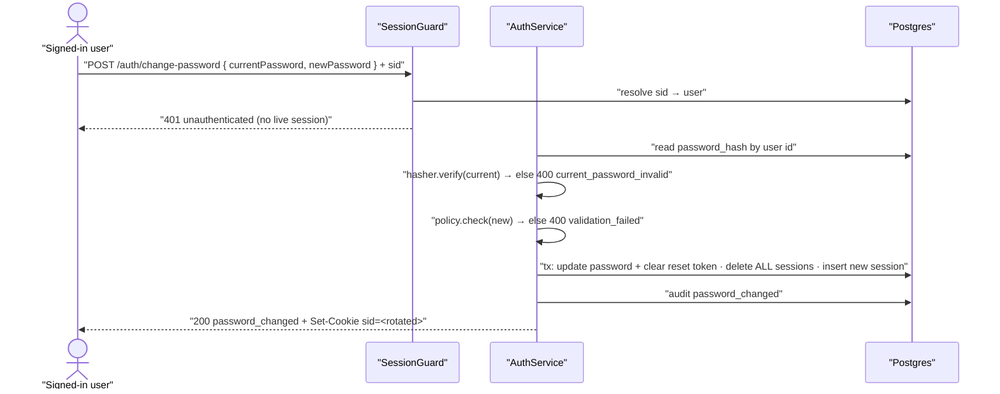

# Technical Design: FEAT-006 — Change password (signed-in)

> Feature from: docs/implementation-plan.md · Epic: EPIC-A — Auth & Identity (`auth` module)
> Implements: FR-AUTH-015, FR-AUTH-017 (partial — the change path) ·
> binds NFR-SEC-003, NFR-SEC-005, NFR-SEC-006, NFR-SEC-007, NFR-SEC-009 ·
> also FR-AUTH-004 (policy on change) and FR-AUTHZ-001 (authenticated endpoint)
> Realizes: UC-006 · Screens: SCR-WEB-015, SCR-WEB-014 (designed by ui-design)
> Status: Draft · Date: 2026-07-26

## 1. Intent

Let a signed-in user rotate their own password: supply the current password plus
a new one, and on success every session that existed before the change is
invalidated (FR-AUTH-017) while *this* device stays signed in on a **freshly
issued** session token (NFR-SEC-007 — rotation on privilege change). It is the
last slice of EPIC-A and the cheapest one: no new schema, no new email, no new
crypto — it composes the password policy + hasher (FEAT-001), the session store
and guard (FEAT-003), the by-user revoke seam (FEAT-005 D4), the audit log
(FEAT-003), and the per-IP limiter (FEAT-003) behind one authenticated endpoint.
It also introduces the Security & Account hub screen (SCR-WEB-014) that FEAT-017
and FEAT-018 will hang their entries on.

## 2. Codebase context

Surveyed live (last migration 006 `1721530000000_password-reset.js`); the design
conforms to and reuses:

- **Password policy + hasher (FEAT-001).** `PasswordPolicyService.check(pw)`
  returns a requirement string or `null`; `PasswordHasher.hash/verify(hash, pw)`
  is Argon2id (NFR-SEC-005). Both reused verbatim — the current-password check is
  the same `verify` sign-in uses, the new-password gate the same `check`
  registration and reset use (FR-AUTH-004).
- **Session store + guard (FEAT-003).** `SessionGuard` (`common/authz`) resolves
  the `sid` cookie to `req.user` and answers a uniform `401 unauthenticated`
  otherwise; `@CurrentUser()` yields `SessionUser { id, email }`. This is the
  first `auth`-module endpoint to sit behind the guard (only `GET /auth/session`
  did) — no new primitive needed.
- **By-user revoke (FEAT-005 D4).** `SessionService.revokeAllForUser(userId, tx?)`
  → `SessionsRepository.deleteByUserId` already accepts a tx client precisely so
  a credential change and its session purge are atomic. FEAT-005's §7 D4 named
  FEAT-006 as its second consumer; this is that consumption.
- **Session issuance.** `SessionService.issue(userId)` mints
  `randomBytes(32).base64url`, stores `SHA-256(raw)` with a `sessionTtlDays`
  expiry, and returns `{ rawToken, cookieOptions }`; the controller sets the
  cookie (`sessionCookieOptions` — HttpOnly + SameSite=Lax always, Secure
  env-gated). `SessionsRepository.create` currently hard-codes the pool — D2
  gives it the same optional-tx parameter its sibling delete already has.
- **Password write.** `UsersRepository.updatePasswordAndClearReset(tx, id, hash)`
  (FEAT-005) sets `password_hash`, clears the reset-token columns and bumps
  `updated_at` — exactly the write this feature wants, including the
  reset-link invalidation (D6). Reused as-is; only a *read* method is new.
- **Contract/error conventions.** `ApiError` envelope (`statusCode/code/message/
  fields[]`) rendered by the global filter; framework-free domain errors in
  `auth.errors.ts` mapped to HTTP in the controller; `validation_failed` +
  `fields[]` for field-level failures; `AUTH_ERROR_CODES` shared so the web
  branches on codes without string-drift; per-IP `RateLimitGuard` on every
  state-changing auth endpoint, keyed `METHOD path` (each endpoint its own
  bucket).
- **Audit (FEAT-003).** `AuditService.record(event, { userId, ip, detail })`,
  best-effort by contract. `AUDIT_EVENTS` currently holds only the two sign-in
  events; NFR-SEC-009 names password change explicitly, so this feature adds its
  two (§5). Note the **reset** path records nothing — a pre-existing NFR-SEC-009
  gap, not this feature's to fix (§8).
- **Web BFF (ADR-002).** `apps/web/src/app/api/auth/*/route.ts` proxy to the API
  server-side. Two variants exist: cookie-*forwarding* (`session`) and
  Set-Cookie-*relaying* (`login`). Change-password needs **both** — it sends the
  caller's cookie and returns a rotated one. `apps/web/AGENTS.md` warns this
  Next.js version differs from training data: read `node_modules/next/dist/docs/`
  before touching web code.
- **Divergence found:** none. (`docs/rtm.md` already carries an uncommitted
  forward reference to this file in FR-AUTH-015/FR-AUTH-017's Design ref — the
  write-back below makes it true rather than duplicating it.)

## 3. API contracts

### 3.1 `POST /auth/change-password` — change own password

- **Auth:** required — `@UseGuards(SessionGuard, RateLimitGuard)`; the user id
  comes from the resolved session (`@CurrentUser()`), **never** from the body
  (FR-AUTHZ-001). No verified-email gate is needed: a session can only exist
  after a successful sign-in, which already requires verification (FR-AUTH-007).
- **Request** `ChangePasswordRequest`: `{ currentPassword, newPassword }` —
  both `@IsString() @IsNotEmpty()`; `newPassword` additionally bounded by the
  policy service (not by DTO length rules, so the requirement message stays
  single-sourced).
- **Success `200`** `ChangePasswordResponse`: `{ status: "password_changed" }`,
  plus a `Set-Cookie: sid=<new token>` on the response. In one transaction:
  update `password_hash` (and clear any pending reset token, D6), delete **all**
  the user's sessions (FR-AUTH-017), and insert one replacement session for this
  device (D1/D2). UC-006 main steps 3–5.
- **Errors** (each traced):
  | Status | code | When | Trace |
  | :-- | :-- | :-- | :-- |
  | `401` | `unauthenticated` | No/expired/already-revoked session cookie | FR-AUTHZ-001; SessionGuard |
  | `400` | `current_password_invalid` (field `currentPassword`) | `currentPassword` does not verify against the stored hash — **nothing changed**, sessions untouched | FR-AUTH-015; UC-006 alt 3a |
  | `400` | `validation_failed` (field `newPassword`) | New password fails the policy — nothing changed | FR-AUTH-004/015, NFR-SEC-003; UC-006 alt 3b |
  | `400` | `validation_failed` (fields[]) | Missing/blank `currentPassword` or `newPassword` | validation (AC-7) |
  | `429` | `rate_limited` (+ `retryAfterSeconds`) | Per-IP window exceeded | NFR-SEC-006 (defense in depth, §8) |

  Handler order: guard resolves session → verify current password
  (`current_password_invalid`) → check new-password policy
  (`validation_failed`) → single transaction: update + revoke-all + reissue →
  set the new cookie → `200`. Both failure paths are pure reads: no password
  write, no session change, no cookie rotation (UC-006 alt 3a/3b "without
  changing anything").

  **Side effects & idempotency:** not idempotent by nature — a replay with the
  same body fails `current_password_invalid` once the change has landed (the old
  password no longer verifies), which is the correct behavior, not an error to
  design around.

## 4. Schema changes

**None.** The change is fully served by existing physical structures:
`users.password_hash` / `updated_at` (migration 002), the reset-token columns
cleared by the reused write (migration 006), and the `sessions` table
(migration 005). No new migration, no new entity, no escalation (D5). The only
persistence-layer change is a widened *signature* (D2), not a schema diff.

## 5. Component design

- **`packages/shared`** — add `CHANGE_PASSWORD_PATH = "/auth/change-password"`,
  `ChangePasswordRequest { currentPassword, newPassword }`,
  `ChangePasswordResponse { status: "password_changed" }`, and
  `AUTH_ERROR_CODES.currentPasswordInvalid = "current_password_invalid"`
  (D3).
- **`common/authz/SessionsRepository`** — `create(userId, tokenHash, expiresAt,
  q: TxClient = this.db)`: same optional-executor shape as `deleteByUserId`, so
  issuance can join a transaction (D2).
- **`common/authz/SessionService`** — `issue(userId, tx?: TxClient)`: passes the
  executor through; existing single-argument callers (sign-in) are unaffected.
- **`common/audit/AUDIT_EVENTS`** — add `passwordChanged: 'password_changed'`
  and `passwordChangeFailure: 'password_change_failure'` (NFR-SEC-009). Recorded
  with `{ userId, ip }`; `detail` carries only a `reason`
  (`wrong_current_password`) — never a password, never a token.
- **`modules/auth/UsersRepository`** — add
  `findPasswordHashById(q, id): { passwordHash } | null` (point read on the PK
  for the current-password check). The write reuses
  `updatePasswordAndClearReset` unchanged.
- **`modules/auth/auth.errors.ts`** — add `CurrentPasswordInvalidError`
  (framework-free, mirrors the existing classes; message: "That current password
  is incorrect."). `PasswordPolicyError` is reused for the new password.
- **`modules/auth/AuthService.changePassword({ userId, currentPassword,
  newPassword, ip })`** — `findPasswordHashById` → `hasher.verify`; on mismatch
  audit `password_change_failure` and throw `CurrentPasswordInvalidError`
  (no state touched, no lockout counter — D4). Then `policy.check(newPassword)`
  → `PasswordPolicyError` on failure. Then `hasher.hash(newPassword)` and, in
  one `db.transaction`: `updatePasswordAndClearReset` →
  `sessions.revokeAllForUser(userId, tx)` → `sessions.issue(userId, tx)`.
  Audit `password_changed` after commit; return the `IssuedSession`.
- **`modules/auth/AuthController`** — `POST /auth/change-password` with
  `ChangePasswordDto`, `@UseGuards(SessionGuard, RateLimitGuard)`,
  `@CurrentUser() user`, `@HttpCode(200)`: calls the service with the resolved
  user id and the client IP (the existing `clientIp(req)` helper), sets the
  returned cookie via `res.cookie(SESSION_COOKIE, …)` exactly as login does, and
  maps `CurrentPasswordInvalidError` → `400 current_password_invalid` with
  `fields: [{ field: 'currentPassword', … }]`, `PasswordPolicyError` →
  `400 validation_failed` with `fields: [{ field: 'newPassword', … }]`.
- **`apps/web`** — BFF `POST /api/auth/change-password`: forwards the browser
  `cookie` header **and** `x-forwarded-for` to the API, relays status + JSON
  verbatim, and relays the API's `set-cookie` back (the login proxy's relay plus
  the session proxy's forward). Screens SCR-WEB-015 (change-password form) and
  SCR-WEB-014 (Security & Account hub, first entry) are ui-design's; this
  feature owns the contract wiring.
- **Stubs replaced:** none outstanding — EPIC-A's remaining stub surface was
  consumed by FEAT-001..005.

## 6. Acceptance criteria

- **AC-1 (FR-AUTH-015, UC-006 main 2–5).** An authenticated `POST
  /auth/change-password` with the correct `currentPassword` and a
  policy-compliant `newPassword` returns `200 { status: "password_changed" }`;
  afterwards `POST /auth/login` succeeds with the new password and fails
  (`401 invalid_credentials`) with the old one. The stored `users.password_hash`
  changed and is still an Argon2id hash — no plaintext anywhere (NFR-SEC-005).
- **AC-2 (FR-AUTH-017, UC-006 postcondition).** Every session that existed
  before the change is invalidated: a cookie captured from a *second* sign-in
  before the change resolves `200` on `GET /auth/session` beforehand and
  `401 unauthenticated` afterwards.
- **AC-3 (NFR-SEC-007, UC-006 main 5).** The caller is not signed out but
  **rotated**: the response carries a `sid` cookie whose value differs from the
  presented one; the new cookie resolves `GET /auth/session` → `200` with the
  same user, while the presented (pre-change) cookie → `401`. The cookie is
  HttpOnly + SameSite=Lax (Secure per config).
- **AC-4 (FR-AUTH-015, UC-006 alt 3a).** A wrong `currentPassword` returns
  `400 current_password_invalid` with a `fields[]` entry for `currentPassword`;
  the password is unchanged (the old one still signs in), **no** session is
  revoked (the caller's cookie still resolves `200`), and no new cookie is set.
- **AC-5 (FR-AUTH-004/015, NFR-SEC-003, UC-006 alt 3b).** A `newPassword` that
  fails the policy (too short, or a common password) returns
  `400 validation_failed` with a `newPassword` field message carrying the
  specific requirement; the password is unchanged and sessions are untouched.
- **AC-6 (FR-AUTHZ-001).** With no `sid` cookie, an unknown/expired cookie, or a
  cookie revoked by an earlier change, the endpoint returns
  `401 unauthenticated` and performs no password write — even when the body
  contains valid credentials.
- **AC-7 (validation).** A missing or blank `currentPassword` or `newPassword`
  returns `400 validation_failed` with a `fields[]` entry naming the field.
- **AC-8 (NFR-SEC-006, FR-AUTH-018 pattern).** The endpoint is per-IP
  rate-limited: past the configured window maximum it returns
  `429 rate_limited` with `retryAfterSeconds`, in its own bucket (hits here do
  not consume `/auth/login`'s allowance, and vice versa).
- **AC-9 (NFR-SEC-009).** A successful change appends one `password_changed`
  audit row for the user; a wrong-current-password attempt appends one
  `password_change_failure` row with `reason: "wrong_current_password"`. Neither
  row contains a password, a hash, or a session token.

All criteria are server-observable. NFR-PERF-001's 300 ms bound is scoped by the
SRS to "core interactive API operations (create/edit/complete a task, load a
list)" and does not bind this endpoint — Argon2id verify + hash dominates its
latency by design (NFR-SEC-005), the same as sign-in.

## 7. Decisions

- **D1 — Revoke *all* sessions, then reissue one for the caller (rotation) —
  rather than "revoke all but the current".** Driver: three requirements pull at
  once — FR-AUTH-017 says *all* existing sessions are invalidated, UC-006 keeps
  the user signed in (postcondition names "other sessions"; step 5 confirms and
  returns them to settings), and NFR-SEC-007 requires "token rotation on
  privilege changes". Deleting all rows and inserting a fresh one satisfies all
  three literally: the presented token is dead, the device continues on a new
  one. Rejected: preserving the current session row (violates FR-AUTH-017 as
  written and skips rotation); revoking all with no reissue (contradicts UC-006's
  postcondition and forces an immediate re-sign-in). Consequence: the client must
  accept the new `Set-Cookie` — the web BFF has to relay it (§5), and any future
  non-browser client must too.
- **D2 — Session issuance joins the transaction (optional tx client on
  `create`/`issue`).** Driver: the change must be atomic — a crash between
  "revoke all" and "insert replacement" would sign the user out of a change that
  succeeded, and a crash between "update password" and "revoke" would leave live
  sessions on a rotated credential (the FR-AUTH-017 violation this feature
  exists to prevent). The optional-executor parameter is the shape
  `deleteByUserId`/`findLiveByTokenHash` already use, so it is a convention
  extension, not a new pattern. Rejected: issuing after commit (smaller diff,
  worse failure mode).
- **D3 — Wrong current password is `400 current_password_invalid`, not `401
  invalid_credentials`.** Driver: in this codebase `401` on an authenticated
  route means "your session is not valid" (`SessionGuard` →
  `AUTH_ERROR_CODES.unauthenticated`), and the web client is built to treat 401
  as a sign-in redirect. UC-006 alt 3a wants a field-level error on a form the
  user is already authenticated for. A distinct shared code (rather than plain
  `validation_failed`) lets the UI show the current-password error specifically
  without matching on message text. Consequence: one new error code in
  `AUTH_ERROR_CODES`; no enumeration concern — the caller already knows who they
  are, so there is nothing to disclose.
- **D4 — No lockout coupling: a wrong current password does not touch
  `failed_login_count` / `locked_until`.** Driver: FR-AUTH-019 and its counters
  are scoped to sign-in (FEAT-003); wiring change-password failures into them
  would let a mistyping user — or a stolen session — lock the *real* owner out of
  sign-in, a self-DoS that no requirement asks for. Brute-forcing here already
  requires a live session, and the per-IP limiter (AC-8) plus the audit trail
  (AC-9) cover the residual risk. Consequence: repeated wrong-current-password
  attempts are visible in the audit log and rate-limited, not lockout-triggering.
- **D5 — No migration.** Driver: every column and table needed already exists
  (§4). The feature is composition, not new state. Consequence: EPIC-A's last
  slice has an empty schema section; implementation starts at the contract layer.
- **D6 — A password change also consumes any pending reset token.** Driver:
  reusing FEAT-005's `updatePasswordAndClearReset` gets this for free, and it
  closes a real window — an outstanding emailed reset link would otherwise stay
  live for up to an hour and let a stale link overwrite the just-chosen password.
  Consistent with NFR-SEC-004's single-use/short-lived intent. Rejected: a
  narrower `updatePassword` that leaves the reset columns alone (more code, worse
  security). Consequence: after changing a password, a reset link requested
  earlier reports `token_invalid` — the correct outcome, and already the behavior
  FEAT-005's AC-5 describes for consumed tokens.
- **D7 — No "new password must differ from the current one" rule.** Driver:
  neither FR-AUTH-015, FR-AUTH-004, NFR-SEC-003 nor UC-006 requires it; adding
  it here would be inventing a requirement. Consequence: re-submitting the same
  password succeeds and still rotates sessions (a defensible outcome). If wanted,
  it is a requirements amendment (§8), not a local invention.

## 8. Escalations & open items

- **No architecture amendment; no new entity.** No schema change at all; the
  session insert/delete pair is physical use of the existing Session entity, and
  the audit rows use the existing `audit_log` entity's extensible `event` name.
- **Pre-existing NFR-SEC-009 gap in the reset path (not fixed here).**
  NFR-SEC-009 names "password change/reset" as auditable events. FEAT-006 adds
  the *change* events; `AuthService.resetPassword` (FEAT-005, accepted) records
  **no** audit event. That is verified behavior falling short of a Should-level
  NFR — surfaced to the orchestrator as a candidate defect for the maintenance
  route (`docs/defects.md`), deliberately out of this feature's scope. Nothing in
  FEAT-006 depends on it.
- **FR-AUTH-018 scope claim, stated precisely.** The SRS's FR-AUTH-018 enumerates
  sign-in, registration, verification resend and password-reset request —
  change-password is not in that list, so the `RateLimitGuard` here is claimed
  under NFR-SEC-006 ("authentication endpoints shall be rate-limited") as
  defense in depth, **not** as new FR-AUTH-018 coverage. On acceptance,
  FR-AUTH-018's RTM Test ref should not change on FEAT-006's account.
- **Positive coverage notes for acceptance to act on.** NFR-SEC-007's rotation
  clause becomes concretely satisfied here (AC-3) — its RTM Test ref is currently
  partial on FEAT-003's session cookie; recommend appending FEAT-006 (still
  partial: CSRF/OWASP verification remains a release-level concern, NFR-SEC-008).
  NFR-SEC-003 (AC-5) and NFR-SEC-005 (AC-1) are exercised on the change path;
  both RTM rows carry a `Foundations` plan ref, so they gain partial Test refs
  rather than a plan-ref change. NFR-SEC-009 gains the change events (partial —
  see the reset gap above).
- **SCR-WEB-014 does not exist in the web app yet.** The plan records it as
  touched by FEAT-006, FEAT-017 and FEAT-018; FEAT-006 introduces the minimal
  Security & Account hub with only the change-password entry (export and
  delete-account entries land with their own features). Flagged for ui-design,
  which owns the screen; the plan needs no correction.
- **Recorded by implementation (T5, 2026-07-26) — pre-existing shell gap, not
  fixed here.** design.md §3 says the app shell's sidebar becomes a drawer below
  `md` with a full-width main column; the skeleton shell
  (`apps/web/src/components/app-shell.tsx`, extracted from `app/page.tsx` by T5)
  has **no drawer** — the 280px sidebar stays fixed, so at a 390px viewport the
  content column is ~115px wide. FEAT-006's screens inherit the shell (their
  responsive notes say so) and no FEAT-006 acceptance criterion covers it; the
  shell frame's states belong to the foundations skeleton (FEAT-004's manifest
  entry records that explicitly). Surfaced as debt for the shell's owner —
  FEAT-009 (sidebar lists) is the natural place, or a foundations task. Screens
  verified at desktop width; the form's action row stacks correctly below `sm`.
- **Deferred by decision, available as amendments:** a
  "new password must differ" rule (D7) and email notification of a password
  change (not in FR-AUTH-015/UC-006; FEAT-007's outbox would carry it) — both
  requirements-engineering amendments if wanted.

Verification: clean (self-check per Phase 5 — FR-AUTH-015 covered by AC-1/4/5/7
and T3–T5; FR-AUTH-017 by AC-2 and T3; every cited FR/UC/NFR/ADR/SCR ID resolves
in `docs/srs.md`, `docs/use-cases.md`, `docs/ux-foundations.md`, and the plan;
no schema change, so the conceptual model is untouched; contracts reuse the
existing envelope, error-code and guard conventions and collide with no existing
route — `/auth/change-password` is unused; tasks are ordered, each with a
done-when, and cover every criterion).
