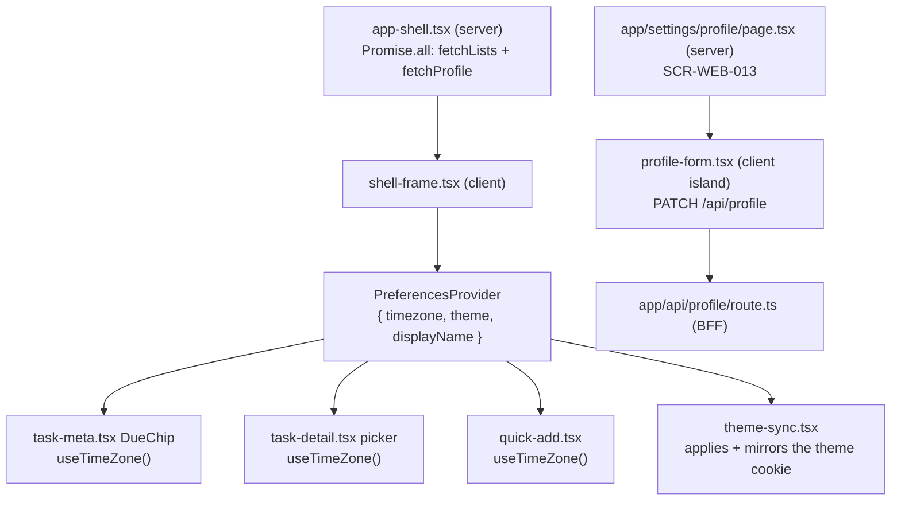

# Technical Design: FEAT-008 — View/edit profile (display name, timezone, theme)

> Feature from: docs/implementation-plan.md · Epic: EPIC-C — Profile & Settings (`profile` module)
> Implements: FR-PROF-001, FR-PROF-002, FR-PROF-003, FR-PROF-004, FR-PROF-005,
> NFR-LOC-001 (partial) · binds NFR-PERF-001, NFR-USE-003, NFR-USE-004, NFR-REL-004 ·
> also FR-AUTHZ-001/004 · **collects** the timezone hand-off FEAT-011 D1/§8 deferred here
> Realizes: UC-007 (main 1–4 + alt 3a, 4a) · Screens: SCR-WEB-013 (+ SCR-WEB-007
> sidebar nav target) — designed by ui-design
> Status: Draft · Date: 2026-07-30

## 1. Intent

Every screen built so far has rendered somebody's data in *the browser's*
assumptions: the browser's timezone decides what "Today" means on a due chip,
and the OS decides whether the product is light or dark. This slice moves those
assumptions onto the account. It mints the `profile` module the architecture
reserved (§5, `src/modules/README.md`), adds the three preference columns to
`users`, and — the part that reaches furthest — makes `lib/due-date.ts` render
in the user's *stored* zone rather than the machine's, which is the second half
of FR-PROF-003 and the hand-off FEAT-011 wrote down and left open.

It is first in Phase 3 because it is the smallest feature that removes a
device-dependence from behaviour already shipped, and because FEAT-015/016
(search filters and smart views) bucket dates *by day* — a bucket is meaningless
until "which day" has an owner-scoped answer.

## 2. Codebase context

Surveyed live (last migration `009_1721560000000_task-due-priority.js`; API
modules = `auth`, `lists`, `tasks` — `profile` is an unbuilt stub in
`src/modules/README.md`, which names this feature as its builder). The design
conforms to and reuses:

- **The `users` table across migrations 002/005/006** — `id, email,
  password_hash, verified_at, verification_token_hash,
  verification_token_expires_at, failed_login_count, locked_until,
  reset_token_hash, reset_token_expires_at, created_at, updated_at`. §4 adds
  three columns to it and nothing else.
- **The module shape `lists` established and `tasks` inherited** —
  `<area>.module.ts` / `.controller.ts` / `.service.ts` / `.repository.ts` /
  `.errors.ts` / `dto/*.dto.ts`; framework-free domain errors mapped to HTTP by
  a `toHttp` helper in the controller; every statement owner-scoped in the
  repository. `ProfileModule` is registered in `app.module.ts` beside
  `ListsModule`/`TasksModule`.
- **Contract/error conventions.** `ApiError`
  (`statusCode/code/message/fields[]`) rendered by the global
  `HttpExceptionFilter`; `validation_failed` + `fields[]` for field-level
  failures; shared error-code constant objects and path constants in
  `@todo/shared`; class-validator DTOs behind the global `ValidationPipe`
  (`{ whitelist: true, transform: true }` — it **strips** unknown properties
  rather than rejecting them, the code fact D6 turns into a visible error, as
  FEAT-011 D4 did before it). Data endpoints are not rate-limited
  (FR-AUTH-018/NFR-SEC-006 scope throttling to auth).
- **`UPDATE … SET …, updated_at = now()`** is the established write shape
  (`ListsRepository.rename`, `TasksRepository.update`).
- **`ChangeSignalInterceptor`** (FEAT-019 D8) — a class-level
  `@UseInterceptors` on any controller with writes publishes the per-user
  `changed` signal after a successful mutation. Its own docblock names
  *"FEAT-014/008/016 will add more"* writes; this is one of them.
- **Web tier.** `lib/session.ts` / `lib/lists.ts` (server-side fetch helpers
  that forward the `sid` cookie and return `null` on failure), the BFF proxy
  pattern in `app/api/**/route.ts` (forward `cookie`, relay status + JSON
  verbatim), `components/app-shell.tsx` (server: resolves the sidebar data) →
  `components/shell-frame.tsx` (`"use client"`: the interactive frame, already
  hosting `SyncProvider`), the client-island form pattern in
  `components/change-password-form.tsx`, and `app/settings/security/page.tsx`
  as the settings-page model. `apps/web/AGENTS.md`: read
  `node_modules/next/dist/docs/` before writing web code.
- **`lib/due-date.ts` and its four consumers** — `task-meta.tsx` (`DueChip`),
  `task-detail.tsx` (picker + display), `quick-add.tsx`
  (`fromDateTimeLocalValue`), and `list-view.tsx` transitively. Every one of
  them is already `"use client"` (or renders client leaves), which is what makes
  §5's context approach possible without converting any server component.
- **The design system already has the dark theme.** `docs/tokens.json`
  `colorDark` → `scripts/build-tokens.mjs` → `:root[data-theme="dark"], .dark`
  in `tokens.generated.css`, and design.md §8: *"Theme: toggle
  `data-theme="dark"` on `:root`; all tokens re-value."* This feature **uses**
  that mechanism; it adds no token and forks nothing (no design-system
  amendment is filed).
- **Divergence found:** one, recorded rather than worked around. The sidebar's
  `Settings` item currently links to `/settings/security` (FEAT-006 shipped the
  only settings screen that existed). ux-foundations' IA puts *Profile &
  Preferences* (SCR-WEB-013) and *Security & Account* (SCR-WEB-014) as siblings
  under Settings — so the nav target moves here (D5) and the two screens link to
  each other. No other document-vs-code divergence.

## 3. API contracts

New module, two endpoints, both authenticated by the existing `SessionGuard` and
both operating on **the session user only**. There is no user id in any path,
query or body — the subject is not addressable, which is the strongest available
form of FR-AUTHZ-004 for a single-subject resource.

```
GET   /profile     → 200 ProfileResponse
PATCH /profile     → 200 UpdateProfileResponse
```

### 3.1 `GET /profile` — view the profile (FR-PROF-001; UC-007 main 1–2)

- **Request**: none (no body, no query).
- **Success `200`** `ProfileResponse`: `{ profile: UserProfile }`

  | Field | Type | Meaning |
  | :-- | :-- | :-- |
  | `email` | `string` | The account email. **Read-only in the MVP** (FR-PROF-001's own note); no endpoint in this feature writes it |
  | `displayName` | `string \| null` | `null` = never set. The client renders the fallback (D1) |
  | `timezone` | `string \| null` | An IANA zone id, exactly as the user chose it; `null` = not yet established (D2) |
  | `theme` | `"light" \| "dark" \| "system"` | Never null — the column is `NOT NULL DEFAULT 'system'` (FR-PROF-004) |

- **Errors:**

  | Status | code | When | Trace |
  | :-- | :-- | :-- | :-- |
  | `401` | `unauthenticated` | No/expired/revoked session | FR-AUTHZ-001 |

  There is deliberately **no `404`**: the subject is whoever the session
  resolves to, so a resolvable session always has a row. The one way the
  repository can return null — the account was deleted while a session was live
  (FEAT-018's future concern) — maps to the same `401 unauthenticated`, because
  "your account is gone" and "your session is not valid" are the same fact to a
  caller, and a `500` would be a lie.
- Read-only, idempotent, **one statement** (NFR-PERF-001).

### 3.2 `PATCH /profile` — edit display name, timezone, theme (FR-PROF-002/003/004/005; UC-007 main 3–4)

- **Request** `UpdateProfileRequest` — **partial**; every field optional, and
  *absent ≠ null*, the semantics FEAT-011 D4 established for `PATCH` in this API
  (D6):

  | Field | Type | Absent | Value | Validation |
  | :-- | :-- | :-- | :-- | :-- |
  | `displayName` | `string \| null` | unchanged | a string sets it; `null` **unsets** it back to "never set" (D1) | trimmed, then **non-empty** (UC-007 alt 3a) and `≤ DISPLAY_NAME_MAX_LENGTH` (80); no control characters, no line breaks |
  | `timezone` | `string` | unchanged | replaces the zone; stored **verbatim** | must be a zone the runtime's ICU database resolves, and must not be a fixed-offset form (D2). `null` is **not** accepted |
  | `theme` | `ThemePreference` | unchanged | replaces the preference | one of `light \| dark \| system` (FR-PROF-004) |

  Not accepted in the body, ever: `email`, `id`, `passwordHash`, `verifiedAt`,
  `createdAt` (FR-PROF-001 read-only note, FR-AUTHZ-004). `whitelist: true`
  strips them and the DTO declares only the three fields above — so a body of
  `{ email: "someone@else" }` reaches the service as `{}` and takes the
  empty-patch path below rather than silently returning `200`.
- **Success `200`** `UpdateProfileResponse`: `{ profile: UserProfile }` — the
  profile **as stored** (the timezone echoed verbatim, D2), so the client renders
  the server's truth rather than its own optimistic copy.
- **Errors:**

  | Status | code | When | Trace |
  | :-- | :-- | :-- | :-- |
  | `401` | `unauthenticated` | No/expired/revoked session | FR-AUTHZ-001 |
  | `400` | `validation_failed` (field `displayName`) | Empty after trim, > 80 chars, or contains control characters — nothing written | FR-PROF-002; UC-007 alt 3a |
  | `400` | `validation_failed` (field `timezone`) | Unknown zone, a fixed-offset form (`+05:30`, `Etc/GMT+5`), or `null` — nothing written | FR-PROF-003 |
  | `400` | `validation_failed` (field `theme`) | Not one of the three values — nothing written | FR-PROF-004 |
  | `400` | `validation_failed` (field `_`) | **Empty patch** — no recognized field present | D6 |

- **Idempotent**: applying the same body twice leaves the same state
  (`updated_at` moves; nothing else does). Partial by construction — saving the
  theme toggle cannot blank a display name being edited on another device
  (FR-PROF-005).
- **Side-effect**: on success the `ChangeSignalInterceptor` publishes the
  per-user `changed` signal, so a second signed-in device refetches and picks up
  the new preference without a reload (FR-PROF-005; ADR-006). Nothing is
  published when the handler throws.
- **Not audited.** NFR-SEC-009 enumerates the security-relevant events (sign-in,
  password change/reset, account deletion); a preference change is not one of
  them, and inventing an audit row here would be gold-plating.

## 4. Schema changes

**Migration 010 — `1721570000000_profile-preferences.js`.** Three columns on
`users`, inside the conceptual entity the architecture already owns (User,
arch §8 / §5's `profile` area). No new entity, no boundary change, **no
escalation**.

```js
exports.up = (pgm) => {
  pgm.addColumns("users", {
    // FR-PROF-002 — NULL = never set. The default display name is DERIVED at
    // read time (technical-design D1), never backfilled, so "did the user
    // choose this?" stays answerable.
    display_name: { type: "text" },

    // FR-PROF-003 — an IANA zone id as the user chose it (NOT re-canonicalized
    // server-side — technical-design D2). NULL = not yet established; the
    // effective zone is COALESCE(timezone, 'UTC'), which is the FR's own
    // "falls back to UTC" (D2). No DB-side CHECK: the valid set is the
    // runtime's ICU database, which Postgres does not share.
    timezone: { type: "text" },

    // FR-PROF-004 — NOT NULL DEFAULT 'system' is the FR's own stated default
    // ("match system") and backfills every existing row in the same statement.
    theme: { type: "text", notNull: true, default: "system" },
  });

  // text + CHECK, matching migration 009's `tasks_priority_check` — this schema
  // has no Postgres enum types and FEAT-011 D6 recorded why.
  pgm.addConstraint("users", "users_theme_check", {
    check: "theme IN ('light', 'dark', 'system')",
  });
};

exports.down = (pgm) => {
  pgm.dropConstraint("users", "users_theme_check"); // before its column
  pgm.dropColumns("users", ["theme", "timezone", "display_name"]);
};
```

**No index.** Every statement this feature issues is `WHERE id = $1` on the
primary key. An index on a preference column would be write cost bought for a
query nobody makes (the rule FEAT-011 D7 set).

## 5. Component design

### 5.1 API — `src/modules/profile/`

| File | Responsibility |
| :-- | :-- |
| `profile.module.ts` | Wires controller + service + repository; imported by `app.module.ts` |
| `profile.controller.ts` | `@Controller('profile')`, class-level `@UseGuards(SessionGuard)` + `@UseInterceptors(ChangeSignalInterceptor)`; `GET` / `PATCH`; `toHttp` maps domain errors to the designed responses |
| `profile.service.ts` | Validation and normalization: `normalizeDisplayName`, `validateTimezone`, theme membership, the empty-patch rule; calls the repository with only the keys actually supplied |
| `profile.repository.ts` | Two owner-scoped statements: `findByUserId` and `update` (SET clause built from supplied keys, always `+ updated_at = now()`), both `RETURNING` a shared `PROFILE_COLUMNS` projection |
| `profile.errors.ts` | `DisplayNameInvalidError`, `TimezoneInvalidError`, `ThemeInvalidError`, `EmptyProfilePatchError`, `ProfileNotFoundError` — framework-free, `requirement`-carrying like `ListNameInvalidError` |
| `dto/update-profile.dto.ts` | The absent-vs-null DTO: `@ValidateIf((_, v) => v !== undefined)` on each field (D6), so class-validator's `@IsOptional()` cannot collapse `null` into `undefined` |

**Timezone validation** (`profile.service.ts`) — one function, because this is
the only place in the system that decides what a zone *is*. It validates and
**stores what the caller sent**; it does not canonicalize (D2):

```ts
function validateTimezone(raw: string): string {
  // Fixed-offset forms are legal input to Intl and wrong for a person: they are
  // DST-blind, so a user "in +05:30" is silently an hour off the day their zone
  // shifts. `Etc/GMT±N` is the same thing spelled differently (and inverted).
  if (/^[+-]/.test(raw) || /^Etc\/GMT/i.test(raw)) {
    throw new TimezoneInvalidError('Choose a timezone from the list.');
  }
  try {
    new Intl.DateTimeFormat('en-US', { timeZone: raw }); // RangeError on nonsense
  } catch {
    throw new TimezoneInvalidError('Choose a timezone from the list.');
  }
  return raw;
}
```

The temptation is to normalize through
`Intl.DateTimeFormat(...).resolvedOptions().timeZone` and to gate on
`Intl.supportedValuesOf('timeZone')`. **Both are traps on this stack, measured
on the repo's own runtimes** rather than assumed:

| Fact (measured) | Node 22.18 / ICU 77 | The E2E suite's Chromium |
| :-- | :-- | :-- |
| `resolvedOptions()` for `Asia/Kolkata` | `Asia/Calcutta` | `Asia/Calcutta` |
| `supportedValuesOf` contains `Asia/Kolkata` | no | no |
| `supportedValuesOf` contains `UTC` | no | no |

Two consequences. A **membership gate would reject `UTC`**, the system's own
fallback zone. And which alias spelling a runtime prefers is an ICU-version
detail, not a fixed fact — the two agree today and are free to diverge on the
next upgrade of either — so a server that canonicalized would eventually hold a
zone id the picker's own option list does not contain, and the settings screen
could not show the user their own saved setting. Hence D2: validate, store
verbatim, and have the client guarantee the stored zone is present in its list
(§5.2's `groupZones`).

### 5.2 Web — the profile's three consumers



| File | Responsibility |
| :-- | :-- |
| `lib/profile.ts` | `fetchProfile()` — server-side, forwards `sid`, returns `UserProfile \| null`. Mirrors `lib/lists.ts` exactly |
| `app/api/profile/route.ts` | BFF proxy: `GET` and `PATCH`, cookie forwarded, status + JSON envelope relayed verbatim |
| `components/app-shell.tsx` | Fetches the profile **alongside** the lists in one `Promise.all` (no added round-trip latency) and passes it into the frame |
| `components/preferences-provider.tsx` | New client context: `{ timezone, theme, displayName, email }` + `useTimeZone()` (returns the effective zone, `timezone ?? 'UTC'`). One provider, so no server component has to prop-drill a zone through `list-view` → `TaskRow` → `DueChip` |
| `components/theme-sync.tsx` | Applies the persisted theme to `document.documentElement.dataset.theme`, mirrors it to the `theme` cookie for the next load, resolves `system` via `matchMedia` and **keeps following** OS changes while `system` is selected (D3) |
| `app/layout.tsx` | Gains the pre-paint inline `<script>` that reads the `theme` cookie and sets `data-theme` before first paint (D3) |
| `app/settings/profile/page.tsx` | SCR-WEB-013 (server): `requireSession()`, `fetchProfile()`, renders the form island + the link to Security & Account |
| `components/profile-form.tsx` | The client island: email read-only, display-name field, timezone select, theme control; states default/saving/success/error; input preserved on error (NFR-REL-004); field errors from `fields[]` |
| `components/shell-frame.tsx` | `Settings` nav target → `/settings/profile` (D5); hosts `PreferencesProvider` + `ThemeSync` |
| `components/sign-out-button.tsx` | Clears the `theme` cookie mirror on sign-out — the preference belongs to the account, not the device (D3 consequence) |
| `lib/due-date.ts` | **Rewritten to be zone-explicit** (§5.3) |

Screens themselves are ui-design's output (SCR-WEB-013 against these
contracts); the table above is the wiring.

### 5.3 `lib/due-date.ts` — the FR-PROF-003 "use it" clause

Today every function in this file reads the **browser's** zone, with a header
comment naming this feature as the fix. It gains an explicit `timeZone`
parameter, supplied by `useTimeZone()`, and does its arithmetic on zone-resolved
parts rather than on `Date`'s local-time getters:

```ts
// Wall-clock parts of an instant, in a named zone — the primitive the rest builds on.
function zonedParts(instant: Date, timeZone: string): { y; m; d; h; min }

formatDueDate(iso, timeZone, now?)      // "Today"/"Tomorrow"/weekday computed on ZONED calendar days
toDateTimeLocalValue(iso, timeZone)     // instant → the picker's wall clock in the user's zone
fromDateTimeLocalValue(value, timeZone) // the picker's wall clock in the user's zone → UTC instant
```

`fromDateTimeLocalValue` is the one with a real algorithm, and it is written as
the standard two-pass offset solve so DST boundaries land correctly:

```
guess   = Date.parse(value + 'Z')            // read the wall clock as if UTC
offset  = asUtc(zonedParts(guess, tz)) - guess
instant = guess - offset
offset  = asUtc(zonedParts(instant, tz)) - instant   // second pass: the offset AT the answer
instant = guess - offset
```

One pass is wrong for values within an offset's width of a transition; two
passes converge for every real zone (offsets change by at most an hour or two,
never enough to re-cross). Half-hour and 45-minute zones (`Asia/Kolkata`,
`Asia/Kathmandu`) fall out of the same arithmetic with no special case.

**`isOverdue` is not touched, and that is the point.** FEAT-011 D1/D3 derive it
server-side from `completed_at IS NULL AND due_at < now()` — an instant
comparison whose answer is the same in every zone. FR-PROF-003's "and shall use
it to compute due-date **and overdue status**" is satisfied for overdue by that
invariance, not by adding a second zone-aware derivation (D4). Changing your
timezone must not make a task stop being late.

### 5.4 Skeleton stubs replaced

`src/modules/README.md`'s `profile` row ("stub until its slice") becomes real;
the file's status table is updated in the same commit as `app.module.ts`'s
comment listing the active modules.

## 6. Acceptance criteria

- **AC-1 (FR-PROF-001; UC-007 main 1–2).** `GET /profile` with a valid session
  returns `200 { profile: { email, displayName, timezone, theme } }` for **that**
  session's user, `email` matching the account. SCR-WEB-013 shows the email as
  read-only text, not an input.
- **AC-2 (FR-PROF-001, FR-AUTHZ-004).** A `PATCH /profile` body containing
  `email` (alone) does not change the email and returns the empty-patch `400`;
  a body containing `email` **and** a valid `displayName` changes only the
  display name. The email in the response and in a follow-up `GET` is unchanged
  in both cases.
- **AC-3 (FR-PROF-002; UC-007 main 3–4).** `PATCH { displayName: "  Ada  " }`
  returns `200` with `displayName: "Ada"` (trimmed), and a subsequent `GET`
  agrees. The value survives a new session on a different client.
- **AC-4 (FR-PROF-002; UC-007 alt 3a).** `displayName` of `""`, `"   "`, a
  string of 81 characters, or a string containing `\n` or a control character
  returns `400 validation_failed` with `fields[0].field === "displayName"`, and
  the stored value is **unchanged** (verified by a follow-up `GET`).
- **AC-5 (FR-PROF-002, D1).** `PATCH { displayName: null }` returns `200` with
  `displayName: null`, and the web surfaces then render the email's local part
  (`ada@example.com` → `ada`) — the derived default, not a stored copy.
- **AC-6 (FR-PROF-003).** `PATCH { timezone: "Asia/Kolkata" }` returns `200`
  and a follow-up `GET` returns **that same string back** — not an ICU
  re-spelling of it (D2). `"America/New_York"`, `"UTC"` and the alias
  `"Asia/Calcutta"` are likewise each accepted and echoed verbatim.
  `"Mars/Olympus"`, `""`, `"+05:30"`, `"Etc/GMT+5"` and `null` each return
  `400 validation_failed` field `timezone` with nothing written.
- **AC-7 (FR-PROF-003, D2).** An account that has never set a timezone reports
  `timezone: null`; the authenticated shell then adopts the browser-detected
  zone with exactly **one** `PATCH`, and a second page load issues **none**
  (the adoption is once, not per render).
- **AC-8 (FR-PROF-003, NFR-LOC-001).** With the profile zone set to
  `Asia/Kolkata`, a task due at `2026-03-01T02:30:00.000Z` renders its due chip
  and its picker value as `08:00` on 1 Mar — **not** the browser's wall clock —
  and the same account viewed with the browser forced to
  `America/Los_Angeles` renders identically. Entering `2026-03-01T09:00` in the
  picker sends `2026-03-01T03:30:00.000Z`. A value on a DST transition day for
  `America/New_York` round-trips through
  `toDateTimeLocalValue`/`fromDateTimeLocalValue` unchanged.
- **AC-9 (FR-PROF-003, D4; FEAT-011 D1 preserved).** Changing the timezone
  changes **no** task's `isOverdue`: the same task list read before and after a
  `PATCH { timezone }` returns byte-identical `isOverdue` values.
- **AC-10 (FR-PROF-004).** `PATCH { theme: "dark" | "light" | "system" }`
  returns `200` and persists; any other value returns `400 validation_failed`
  field `theme` with nothing written. The DB rejects an out-of-set value
  independently (`users_theme_check`).
- **AC-11 (FR-PROF-004, "applied on load").** An account with `theme: "dark"`
  loads any authenticated screen with `data-theme="dark"` present on
  `<html>` **at first paint** — no light-themed flash (asserted on the
  pre-hydration state, not just the settled DOM). With `theme: "system"`, the
  resolved attribute follows the OS preference and **changes live** when the OS
  preference changes, without a reload.
- **AC-12 (FR-PROF-005).** A preference saved in one browser is present in a
  second browser signed into the same account (server-side truth, no
  `localStorage`), and a second **already-open** device picks it up via the
  `changed` signal without a manual reload. Nothing is published when the PATCH
  fails validation.
- **AC-13 (D6, partial-patch semantics).** A patch carrying one field leaves the
  other two exactly as they were. A patch with no recognized field — `{}`,
  `{ nickname: "x" }`, `{ email: "x" }` — returns `400 validation_failed` field
  `_` and writes nothing (`updated_at` unmoved).
- **AC-14 (FR-AUTHZ-001).** Both routes return `401 unauthenticated` with no
  cookie, an expired session and a revoked session, rendering the `ApiError`
  envelope; nothing is written on the `PATCH`. Neither route accepts a user
  identifier in any position.
- **AC-15 (NFR-PERF-001).** `GET /profile` issues exactly one `DbService`
  query and `PATCH /profile` exactly one, each completing well inside the
  300 ms bound.
- **AC-16 (NFR-USE-003, NFR-USE-004).** SCR-WEB-013 presents default, saving,
  success and error states (UC-007 alt 3a's field error inline, input
  preserved); every control is keyboard-operable with a visible focus ring; and
  every text/background pairing the screen introduces is **measured** in
  **both** themes against design.md §5's 4.5:1 (3:1 for UI graphics) — the check
  DEF-003/004/006 exist because earlier features skipped.

## 7. Decisions

- **D1 — The default display name is derived at read time, never stored.**
  Driver: FR-PROF-002's note ("may default to the local part of the email") is a
  *presentation* default, and FR-PROF-001 needs "did the user choose a name?" to
  stay answerable. `display_name IS NULL` means never set; a shared
  `displayNameFor({ displayName, email })` in `@todo/shared` renders the
  fallback so web and every future surface agree on one rule. Rejected:
  backfilling the local part at registration (it would drift from the email the
  moment either changed, and would make an unset name indistinguishable from a
  deliberately-chosen one — it also drags FEAT-001's verified registration path
  into this slice's scope). Consequence: `null` is a *transmittable* value on
  the PATCH (it unsets), while `""` is a validation error, which is exactly the
  pair UC-007 alt 3a and this decision each require.
- **D2 — Timezone is nullable, validated but *not* canonicalized; the fallback
  is computed, not stored.** Driver, part one: FR-PROF-003 says the zone
  "defaults to the browser-detected timezone at first sign-in; falls back to
  UTC" — two different defaults for two different moments, which a single stored
  default cannot express. `NULL` = not yet established; the effective zone
  anywhere the server needs one is `COALESCE(timezone, 'UTC')`; the
  browser-detected adoption is a one-time client `PATCH` when the profile
  reports `null` (AC-7). Driver, part two — **measured on both runtimes, not
  assumed** (the table in §5.1): `Intl.supportedValuesOf` excludes `UTC` on
  *both* the API's ICU and the E2E browser's, so a membership gate would reject
  the system's own fallback zone; and the alias spelling a runtime canonicalizes
  to is an ICU-version detail (both currently prefer `Asia/Calcutta` over
  `Asia/Kolkata`, and are free to diverge on the next upgrade of either). A
  server that canonicalized would therefore be one ICU bump away from holding a
  zone id absent from the picker's own option list — a settings screen that
  cannot show the user their own saved setting. The client closes the remaining
  gap by guaranteeing the stored zone appears in its list regardless (§5.2's
  `groupZones`).
  So: validate (resolves through `Intl`, not a fixed-offset form) and store the
  caller's string unchanged. The residual cost is that two spellings of one zone
  can both exist in the column; that costs nothing, because the value is only
  ever handed back to `Intl`, never compared. Rejected: a `NOT NULL DEFAULT
  'UTC'` column (an account that never chose UTC would be indistinguishable from
  one that did, and the adoption step would have no trigger); canonicalizing
  server-side (above); a DB `CHECK` against a zone list (Postgres's
  `pg_timezone_names` and the Node runtime's ICU set are different databases
  that drift).
- **D3 — Theme is applied before paint from a mirrored cookie; the server row
  stays the truth.** Driver: FR-PROF-004 says "applied on load" and "persisted
  server-side so it follows the user across devices" — the first demands a
  pre-hydration decision, the second forbids treating the browser as the source.
  So: the DB row is authoritative and cross-device; a non-HttpOnly `theme`
  cookie mirrors it *per device* purely as a render cache; the root layout's
  inline script reads that cookie (resolving `system` via `matchMedia`) and sets
  `data-theme` before first paint; `ThemeSync` corrects and re-mirrors it from
  the server-fetched profile once the shell renders. Rejected: server-rendering
  `data-theme` from a per-page profile fetch (an API round-trip added to the
  *unauthenticated* pages too, and a hydration-mismatch hazard on `system`);
  applying the theme in a `useEffect` only (a guaranteed light flash for every
  dark-theme user — the defect AC-11 is written to catch); `localStorage` (unreadable
  before paint without the same script, and it is the device-local store
  FR-PROF-005 explicitly rules out as the source). Consequence: a fresh device's
  very first authenticated paint has no mirror yet and resolves `system` until
  the shell corrects it; and sign-out clears the mirror, because leaving one
  account's theme on a shared browser is a (small) preference leak.
- **D4 — Overdue stays timezone-invariant; the timezone governs interpretation
  and display only.** Driver: FEAT-011 D1/D3 derive overdue server-side from an
  instant comparison and require it to have exactly one definition. FR-PROF-003
  names overdue, but an absolute instant either has passed or has not, in every
  zone at once — the requirement is satisfied by the invariance rather than by a
  second derivation. Rejected: recomputing overdue against the user's zone
  (it would produce a task that is late in the API and on time in the UI, and
  would give FEAT-016's Overdue view a third opinion). Consequence: AC-9 pins
  it, so a later feature cannot quietly make overdue zone-dependent.
- **D5 — The Settings nav lands on Profile & Preferences; Security & Account
  becomes its sibling.** Driver: ux-foundations' IA (`settings → prefs` /
  `settings → account`) and the fact that SCR-WEB-013 is the settings screen a
  user visits routinely, while SCR-WEB-014 is a hub for occasional destructive
  actions. Rejected: leaving the nav on `/settings/security` and burying the new
  screen (it would contradict the IA the pipeline already agreed on).
  Consequence: this feature edits `shell-frame.tsx` — a FEAT-009 file — and adds
  reciprocal links between the two settings screens; FEAT-006's screen itself is
  otherwise untouched, and no contract changes.
- **D6 — PATCH is partial, *absent* is not *null*, and the empty patch is an
  error.** Driver: the same `ValidationPipe` fact FEAT-011 D4 documented —
  `whitelist: true` strips unknown properties, so a typo (`{ timeZone: … }` for
  `timezone`) would otherwise return `200` having changed nothing, which is the
  worst available outcome. Inherited verbatim rather than re-litigated: the same
  `@ValidateIf((_, v) => v !== undefined)` DTO shape, the same key-presence
  branching in the service, the same `SET`-clause-from-supplied-keys repository.
  Consequence: consistency across the API's two PATCH resources, and AC-13 pins
  it here too.
- **D7 — `SessionUser` does not gain a display name.** Driver: `SessionUser`
  (`{ id, email }`) is FEAT-003's shipped contract, returned by `POST
  /auth/login` and `GET /auth/session`; widening it would change two verified
  features' responses and their tests for a value the profile resource already
  serves. Rejected: adding `displayName` to the session payload to save the
  shell one fetch. Consequence: the shell fetches the profile — in the same
  `Promise.all` as the lists it already fetches, so the added cost is one
  parallel primary-key read, not one round-trip of latency.

## 8. Escalations & open items

**Recorded during implementation** (deviations too small for the amendment path,
in the house style FEAT-011 §8 set — the design's substance is unchanged):

1. **`'field' in patch` → `patch.field !== undefined` in the service.** D6's
   absent-vs-null rule stands; only its *encoding* moved, for the reason
   FEAT-011 already documented: class-transformer materializes every declared
   DTO property, so `in` is true for a field the client never mentioned (it made
   every single-field PATCH `400` on a phantom display name). `!== undefined` is
   exact at this boundary because JSON cannot carry `undefined`. A service test
   passes a fully-materialized instance to keep it from regressing.
2. **§5.1's timezone rationale was corrected against measurement.** The original
   text claimed the API's ICU and the browser's canonicalize aliases in opposite
   directions. Measured on both (Node 22.18/ICU 77 and the E2E Chromium): they
   currently *agree* on `Asia/Calcutta`, and both exclude `UTC` from
   `supportedValuesOf`. D2's decision is unchanged and better supported — see
   the table in §5.1. The client's `groupZones` guarantees the stored zone is
   present in the picker regardless of which way a future ICU bump goes.
3. **AC-7's adoption had no task.** The criterion and §5.2 specify it; tasks.md
   T1–T11 never named it. Implemented in T8 as `components/timezone-adoption.tsx`
   (five unit tests + an E2E that counts the request). A tasks.md completeness
   gap, not a design change.
4. **`suppressHydrationWarning` on `<html>`.** The pre-paint script mutates the
   element before React hydrates, which is the mechanism working; React's
   documented escape hatch marks it, scoped to that one element.
5. **The form re-syncs from the server during render.** FR-PROF-005/AC-12 needs
   an already-open second device to converge, and a `useState` seeded once never
   does. Adjusted during render against previous props (React's own pattern for
   prop-derived state — the hooks lint rejects the effect form), skipping the
   display name while it is dirty so FEAT-019 AC-9 still holds.

**Recorded tech debt (not acted on — pre-existing, not caused here):**
`apps/api/src/modules/auth/change-password.controller.spec.ts:94` does not
typecheck under `tsc --noEmit` (an `unknown` argument); it passes under ts-jest,
which is why it has gone unnoticed. Confirmed present before this feature's
first commit.


- **No architecture amendment.** Three columns on `users` — an entity the
  conceptual model already owns (arch §8) — and the `profile` module the
  architecture's building-block view already names. Nothing crosses a
  consistency boundary.
- **No design-system amendment.** The dark theme, its tokens, and the
  `data-theme` mechanism are already specified (design.md §8, tokens.json
  `colorDark`) and generated into `tokens.generated.css`. This feature is the
  first to *exercise* dark mode end to end, so ui-design should expect to
  measure the dark values in earnest — if a pairing fails §5, that is a
  design-system amendment ui-design files, not a change this design pre-empts.
- **DEF-006 is open and overlaps this feature's surface.** Five shipped sites
  (including `app/signup/page.tsx`, `app/signin/page.tsx`,
  `components/lists-nav.tsx`) still use the 3.95:1 danger pairing. This feature
  does **not** fix them — that is a web-tier maintenance pass with its own
  ledger row — but its own new alert must use `--color-danger-text` from the
  start (AC-16), and any new code copied from those files inherits the defect if
  copied blindly.
- **DEF-002 is open.** The api suite must be run **serially**
  (`npm test -w @todo/api -- --runInBand`) while it is; a red parallel run is
  re-checked serially before it is attributed to this feature.
- **First-sign-in adoption is client-side, by design.** FR-PROF-003's
  "browser-detected at first sign-in" is realized in the shell (AC-7), not in
  the sign-in endpoint, because the API never sees a browser's zone. A user who
  only ever uses the API would stay on `UTC` — correct, and stated so it is not
  later mistaken for a gap.
- **The timezone picker's option list is ui-design's.** `Intl.supportedValuesOf`
  yields ~400 zones; whether SCR-WEB-013 presents a searchable combobox or a
  grouped select is a screen decision, not a contract one. The contract accepts
  any zone id the runtime resolves, regardless.
- **Not in this feature:** changing the account email (FR-PROF-001 states it is
  read-only in the MVP; no FR requests a change flow), an avatar, notification
  preferences, or language (NFR-LOC-002 is a Should about externalized strings,
  assigned nowhere in the plan and not pulled forward here).
