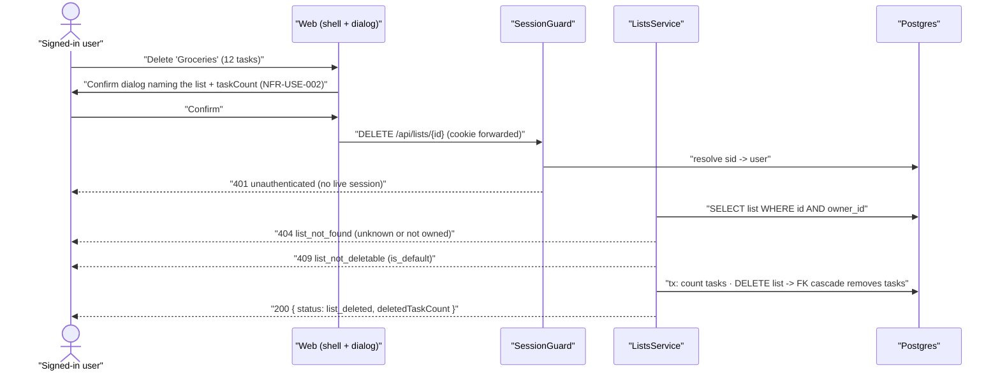

# Technical Design: FEAT-009 — List management

> Feature from: docs/implementation-plan.md · Epic: EPIC-D — Task Lists (`lists` module)
> Implements: FR-LIST-001, FR-LIST-002, FR-LIST-004, FR-LIST-005, FR-LIST-006,
> FR-LIST-007, FR-LIST-008, FR-LIST-009 (partial — the one-list-per-task
> constraint) · binds NFR-USE-002, NFR-PERF-001 ·
> also FR-AUTHZ-001/002/003/004/005 (first owned-data endpoints)
> Realizes: UC-008 · Screens: SCR-WEB-011, SCR-WEB-007 (sidebar) — designed by ui-design
> Status: Draft · Date: 2026-07-27

## 1. Intent

The first slice of Phase 2 and the first **owned-data** capability in the system:
a signed-in user sees all of their lists with active-task counts, creates,
renames, reorders and deletes them, with the Inbox protected from deletion
(FR-LIST-004) and list deletion cascading to the tasks it contains
(FR-LIST-007). It is next because lists gate every task slice — FEAT-010..014
all write through a `list_id` — and because it is where the *ownership* half of
the authz story (FR-AUTHZ-002/003/005) stops being a foundation stub and becomes
enforced, tested behavior on real rows. It also turns the app shell's sidebar
(SCR-WEB-007) from placeholder text into the product's primary navigation.

## 2. Codebase context

Surveyed live (last migration 006 `1721530000000_password-reset.js`; API modules
= `auth` only, `lists` does not exist yet). The design conforms to and reuses:

- **Session + identity (FEAT-003).** `SessionGuard` (`common/authz`) resolves the
  `sid` cookie to `req.user` and answers a uniform `401 unauthenticated`;
  `@CurrentUser()` yields `SessionUser { id, email }`. Every endpoint here sits
  behind it, and the owner id comes from the resolved session — never from a
  path, query or body (FR-AUTHZ-001). `session.guard.ts`'s own header comment
  names FEAT-009 as the slice that extends this concern with ownership scoping;
  this is that extension (D3).
- **Error/contract conventions (FEAT-001..006).** `ApiError`
  (`statusCode/code/message/fields[]`) rendered by the global
  `HttpExceptionFilter`; framework-free domain errors in a module-local
  `*.errors.ts` mapped to HTTP in the controller; `validation_failed` +
  `fields[]` for field-level failures; shared error-code constants so the web
  branches on codes, not message text; `class-validator` DTOs behind the global
  `ValidationPipe`. All inherited verbatim; this feature adds a `lists` error-code
  block rather than a second convention.
- **Persistence.** `DbService.query` / `DbService.transaction(fn)` with the
  `TxClient` seam (`infra/db.service.ts`); repositories are thin, parameterized
  SQL, one per module. `lists` already exists physically (migration 002:
  `id, owner_id → users(id) ON DELETE CASCADE, name, is_default, created_at,
  updated_at` + `lists_owner_id_idx`), created **minimal with the explicit note
  "FEAT-009 extends"**. `tasks` does **not** exist yet.
- **The Inbox bootstrap (FEAT-001) lives in the `auth` module.**
  `modules/auth/lists.repository.ts` inserts the default Inbox inside
  registration's transaction. `.dependency-cruiser.cjs` forbids
  `modules/auth → modules/lists`, so that insert stays where it is; FEAT-009 only
  ensures it stays correct against the extended schema (D6).
- **Rate limiting.** `RateLimitGuard` is per-IP and scoped by FEAT-003/006 to
  *auth* endpoints (FR-AUTH-018, NFR-SEC-006). No SRS requirement rate-limits
  data endpoints, so it is deliberately **not** applied here (§8).
- **Web tier (ADR-002).** Screens are React server components under
  `apps/web/src/app/**` calling the API through same-origin BFF routes in
  `app/api/**/route.ts`; `lib/session.ts` (`getSession`/`requireSession`) is the
  server-side session gate FEAT-006 established for the authenticated zone;
  `components/app-shell.tsx` is the SCR-WEB-007 frame, whose sidebar currently
  renders **hard-coded placeholder text** (`Today / Upcoming / Overdue / Inbox`)
  with a comment naming FEAT-009 as the slice that makes lists real.
  `apps/web/AGENTS.md`: read `node_modules/next/dist/docs/` before writing web
  code — this Next.js differs from training data.
- **Divergences found (both acted on, not worked around):**
  1. `/` still renders the **walking-skeleton health card** (`fetchSkeletonPing`
     → `GET /healthz/ping`), while `signin/page.tsx` already redirects there
     "into the app shell (SCR-WEB-007)" on success. `docs/scaffold-notes.md`
     (2026-07-21) states `SkeletonService` + the `skeleton_ping` table + the
     `/healthz/ping` route "are removed when the first real slice lands" — that
     trigger is now overdue and `/` is exactly the surface this feature needs
     (D7).
  2. FEAT-006 §8 recorded shell debt: `app-shell.tsx` has no responsive drawer
     below `md`, so the content column is ~115px at 390px, and named FEAT-009
     (sidebar lists) as the natural owner. This feature owns the sidebar's
     *content*; the frame's responsive behavior is handed to ui-design with that
     note attached (§8) — no acceptance criterion here covers it.

## 3. API contracts

All five endpoints are `@UseGuards(SessionGuard)`, owner-scoped from
`@CurrentUser()`, and return the `ApiError` envelope on failure. Route
declaration order matters: `POST /lists/reorder` is declared **before**
`PATCH /lists/:id` so the static segment is not captured as an id.

**Shared response element — `ListSummary`:**

```ts
interface ListSummary {
  id: string;           // uuid
  name: string;         // trimmed
  isDefault: boolean;   // Inbox (FR-LIST-003/004)
  position: number;     // 0-based rank within the owner's lists (FR-LIST-008)
  activeTaskCount: number; // incomplete, not soft-deleted (FR-LIST-005)
  taskCount: number;       // every task in the list, for the delete warning (FR-LIST-007)
}
```

### 3.1 `GET /lists` — all of the caller's lists with counts

- **Success `200`** `ListsResponse`: `{ lists: ListSummary[] }`, ordered by
  `position ASC, created_at ASC` (FR-LIST-005, FR-LIST-008). Resolved by **one**
  SQL statement — lists left-joined to their task counts, never a count query per
  list (NFR-PERF-001, D5). Always non-empty in practice: every account has an
  Inbox (FR-LIST-003).
- **Errors:** `401 unauthenticated`.
- Read-only, idempotent.

### 3.2 `POST /lists` — create a list

- **Request** `CreateListRequest`: `{ name: string }` — `@IsString()`, trimmed by
  the service, then non-empty and `≤ LIST_NAME_MAX_LENGTH` (100) per FR-LIST-002.
  **Duplicate names are permitted** (SRS FR-LIST-002 note) — no uniqueness check.
- **Success `201`** `CreateListResponse`: `{ list: ListSummary }` with
  `isDefault: false`, both counts `0`, and `position = max(position) + 1` for the
  owner — appended to the end (FR-LIST-008 note). Ownership is the authenticated
  user (FR-AUTHZ-004); no field in the request can set it.
- **Errors:**
  | Status | code | When | Trace |
  | :-- | :-- | :-- | :-- |
  | `401` | `unauthenticated` | No/expired session | FR-AUTHZ-001 |
  | `400` | `validation_failed` (field `name`) | Missing, non-string, empty-after-trim, or > 100 chars | FR-LIST-002; UC-008 alt 3a |
- Not idempotent (a repeated call creates a second list — permitted, since
  duplicate names are legal).

### 3.3 `PATCH /lists/{id}` — rename a list

- **Request** `RenameListRequest`: `{ name: string }` — same validation as 3.2
  (FR-LIST-002, FR-LIST-006).
- **Success `200`** `RenameListResponse`: `{ list: ListSummary }` with the
  trimmed name and unchanged counts/position. **The default list is renameable**
  (FR-LIST-004 explicitly permits it) — `is_default` is untouched.
- **Errors:**
  | Status | code | When | Trace |
  | :-- | :-- | :-- | :-- |
  | `401` | `unauthenticated` | No/expired session | FR-AUTHZ-001 |
  | `400` | `validation_failed` (field `name`) | Fails FR-LIST-002 | UC-008 alt 3a |
  | `404` | `list_not_found` | Id is unknown **or** owned by another user — byte-identical response for both | FR-AUTHZ-002/003 (D3) |
- Idempotent for a given name.

### 3.4 `DELETE /lists/{id}` — delete a non-default list and its tasks

- **Success `200`** `DeleteListResponse`:
  `{ status: "list_deleted", deletedTaskCount: number }` — the list row is
  removed and **every task it contained is permanently deleted**, including
  completed and already soft-deleted ones (FR-LIST-007: "permanently delete all
  tasks contained in that list"; this is a hard delete, distinct from
  FR-TASK-013's soft delete — D4). `deletedTaskCount` is the number of task rows
  removed, for the success confirmation.
- **Errors:**
  | Status | code | When | Trace |
  | :-- | :-- | :-- | :-- |
  | `401` | `unauthenticated` | No/expired session | FR-AUTHZ-001 |
  | `404` | `list_not_found` | Unknown id or another user's list | FR-AUTHZ-002/003 |
  | `409` | `list_not_deletable` | Target is the account's default (Inbox) list — **nothing is deleted** | FR-LIST-004; UC-008 exc-4b |
- Not idempotent: a repeat returns `404 list_not_found` (the row is gone), which
  is the correct outcome.
- **Confirmation (NFR-USE-002, UC-008 alt 4a) is a client obligation** the
  contract supports: the warning names the list and its `taskCount`, and no
  request is issued until the user confirms. The server does not implement a
  two-phase confirm token — no requirement asks for one (D8).

### 3.5 `POST /lists/reorder` — persist a manual order

- **Request** `ReorderListsRequest`: `{ listIds: string[] }` — the caller's
  **complete** list of ids in the desired order. `@IsArray() @IsUUID('4', { each: true })`,
  then validated by the service against the owner's actual set.
- **Success `200`** `ReorderListsResponse`: `{ lists: ListSummary[] }` — the full
  collection in its new order, so the client re-renders from the server's truth
  rather than its optimistic guess (FR-LIST-008: "persist the chosen order across
  devices").
- In one transaction the service rewrites `position` to `0..n-1` in the given
  order. Rewriting the whole vector (rather than patching one row) makes the
  operation **idempotent** and keeps positions dense and drift-free (D2).
- **Errors:**
  | Status | code | When | Trace |
  | :-- | :-- | :-- | :-- |
  | `401` | `unauthenticated` | No/expired session | FR-AUTHZ-001 |
  | `400` | `validation_failed` (field `listIds`) | Not a uuid array, contains duplicates, or is not exactly the caller's set of list ids (missing, extra, or foreign id) | FR-LIST-008; FR-AUTHZ-002/003 |

  A foreign or unknown id is reported as `validation_failed` on `listIds`, not
  `404` — the request describes one collection, and the response still discloses
  nothing about whether the id exists elsewhere (D3 holds).

## 4. Schema changes

One migration, `migrations/1721540000000_lists-management.js` (007), against the
current schema (last applied: 006). Both changes are physical realizations of
entities the architecture's conceptual model already owns (List; Task, whose
`tasks.list_id` / `tasks.owner_id` foreign keys the architecture's Data section
names explicitly) — **no new entity, no boundary change, no escalation.**

**a) `lists` — add manual ordering (FR-LIST-008).**

| Change | Detail |
| :-- | :-- |
| `ADD COLUMN position` | `integer NOT NULL DEFAULT 0` |
| backfill | `position` = row number − 1 per `owner_id`, ordered `created_at ASC, id ASC` — existing Inbox rows land at 0 |
| index | `lists_owner_position_idx (owner_id, position)` — serves the `GET /lists` sort |

No uniqueness constraint on `(owner_id, position)`: reorder rewrites the whole
vector inside one transaction (D2), and a unique constraint would make the
intermediate states of that rewrite fail. Name length stays an application rule
(FR-LIST-002), matching how `users.email` normalization is handled — no CHECK.

**b) `tasks` — create, minimal (FR-LIST-005, FR-LIST-007, FR-LIST-009).**

Mirroring migration 002's own precedent (`lists` created minimal, "FEAT-009
extends"), this creates only what list management can demonstrate; FEAT-010..014
extend it with `due_at`, `priority`, `position` and the rest.

| Column | Type | Notes |
| :-- | :-- | :-- |
| `id` | `uuid PK default gen_random_uuid()` | as every table |
| `owner_id` | `uuid NOT NULL → users(id) ON DELETE CASCADE` | FR-AUTHZ-002/004; architecture Data §8 |
| `list_id` | `uuid NOT NULL → lists(id) ON DELETE CASCADE` | **FR-LIST-009** (exactly one list, NOT NULL) + **FR-LIST-007** (cascade) |
| `title` | `text NOT NULL` | FEAT-010 owns its validation |
| `completed_at` | `timestamptz NULL` | NULL = active; defines "active" for FR-LIST-005 (FEAT-012 gives it behavior) |
| `deleted_at` | `timestamptz NULL` | soft delete (architecture §8 Data, FR-TASK-013); excluded from the active count (FEAT-013 gives it behavior) |
| `created_at` / `updated_at` | `timestamptz NOT NULL default now()` | UTC (NFR-LOC-001) |

Indexes: `tasks_owner_list_idx (owner_id, list_id)` (the architecture's named
index) and `tasks_active_by_list_idx (list_id) WHERE completed_at IS NULL AND
deleted_at IS NULL` — the partial index the count query rides (NFR-PERF-001).

`activeTaskCount` ≔ `completed_at IS NULL AND deleted_at IS NULL`;
`taskCount` ≔ every row with that `list_id`. Defining both now means FEAT-012/013
add behavior without re-defining the counts (D1).

**Down:** drop `tasks` (with its indexes), drop `lists_owner_position_idx`, drop
`lists.position`. Reversible with no data loss for anything 006 created.

## 5. Component design

- **`packages/shared`** — a `lists` block: `LISTS_PATH = "/lists"`,
  `LIST_REORDER_PATH = "/lists/reorder"`, `LIST_NAME_MAX_LENGTH = 100`,
  `ListSummary`, `ListsResponse`, `CreateListRequest/Response`,
  `RenameListRequest/Response`, `DeleteListResponse`,
  `ReorderListsRequest/Response`, and
  `LIST_ERROR_CODES = { listNotFound: "list_not_found", listNotDeletable: "list_not_deletable" }`
  (the `AUTH_ERROR_CODES` pattern, kept separate per capability area).
- **`apps/api/src/modules/lists/`** — the new capability module (ADR-001), added
  to `AppModule`:
  - **`lists.repository.ts`** — parameterized SQL, **every method takes
    `ownerId` and every statement carries `WHERE owner_id = $1`** (D3):
    `findAllWithCounts(ownerId)` (single LEFT JOIN + `FILTER`-aggregate query),
    `findById(ownerId, id)`, `create(ownerId, name)` (position from
    `COALESCE(MAX(position) + 1, 0)` for that owner), `rename(ownerId, id, name)`,
    `deleteById(q, ownerId, id)` returning the deleted row,
    `countTasks(q, listId, ownerId)`, `setPositions(tx, ownerId, orderedIds)`.
    Optional-`TxClient`-first-parameter shape where a method participates in a
    transaction, matching `SessionsRepository`.
  - **`lists.errors.ts`** — framework-free `ListNotFoundError`,
    `ListNotDeletableError`, `ListNameInvalidError(requirement)` (mirrors
    `PasswordPolicyError`'s carried message).
  - **`lists.service.ts`** — name normalization (`trim`, then the FR-LIST-002
    bounds → `ListNameInvalidError`), the default-list guard
    (`is_default` → `ListNotDeletableError`), the delete transaction (count tasks
    → delete the list, letting the FK cascade remove them → return the count),
    and the reorder set-equality check + `setPositions` inside one transaction.
  - **`lists.controller.ts`** — `@Controller('lists')`,
    `@UseGuards(SessionGuard)` at class level, `@CurrentUser()` for the owner id;
    maps `ListNameInvalidError` → `400 validation_failed` (`fields: [{ field:
    'name' | 'listIds', … }]`), `ListNotFoundError` → `404 list_not_found`,
    `ListNotDeletableError` → `409 list_not_deletable`.
  - **`dto/`** — `create-list.dto.ts`, `rename-list.dto.ts`,
    `reorder-lists.dto.ts`.
- **`apps/api/src/modules/auth/lists.repository.ts` (FEAT-001, touched)** — the
  Inbox insert gains an explicit `position` of `0`; behavior is unchanged (the
  column defaults to 0) but the intent stops being implicit (D6). No cross-module
  import is introduced.
- **`apps/web`** —
  - BFF routes `app/api/lists/route.ts` (GET, POST),
    `app/api/lists/[id]/route.ts` (PATCH, DELETE) and
    `app/api/lists/reorder/route.ts` (POST): forward the browser `cookie` header
    to the API and relay status + JSON verbatim (the `session` proxy's
    cookie-forwarding variant; no `Set-Cookie` relay is needed here).
  - `lib/lists.ts` — `fetchLists()` server-side helper for the shell.
  - `components/app-shell.tsx` — the sidebar's placeholder text is replaced by
    the caller's real lists as `sidebar-nav-item`s with a count badge
    (design.md §4 specifies exactly that shape), plus a "New list" action and a
    per-row menu (rename / delete / move up / move down). The shell resolves the
    session and lists server-side.
  - `app/page.tsx` — becomes the authenticated app home: `requireSession()` then
    the shell. Its **content column** is a minimal placeholder;
    **SCR-WEB-008 (List View) and SCR-WEB-018 (onboarding) are FEAT-010's** and
    replace it (§8).
  - SCR-WEB-011 (create / rename / delete-confirm dialog) and the SCR-WEB-007
    sidebar treatment are **ui-design's** to specify; this feature owns their
    contract wiring.
- **Stubs retired (D7):** `apps/api/src/health/skeleton.service.ts` (+ spec) and
  the `GET /healthz/ping` route, `SKELETON_PING_PATH` / `SkeletonPingResponse` in
  `@todo/shared`, `fetchSkeletonPing` in `apps/web/src/lib/api.ts`, the
  `skeleton_ping` table (migration 008), and `e2e/tests/skeleton.spec.ts` —
  superseded by the lists E2E. `GET /healthz` (liveness, NFR-OBS-002) is
  untouched.



## 6. Acceptance criteria

- **AC-1 (FR-LIST-005, FR-LIST-008; UC-008 main 1).** `GET /lists` returns every
  list the caller owns — and only those — each with `activeTaskCount` counting
  exactly the tasks with `completed_at IS NULL AND deleted_at IS NULL`, and
  `taskCount` counting all of them. Ordered by `position ASC` with `created_at`
  as tiebreak. Seeded fixture: a list with 3 active + 2 completed + 1
  soft-deleted task reports `activeTaskCount: 3`, `taskCount: 6`.
- **AC-2 (FR-LIST-001, FR-AUTHZ-004; UC-008 main 2–3).** `POST /lists { name }`
  returns `201` with the created list: name trimmed, `isDefault: false`, counts
  `0`, `position` one past the caller's previous maximum (appended last), and
  `owner_id` = the session user. A subsequent `GET /lists` includes it in last
  position.
- **AC-3 (FR-LIST-002; UC-008 alt 3a).** A name that is missing, not a string,
  empty, whitespace-only, or longer than 100 characters returns
  `400 validation_failed` with a `fields[]` entry for `name`, and creates
  nothing. A 100-character name succeeds. **A name identical to an existing
  list's succeeds** — duplicates are permitted by FR-LIST-002.
- **AC-4 (FR-LIST-006, FR-LIST-004 rename clause; UC-008 main 4).**
  `PATCH /lists/{id} { name }` returns `200` with the renamed list; `GET /lists`
  reflects it; position and counts are unchanged. **Renaming the default (Inbox)
  list succeeds** and leaves `isDefault: true`. The same FR-LIST-002 validation
  as AC-3 applies, and a rejected rename changes nothing.
- **AC-5 (FR-LIST-007, FR-LIST-009; UC-008 alt 4a).** `DELETE /lists/{id}` on a
  non-default list returns `200 { status: "list_deleted", deletedTaskCount }`;
  the list row is gone and **every** task that referenced it — active, completed,
  and soft-deleted alike — is permanently absent from `tasks`; `deletedTaskCount`
  equals the number removed. Tasks in the caller's *other* lists and all other
  users' rows are untouched.
- **AC-6 (FR-LIST-004; UC-008 exc-4b).** `DELETE` targeting the account's default
  (Inbox) list returns `409 list_not_deletable`; the list and its tasks still
  exist afterwards. Every account therefore always retains at least one list.
- **AC-7 (FR-LIST-008; UC-008 main 4–5).** `POST /lists/reorder { listIds }` with
  the caller's ids in a new order returns `200` with the collection in that
  order, and a fresh `GET /lists` returns the same order (persisted, so a second
  device sees it). Positions are dense `0..n-1`. Re-posting the same body is
  idempotent. A body that omits one of the caller's ids, repeats an id, or
  includes an id the caller does not own returns `400 validation_failed`
  (field `listIds`) and leaves the stored order unchanged.
- **AC-8 (FR-AUTHZ-002, FR-AUTHZ-003, FR-AUTHZ-005).** With user B's valid
  session, `PATCH` and `DELETE` against user A's list id return
  **`404 list_not_found` — byte-identical to the response for a random unknown
  uuid** (no disclosure that the id exists), and A's list is unmodified. `GET
  /lists` for B never contains A's lists. Enforcement is server-side and
  independent of any client behavior.
- **AC-9 (FR-AUTHZ-001).** With no `sid` cookie, or an expired/revoked one, each
  of the five endpoints returns `401 unauthenticated` and performs no read or
  write — including when the body is otherwise valid.
- **AC-10 (FR-LIST-009).** The schema makes "a task belongs to exactly one list"
  structural: inserting a task with `list_id NULL` fails the NOT NULL
  constraint, and a `list_id` that references no list fails the foreign key.
- **AC-11 (NFR-PERF-001).** `GET /lists` resolves lists **and** their counts in a
  single SQL statement — no per-list count query (no N+1). Demonstrated by
  asserting one `DbService` query for the request; with 20 lists × 100 tasks
  seeded it completes server-side well inside the 300 ms bound the SRS states for
  "load a list".
- **AC-12 (NFR-USE-002; UC-008 alt 4a).** Deleting a list from the UI requires an
  explicit confirmation that names the list and the number of tasks that will be
  permanently deleted; dismissing it issues no request and deletes nothing.
- **AC-13 (FR-LIST-005 end-to-end; UC-008 main 1–3).** Signed in, the app shell's
  sidebar (SCR-WEB-007) renders the user's real lists with their active counts —
  a fresh account shows Inbox — and creating a list from SCR-WEB-011 makes it
  appear in the sidebar without a manual reload.

## 7. Decisions

- **D1 — FEAT-009 creates the `tasks` table (minimal), rather than deferring it
  to FEAT-010.** Driver: two of this feature's Must FRs are undemonstrable
  without it — FR-LIST-007's cascade ("permanently delete all tasks contained in
  that list") and FR-LIST-005's *active*-task count — and the plan's own entry
  lists FEAT-009's data as "List, **Task (cascade)**" with FR-LIST-009 partial.
  Migration 002 set the precedent in the opposite direction (it created `lists`
  minimal for FEAT-001 with "FEAT-009 extends" in the comment). Rejected:
  hard-coding counts to `0` and deferring the FK — it would ship an FR-LIST-005
  that reports a number no query produced, and would make FEAT-010 retrofit a
  cascade this feature is accountable for. Consequence: FEAT-010..014 *extend*
  `tasks` (due date, priority, ordering, validation) instead of creating it; the
  columns added here (`completed_at`, `deleted_at`) exist to define the counting
  semantics, and gain behavior in FEAT-012/013.
- **D2 — Reorder rewrites the whole position vector from a client-supplied full
  ordering, rather than patching a single list's index.** Driver: FR-LIST-008
  wants a persisted order, and a full rewrite inside one transaction is
  idempotent, keeps positions dense, and cannot drift when two devices reorder
  concurrently (last write wins on the *whole* order, never a half-applied
  shuffle). At MVP scale (a handful of lists per user) the write cost is
  irrelevant. Rejected: `PATCH /lists/{id} { position }` with server-side
  shifting (more endpoints' worth of edge cases, non-idempotent, drifts under
  concurrency); fractional/lexo ranks (built for long drag-heavy collections —
  unjustified complexity here). Consequence: the endpoint requires the client to
  send the complete set, and says so with a `validation_failed` on `listIds`
  when it does not.
- **D3 — Ownership is enforced by mandatory query scoping in the repository,
  with a uniform `404 list_not_found` for missing-or-forbidden — not by a
  separate route guard.** Driver: the architecture's §8 AuthZ concept asks that
  "every data operation runs through an ownership guard that scopes queries to
  `owner_id = current_user`" and that "not found is returned uniformly for
  missing-or-forbidden to prevent enumeration" (FR-AUTHZ-002/003/005). A NestJS
  `CanActivate` cannot scope a query; it can only pre-fetch a row, which
  duplicates the read. Putting `WHERE owner_id = $1` in every repository
  statement realizes the *intent* structurally: there is no code path that can
  read or write an unowned row, so there is nothing for a guard to catch.
  Rejected: an ownership guard that loads the resource by id and compares owners
  (a second query per request, and it leaves an unscoped repository API that a
  later feature can misuse). Consequence: the discipline is a repository
  convention, restated here and enforced by review and by AC-8 — every later data
  module (`tasks`, `search`, `account-data`) inherits it. `SessionGuard` remains
  the FR-AUTHZ-001 half.
- **D4 — List deletion hard-deletes its tasks; it is not a soft delete.** Driver:
  FR-LIST-007 says "permanently delete all tasks contained in that list", and the
  architecture already models the FK as `ON DELETE CASCADE`. FR-TASK-013's soft
  delete is a *task*-level undo affordance with a 30-day purge (FR-TASK-015); a
  deleted list has nowhere to restore a task to. Rejected: soft-deleting the list
  and its tasks (contradicts "permanently", and leaves rows that FR-LIST-005's
  counts and FEAT-015's search would have to learn to hide). Consequence: list
  deletion is irreversible — which is exactly why NFR-USE-002's confirmation
  (AC-12) is a criterion, and why already-soft-deleted tasks in that list go too.
- **D5 — Counts are computed per request in the `GET /lists` query, not stored on
  the row.** Driver: NFR-PERF-001's 300 ms applies to "load a list" and a single
  aggregate over ≤ 5k tasks/user on the partial index is far inside it; a stored
  counter would need every task write (create, complete, reopen, delete,
  restore, purge — FEAT-010..013, FEAT-020) to maintain it transactionally, and
  any missed path silently shows a wrong number. Rejected: a denormalized
  `active_task_count` column (premature, and its failure mode is invisible).
  Consequence: FEAT-010..013 add no counter-maintenance work; if a future scale
  point demands it, the column is an additive change behind the same contract.
- **D6 — The Inbox bootstrap stays in the `auth` module.** Driver:
  `.dependency-cruiser.cjs`'s `no-cross-module` rule forbids
  `modules/auth → modules/lists` (ADR-001's seam), and registration's Inbox
  insert must remain inside its transaction (FEAT-001 §4). The duplication is one
  `INSERT`. Rejected: moving list provisioning into `common/` (a domain
  capability in the cross-cutting layer, to save one statement) and exporting a
  cross-module interface (real work, no benefit at this size). Consequence:
  FEAT-009 touches `modules/auth/lists.repository.ts` only to state `position = 0`
  explicitly; if a third writer of `lists` ever appears, that is the moment to
  mint a shared interface.
- **D7 — This feature retires the walking-skeleton scaffolding.** Driver:
  `signin` already redirects to `/` "into the app shell", `/` still renders the
  skeleton health card, and `docs/scaffold-notes.md` states the
  `SkeletonService` + `/healthz/ping` + `skeleton_ping` table are removed "when
  the first real slice lands". FEAT-009 is the first slice that needs `/` itself,
  so the two cannot coexist and the trigger is already overdue. Rejected: leaving
  the scaffolding in place (a dead SCAFFOLDING endpoint plus a home page the
  product has outgrown); doing it as a separate chore (it *is* the same edit —
  `/`'s content column). Consequence: `e2e/tests/skeleton.spec.ts` is replaced by
  the lists E2E (T8), `GET /healthz` liveness is deliberately untouched
  (NFR-OBS-002), and migration 008 drops the table with a reversible `down`.
- **D8 — Delete confirmation is a client obligation, not a server handshake.**
  Driver: NFR-USE-002 and UC-008 alt 4a require an explicit confirmation before a
  destructive action; nothing requires the *server* to enforce two-phase intent,
  and the API is same-origin behind a SameSite session cookie. The contract
  serves the requirement by exposing `taskCount` so the warning can be specific.
  Rejected: a confirm token or `?confirm=true` parameter (ceremony that no
  requirement asks for and that a non-browser client would simply set).
  Consequence: AC-12 is verified at the UI layer, and the pattern carries to
  FEAT-013 and FEAT-018's destructive flows.

## 8. Escalations & open items

- **No architecture amendment; no new conceptual entity.** `tasks` and its
  `list_id`/`owner_id` foreign keys are named in the architecture's §8 Data
  concept and ADR-003; `lists.position` is a column on an entity that already
  exists. Both changes are physical realization inside the conceptual model.
- **Ownership-scoping convention is established here for every later data
  module** (D3). `tasks`, `search` and `account-data` inherit it;
  `session.guard.ts`'s header comment (which names FEAT-009 as the extension
  point) should be updated to point at this document rather than promising a
  guard that, by D3, is not the mechanism.
- **Inherited shell debt — flagged to ui-design, not fixed by a criterion.**
  FEAT-006 §8 recorded that `app-shell.tsx` has no responsive drawer below `md`
  (design.md §3 specifies one), leaving a ~115px content column at 390px, and
  named FEAT-009 as the natural owner. This feature fills the sidebar with real
  content, which makes the gap more visible but does not itself cause it. It is
  handed to **ui-design** as a decision for SCR-WEB-007: fix the frame here, or
  record it once more as foundations debt. No FEAT-009 acceptance criterion
  covers responsive behavior.
- **`/`'s content column is a placeholder that FEAT-010 replaces.** SCR-WEB-008
  (List View) and SCR-WEB-018 (first-run/onboarding) belong to FEAT-010; sidebar
  list rows are therefore **not navigational** in this slice (there is no
  `/lists/{id}` route yet). Recorded so ui-design does not design SCR-WEB-008
  early and so acceptance does not read the placeholder as an unstated screen.
- **No rate limiting on data endpoints — stated precisely.** FR-AUTH-018 and
  NFR-SEC-006 scope throttling to authentication endpoints; no SRS requirement
  covers data-endpoint abuse, so `RateLimitGuard` is deliberately absent here.
  If it is wanted, that is a requirements amendment, not a local invention.
- **Pre-existing NFR-SEC-009 gap in the reset path** (raised by FEAT-006 §8, still
  open) is untouched by this feature. Unrelated, but still an open candidate for
  the maintenance route.
- **No audit events for list operations.** NFR-SEC-009 enumerates
  security-relevant events (sign-in, password change/reset, account deletion);
  list CRUD is not among them. Deliberately not added.
- **E2E obligation:** the architecture names no critical flows and no E2E
  framework in a Testing concept, so no *mandatory* Playwright task is owed (the
  same legitimate skip FEAT-001..006 recorded). T8 nonetheless mints one, for a
  different reason: D7 deletes `skeleton.spec.ts`, and the suite must not shrink
  to nothing — the lists flow replaces it as the end-to-end proof.

Verification: clean (self-check per Phase 5 — FR-LIST-001 covered by AC-2/T4/T5;
FR-LIST-002 by AC-3/AC-4/T3/T4; FR-LIST-004 by AC-4/AC-6/T3/T4; FR-LIST-005 by
AC-1/AC-13/T3/T5; FR-LIST-006 by AC-4/T3/T4; FR-LIST-007 by AC-5/AC-12/T1/T3/T5;
FR-LIST-008 by AC-1/AC-2/AC-7/T1/T3/T4; FR-LIST-009 (partial) by AC-10/T1; UC-008
main 1–5 and alt 3a/4a and exc-4b all map to §3 behaviors and criteria; every
cited FR/UC/NFR/ADR/SCR ID resolves in `docs/srs.md`, `docs/use-cases.md`,
`docs/architecture.md`, `docs/ux-foundations.md` and the plan; the schema stays
inside the conceptual model, expressed against migration 006; contracts reuse the
existing envelope/error/guard conventions and collide with no existing route —
`/lists*` is unused; tasks are ordered, each with a done-when, and cover every
criterion).
