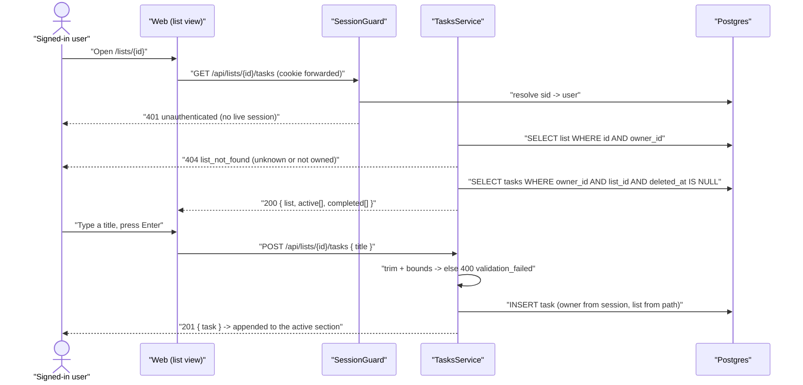

# Technical Design: FEAT-010 — Create task + list view

> Feature from: docs/implementation-plan.md · Epic: EPIC-E — Tasks (`tasks` module)
> Implements: FR-TASK-001, FR-TASK-002, FR-TASK-003 (partial — the active/completed
> split; the collapsed presentation is FR-TASK-011/FEAT-012), FR-LIST-009 (partial —
> assignment at creation), NFR-USE-001 (partial) ·
> binds NFR-USE-003, NFR-PERF-001, NFR-LOC-001 · also FR-AUTHZ-001..005
> Realizes: UC-009 (main 1, 3, 4 + alt 3a; **step 2 — optional due date/priority —
> arrives with FEAT-011**, D6) · Screens: SCR-WEB-008, SCR-WEB-018 (designed by ui-design)
> Status: Draft · Date: 2026-07-27

## 1. Intent

The product's core value, finally: a signed-in user types a title and has a task.
FEAT-009 made lists real and left the app home a placeholder; this slice fills it
with the **list view** — a list's active and completed tasks, with the quick-add
composer above them — and makes the sidebar's rows navigational. It is the
second owned-data module, and the first to be built *entirely* on the ownership
convention FEAT-009 established rather than inventing one. Everything that
follows in EPIC-E (detail/edit, complete/reopen, delete/undo, reorder) extends
the `tasks` table and the contracts minted here.

## 2. Codebase context

Surveyed live (last migration 008 `1721550000000_retire-skeleton.js`; API modules
= `auth`, `lists`). The design conforms to and reuses:

- **The `tasks` table already exists** (migration 007, created by FEAT-009 as
  *minimal* with "FEAT-010+ extend" on it): `id, owner_id → users ON DELETE
  CASCADE, list_id → lists ON DELETE CASCADE NOT NULL, title, completed_at,
  deleted_at, created_at, updated_at`, plus `tasks_owner_list_idx (owner_id,
  list_id)` and the partial `tasks_active_by_list_idx`. Everything this feature
  needs is present — see §4.
- **The ownership convention (FEAT-009 D3), inherited verbatim.** Every
  repository statement carries `WHERE owner_id = $1`; unknown and not-owned
  collapse into one uniform `404` (FR-AUTHZ-002/003/005). `session.guard.ts`'s
  header now points at that design as the reference; `modules/lists` is the
  worked example this module copies.
- **Contract/error conventions.** `ApiError`
  (`statusCode/code/message/fields[]`) via the global `HttpExceptionFilter`;
  framework-free domain errors in a module-local `*.errors.ts` mapped in the
  controller; `validation_failed` + `fields[]` for field failures; shared
  error-code constants (`LIST_ERROR_CODES`, `AUTH_ERROR_CODES`) so the web
  branches on codes; class-validator DTOs behind the global `ValidationPipe`;
  class-level `@UseGuards(SessionGuard)` with `@CurrentUser()` for the owner id.
  Data endpoints are **not** rate-limited (FEAT-009 §8).
- **Shared contracts.** `ListSummary` (`id, name, isDefault, position,
  activeTaskCount, taskCount`) and `LIST_ERROR_CODES.listNotFound` are already
  exported from `@todo/shared`; this feature reuses both rather than minting
  parallel shapes.
- **Web tier.** `lib/session.ts` (`requireSession`), `lib/lists.ts`
  (`fetchLists`), the BFF proxy pattern in `app/api/**/route.ts` (forward the
  `cookie`, relay status + JSON verbatim), and `components/app-shell.tsx` →
  `shell-frame.tsx` → `lists-nav.tsx`. FEAT-009 recorded two hand-offs this
  feature takes up: **`/`'s content column is a placeholder for SCR-WEB-008/018**,
  and **sidebar rows are not navigational until `/lists/{id}` exists**.
  `apps/web/AGENTS.md`: read `node_modules/next/dist/docs/` before writing web
  code.
- **Divergence found:** none. One scoping note, not a divergence: UC-009's step 2
  (optional due date and priority at creation) traces to FR-TASK-006/008, which
  the plan assigns to **FEAT-011** — so UC-009 is realized partially here (D6),
  and design.md's `quick-add` component reaches its full specified form then.

## 3. API contracts

Both endpoints are `@UseGuards(SessionGuard)` and owner-scoped from
`@CurrentUser()`; the `listId` in the path is validated by ownership, never
trusted (FR-AUTHZ-002/003). They live in the new `tasks` module under the
`lists/:listId/tasks` path prefix — the plan's own naming, and no collision with
`ListsController`'s `/lists`, `/lists/reorder` and `/lists/:id` routes (the extra
segment disambiguates).

**Shared response element — `TaskSummary`:**

```ts
interface TaskSummary {
  id: string;           // uuid
  listId: string;       // the one list it belongs to (FR-LIST-009)
  title: string;        // trimmed
  completedAt: string | null; // ISO-8601 UTC; null = active (NFR-LOC-001)
  createdAt: string;    // ISO-8601 UTC
}
```

FEAT-011/012 extend this shape with `dueAt` and `priority`; FEAT-014 adds
`position`. Consumers read fields, never assume exhaustiveness (D5).

### 3.1 `GET /lists/{listId}/tasks` — the list view

- **Success `200`** `ListTasksResponse`:
  `{ list: ListSummary, active: TaskSummary[], completed: TaskSummary[] }`.
  - `list` is the same `ListSummary` `GET /lists` returns (FEAT-009 §3), so the
    screen renders its header — name, counts — without a second round trip
    (NFR-PERF-001; D3).
  - **`active`** = `completed_at IS NULL AND deleted_at IS NULL`, ordered
    `created_at ASC, id ASC` — append order, matching FR-TASK-012's note that
    "new tasks [are] appended to the active order by default" (D4).
  - **`completed`** = `completed_at IS NOT NULL AND deleted_at IS NULL`, ordered
    `completed_at DESC, id ASC` — most recently finished first, the useful order
    for the review-and-reopen purpose FR-TASK-011 gives the section.
  - Soft-deleted tasks appear in neither (FR-TASK-013; the column exists, FEAT-013
    gives it behavior).
  - The split is the **server's** answer, not the client's filter — FR-TASK-003
    says the system separates them.
- **Errors:**
  | Status | code | When | Trace |
  | :-- | :-- | :-- | :-- |
  | `401` | `unauthenticated` | No/expired session | FR-AUTHZ-001 |
  | `404` | `list_not_found` | `listId` unknown **or** owned by another user — identical response for both | FR-AUTHZ-002/003 (FEAT-009 D3) |
- Read-only, idempotent. Resolved in **two** statements (the list with its counts,
  and the task rows) — never one query per task (D3).

### 3.2 `POST /lists/{listId}/tasks` — create a task in this list

- **Request** `CreateTaskRequest`: `{ title: string }` — `@IsString()`, trimmed by
  the service, then non-empty and `≤ TASK_TITLE_MAX_LENGTH` (500) per FR-TASK-002.
  No `listId` or `ownerId` in the body: the list comes from the path and the owner
  from the session (FR-AUTHZ-004, FR-LIST-009).
- **Success `201`** `CreateTaskResponse`: `{ task: TaskSummary }` — created
  **active** (`completedAt: null`, FR-TASK-001) in the path's list, appended to
  the active order (D4). UC-009 main 3.
- **Errors:**
  | Status | code | When | Trace |
  | :-- | :-- | :-- | :-- |
  | `401` | `unauthenticated` | No/expired session | FR-AUTHZ-001 |
  | `404` | `list_not_found` | `listId` unknown or not owned — **checked before any insert**, so a task can never land in a list the caller doesn't own | FR-AUTHZ-002/003, FR-LIST-009 |
  | `400` | `validation_failed` (field `title`) | Missing, non-string, empty-after-trim, or > 500 chars — nothing created | FR-TASK-002; UC-009 alt 3a |
- Not idempotent: two identical calls create two tasks. Duplicate titles are legal
  (no requirement forbids them, exactly as FR-LIST-002 permits duplicate list
  names). The architecture's §8 note about deduplicating task creation by a
  client-supplied request id is an **optimistic-retry** concern that no FR states;
  not built here (§8).

**Where "defaults to Inbox" lives (FR-TASK-001's note).** The contract always
carries an explicit list, because the plan's endpoint shape does. The default is
realized by the *caller*: the app home renders the default list (D2), so the
quick-add there creates in the Inbox without the user choosing anything. When
FEAT-016's smart views add a composer with no list in context, they resolve the
default list the same way — from `GET /lists`'s `isDefault` flag.

## 4. Schema changes

**None.** FEAT-009's migration 007 created `tasks` with precisely the columns this
feature reads and writes — `owner_id`, `list_id` (NOT NULL + FK = FR-LIST-009),
`title`, `completed_at` (the active/completed split), `deleted_at` (excluded from
both sections), `created_at` (the active order). The filter
`owner_id = $1 AND list_id = $2` rides the existing
`tasks_owner_list_idx`; `tasks_active_by_list_idx` continues to serve
FEAT-009's counts. No new entity, no boundary change, no escalation, no migration
(D1). The first task to touch the schema again is FEAT-011's `due_at`/`priority`.

## 5. Component design

- **`packages/shared`** — a `tasks` block: `listTasksPath(listId)` helper
  (`/lists/${listId}/tasks`), `TASK_TITLE_MAX_LENGTH = 500`, `TaskSummary`,
  `ListTasksResponse`, `CreateTaskRequest`, `CreateTaskResponse`. Errors reuse
  `LIST_ERROR_CODES.listNotFound` and the existing `validation_failed`
  convention — **no new error code** (D7).
- **`apps/api/src/modules/tasks/`** — the new capability module (ADR-001), added
  to `AppModule`:
  - **`tasks.repository.ts`** — parameterized SQL, **every statement owner-scoped**
    (FEAT-009 D3): `findByList(ownerId, listId)` returning the rows for both
    sections in one statement (ordered so the service partitions without a second
    query), `create(ownerId, listId, title)` returning the new row, and
    `findOwnedList(ownerId, listId)` — a one-statement existence check against
    `lists` (D8).
  - **`tasks.errors.ts`** — framework-free `TaskTitleInvalidError(requirement)`
    (mirrors `ListNameInvalidError`). List-not-found reuses
    `ListNotFoundError`'s *shape* via a module-local `ListNotFoundError` of its
    own name — the boundary rule forbids importing the lists module's class (D8).
  - **`tasks.service.ts`** — title normalization (`trim` → FR-TASK-002 bounds),
    the owned-list guard before every operation, the active/completed partition,
    and row → `TaskSummary` mapping (timestamps as ISO-8601 UTC, NFR-LOC-001).
  - **`tasks.controller.ts`** — `@Controller('lists/:listId/tasks')`,
    class-level `@UseGuards(SessionGuard)`; maps `TaskTitleInvalidError` →
    `400 validation_failed` (`fields: [{ field: 'title', … }]`) and the
    list-not-found error → `404 list_not_found`.
  - **`dto/create-task.dto.ts`**.
- **`apps/web`** —
  - BFF route `app/api/lists/[id]/tasks/route.ts` (GET, POST): forwards the
    browser `cookie`, relays status + JSON verbatim — the shape FEAT-009's list
    proxies established.
  - `lib/tasks.ts` — `fetchListTasks(listId)` server-side helper (mirrors
    `fetchLists`).
  - `app/lists/[id]/page.tsx` — **SCR-WEB-008**, the list view: `requireSession()`,
    fetch, render inside `AppShell`; an unknown/not-owned id renders the
    not-found state rather than leaking existence.
  - `app/page.tsx` — replaces FEAT-009's placeholder: resolves the caller's
    **default list** and renders the same view (D2), which for a new account is
    **SCR-WEB-018**'s onboarding empty state.
  - `components/lists-nav.tsx` — sidebar rows become **links** to `/lists/{id}`
    with the `sidebar-nav-item` selected state design.md already specifies
    (FEAT-009 ui-design flagged both as this feature's).
  - Screens SCR-WEB-008 (list view + quick-add + empty/loading/error states) and
    SCR-WEB-018 (first-run) are **ui-design's**; this feature owns the contract
    wiring.
- **Stubs replaced:** `/`'s interim placeholder card (FEAT-009 §8) — the last one
  outstanding.



## 6. Acceptance criteria

- **AC-1 (FR-TASK-001, FR-LIST-009, FR-AUTHZ-004; UC-009 main 1/3).**
  `POST /lists/{listId}/tasks { title }` returns `201` with the created task:
  title trimmed, `listId` equal to the path's list, `completedAt: null` (created
  **active**), and `owner_id` in the row equal to the session user. A subsequent
  `GET` shows it in `active` and not in `completed`.
- **AC-2 (FR-TASK-002; UC-009 alt 3a).** A title that is missing, not a string,
  empty, whitespace-only, or longer than 500 characters returns
  `400 validation_failed` with a `fields[]` entry for `title`, and **creates
  nothing**. A 500-character title succeeds. Two tasks may share a title.
- **AC-3 (FR-TASK-003 partial; UC-009 main 4).** `GET /lists/{listId}/tasks`
  returns `{ list, active, completed }` where the split is by `completed_at`:
  with 2 active, 3 completed and 1 soft-deleted task seeded, `active` has exactly
  the 2, `completed` exactly the 3, and the soft-deleted task appears in neither.
  `list` carries the same `ListSummary` shape `GET /lists` returns.
- **AC-4 (ordering, FR-TASK-012 note).** `active` is ordered oldest-first by
  creation, so a newly created task is **last** in `active`; `completed` is
  ordered most-recently-completed first. Both orders are stable across repeated
  reads.
- **AC-5 (FR-AUTHZ-002/003/005).** With user B's session, `GET` and `POST`
  against user A's `listId` both return **`404 list_not_found` — byte-identical
  to the response for a random unknown uuid** — and **no task row is created**
  for either user. A's tasks never appear in B's response.
- **AC-6 (FR-AUTHZ-001).** With no `sid` cookie, or an expired/revoked one, both
  endpoints return `401 unauthenticated` and write nothing, even with a valid
  body and a real `listId`.
- **AC-7 (FR-LIST-009).** A task always belongs to exactly one list and the
  relationship survives its owner's other actions: a task created through the
  endpoint is returned by `GET` on **that** list only, and deleting the list
  removes it (FEAT-009's cascade, re-checked here now that tasks are created
  through a real contract rather than seeded).
- **AC-8 (NFR-PERF-001).** `GET /lists/{listId}/tasks` resolves the list and both
  sections in **two** SQL statements — no query per task. With 500 tasks in the
  list it completes server-side well inside the 300 ms bound the SRS states for
  "load a list".
- **AC-9 (NFR-LOC-001).** `createdAt` and `completedAt` are ISO-8601 UTC strings
  (or `null`), and the stored values are `timestamptz` — no local-time strings
  cross the contract.
- **AC-10 (NFR-USE-003; UC-009 main 4).** The list view renders its three
  data-view states: **populated**, **empty** (a list with no tasks shows the
  onboarding/empty treatment rather than a blank column), and **error** (a failed
  fetch shows a retry affordance, not a stranded frame). Loading is server-rendered
  in the common path, as SCR-WEB-007's is.
- **AC-11 (NFR-USE-001 partial; UC-009 main 1–4).** From a fresh signed-in landing
  on `/`, creating the first task requires **one field and one action** with no
  navigation: the home renders the default list, the quick-add is focusable
  immediately, and Enter creates the task, which appears in the active section
  without a manual reload.
- **AC-12 (FR-TASK-003 partial, navigation).** Sidebar rows navigate to their
  list's view; the row for the open list carries the `sidebar-nav-item` selected
  state; and the list's active-task count badge (FEAT-009 AC-13) increments when a
  task is created — the badge's presence now being meaningful (FEAT-009
  ui-design D2).

## 7. Decisions

- **D1 — No migration.** Driver: FEAT-009 deliberately created `tasks` with the
  columns whose *semantics* this feature needs — `completed_at` and `deleted_at`
  exist precisely so the active/completed/soft-deleted distinction was defined
  once (FEAT-009 D1). Everything else is application logic. Rejected: adding
  `due_at`/`priority` now to "get the table done" — they belong to FEAT-011's
  criteria and would ship unverified columns. Consequence: this slice starts at
  the contract layer; the schema is next touched by FEAT-011.
- **D2 — `/` renders the caller's default list rather than redirecting to it.**
  Driver: sign-in already lands on `/`, ux-foundations has no "home" screen
  distinct from the list view, and FR-TASK-001's "defaults to Inbox" needs a
  surface where the default list is the working context. Rendering directly
  avoids a redirect round-trip on the app's most-hit route and keeps `/` a stable
  bookmark. Rejected: `/` → `redirect('/lists/{inboxId}')` (an extra hop and a URL
  that changes per account); keeping a separate home screen (a screen the
  inventory doesn't have). Consequence: two routes render one component, and for
  a new account `/` *is* SCR-WEB-018's first-run state.
- **D3 — Two statements per list view, and the list travels with its tasks.**
  Driver: NFR-PERF-001 names "load a list" explicitly, and the screen needs the
  list's name and counts in its header; returning `ListSummary` in the same
  response removes a round trip the client would otherwise always make. Two
  statements rather than one because the counts aggregate and the row fetch have
  different shapes — forcing them together would produce a worse plan than two
  indexed reads. Rejected: a `list`-less response plus a second `GET /lists` call
  (slower, and racy — the header could disagree with the rows).
- **D4 — Active tasks are ordered oldest-first; completed most-recent-first.**
  Driver: an order must exist before FEAT-014's manual `position` column does, and
  FR-TASK-012's own note fixes the default — "new tasks appended to the active
  order". Oldest-first *is* append order. Completed tasks serve review (FR-TASK-011),
  where the last thing finished is the most relevant. Rejected: newest-first for
  active (contradicts "appended"); leaving the order unspecified (a view whose
  order changes between reads is a defect). Consequence: FEAT-014 adds `position`
  and changes the active `ORDER BY`; this criterion is superseded then, by design.
- **D5 — `TaskSummary` is minimal now and grows.** Driver: the fields a task has
  in this slice are exactly the columns that exist (D1). FEAT-011 adds `dueAt` and
  `priority`, FEAT-014 `position`. Rejected: shipping `dueAt: null` placeholders
  for columns that do not exist — a contract that lies about what the system
  stores. Consequence: web consumers must read fields defensively rather than
  destructure exhaustively; noted for ui-design.
- **D6 — UC-009 is realized partially, and the plan is right about it.** Driver:
  UC-009 step 2 ("optionally sets a due date/time and priority") traces to
  FR-TASK-006 and FR-TASK-008, which the plan assigns to FEAT-011. Implementing
  them here would take FEAT-011's requirements without its criteria. Consequence:
  the quick-add composer is **title-only** in this slice — design.md's `quick-add`
  spec ("inline affordances to set due date and priority") is reached when
  FEAT-011 lands, and ui-design is told so explicitly (§8). UC-009's RTM row gains
  a partial marker via the feature's report, not a full one.
- **D7 — No new error codes.** Driver: both failure modes already have codes with
  established client handling — `list_not_found` (FEAT-009, and the *same*
  meaning: the list is unknown or not yours) and `validation_failed` + `fields[]`.
  Rejected: a `task_not_found` code (nothing in this slice looks a task up by id —
  that arrives with FEAT-011) and a distinct `title_invalid` (the field-level
  convention already carries the message). Consequence: `LIST_ERROR_CODES` is
  consumed by a second module, which is what putting it in `@todo/shared` was for.
- **D8 — The `tasks` module reads the `lists` table directly, without importing
  the `lists` module.** Driver: `POST` must verify the list is owned before
  inserting (FR-AUTHZ-002/003), and `.dependency-cruiser.cjs` forbids
  `modules/tasks → modules/lists`. The boundary rule governs **imports**, not the
  shared database — and the traffic already runs the other way: FEAT-009's
  `ListsRepository.countTasks` queries `tasks`. A one-statement ownership check
  is the symmetric case. Rejected: moving the endpoints into the lists module (the
  wrong home for a task capability); a `common/` "list lookup" service (domain
  logic in the cross-cutting layer, which ADR-001 reserves for concerns, not
  entities). Consequence: the ownership check is duplicated SQL, deliberately —
  the same trade FEAT-009 D6 made for registration's Inbox insert. This is now the
  **second** such duplication; a third is the signal to mint an explicit
  cross-module read interface rather than keep copying, and that judgement is
  recorded here so the next feature inherits it rather than rediscovers it.

## 8. Escalations & open items

- **No architecture amendment; no schema change at all.** Task is an entity the
  conceptual model owns (arch §8 names `tasks.list_id` / `tasks.owner_id`), and
  its physical realization already exists from FEAT-009.
- **UC-009 partial realization is deliberate and plan-sanctioned** (D6). Recorded
  so acceptance does not read the missing due-date/priority affordances as a gap:
  they are FEAT-011's criteria. The **quick-add composer is title-only** in this
  slice — flagged to ui-design, which owns SCR-WEB-008.
- **NFR-USE-003 binds here and the plan's ledger doesn't say so.** The SRS makes
  it a **Must** for "every list/search view", and this is the product's first list
  view; the plan lists NFR-USE-003 only against FEAT-015 (partial). AC-10 covers
  it. Positive coverage note for acceptance: NFR-USE-003 should gain a **partial**
  Test ref on FEAT-010's account. No plan correction needed — the plan's ledger
  tracks epics, not every NFR touchpoint.
- **`task-row` renders a subset of its design.md spec.** design.md §4 specifies
  complete-checkbox + title + due-date chip + priority dot + drag handle. In this
  slice only the title exists as data; the checkbox is FEAT-012's behavior, the
  chip and dot FEAT-011's, the handle FEAT-014's. ui-design decides how the row
  presents in the interim (a non-interactive checkbox is a promise the slice can't
  keep) — flagged, not decided here.
- **Optimistic-retry deduplication not built.** The architecture's §8 resilience
  note mentions "task creation deduplicated by a client-supplied request id". No
  FR requires it, the composer is a single synchronous action, and building it
  would be inventing a requirement. Recorded as available if retry behavior later
  demands it (a requirements amendment).
- **No pagination on the list view.** No FR bounds a list's size, volume is modest
  (≤ 5k tasks/user, ADR-003), and AC-8 measures the unpaginated read. FEAT-015
  owns paginated search (FR-SRCH-009). If a real user ever holds thousands of
  tasks in one list, pagination is an additive change behind the same contract.
- **Carried from FEAT-009's acceptance (not this feature's to fix):** the
  hard-coded `44` touch-target literals, the missing `AUTH_RATELIMIT_MAX` override
  in the E2E harness (which this feature's E2E work will hit again), and the
  `apps/api/tsconfig.json` spec-typing debt. All four minors are in FEAT-009's
  acceptance report; the E2E one is the only one likely to bite during this
  feature's tasks.

Verification: clean (self-check per Phase 5 — FR-TASK-001 covered by AC-1/AC-11
and T3/T4/T5; FR-TASK-002 by AC-2 and T3/T4; FR-TASK-003 (partial) by AC-3/AC-4/
AC-12 and T3/T4/T5; FR-LIST-009 (partial) by AC-1/AC-7 and T3; NFR-USE-001
(partial) by AC-11 and T5; NFR-USE-003 by AC-10 and T5; NFR-PERF-001 by AC-8 and
T4; NFR-LOC-001 by AC-9 and T3; UC-009 main 1/3/4 and alt 3a map to §3 behaviors
and criteria, step 2 deferred per D6; every cited FR/UC/NFR/ADR/SCR ID resolves in
`docs/srs.md`, `docs/use-cases.md`, `docs/architecture.md`,
`docs/ux-foundations.md` and the plan; no schema change, so the conceptual model
is untouched; contracts reuse the existing envelope, error-code and guard
conventions and collide with no existing route — `/lists/:listId/tasks` is unused;
tasks are ordered, each with a done-when, and cover every criterion).
