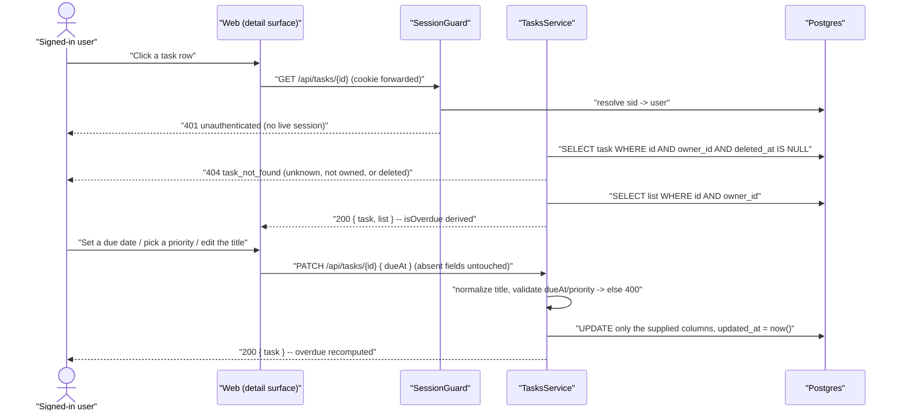

# Technical Design: FEAT-011 — Task detail (title, due date, priority, overdue)

> Feature from: docs/implementation-plan.md · Epic: EPIC-E — Tasks (`tasks` module)
> Implements: FR-TASK-004, FR-TASK-005, FR-TASK-006, FR-TASK-007, FR-TASK-008,
> NFR-LOC-001 (partial) · binds NFR-PERF-001, NFR-USE-003 · also FR-AUTHZ-001..005 ·
> **completes** UC-009 step 2 (FR-TASK-006/008 at creation), which FEAT-010 D6 deferred here
> Realizes: UC-010 (main 1–3 + alt 2a, 3a; **step 2's drag-to-reorder is FEAT-014**, D9) ·
> Screens: SCR-WEB-010, SCR-WEB-008 (task-row additions) — designed by ui-design
> Status: Draft · Date: 2026-07-28

## 1. Intent

FEAT-010 made a task a title. This slice makes it a *task*: openable, editable,
schedulable, prioritized — and visibly late when it is. It is the first feature
to touch a single task **by id** rather than through its list, so it mints the
`/tasks/{id}` resource that FEAT-012 (complete/reopen) and FEAT-013
(delete/restore) will extend, and the `task_not_found` code FEAT-010 D7
deliberately left unminted. It is also the first schema change since FEAT-009.

## 2. Codebase context

Surveyed live (last migration 008 `1721550000000_retire-skeleton.js`; API modules
= `auth`, `lists`, `tasks`). The design conforms to and reuses:

- **The `tasks` table as FEAT-009 migration 007 created it** — `id, owner_id,
  list_id, title, completed_at, deleted_at, created_at, updated_at`, with
  `tasks_owner_list_idx` and the partial `tasks_active_by_list_idx`. The
  migration's own comment names this slice: *"created MINIMAL … FEAT-010..014
  extend it (due_at, priority, …)"*. §4 is that extension.
- **The `tasks` module FEAT-010 built** — `tasks.repository.ts` (every statement
  owner-scoped), `tasks.service.ts` (`normalizeTitle`, `assertLookupId`,
  `toSummary`), `tasks.controller.ts` (`@Controller('lists/:listId/tasks')`,
  class-level `@UseGuards(SessionGuard)`, `toHttp` error mapping),
  `tasks.errors.ts`, `dto/create-task.dto.ts`. This feature **extends** those
  files and adds a second controller; it rewrites none of them.
- **The ownership convention (FEAT-009 D3, inherited through FEAT-010).** Every
  statement carries `WHERE owner_id = $1`; unknown and not-owned collapse into
  one uniform `404` (FR-AUTHZ-002/003/005). `assertLookupId` rejects a
  non-uuid path parameter as that same not-found *before* it reaches Postgres.
- **Contract/error conventions.** `ApiError` (`statusCode/code/message/fields[]`)
  via the global `HttpExceptionFilter`; framework-free domain errors in
  `*.errors.ts` mapped in the controller; `validation_failed` + `fields[]`;
  shared error-code constant objects in `@todo/shared`; class-validator DTOs
  behind the global `ValidationPipe`. Data endpoints are not rate-limited.
- **`ValidationPipe` is `{ whitelist: true, transform: true }`** (`app-setup.ts`).
  `whitelist` **strips** unknown properties rather than rejecting them — the
  single most important code fact for this design, because a PATCH body with a
  misspelled field arrives at the service as `{}`. D4 turns that into a visible
  error instead of a silent no-op.
- **`UPDATE … SET …, updated_at = now()`** is the established write shape
  (`ListsRepository.rename`, `.setPositions`). Task updates match it.
- **Web tier.** `lib/tasks.ts` (`fetchListTasks`, returning a discriminated
  `ListViewResult` so the page renders `not-found` without disclosing
  existence), the BFF proxy pattern in `app/api/**/route.ts` (forward `cookie`,
  relay status + JSON verbatim), `components/list-view.tsx` (server component;
  its `TaskRow` is a **deliberate subset** — title only), `components/quick-add.tsx`
  (client component; `router.refresh()` after a write). `apps/web/AGENTS.md`:
  read `node_modules/next/dist/docs/` before writing web code.
- **Divergence found:** none. Two inherited hand-offs are picked up here rather
  than being new scope: FEAT-010 D6 (UC-009 step 2 → this feature) and FEAT-010
  D7 (`task_not_found` → this feature).

## 3. API contracts

Two new routes on a **new controller** for the single-task resource,
`@Controller('tasks')` — the plan's own path shape, and the one FEAT-012/013
extend. Both are `@UseGuards(SessionGuard)` and owner-scoped from
`@CurrentUser()`; the `{id}` in the path is validated by ownership, never
trusted. One existing route's body grows (§3.3).

**`TaskSummary` gains three fields** (FEAT-010 D5 planned exactly this):

```ts
interface TaskSummary {
  id: string;
  listId: string;
  title: string;
  completedAt: string | null;   // ISO-8601 UTC; null = active
  createdAt: string;            // ISO-8601 UTC
  dueAt: string | null;         // NEW — ISO-8601 UTC instant; null = no due date (FR-TASK-006)
  priority: TaskPriority;       // NEW — 'none' | 'low' | 'medium' | 'high' (FR-TASK-008)
  isOverdue: boolean;           // NEW — derived, server-authoritative (FR-TASK-007, D3)
}
```

`FEAT-014` still adds `position`. Consumers read fields, never assume
exhaustiveness (FEAT-010 D5).

### 3.1 `GET /tasks/{id}` — the task's details (FR-TASK-004)

- **Success `200`** `TaskDetailResponse`: `{ task: TaskSummary, list: ListSummary }`.
  - FR-TASK-004 names **"title, list, due date/time, priority, status"** as the
    details. `task` carries four of the five; `list` carries the fifth as the
    same `ListSummary` every other endpoint returns, so the panel renders "in
    Inbox" without a second round trip — the trade FEAT-010 D3 already made for
    the list view.
  - Soft-deleted tasks are **not** found here (`deleted_at IS NULL`), consistent
    with their absence from the list view (FR-TASK-013; FEAT-013 owns restore).
- **Errors:**
  | Status | code | When | Trace |
  | :-- | :-- | :-- | :-- |
  | `401` | `unauthenticated` | No/expired/revoked session | FR-AUTHZ-001 |
  | `404` | `task_not_found` | `id` unknown, **not owned**, not a uuid, or soft-deleted — identical response for all four | FR-AUTHZ-002/003/005 (FEAT-009 D3) |
- Read-only, idempotent. **Two** statements: the task, then its list (D5).

### 3.2 `PATCH /tasks/{id}` — edit title, due date, priority (FR-TASK-005/006/008)

- **Request** `UpdateTaskRequest` — **partial**; every field optional, and
  *absent ≠ null* (D4):

  | Field | Type | Absent | Value | Validation |
  | :-- | :-- | :-- | :-- | :-- |
  | `title` | `string` | unchanged | replaces the title | trimmed, then non-empty and `≤ TASK_TITLE_MAX_LENGTH` (500) — **the same `normalizeTitle` POST uses**, per FR-TASK-005's "subject to FR-TASK-002 validation" |
  | `dueAt` | `string \| null` | unchanged | `null` **clears** the due date (UC-010 alt 2a); a string sets it | valid ISO-8601 instant; **past instants are legal** (D2) |
  | `priority` | `TaskPriority` | unchanged | replaces the priority | one of `none \| low \| medium \| high` (FR-TASK-008) |

  Not accepted in the body, ever: `id`, `listId`, `ownerId`, `completedAt`,
  `createdAt`, `isOverdue` (FR-AUTHZ-004; `whitelist: true` strips them, and the
  DTO declares only the three above). Moving a task between lists is **not** in
  any FR this feature implements — §8.
- **Success `200`** `UpdateTaskResponse`: `{ task: TaskSummary }` — the task as
  stored, with `isOverdue` recomputed (UC-010 main 3: *"persists the changes and
  updates overdue indication as needed"*).
- **Errors:**
  | Status | code | When | Trace |
  | :-- | :-- | :-- | :-- |
  | `401` | `unauthenticated` | No/expired/revoked session | FR-AUTHZ-001 |
  | `404` | `task_not_found` | Unknown, not owned, non-uuid, or soft-deleted — **checked before any write** | FR-AUTHZ-002/003/005 |
  | `400` | `validation_failed` (field `title`) | Missing-after-trim or > 500 chars — nothing written | FR-TASK-002/005; UC-010 alt 3a |
  | `400` | `validation_failed` (field `dueAt`) | Not a valid ISO-8601 instant (and not `null`) | FR-TASK-006 |
  | `400` | `validation_failed` (field `priority`) | Not one of the four values | FR-TASK-008 |
  | `400` | `validation_failed` (field `_`) | **Empty patch** — no recognized field present | D4 |
- **Idempotent**: applying the same body twice leaves the same state (`updated_at`
  moves; nothing else does). Partial by construction — a request that sets only
  `priority` cannot disturb a title being edited on another device.

### 3.3 `POST /lists/{listId}/tasks` — due date and priority at creation

FEAT-010 shipped this endpoint title-only and recorded why (D6): UC-009 step 2
traces to FR-TASK-006/008, which the plan assigns **here**. `CreateTaskRequest`
therefore grows two **optional** fields, validated by the same rules as §3.2:

```ts
interface CreateTaskRequest {
  title: string;
  dueAt?: string | null;   // omitted or null = no due date (FR-TASK-006)
  priority?: TaskPriority; // omitted = 'none' (FR-TASK-008's stated default)
}
```

Additive and backward-compatible: a `{ title }` body behaves exactly as before,
so every FEAT-010 contract test stays valid unchanged (D8). `GET
/lists/{listId}/tasks` needs no contract change at all — it returns
`TaskSummary`, which now carries the new fields for free, which is what gives
the list view its due chips and priority dots (design.md §4 `task-row`).

## 4. Schema changes

**Migration 009 — `1721560000000_task-due-priority.js`.** Two columns on `tasks`
(conceptual entity **Task**, which the architecture already owns — arch §8 names
`tasks.owner_id` / `tasks.list_id` and an eventual `(owner_id, due_at)` index).
No new entity, no ownership or boundary change, **no escalation**.

```js
exports.up = (pgm) => {
  // FR-TASK-006 — optional due date/time. NULL = no due date. An absolute
  // instant (timestamptz, UTC — NFR-LOC-001); the user's timezone interprets
  // input and formats output, it does not change the instant (D1).
  pgm.addColumns("tasks", { due_at: { type: "timestamptz" } });

  // FR-TASK-008 — priority. text + CHECK rather than a Postgres enum (D6);
  // NOT NULL DEFAULT 'none' is the FR's own stated default, and backfills
  // every existing row in the same statement.
  pgm.addColumns("tasks", {
    priority: { type: "text", notNull: true, default: "none" },
  });
  pgm.addConstraint("tasks", "tasks_priority_check", {
    check: "priority IN ('none', 'low', 'medium', 'high')",
  });
};

exports.down = (pgm) => {
  pgm.dropConstraint("tasks", "tasks_priority_check");
  pgm.dropColumns("tasks", ["priority", "due_at"]);
};
```

- **`due_at` is nullable and has no default** — "the due date/time is optional"
  (FR-TASK-006) is exactly SQL NULL.
- **No index in this migration.** The architecture's `(owner_id, due_at)` index
  serves due-date *filtering* and *bucketing* — FR-SRCH-004 and the smart views,
  which belong to FEAT-015/016. Every query this feature issues is keyed on
  `owner_id` + `id` or `owner_id` + `list_id` and rides `tasks_owner_list_idx`
  and the primary key. Adding an unused index now would be the same
  build-ahead FEAT-010 D1 rejected — recorded in §8 so FEAT-015/016 inherit it
  rather than rediscover it (D7).
- **`down` is real, not decorative**: the constraint drops before its column.
  `updated_at` already exists; §5 writes it.

## 5. Component design

- **`packages/shared`** — a FEAT-011 block: `taskPath(id)` helper (`/tasks/${id}`),
  `TaskPriority` union + `TASK_PRIORITIES` tuple (single-sourced so the DTO, the
  CHECK constraint and the `priority-selector` cannot drift), the three new
  `TaskSummary` fields, `TaskDetailResponse`, `UpdateTaskRequest`,
  `UpdateTaskResponse`, the two new `CreateTaskRequest` fields, and
  `TASK_ERROR_CODES = { taskNotFound: 'task_not_found' }`.
- **`apps/api/src/modules/tasks/`** — extended, not restructured:
  - **`tasks.repository.ts`** — `TaskRow` gains `dueAt: Date | null` and
    `priority: TaskPriority`; the existing `findByList`/`create` selects and the
    `toTaskRow` mapper carry them. New, both owner-scoped:
    - `findById(ownerId, id)` → `TaskRow | null` (`WHERE owner_id = $1 AND id = $2
      AND deleted_at IS NULL`).
    - `update(ownerId, id, patch)` → `TaskRow | null` — **one** `UPDATE … SET
      … updated_at = now() WHERE owner_id = $1 AND id = $2 AND deleted_at IS NULL
      RETURNING …`, built from only the keys the patch actually contains (D4).
      A `null` rowCount is the uniform not-found.
    - `create` takes the optional `dueAt`/`priority`, defaulting priority to
      `'none'` in SQL rather than in JS, so the column default stays the truth.
  - **`tasks.errors.ts`** — new framework-free `TaskNotFoundError` (alongside the
    existing `ListNotFoundError` and `TaskTitleInvalidError`), plus
    `TaskFieldInvalidError(field, requirement)` for the `dueAt`/`priority`/empty-patch
    failures that class-validator can't express as cleanly as the service can
    (the shape `TaskTitleInvalidError` already set, generalized to a named field).
  - **`tasks.service.ts`** — `detail(ownerId, id)` and `update(ownerId, id, patch)`;
    `normalizeTitle` is **reused verbatim** by both create and update (FR-TASK-005
    → FR-TASK-002), `assertLookupId` guards the new id parameter, and `toSummary`
    gains the three fields — including `isOverdue`, computed in exactly one place
    (D3).
  - **`task-item.controller.ts` → `TaskItemController`** — `@Controller('tasks')`,
    class-level `@UseGuards(SessionGuard)`, registered in `TasksModule`. Named for
    the *item* resource so it never reads as a near-duplicate of the collection's
    `TasksController`; **FEAT-012's complete/reopen and FEAT-013's delete/restore
    land here.** Its `toHttp` maps `TaskNotFoundError` → `404 task_not_found` and
    `TaskFieldInvalidError` → `400 validation_failed` with the named field.
  - **`dto/update-task.dto.ts`** — the absent-vs-null DTO (D4): each field
    `@ValidateIf((_, value) => value !== undefined)` so an explicit `null` is
    *validated* rather than skipped, which is what `@IsOptional()` would wrongly
    do. **`dto/create-task.dto.ts`** gains the same two optional fields.
- **`apps/web`** —
  - BFF route `app/api/tasks/[id]/route.ts` (GET, PATCH) — forward the browser
    `cookie`, relay status + JSON verbatim.
  - `lib/tasks.ts` — `fetchTask(id)`, returning the same discriminated result
    shape `fetchListTasks` established (`ok | not-found | unauthenticated | error`).
  - `app/tasks/[id]/page.tsx` — the addressable surface for **SCR-WEB-010**.
    A URL must exist (deep link, refresh, back button); whether ui-design
    presents it as design.md's slide-in `task-detail-panel` at `≥lg` or a
    full-screen route on mobile is **ui-design's** call, not this document's.
  - `components/list-view.tsx` — `TaskRow` grows the due-date `chip` and priority
    dot design.md §4 specifies, and becomes the click target for the detail
    surface. Two of the four deferred `task-row` affordances FEAT-010 ui-design
    D2 listed are settled here; the checkbox (FEAT-012) and drag handle
    (FEAT-014) stay honestly absent.
  - `components/quick-add.tsx` — the inline due-date and priority affordances
    design.md's `quick-add` specifies and FEAT-010 shipped without (D6 there).
  - Screens are ui-design's manifest; these are the contract wiring points.
- **Stubs replaced:** none outstanding — FEAT-010 took the last one.



## 6. Acceptance criteria

- **AC-1 (FR-TASK-004; UC-010 main 1).** `GET /tasks/{id}` returns `200 { task,
  list }` where `task` carries the five details FR-TASK-004 names — `title`,
  `dueAt`, `priority`, `completedAt` (status) — and `list` is the owning list's
  `ListSummary`, `list.id === task.listId`.
- **AC-2 (FR-TASK-005; UC-010 main 2/3, alt 3a).** `PATCH /tasks/{id} { title }`
  replaces the title (trimmed) and returns the stored task. A title that is
  empty, whitespace-only or > 500 characters returns `400 validation_failed`
  with a `fields[]` entry for `title` and **leaves the stored title unchanged**;
  a 500-character title succeeds.
- **AC-3 (FR-TASK-006; UC-010 main 2/3).** `PATCH { dueAt: "<ISO-8601>" }` sets
  the due date; a second PATCH with a different instant changes it; the value
  round-trips as the same instant it was sent (`timestamptz`, UTC).
- **AC-4 (FR-TASK-006; UC-010 alt 2a).** `PATCH { dueAt: null }` **clears** the
  due date: the stored `due_at` is SQL NULL, the response carries `dueAt: null`,
  and `isOverdue` is `false` even if the cleared date was in the past. A PATCH
  that **omits** `dueAt` entirely leaves an existing due date untouched — the
  absent-vs-null distinction, asserted directly.
- **AC-5 (FR-TASK-007; UC-010 main 3).** `isOverdue` is `true` exactly when the
  task is **active** and has a `dueAt` strictly in the past: a task due in the
  past is overdue; due in the future is not; with no due date is not; and a
  **completed** task with a past due date is **not** overdue (the FR's own
  "only active tasks can be overdue"). Setting a past due date on an active task
  flips `isOverdue` to `true` in the same response that stores it.
- **AC-6 (FR-TASK-008).** `PATCH { priority }` accepts each of `none`, `low`,
  `medium`, `high` and returns the stored value; any other value returns
  `400 validation_failed` naming `priority` and changes nothing. A task created
  without a priority reads back `'none'` (the FR's stated default) — asserted at
  the database, so the column default is the source of the default.
- **AC-7 (partial-update semantics, D4).** A PATCH carrying one field changes
  that field **only** — the other two are byte-identical before and after,
  verified across all three single-field patches. A body with no recognized
  field (`{}`, or one whose keys the whitelist strips) returns
  `400 validation_failed` rather than a silent `200`, and writes nothing —
  including `updated_at`.
- **AC-8 (FR-AUTHZ-002/003/005).** With user B's session, `GET` and `PATCH`
  against user A's task id both return **`404 task_not_found`, byte-identical to
  the response for a random unknown uuid, for a non-uuid path segment, and for a
  soft-deleted task** — and A's task is **unmodified** afterwards.
- **AC-9 (FR-AUTHZ-001).** With no `sid` cookie, or an expired/revoked one, both
  routes return `401 unauthenticated` and write nothing, even with a valid body
  and a real task id.
- **AC-10 (FR-TASK-006/008 at creation; UC-009 step 2 — FEAT-010 D6's deferral,
  closed).** `POST /lists/{listId}/tasks { title, dueAt, priority }` creates the
  task with both values set; `{ title }` alone still creates a task with
  `dueAt: null` and `priority: 'none'`, and **every FEAT-010 contract test passes
  unmodified** (D8).
- **AC-11 (NFR-LOC-001).** `dueAt` crosses the contract as an ISO-8601 UTC string
  or `null`, and is stored `timestamptz` — no local-time string, no bare date,
  no offset-less string is ever accepted or emitted. A `dueAt` sent with a
  non-UTC offset is stored as the **same instant** and read back in UTC.
- **AC-12 (NFR-PERF-001).** `GET /tasks/{id}` resolves in **two** SQL statements
  (the task, then its list — D5) and `PATCH /tasks/{id}` in **one** (a single
  ownership-bearing `UPDATE … RETURNING`) — no N+1, and no read-modify-write
  round trip per field. Both complete server-side well inside the 300 ms bound
  for "edit a task". The session guard's own two statements are cross-cutting
  and counted separately, per FEAT-010 AC-8's accounting.
  *(Corrected during implementation, 2026-07-28: this criterion originally said
  PATCH takes two statements "then the list for the response" — which
  contradicted §3.2's own `UpdateTaskResponse: { task }`, a body with no list in
  it. One statement was always what the contract implied; the criterion was
  wrong, not the code. §8.)*
- **AC-13 (NFR-USE-003; UC-010 main 1).** The detail surface renders its states:
  **viewing**, **editing**, **error** (a failed save shows a retry affordance and
  **keeps the user's typed value**, as `quick-add` does), and **not-found** (an
  unknown or unowned id renders the uniform not-found treatment without
  disclosing which). Loading is server-rendered in the common path, as
  SCR-WEB-008's is.
- **AC-14 (list-view integration).** `GET /lists/{listId}/tasks` returns the
  three new fields on every task in both sections, and the list view renders the
  due-date chip and priority dot — the chip in `--color-danger` **with the word
  "Overdue"**, never colour alone (design.md §5 accessibility rule, §8). Clicking
  a row opens that task's detail surface.

## 7. Decisions

- **D1 — `due_at` is a single absolute instant (`timestamptz`), and overdue is
  therefore timezone-invariant.** Driver: FR-TASK-006 specifies one optional
  "due date **and** time", and FR-TASK-007 defines overdue as "comparing its due
  date/time to the current time in the user's timezone". Once a wall-clock
  due-time is resolved to an instant, `due_at < now()` gives the same answer in
  every timezone — a task due 09:00 in Karachi is late at the same moment
  whether you ask from Karachi or Lisbon. So the timezone governs two things,
  both of which are presentation: **interpreting** what the user typed into an
  instant, and **formatting** it back. Rejected: storing a local wall-clock date
  plus a separate timezone (correct only for recurring/all-day semantics no FR
  asks for, and it makes every future due-date query timezone-joined);
  a date-only `due_date` column (FR-TASK-006 says "and time"). Consequence: the
  API contract needs **no** timezone parameter and needs nothing from FEAT-008 —
  see §8 for what FEAT-008 does change.
- **D2 — A due date in the past is valid input.** Driver: FR-TASK-007's entire
  purpose is tasks whose due date has passed; rejecting past dates would make
  the overdue state unreachable except by waiting. No FR bounds the value in
  either direction. Rejected: a "due date must be in the future" validation
  (invents a requirement and breaks FR-TASK-007). Consequence: `dueAt`
  validation is *format only*.
- **D3 — `isOverdue` is derived by the server and shipped on the wire.** Driver:
  FR-TASK-007 says the **system** shall indicate overdue. Computing it in one
  server-side function makes it directly testable at the contract level (AC-5),
  and guarantees the list view, the detail surface and FEAT-016's Overdue smart
  view cannot drift into three different definitions. Rejected: shipping only
  `dueAt` and letting each client compare (untestable as a requirement, and
  three copies of one rule); a stored `is_overdue` column (a denormalized value
  that is wrong the instant the clock passes it). Consequence: the flag is a
  **snapshot at response time** — a page left open for hours holds a stale
  `false`. That is acceptable and is recorded rather than hidden: the client may
  freely re-derive from `dueAt`, which is the same rule against a fresher clock,
  and FEAT-019's realtime refetch shortens the window further.
- **D4 — PATCH is partial, and *absent* is not *null*.** Driver: FR-TASK-006
  requires "set, change, **or clear**", so `null` must be a transmittable value —
  and a detail panel that saves one field must not blank the other two. JSON
  distinguishes absent from null; the design uses that distinction rather than
  inventing a sentinel. The trap is in the tooling, not the concept:
  class-validator's `@IsOptional()` skips validation for `null` *and*
  `undefined`, collapsing exactly the distinction this contract depends on —
  hence `@ValidateIf((_, value) => value !== undefined)` in the DTO and a
  service that branches on key **presence**, and hence a repository that builds
  its `SET` clause from the keys actually supplied. Rejected: `PUT` with a full
  representation (a lost-update machine — two devices editing different fields
  would overwrite each other); a `clearDueDate: true` flag (a second way to say
  one thing); JSON Merge Patch semantics as a formal content type (the same
  rule, plus a header ceremony nothing else in this API uses). Consequence: the
  **empty patch is an error, not a no-op** — because `whitelist: true` strips
  unknown properties silently, `{ dueDate: … }` (a plausible typo for `dueAt`)
  would otherwise return `200` and change nothing, which is the worst available
  outcome. AC-7 pins this.
- **D5 — `GET /tasks/{id}` returns the owning list, in a second statement.**
  Driver: FR-TASK-004 names the list as one of the five details, and the panel
  must show it. Two statements rather than a join because the `ListSummary`
  shape carries aggregate counts (`activeTaskCount`, `taskCount`) whose GROUP BY
  does not compose cleanly with a single-row task fetch — the same reasoning
  FEAT-010 D3 recorded, reused rather than re-litigated. Rejected: returning a
  bare `listId` and making the client fetch the list (a round trip on the app's
  second-most-opened surface); inlining just the list *name* (a third shape for
  a list, when `ListSummary` already exists).
- **D6 — `priority` is `text` + CHECK, not a Postgres enum.** Driver: the project
  uses no enum types anywhere (booleans, timestamps and text throughout), a
  CHECK constraint enforces the same four values, and `text` stays trivially
  greppable and dumpable. `TASK_PRIORITIES` in `@todo/shared` is the single
  source the DTO, the constraint and the UI all read. Rejected: a Postgres enum
  (`ALTER TYPE` migrations for any future change, and no ordering benefit when
  nothing sorts by priority); a smallint ordinal (fast to sort, unreadable in a
  dump, and needs a mapping table nobody asked for — revisit only if an FR ever
  sorts by priority; none does today). Consequence: priority is **not ordered**
  in the database; if FEAT-015/016 ever need "high first", that is a
  `CASE`/ordinal decision made there, with a requirement behind it.
- **D7 — No `(owner_id, due_at)` index in this migration**, despite the
  architecture naming one. Driver: architecture §8 lists it under *performance
  and scaling* for the **search and smart-view** query shapes (FR-SRCH-004,
  FEAT-015/016); every statement this feature issues is keyed on `owner_id` +
  `id` or `owner_id` + `list_id`. An index with no query is write cost and
  maintenance surface bought for a feature that hasn't reached the front —
  precisely the build-ahead FEAT-010 D1 declined. Rejected: adding it "while
  we're in the table" (the reasoning that produces unmeasured indexes).
  Consequence: **FEAT-015 or FEAT-016 owns creating it**, against its own
  measured query — recorded in §8 so it is inherited, not rediscovered.
- **D8 — Growing `CreateTaskRequest` is additive, and FEAT-010's tests are not
  touched.** Driver: this is a change to a contract a verified feature
  established, so it needs an explicit compat story. Both new fields are
  optional with behaviour-preserving defaults, so every existing `{ title }`
  caller — including `quick-add.tsx` and all of FEAT-010's contract tests —
  behaves identically. Rejected: a separate `POST /tasks` endpoint taking the
  full shape (two ways to create a task, and the list would move from the path
  to the body, weakening FR-AUTHZ-002's path-ownership check). Consequence:
  AC-10 asserts the compat explicitly, and any FEAT-010 test that needs editing
  to stay green is a **signal the change was not additive** — not a test to fix.
- **D9 — UC-010's reorder is FEAT-014's, and this feature realizes the rest.**
  Driver: UC-010 step 2 bundles editing with "drags the task to reorder it",
  which traces to FR-TASK-012 — assigned by the plan to FEAT-014. Implementing
  it here would take FEAT-014's requirement without its criteria, the exact
  error FEAT-010 D6 avoided. Consequence: UC-010 is realized **partially** (main
  1–3 and both alternates, minus reorder), and the `task-row` drag handle stays
  absent. Acceptance should read the missing handle as scope, not as a gap.

## 8. Escalations & open items

- **Two corrections made during implementation** (both small and
  design-consistent — neither changes a contract, the schema, or a criterion's
  substance, so neither took the amendment path):
  1. **AC-12's PATCH statement count: two → one.** The criterion justified the
     second statement as "the list for the response", but §3.2's
     `UpdateTaskResponse` is `{ task }` and carries no list. One
     `UPDATE … RETURNING` was always what the contract implied. The code was
     right and measured at one; the criterion was wrong and now says so.
  2. **`'field' in patch` → `patch.field !== undefined` in the service.** D4's
     absent-vs-null rule is unchanged and still binding — only its *encoding*
     moved, because `in` is unusable at this boundary: class-transformer
     materializes every declared DTO property, so `Object.keys(dto)` is always
     all three and `in` is always true (it made every single-field PATCH 400 on
     a phantom title). `!== undefined` is exact here because JSON cannot carry
     `undefined`, so a key the client sent always holds a real value — `null`
     included, which is what preserves the clear operation. A service test now
     passes a fully-materialized instance to keep this from regressing.
- **No architecture amendment.** `due_at` and `priority` are physical columns on
  **Task**, an entity the conceptual model already owns (arch §8). No new noun,
  no boundary crossed, no ownership change.
- **FEAT-008 (profile/timezone) does not block this feature, and this feature
  does not pre-empt it.** FR-TASK-006/007 cite FR-PROF-003, whose feature sits
  in Phase 3 — *after* this one. D1 is why that ordering is safe: the stored
  instant and the overdue comparison are timezone-invariant, so the API contract
  designed here is final. What FEAT-008 changes is **the client's source of
  truth for the display/input timezone**: today the browser's detected zone,
  which is FR-PROF-003's own stated default ("Defaults to the browser-detected
  timezone at first sign-in; falls back to UTC"); after FEAT-008, the stored
  profile value. That is a one-line change at the formatting boundary and
  **needs no migration, no contract change, and no rework of these criteria** —
  recorded here so FEAT-008's designer inherits the analysis. No
  `users.timezone` column is added by this feature: it would be an unverified
  column serving another feature's requirement (FEAT-010 D1/D5's standard).
- **`(owner_id, due_at)` index deferred to FEAT-015/016** (D7). Flagged so the
  architecture's performance note is honoured by the feature that actually
  issues the query, and so its absence here reads as a decision.
- **Moving a task between lists is not in this feature.** No FR states it
  (FR-LIST-009 fixes assignment *at creation*; FR-TASK-004..008 don't mention
  it), yet design.md's `task-detail-panel` spec lists a **list picker** among its
  controls. The contract deliberately rejects `listId` in the PATCH body.
  Surfaced to **ui-design**, which must not render a picker this contract cannot
  serve, and recorded as a candidate **requirements amendment** if the product
  wants it — not something to slip in as "obviously needed".
- **`quick-add`'s inline affordances reach their full design.md form here** (D6
  of FEAT-010, closed). Flagged to ui-design as an expectation, not a
  discovery.
- **`isOverdue` staleness is a known, accepted property** (D3). If a future
  requirement demands live transitions without a refetch, the fix is client-side
  re-derivation from `dueAt` on a timer, not a schema or contract change.
- **DEF-002 is open and affects how this feature's suites are run.** The api
  suite still fails ~8% of parallel runs (`docs/defects.md`); the gate is
  trustworthy serially. Implementation and verification of this feature should
  run `npm test -w @todo/api -- --runInBand`, and a red run should be re-checked
  serially **before** being treated as this feature's regression. The ledger's
  recommended next step (asserting fixture preconditions in the **auth** specs)
  is not this feature's work; the new specs written here should follow FEAT-010's
  practice of asserting their own fixture responses (`201`/`200`) so they never
  add to the mystery.
- **Carried, unresolved, and still not this feature's to fix** (FEAT-009
  acceptance minors): the hard-coded `44` touch-target literals, the E2E
  harness's missing `AUTH_RATELIMIT_MAX` override, and the
  `apps/api/tsconfig.json` spec-typing debt. The E2E one will bite T8 again.

Verification: clean (self-check per Phase 5 — FR-TASK-004 covered by AC-1 and
T3/T4/T6; FR-TASK-005 by AC-2 and T2/T3/T4; FR-TASK-006 by AC-3/AC-4/AC-10/AC-11
and T1/T2/T3/T4/T5; FR-TASK-007 by AC-5/AC-14 and T3/T4/T6; FR-TASK-008 by
AC-6/AC-10 and T1/T2/T3/T5; NFR-LOC-001 by AC-11 and T1/T3; NFR-PERF-001 by AC-12
and T4; NFR-USE-003 by AC-13 and T6; FR-AUTHZ-001/002/003/004/005 by AC-8/AC-9 and
T4; UC-010 main 1–3 and alts 2a/3a map to §3 behaviours and criteria, reorder
deferred per D9; UC-009 step 2 closed by AC-10; every cited FR/UC/NFR/ADR/SCR ID
resolves in `docs/srs.md`, `docs/use-cases.md`, `docs/architecture.md`,
`docs/ux-foundations.md`, `docs/design.md` and the plan; the schema change stays
inside the conceptual model's **Task** entity and is written against migration
008, the current head; contracts reuse the existing envelope, error-code, guard
and DTO conventions; `/tasks/{id}` collides with no existing route — the API's
only `tasks` routes today are under `lists/:listId/tasks`; the one change to a
prior feature's contract is additive with its compat story in D8; tasks are
ordered, each with a done-when, and cover every criterion).
