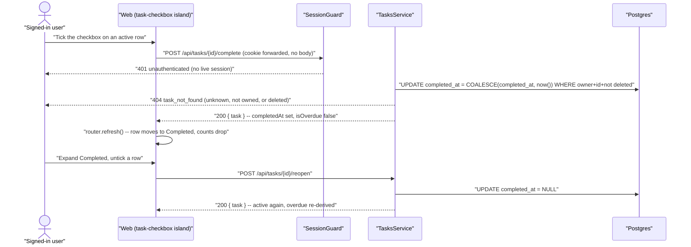

# Technical Design: FEAT-012 — Complete / reopen task

> Feature from: docs/implementation-plan.md · Epic: EPIC-E — Tasks (`tasks` module)
> Implements: FR-TASK-003 (partial — completes what FEAT-010 began), FR-TASK-009,
> FR-TASK-010, FR-TASK-011 · binds NFR-PERF-001, NFR-USE-003, NFR-USE-004 ·
> also FR-AUTHZ-001..005 · must not regress FR-LIST-005 (FEAT-009's active counts)
> Realizes: UC-011 (main 1–4, in full)
> Screens: SCR-WEB-008, SCR-WEB-010 — designed by ui-design
> Status: Draft · Date: 2026-07-29

## 1. Intent

FEAT-010 made the list view *show* two sections; FEAT-011 made a task editable.
Neither gave a user any way to move a task from one section to the other — the
`Completed` heading in `list-view.tsx` renders only when rows already exist, and
today nothing can produce one. This slice closes that: the completion toggle, the
timestamp behind it, and the collapsed section that keeps finished work out of
the way without hiding it. It is the payoff slice for the core loop — after it, a
user can do the whole thing they came for (add → schedule → finish).

It writes the `completed_at` column migration 007 created **for this feature**
("NULL = active … FEAT-012 writes it"), and it extends the `/tasks/{id}` resource
FEAT-011 minted, exactly as that design said FEAT-012 would.

## 2. Codebase context

Surveyed live (last migration **009** `1721560000000_task-due-priority.js`; API
modules = `auth`, `lists`, `tasks`). The design conforms to and reuses:

- **`tasks.completed_at timestamptz NULL`** — present since migration 007, never
  yet written by any code path. The partial index
  `tasks_active_by_list_idx (list_id) WHERE completed_at IS NULL AND deleted_at IS NULL`
  already exists and already backs `FR-LIST-005`'s active counts; a row moves in
  or out of it automatically as this feature writes the column. §4 is therefore
  empty on purpose.
- **`TaskItemController` (`@Controller('tasks')`)** — FEAT-011's item resource,
  whose own header comment reserves this ground: *"FEAT-012's complete/reopen and
  FEAT-013's delete/restore land here."* Class-level `@UseGuards(SessionGuard)`,
  `@CurrentUser()` for the owner id, a local `toHttp` mapping domain errors to the
  designed HTTP responses.
- **The ownership convention (FEAT-009 D3 → FEAT-010 → FEAT-011).** Every
  repository statement carries `WHERE owner_id = $1`; unknown, not-owned, non-uuid
  and soft-deleted collapse into one uniform `404 task_not_found`
  (FR-AUTHZ-002/003/005). `assertTaskLookupId` rejects a non-uuid path parameter
  *before* it reaches Postgres. Both are reused verbatim; this feature adds no new
  error class and no new error code.
- **`isOverdue` is derived in exactly one function** (`tasks.service.ts`,
  FEAT-011 D3) and its first clause is `completedAt === null`. FR-TASK-009's
  "completing clears overdue indication" is therefore already true the moment this
  feature writes the column — D4.
- **`findByList`'s ORDER BY** already sorts active-first, then
  `completed_at DESC` — the "most recently completed first" this feature finally
  makes observable. No query change.
- **Contract/error conventions.** `ApiError` (`statusCode/code/message/fields[]`)
  via the global `HttpExceptionFilter`; framework-free domain errors in
  `*.errors.ts`; shared error-code constant objects and path helpers in
  `@todo/shared`; data endpoints are not rate-limited (FR-AUTH-018 / NFR-SEC-006
  scope throttling to auth).
- **`ValidationPipe` is `{ whitelist: true, transform: true }`** (`app-setup.ts`) —
  relevant here only as the reason these routes accept **no body at all** (D8).
- **Web tier.** `components/list-view.tsx` is a **server** component whose
  `TaskRow` is one `<Link>` wrapping the entire row (D6 restructures that);
  `components/quick-add.tsx` and `components/task-detail.tsx` are the client-island
  pattern (`fetch` the BFF → `router.refresh()`); `app/api/tasks/[id]/route.ts` is
  the BFF proxy shape (forward `cookie`, relay status + body verbatim);
  `app/@detail/(.)tasks/[id]/page.tsx` intercepts the detail into a slide-in panel
  while `app/tasks/[id]/page.tsx` serves the hard navigation — **one component in
  both**, so a control added to `TaskDetail` appears in both automatically.
- **Divergence found:** none. Two inherited hand-offs are picked up rather than
  invented: migration 007's `completed_at` note and FEAT-010 ui-design D2's
  deliberately-absent complete checkbox (FEAT-011 restated it: *"the checkbox
  (FEAT-012) and drag handle (FEAT-014) stay honestly absent"*).

## 3. API contracts

Two new routes on the **existing** `TaskItemController`, exactly as the plan names
them. Both authenticated, owner-scoped from `@CurrentUser()`, **no request body**
(D8). No existing contract changes — `TaskSummary` already carries `completedAt`,
so `GET /lists/{listId}/tasks`, `GET /tasks/{id}` and `PATCH /tasks/{id}` are
untouched by this feature and every FEAT-010/011 test stays valid unmodified.

One new response type, shared by both routes:

```ts
/** The task as stored, with isOverdue recomputed. */
interface TaskStatusResponse {
  task: TaskSummary;
}
```

### 3.1 `POST /tasks/{id}/complete` — mark an active task done (FR-TASK-009)

- **Request:** no body. The completion instant is the **server's** (`now()` in
  SQL), never client-supplied (FR-AUTHZ-004 — the same rule that keeps `ownerId`
  out of every other body).
- **Success `200`** `TaskStatusResponse`: `task.completedAt` is a non-null ISO-8601
  UTC string (NFR-LOC-001) and `task.isOverdue` is `false` — recomputed, so the
  response that completes a late task is the same response that clears its overdue
  indication (UC-011 main 2; FR-TASK-009's note).
- **Idempotent (D2).** Completing an already-completed task returns `200` with the
  **original** `completedAt` — not a re-stamp, not a `409`. UC-011 names no
  exception flow for it, and the transition it asks for has already happened.
- **Errors:**
  | Status | code | When | Trace |
  | :-- | :-- | :-- | :-- |
  | `401` | `unauthenticated` | No/expired/revoked session | FR-AUTHZ-001 |
  | `404` | `task_not_found` | `id` unknown, **not owned**, not a uuid, or soft-deleted — identical response for all four | FR-AUTHZ-002/003/005 (FEAT-009 D3) |
- **Side effects:** `completed_at` set (if NULL), `updated_at` moved; the task
  leaves the list's `activeTaskCount` aggregate (FR-LIST-005, FEAT-009's contract)
  and moves to the `completed` array of the list view. **One** SQL statement
  (NFR-PERF-001; D2).

### 3.2 `POST /tasks/{id}/reopen` — return a completed task to active (FR-TASK-010)

- **Request:** no body.
- **Success `200`** `TaskStatusResponse`: `task.completedAt` is `null`, and
  `isOverdue` is recomputed — a task reopened with a past due date is overdue
  again, which is FR-TASK-007's rule applied to a now-active task rather than a
  second rule.
- **Idempotent (D2).** Reopening an already-active task returns `200` with
  `completedAt: null`.
- **Errors:** identical table to §3.1 — same guard, same uniform 404.
- **Side effects:** `completed_at` cleared, `updated_at` moved; the task rejoins
  `activeTaskCount` and the `active` array. **One** SQL statement.

### 3.3 Why not `PATCH /tasks/{id} { completed }`

FEAT-011's PATCH is a *field editor* whose DTO declares exactly `title`, `dueAt`,
`priority`, and whose §3.2 explicitly refuses `completedAt` in the body. A status
transition is not a field edit: the client names the transition, the **server**
owns the timestamp. Keeping it out of PATCH also keeps FEAT-011's partial-update
semantics (absent ≠ null) from having to answer "what does `completedAt: null`
mean in a patch?" — a question with two plausible answers and therefore a bug. See
D1.

## 4. Schema changes

**None — and that is the design, not an omission.**

`tasks.completed_at timestamptz` (nullable) has existed since **migration 007**,
which named this feature as its writer: *"`completed_at` … NULL = active
(FR-LIST-005; FEAT-012 writes it)"*. Its semantics are already fixed by that
migration and consumed by FEAT-010's `findByList` split and FEAT-009's active
counts; this feature adds behaviour, not structure.

Nothing else is needed:

- **No index.** `tasks_active_by_list_idx (list_id) WHERE completed_at IS NULL AND
  deleted_at IS NULL` is a **partial** index on exactly this predicate — a row
  enters or leaves it as a side effect of the writes above, which is what keeps the
  active-count aggregate correct without a second structure. Both new statements
  are keyed on `owner_id + id` and ride the primary key.
- **No `completed_by` / no audit row.** No FR asks who completed a task in a
  single-user-per-account system (arch §8: a user's data is private to them).
- **No status enum.** "Active vs completed" is `completed_at IS NULL` — the
  conceptual model's own encoding, and a second column holding the same fact is a
  consistency bug waiting for a partial write.

Conceptual-model check: the only entity touched is **Task**, which the architecture
already owns (arch §8). No new entity, no ownership or boundary change, **no
architecture amendment** (§8).

## 5. Component design

- **`packages/shared`** — a FEAT-012 block, beside FEAT-011's:
  `completeTaskPath(id)` (`/tasks/${id}/complete`), `reopenTaskPath(id)`
  (`/tasks/${id}/reopen`), and `TaskStatusResponse`. No existing export changes
  shape; `TaskSummary.completedAt` already documents `null = active`.
- **`apps/api/src/modules/tasks/`** — extended, not restructured:
  - **`tasks.repository.ts`** — one new owner-scoped method,
    `setCompletion(ownerId, id, completed: boolean): Promise<TaskRow | null>`:

    ```sql
    UPDATE tasks
       SET completed_at = <COALESCE(completed_at, now()) | NULL>,
           updated_at   = now()
     WHERE owner_id = $1 AND id = $2 AND deleted_at IS NULL
    RETURNING id, list_id, title, completed_at, created_at, due_at, priority
    ```

    `COALESCE(completed_at, now())` on the complete side is what makes the route
    idempotent *inside the single statement* (D2); the reopen side is a plain
    `NULL`. A zero-row result is the same uniform not-found `findById` returns.
    Projects the existing `TASK_COLUMNS` constant so it cannot drift from the other
    three statements.
  - **`tasks.service.ts`** — `complete(ownerId, id)` and `reopen(ownerId, id)`:
    `assertTaskLookupId` (reused), `setCompletion`, `TaskNotFoundError` on null,
    `toSummary` on the row — so `isOverdue` comes from the **one** existing
    derivation and this feature adds no second opinion about overdue (D4).
  - **`task-item.controller.ts`** — two `@Post(':id/complete')` / `@Post(':id/reopen')`
    handlers with `@HttpCode(200)` (the module's `POST` default is 201 only where
    it was set explicitly; these create nothing), reusing the file's existing
    `toHttp`. No DTO, no `@Body()` (D8).
  - **`tasks.errors.ts`** — unchanged. No new failure mode exists.
- **`apps/web`** —
  - BFF routes `app/api/tasks/[id]/complete/route.ts` and
    `app/api/tasks/[id]/reopen/route.ts` (POST) — forward the browser `cookie`,
    relay status + JSON verbatim, no body, mirroring `app/api/tasks/[id]/route.ts`.
  - `components/task-checkbox.tsx` — **new client island**: design.md §4's
    `checkbox` (circular, `--color-success` when checked), posting to the BFF and
    calling `router.refresh()` on success so the sections, the header count and the
    sidebar counts all re-render from the server. Optimistic pending state while
    in flight; a failure restores the previous state and surfaces an inline
    message rather than lying about what was stored (the `quick-add` /
    `task-detail` rule).
  - `components/list-view.tsx` — **`TaskRow` restructured** so the checkbox is a
    *sibling* of the row `<Link>`, not nested inside it (D6); the completed
    section becomes a **collapsed disclosure** (D5) with its count in the summary.
  - `components/task-detail.tsx` — the read-only `detail-status` paragraph
    (`"Completed" | "Active"`) becomes the same transition control, satisfying
    design.md's `task-detail-panel` "complete" affordance. Because both the
    intercepted panel and the full page render this one component, both get it.
  - Screens are ui-design's manifest; these are the contract wiring points.
- **Stubs replaced:** none outstanding.



## 6. Acceptance criteria

- **AC-1 (FR-TASK-009; UC-011 main 1/2).** `POST /tasks/{id}/complete` on an
  active task returns `200 { task }` where `completedAt` is a non-null ISO-8601
  UTC instant no earlier than the request and no later than the response, the
  stored `completed_at` holds that same instant, and a following `GET /tasks/{id}`
  reports it unchanged.
- **AC-2 (FR-TASK-010; UC-011 main 3/4).** `POST /tasks/{id}/reopen` on a completed
  task returns `200 { task }` with `completedAt: null`, the stored column is SQL
  NULL, and a following `GET /tasks/{id}` agrees. Every other field —
  `title`, `dueAt`, `priority`, `listId`, `createdAt` — is byte-identical before
  and after both transitions.
- **AC-3 (FR-TASK-003, FR-TASK-011; UC-011 main 2/4).** After completing,
  `GET /lists/{listId}/tasks` returns the task in `completed` and **not** in
  `active`; after reopening, in `active` and not in `completed`. With two tasks
  completed in a known order, `completed` is ordered most-recently-completed
  first; `active` keeps its oldest-first append order.
- **AC-4 (FR-TASK-009's note; FR-TASK-007).** Completing a task whose `dueAt` is in
  the past returns `isOverdue: false` **in the completing response itself**, and
  the same `false` on the next read; reopening it returns `isOverdue: true` again,
  with `dueAt` unchanged throughout. A completed task with a *future* due date is
  likewise not overdue.
- **AC-5 (idempotency, D2).** A second `POST …/complete` on an already-completed
  task returns `200` with `completedAt` **byte-identical to the first response** —
  not re-stamped, not an error. A `POST …/reopen` on an already-active task
  returns `200` with `completedAt: null`. Neither changes the task's section on a
  following list read.
- **AC-6 (FR-LIST-005, established by FEAT-009 — must not regress).** Completing a
  task decrements the owning list's `activeTaskCount` and leaves `taskCount`
  unchanged, as reported by **both** `GET /lists` and the `list` in
  `GET /lists/{listId}/tasks`; reopening restores it. Asserted because this is the
  first feature that can move a task across the aggregate's predicate.
- **AC-7 (FR-AUTHZ-002/003/005).** With user B's session, both routes against user
  A's task id return **`404 task_not_found`, byte-identical to** the response for a
  random unknown uuid, a non-uuid path segment, and a soft-deleted task — and A's
  task is **unmodified** afterwards (`completed_at` and `updated_at` both
  unchanged, verified at the row).
- **AC-8 (FR-AUTHZ-001).** With no `sid` cookie, or an expired/revoked one, both
  routes return `401 unauthenticated` against a real, owned task id and write
  nothing.
- **AC-9 (NFR-PERF-001).** Each route resolves in **exactly one** SQL statement (a
  single ownership-bearing `UPDATE … RETURNING` — no read-then-write), completing
  server-side well inside the 300 ms bound; NFR-PERF-001 names "complete a task"
  verbatim. The session guard's own statements are cross-cutting and counted
  separately, per FEAT-010 AC-8's accounting.
- **AC-10 (FR-TASK-011; NFR-USE-003/004).** In SCR-WEB-008 the completed tasks
  render in a section that is **collapsed by default**, carries its count in the
  visible summary, and expands to reveal its rows — operable by mouse **and** by
  keyboard alone, with the expanded/collapsed state exposed to assistive
  technology. With no completed tasks the section is absent entirely (not an empty
  heading).
- **AC-11 (FR-TASK-009/010 through the UI; SCR-WEB-008, SCR-WEB-010).** Ticking an
  active row's checkbox completes that task: it moves to the completed section, its
  title renders strikethrough + `--color-text-muted`, any overdue treatment
  disappears, and the header/sidebar counts drop — without a full page navigation.
  Unticking a row inside the expanded completed section reopens it and reverses all
  of the above. The detail surface (panel **and** full page, one component) offers
  the same transition and shows the resulting status.
- **AC-12 (NFR-USE-003).** A failed transition (server error or offline) leaves the
  control in its **pre-click** state with an inline message — never a checkbox that
  shows completed while the row is still active. The reverse transition remains
  available immediately.

## 7. Decisions

- **D1 — Two verb routes, not a status field on PATCH.** Driver: the plan
  specifies `POST /tasks/{id}/complete` and `/reopen`, and the code agrees with it
  — FEAT-011 §3.2 lists `completedAt` among the fields the PATCH body must never
  accept (FR-AUTHZ-004), because the completion instant is the server's fact, not
  the client's. A verb route also keeps the transition atomic and nameable in logs
  and in the E2E. Rejected: `PATCH { completedAt }` (lets a client forge when
  something was finished); `PATCH { completed: true }` (a boolean whose write
  produces a *timestamp* — the field the client sends is not the field the server
  stores, and FEAT-011 D4's absent-vs-null rule would then need an answer for
  `completed: null`); `POST /tasks/{id}/status { completed }` (one route with the
  verb moved into the body, which is the same two operations wearing a disguise).
  Consequence: `TaskItemController` now carries four routes on one resource, which
  is what FEAT-011's header comment anticipated; FEAT-013's `DELETE` and
  `POST …/restore` complete the set.
- **D2 — Both transitions are idempotent, and completing does not re-stamp.**
  Driver: a checkbox over a network is double-tapped, retried after a timeout, and
  pressed on two devices; UC-011 defines no exception flow for "already
  completed", so there is no user-visible meaning to a failure there. And
  FR-TASK-009 says "recording the completion timestamp" — *the* moment it was
  completed, so a repeat click must not overwrite it (a re-stamp would also
  silently reorder the completed section, which sorts on that column). The
  mechanism is `COALESCE(completed_at, now())`, which keeps it to one statement.
  Rejected: `409 conflict` on a repeat (forces every client to handle a race whose
  outcome is already what the user wanted); a conditional
  `WHERE … AND completed_at IS NULL` (a zero-row result then means *either*
  not-found *or* already-done, and disambiguating costs the second statement AC-9
  forbids); re-stamping (loses the true completion instant). Consequence:
  `updated_at` does move on a no-op repeat. That is accepted and recorded: a
  legitimate operation was requested and re-affirmed, unlike FEAT-011 AC-7's
  *empty patch*, which was a malformed request and must write nothing.
- **D3 — No migration.** Driver: `completed_at` and the partial index that depends
  on it were created by migration 007 explicitly for this feature; adding anything
  now would be structure without a query. Rejected: a `status` column or enum
  (duplicates `completed_at IS NULL`, and two encodings of one fact drift);
  `completed_by` / a completion audit trail (no FR, and the account is
  single-user). Consequence: this is the first feature since FEAT-008's era with
  an empty §4 — verification should read that as conformance, not as a missing
  step.
- **D4 — Overdue clearing is inherited, not implemented.** Driver: FR-TASK-009's
  note ("Completing clears overdue indication") is already satisfied by
  FEAT-011 D3's single `isOverdue` derivation, whose first clause is
  `completedAt === null`. Writing anything here would be a second definition of
  overdue — precisely what D3 exists to prevent. Rejected: a client-side "hide the
  chip when completed" rule (the same logic, in a second place, reachable only by
  eye). Consequence: AC-4 **asserts** the behaviour rather than assuming it, so if
  the derivation ever changes, this feature's suite catches it.
- **D5 — The completed section is a native `<details>`/`<summary>` disclosure,
  collapsed by default.** Driver: FR-TASK-011 wants "collapsed or hidden … user can
  expand to review/reopen"; `list-view.tsx` is a **server** component, and native
  disclosure gives keyboard operability, the expanded/collapsed state announced to
  assistive technology, and correct behaviour with JS unavailable — for zero client
  JavaScript (NFR-USE-004). Rejected: a `useState` client component (a client
  island bought for a triangle, and it would pull the completed rows' server
  rendering with it); hiding completed tasks entirely (FR-TASK-011 requires them
  reachable); a separate route or filter for completed tasks (FR-TASK-011 says
  "within a list", and search/filter is FEAT-015's). Consequence: the summary must
  carry the count, since a collapsed section otherwise gives no sign there is
  anything inside.
- **D6 — The checkbox is a sibling of the row link, never nested inside it.**
  Driver: `TaskRow` today is a single `<Link>` wrapping the whole row; an
  interactive control inside an anchor is invalid HTML, and browsers disagree
  about which target a click or an Enter press activates — an accessibility and
  correctness bug, not a style preference (NFR-USE-004). The `<li>` becomes the
  flex container; the checkbox and the link are its children. Rejected: nesting it
  and calling `preventDefault`/`stopPropagation` (fights the platform, and
  keyboard activation still lands on the anchor); making the whole row a `<button>`
  and navigating in JS (loses middle-click, Cmd-click and the visible URL that
  FEAT-011 ui-design D1 deliberately gave the detail surface). Consequence:
  design.md's "full row is the click target for detail" holds for the row *minus*
  the checkbox's own 44px target — which is the intended behaviour, not an
  exception to it.
- **D7 — The response carries the task; the section move and the counts come from
  `router.refresh()`.** Driver: the list header count, the sidebar list counts and
  the two sections are all **server**-rendered from `GET /lists` and
  `GET /lists/{listId}/tasks`; re-deriving them in the client island would
  duplicate three server computations and let them disagree. The established
  pattern (`quick-add`, `task-detail`) is already refresh-after-write. Rejected:
  returning the whole list view from the transition (a second shape for the list,
  and a bigger payload on the most frequent write in the app); client-side count
  arithmetic (drifts the moment another device writes). Consequence: one extra
  server round trip per toggle, which is the same trade FEAT-010 and FEAT-011
  already made and which FEAT-019's realtime refetch generalizes.
- **D8 — The routes accept no request body.** Driver: method + path + session fully
  specify both operations; a body would be a place for a client to send something
  the server must then decide to ignore. `whitelist: true` would strip unknown
  properties silently, so an accepted-but-ignored body is exactly the invisible
  no-op FEAT-011 D4 fought. Rejected: an optional `{ completedAt }` for offline
  clients backfilling a completion time (no FR, no offline mode in the MVP — arch
  §2 — and it would let a client write history). Consequence: no DTO and no
  `400 validation_failed` on either route; the only failures are `401` and `404`.

## 8. Escalations & open items

- **No architecture amendment.** The only entity touched is **Task**, already owned
  by the conceptual model (arch §8); no new noun, no boundary crossed, no
  ownership change — and no schema change at all (D3).
- **No requirements or plan amendment.** Both endpoints, both screens and all four
  FRs are exactly the plan's FEAT-012 row.
- **FR-TASK-003 is finished by this feature, and the RTM should read that way.**
  FEAT-010 delivered the *split*; the FR's own note defers the completed side to
  FR-TASK-011, which lands here. Acceptance should treat the FR-TASK-003 `(partial)`
  markers on FEAT-010's row as closed by this feature's report rather than
  outstanding.
- **`apps/web` still has no unit-test runner** — the gap DEF-003 named twice and
  FEAT-011's acceptance report carries as minor #1. It bites harder here than
  anywhere so far: `task-checkbox.tsx` is the first control on the list row with
  **state and a failure mode** (AC-12), and the only harness that can currently
  see it is Playwright. This feature does **not** stand the runner up — that is an
  engineering-foundations item, not a FEAT-012 requirement, and adopting it
  silently inside a feature slice is how foundations work becomes invisible. It is
  re-flagged here as the third concrete case, with a recommendation that it be
  scheduled explicitly before FEAT-013's undo-snackbar (another stateful island
  with a timeout) makes it a fourth.
- **DEF-002 is open and affects how this feature's suites are run.** The api suite
  still fails ~8% of parallel runs (`docs/defects.md`); the gate is trustworthy
  serially. Implementation and verification must run
  `npm test -w @todo/api -- --runInBand`, and a red parallel run must be re-checked
  serially **before** it is attributed to this feature. New specs must assert their
  own fixture responses (`201`/`200`) rather than destructuring an unchecked one,
  per FEAT-010's practice.
- **Realtime is FEAT-019's.** A task completed on one device does not appear
  completed on another until that device refetches. That is the current state of
  every write in the system, not a regression introduced here.
- **The `task-row` drag handle stays absent** (FEAT-014), as does moving a task
  between lists (no FR — FEAT-011 §8 recorded it as a candidate requirements
  amendment, unchanged). After this feature, `task-row` is complete except for the
  handle.
- **`(owner_id, due_at)` index still deferred to FEAT-015/016** (FEAT-011 D7),
  carried forward so its absence keeps reading as a decision.
- **Carried, unresolved, and still not this feature's to fix** (FEAT-009 acceptance
  minors): the hard-coded `44` touch-target literals, the E2E harness's missing
  `AUTH_RATELIMIT_MAX` override (it will bite the E2E task again — clear
  `auth_rate_buckets` for `::1` rather than weakening a test), and the
  `apps/api/tsconfig.json` spec-typing debt.

Verification: clean (self-check per Phase 5 — FR-TASK-003 covered by AC-3 and
T4/T5/T6; FR-TASK-009 by AC-1/AC-4/AC-5/AC-11 and T2/T3/T4/T6; FR-TASK-010 by
AC-2/AC-5/AC-11 and T2/T3/T4/T6; FR-TASK-011 by AC-3/AC-10 and T6; FR-LIST-005
regression by AC-6 and T5; NFR-PERF-001 by AC-9 and T4; NFR-USE-003 by AC-12 and
T6; NFR-USE-004 by AC-10/AC-11 and T6; FR-AUTHZ-001/002/003/004/005 by AC-7/AC-8
and T4; UC-011 main 1–4 map to §3 behaviours and AC-1..AC-5; every cited
FR/UC/NFR/ADR/SCR ID resolves in `docs/srs.md`, `docs/use-cases.md`,
`docs/architecture.md`, `docs/ux-foundations.md`, `docs/design.md` and the plan;
no schema change is needed and D3 records why, so the conceptual model is
untouched; contracts reuse the existing envelope, error-code, guard and controller
conventions and introduce no new error code; `/tasks/{id}/complete` and
`/tasks/{id}/reopen` collide with no existing route — `@Controller('tasks')`
currently serves only `GET :id` and `PATCH :id`, and Nest matches the literal
segments ahead of nothing else; no prior feature's contract or schema changes, so
no compat story is owed; tasks are ordered, each with a done-when, and cover every
criterion).
