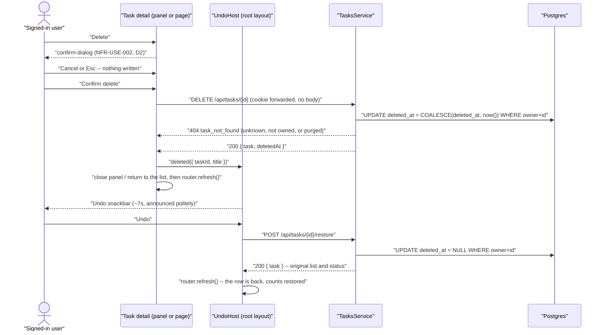

# Technical Design: FEAT-013 — Delete / restore task (soft-delete + undo)

> Feature from: docs/implementation-plan.md · Epic: EPIC-E — Tasks (`tasks` module)
> Implements: FR-TASK-013, FR-TASK-014 · binds NFR-USE-002 (partial), NFR-PERF-001,
> NFR-USE-003, NFR-USE-004, NFR-REL-004 · also FR-AUTHZ-001..005 · must not regress
> FR-LIST-005 (FEAT-009's counts) or FR-TASK-003/011 (FEAT-010/012's sections)
> Realizes: UC-012 (main 1–4 and alternate 3a's first half — the *purge* half is
> FEAT-020's)
> Screens: SCR-WEB-008 (undo snackbar, row removal) **and SCR-WEB-010** (the delete
> control) — designed by ui-design; see §8 on the plan's screen list
> Status: Draft · Date: 2026-07-29

## 1. Intent

Every write the task loop has so far is additive or reversible in place: create,
edit, complete, reopen. Nothing removes a task. This slice adds removal — and
adds it the way ADR-003 and arch §8 already decided it would be done: a
**soft** delete that takes the task out of every normal view while keeping the
row recoverable, plus the **undo** that makes deletion safe enough not to need a
modal in front of it (D2).

It writes the `deleted_at` column migration 007 created **for this feature**
("soft delete (arch §8 Data; FEAT-013 writes it)") and completes the four-route
set `TaskItemController`'s own header comment reserved. It does **not** purge:
the 30-day retention sweep is FR-TASK-015 / FEAT-020, and this feature's job is
to start that clock honestly and never to stop it early.

## 2. Codebase context

Surveyed live (last migration **009** `1721560000000_task-due-priority.js`; API
modules = `auth`, `lists`, `tasks`; web components as listed below). The design
conforms to and reuses:

- **`tasks.deleted_at timestamptz NULL`** — present since migration 007, never
  yet written by any code path, and already *read* by four statements:
  `findByList`, `findById`, `update` and `setCompletion` all carry
  `AND deleted_at IS NULL`, and `lists.repository`'s active-count aggregate
  filters on it. **Every consumer of soft-deletion already exists**; this feature
  supplies the only writer. §4 is therefore empty on purpose (D8).
- **`TASK_COLUMNS`** (`tasks.repository.ts`) — the one projection the module's
  statements share, whose own comment anticipates this feature:
  *"FEAT-012/013/014 each add to it."* D5 takes it up on that.
- **`TaskItemController` (`@Controller('tasks')`)** — `GET :id`, `PATCH :id`,
  `POST :id/complete`, `POST :id/reopen`, class-level `@UseGuards(SessionGuard)`,
  `@CurrentUser()` for the owner id, and a local `toHttp` mapping domain errors to
  the designed responses. Its header reserves this ground explicitly:
  *"FEAT-013's delete/restore land here."*
- **The ownership convention (FEAT-009 D3 → FEAT-010 → FEAT-011 → FEAT-012).**
  Every statement carries `WHERE owner_id = $1`; unknown, not-owned, non-uuid and
  soft-deleted collapse into one uniform `404 task_not_found`
  (FR-AUTHZ-002/003/005). `assertTaskLookupId` rejects a non-uuid path parameter
  before it reaches Postgres. Reused verbatim; **no new error class, no new error
  code**.
- **FEAT-012's idempotency mechanism** — `COALESCE(completed_at, now())` in a
  single `UPDATE … RETURNING`, so a double-tapped control is a no-op rather than a
  `409`, and the *original* instant survives. D3 applies the same shape to
  `deleted_at`, where it matters more: that column is the retention clock.
- **`FR-LIST-005`'s two counts, and their asymmetry.** `activeTaskCount` filters
  `completed_at IS NULL AND deleted_at IS NULL`; `taskCount` is a plain
  `COUNT(t.id)` that **includes soft-deleted rows** — FEAT-009's deliberate
  contract (*"completed and soft-deleted alike, because all of them go when the
  list does"*, `lists.repository.ts`). This feature is the first that can move a
  row across that asymmetry, so AC-5 pins it rather than leaving it to be
  discovered.
- **Contract/error conventions.** `ApiError` (`statusCode/code/message/fields[]`)
  via the global `HttpExceptionFilter`; framework-free domain errors in
  `*.errors.ts`; shared path helpers and response types in `@todo/shared`; data
  endpoints are not rate-limited (FR-AUTH-018 / NFR-SEC-006 scope throttling to
  auth). `DELETE /lists/{id}` (FEAT-009) is the precedent for a delete contract
  that returns a **body** rather than a `204`.
- **Web tier.** `components/task-detail.tsx` is the client island rendered by
  **both** `app/@detail/(.)tasks/[id]/page.tsx` (intercepted panel) and
  `app/tasks/[id]/page.tsx` (hard navigation); `components/task-checkbox.tsx` is
  the optimistic-write-then-`router.refresh()` pattern; `lists-nav.tsx` already
  contains a working toast (`role="status"`, `aria-live="polite"`, fixed
  bottom-right, timed dismissal) that the snackbar should read like.
- **The structural fact D6 turns on:** in `app/layout.tsx`, `{children}` and
  `{detail}` are **siblings**. The detail panel is *not* inside `AppShell` /
  `ShellFrame`, so no client state held in the shell is visible to the panel, and
  no state held in the panel survives the panel closing.
- **Divergence found:** one, documentary, recorded in §8 — design.md §4's
  `confirm-dialog` entry lists *"delete task-with-warning"* where
  ux-foundations §A5 (which the same sentence cites) lists
  *"delete-list-with-tasks"*. The two documents' third item is the same slot; the
  design follows ux-foundations §A5 + Flow 3 (D2).

## 3. API contracts

Two new routes on the **existing** `TaskItemController`, exactly as the plan names
them. Both authenticated, owner-scoped from `@CurrentUser()`, **no request body**
(the FEAT-012 D8 rule: method + path + session fully specify both operations). No
existing contract changes shape — `TaskSummary` is untouched (D4), so every
FEAT-010/011/012 test stays valid unmodified.

Two new response types:

```ts
/** DELETE /tasks/{id} — the task as stored, plus the instant the retention
 *  clock started (FR-TASK-013 → FR-TASK-015). */
interface DeleteTaskResponse {
  task: TaskSummary;
  deletedAt: string; // ISO-8601 UTC
}

/** POST /tasks/{id}/restore — the task, back in its original list and status. */
interface RestoreTaskResponse {
  task: TaskSummary;
}
```

### 3.1 `DELETE /tasks/{id}` — soft-delete a task (FR-TASK-013)

- **Request:** no body. The deletion instant is the **server's** (`now()` in SQL),
  never client-supplied (FR-AUTHZ-004) — the same rule that keeps `ownerId` out of
  every body, and here it is also what keeps a client from choosing when its data
  gets purged.
- **Success `200`** `DeleteTaskResponse` (Nest's default status for `DELETE`;
  FEAT-009's `DELETE /lists/{id}` set the body-not-`204` precedent):
  `deletedAt` is a non-null ISO-8601 UTC instant, and `task` is the row as it now
  stands — `listId`, `title`, `completedAt`, `dueAt`, `priority` all unchanged,
  because a delete moves nothing except `deleted_at` (that is what makes
  FR-TASK-014's "returning it to its original list and status" free).
- **Idempotent, and it does not re-stamp (D3).** Deleting an already-deleted task
  returns `200` with the **original** `deletedAt`. Not a `404`, not a fresh
  timestamp — a re-stamp would silently extend the 30-day retention window
  (FR-TASK-015) on a repeat click.
- **Errors:**
  | Status | code | When | Trace |
  | :-- | :-- | :-- | :-- |
  | `401` | `unauthenticated` | No/expired/revoked session | FR-AUTHZ-001 |
  | `404` | `task_not_found` | `id` unknown, **not owned**, not a uuid, or already purged — identical response for all four | FR-AUTHZ-002/003/005 (FEAT-009 D3) |
- **Side effects:** `deleted_at` set (if NULL), `updated_at` moved. The task leaves
  `GET /lists/{listId}/tasks` (both arrays), leaves the list's `activeTaskCount`
  if it was active, and becomes unreachable through `GET /tasks/{id}`,
  `PATCH /tasks/{id}`, `POST …/complete` and `POST …/reopen` — all four already
  filter `deleted_at IS NULL`, so "removed from normal views" (FR-TASK-013) is
  enforced by statements that already exist rather than by new checks. `taskCount`
  is **unchanged** (FEAT-009's contract; §2). **One** SQL statement.
- **The row is not destroyed.** No `DELETE FROM tasks` runs anywhere in this
  feature; permanence is FR-TASK-015 / FEAT-020 alone.

### 3.2 `POST /tasks/{id}/restore` — undo a soft-delete (FR-TASK-014)

- **Request:** no body.
- **Success `200`** `RestoreTaskResponse`: `deleted_at` cleared, and the task
  reappears **in its original list and status** — `list_id` and `completed_at`
  were never touched by §3.1, so a completed task restores into the completed
  section with its `completedAt` byte-identical, and an active one restores into
  the active section in its original `created_at` order. `isOverdue` is recomputed
  by the single existing derivation (FEAT-011 D3), so a task whose due date passed
  while it sat deleted comes back overdue — correct, and inherited rather than
  implemented.
- **This route is the one statement in the module that must see soft-deleted
  rows** (D5): its `WHERE` carries `owner_id` and `id` and **no**
  `deleted_at IS NULL`. Ownership is still structural.
- **Idempotent (D3).** Restoring a task that is not deleted returns `200` with
  `deleted_at` NULL — the transition it asks for has already happened.
- **No time limit on the server.** FR-TASK-014's window is "until purge": the
  ~7 s snackbar is a *UI* affordance (design.md §4), not the contract. A restore
  is legal for as long as the row exists; once FEAT-020 purges it, the row is
  gone and the uniform `404` is the honest answer.
- **Errors:** identical table to §3.1 — same guard, same uniform 404.
- **Side effects:** `deleted_at` cleared, `updated_at` moved; the task rejoins the
  list view and, if active, `activeTaskCount`. **One** SQL statement.

### 3.3 Why `DELETE` + a verb route, and not `PATCH { deleted }`

Same reasoning FEAT-012 D1 settled for complete/reopen, and the plan names these
verbs: `DELETE /tasks/{id}` is the method HTTP already has for "remove this
resource", and its soft implementation is a storage decision the client has no
business seeing. Restore has no HTTP method, so it takes a verb route beside
`complete` and `reopen`. `PATCH { deleted: true }` is rejected for the reason
FEAT-011 §3.2 refuses `completedAt` in a patch body: the field the client would
send is not the field the server stores, and FEAT-011 D4's absent-vs-null rule
would then owe an answer for `deleted: null`. See D1.

## 4. Schema changes

**None — and that is the design, not an omission** (D8), for the second feature
running.

`tasks.deleted_at timestamptz` (nullable) has existed since **migration 007**,
which named this feature as its writer, and the partial index
`tasks_active_by_list_idx (list_id) WHERE completed_at IS NULL AND deleted_at IS NULL`
is already predicated on it — a row leaves that index the moment §3.1 writes the
column, which is what keeps `activeTaskCount` correct with no second structure.

Nothing else is needed:

- **No index for delete/restore.** Both statements are keyed on `owner_id + id`
  and ride the primary key.
- **No index for the purge sweep yet.** FEAT-020 will scan
  `WHERE deleted_at < now() - interval '30 days'` and *that* feature owns the
  index it needs (the same deferral FEAT-011 D7 made for `(owner_id, due_at)`).
  Adding it here would be structure without a query.
- **No `deleted_by`, no audit row, no tombstone table.** A soft-deleted task *is*
  its own tombstone, and the account is single-user (arch §8).

Conceptual-model check: the only entity touched is **Task**, which the
architecture already owns (arch §8, ADR-003). No new entity, no ownership or
boundary change, **no architecture amendment** (§8).

## 5. Component design

- **`packages/shared`** — a FEAT-013 block, beside FEAT-012's: `restoreTaskPath(id)`
  (`/tasks/${id}/restore`), `DeleteTaskResponse`, `RestoreTaskResponse`. `taskPath(id)`
  already addresses the DELETE. **No existing export changes shape** (D4).
- **`apps/api/src/modules/tasks/`** — extended, not restructured:
  - **`tasks.repository.ts`**
    - `TASK_COLUMNS` gains `deleted_at`, and `TaskRow` gains
      `deletedAt: Date | null` (D5). Every existing statement filters
      `deleted_at IS NULL`, so the field is always `null` in their rows — the
      point is that the *one* projection stays the single source as the table
      grows, exactly as its comment says.
    - one new owner-scoped method,
      `setDeletion(ownerId, id, deleted: boolean): Promise<TaskRow | null>`:

      ```sql
      UPDATE tasks
         SET deleted_at = <COALESCE(deleted_at, now()) | NULL>,
             updated_at = now()
       WHERE owner_id = $1 AND id = $2
      RETURNING id, list_id, title, completed_at, deleted_at, created_at, due_at, priority
      ```

      **The absent `AND deleted_at IS NULL` is the design** (D5): restore must
      reach a deleted row, and delete must be able to answer a repeat with the
      original instant. Ownership remains in the `WHERE`, so nothing widens.
      `COALESCE(deleted_at, now())` is FEAT-012's idempotency mechanism applied to
      the retention clock (D3). A zero-row result is the same uniform not-found
      `findById` returns.
  - **`tasks.service.ts`** — `softDelete(ownerId, id)` returning
    `{ task, deletedAt }` and `restore(ownerId, id)` returning the summary: both
    `assertTaskLookupId` (reused), then `setDeletion`, `TaskNotFoundError` on
    null, `toSummary` on the row. `deletedAt` is formatted with the same
    `toISOString()` rule the module uses everywhere (NFR-LOC-001).
  - **`task-item.controller.ts`** — `@Delete(':id')` (Nest's default `200`) and
    `@Post(':id/restore')` with `@HttpCode(200)`, reusing the file's existing
    `toHttp`. No DTO, no `@Body()`.
  - **`tasks.errors.ts`** — unchanged. No new failure mode exists.
- **`apps/web`** —
  - `app/api/tasks/[id]/route.ts` — add a **`DELETE`** handler to the existing
    proxy (its `proxy()` helper already takes a method and an optional body).
  - `app/api/tasks/[id]/restore/route.ts` — **new** POST proxy, mirroring
    `…/complete/route.ts` (forward `cookie`, relay status + JSON verbatim, no body).
  - `components/undo-snackbar.tsx` — **new client island**: an `UndoHost` provider
    plus a `useUndo()` hook, mounted in `app/layout.tsx` **around both `{children}`
    and `{detail}`** (D6). It holds `{ taskId, title }` for the most recent
    deletion, renders design.md §4's undo snackbar (a `toast` with an "Undo"
    `button-tertiary` and a ~7 s timeout), announces politely without stealing
    focus (`role="status"`/`aria-live="polite"`, the shape `lists-nav.tsx` already
    uses), posts to the restore BFF on Undo and calls `router.refresh()`. A failed
    restore leaves the snackbar in place with a recoverable message rather than
    dismissing on a lie (NFR-REL-004).
  - `components/task-detail.tsx` — the delete control design.md's
    `task-detail-panel` names alongside complete (`button-danger`, kept visually
    apart from the editing fields), opening design.md §4's **`confirm-dialog`**
    rather than deleting outright (D2): title, body naming the task,
    `button-secondary` cancel + `button-danger` confirm, focus trapped and
    restored, Esc and scrim close. `components/list-dialog.tsx`'s `kind: "delete"`
    branch is the working precedent for all of that — whether the confirm becomes a
    shared component or a second local one is ui-design's call, but the *behaviour*
    is the one already shipped. On a confirmed delete it calls
    `useUndo().deleted(...)`,
    then leaves the surface: `router.back()` in the panel presentation,
    `router.push('/lists/{listId}')` in the full-page one — so the component takes
    a `presentation: "panel" | "page"` prop from its two callers. Failure keeps
    the task on screen with an inline message (never a row that vanishes on a
    failed write).
  - `app/layout.tsx` — wrap `{children}{detail}` in `UndoHost`. This is the only
    structural change to a file this feature does not otherwise own, and D6 is
    why it is necessary rather than convenient.
  - Screens are ui-design's manifest; these are the contract wiring points.
- **Stubs replaced:** none outstanding.



## 6. Acceptance criteria

- **AC-1 (FR-TASK-013; UC-012 main 1/2).** `DELETE /tasks/{id}` on a task returns
  `200 { task, deletedAt }` where `deletedAt` is a non-null ISO-8601 UTC instant no
  earlier than the request and no later than the response, the stored `deleted_at`
  holds that same instant, and `list_id`, `title`, `completed_at`, `due_at`,
  `priority` are **byte-identical at the row** before and after.
- **AC-2 (FR-TASK-013 — "removed from normal views"; FR-AUTHZ-005).** After a
  delete: `GET /lists/{listId}/tasks` contains the task in **neither** `active` nor
  `completed`; `GET /tasks/{id}`, `PATCH /tasks/{id}`, `POST /tasks/{id}/complete`
  and `POST /tasks/{id}/reopen` each return `404 task_not_found` **byte-identical
  to** the response for an unknown uuid. The row **still exists** in `tasks` with
  its `deleted_at` set — asserted at the database, because "recoverable state"
  (FR-TASK-013) is the difference between this feature and a destructive one.
- **AC-3 (FR-TASK-014; UC-012 main 3/4).** `POST /tasks/{id}/restore` on a
  soft-deleted task returns `200 { task }`, the stored `deleted_at` is SQL NULL,
  and the task reappears in `GET /lists/{listId}/tasks` **in its original list and
  its original section**: one deleted while active returns to `active` in its
  original `created_at` position; one deleted while completed returns to
  `completed` with `completedAt` byte-identical. `GET /tasks/{id}` succeeds again,
  and every field is byte-identical across the delete→restore round trip.
- **AC-4 (idempotency, D3).** A second `DELETE` on an already-deleted task returns
  `200` with `deletedAt` **byte-identical to the first response** — not
  re-stamped (the retention clock does not move), not a `404`. A `restore` on a
  task that is not deleted returns `200` and leaves `deleted_at` NULL. Neither
  changes what a following list read shows.
- **AC-5 (FR-LIST-005, established by FEAT-009 — must not regress).** Deleting an
  **active** task decrements the owning list's `activeTaskCount` and leaves
  `taskCount` unchanged, as reported by **both** `GET /lists` and the `list` in
  `GET /lists/{listId}/tasks`; restoring it restores the count. Deleting a
  **completed** task changes neither count. (`taskCount` including soft-deleted
  rows is FEAT-009's deliberate contract, §2 — pinned here, not changed.)
- **AC-6 (FR-AUTHZ-002/003/005).** With user B's session, both routes against user
  A's task id return **`404 task_not_found`, byte-identical to** the response for a
  random unknown uuid and for a non-uuid path segment — including when A's task is
  *already soft-deleted*, which restore must not be able to reach across owners —
  and A's row is **unmodified** afterwards (`deleted_at` and `updated_at` both
  unchanged, verified at the row).
- **AC-7 (FR-AUTHZ-001).** With no `sid` cookie, or an expired/revoked one, both
  routes return `401 unauthenticated` against a real, owned task id and write
  nothing.
- **AC-8 (NFR-PERF-001).** Each route resolves in **exactly one** SQL statement (a
  single ownership-bearing `UPDATE … RETURNING` — no read-then-write), completing
  server-side well inside the 300 ms bound. NFR-PERF-001 names "create/edit/complete
  a task, load a list" rather than delete; the bound is applied as the module's
  standing convention (FEAT-010 AC-8's accounting: the session guard's own
  statements are cross-cutting and counted separately).
- **AC-9 (FR-TASK-013 through the UI; SCR-WEB-010).** The task detail surface —
  **panel and full page, one component** — offers a delete control that is visually
  destructive (design.md's `button-danger`), reachable by keyboard, and separated
  from the editing fields. Once confirmed (AC-9b), it removes the task from the
  list view without a full page navigation, and leaves the detail surface (the
  panel closes; the full page returns to the owning list).
- **AC-9b (NFR-USE-002; design.md §4 `confirm-dialog`; D2).** The delete control
  does **not** delete on its first activation: it opens a confirm dialog naming the
  task, with a `button-secondary` cancel and a `button-danger` confirm, focus moved
  into it and trapped, Esc and cancel closing it with **nothing written** (the task
  still present at the row, `deleted_at` still NULL) and focus returned to the
  delete control. Only the confirm action issues the `DELETE`. No request reaches
  the API on any path through the dialog except confirm.
- **AC-10 (FR-TASK-014 through the UI; NFR-USE-003; SCR-WEB-008).**
  Immediately after a confirmed deletion an undo snackbar appears over the list
  view, names
  what happened, and carries an **Undo** action that is operable by keyboard alone
  and announced politely to assistive technology **without stealing focus**.
  Activating Undo restores the task: it returns to its original list and section
  and the list/sidebar counts return to their pre-delete values, with no full page
  navigation. Left alone, the snackbar auto-dismisses (~7 s per design.md §4) and
  the task stays deleted. The snackbar survives the panel closing — it is not
  unmounted with the surface that triggered it (D6).
- **AC-11 (NFR-USE-003, NFR-REL-004).** A failed delete (server error or offline)
  leaves the task **on screen and in the list**, with an inline recoverable
  message — never a row that disappears on a write that did not land. A failed
  Undo leaves the snackbar in place with its message and the Undo action still
  available, rather than dismissing as though the restore succeeded.
- **AC-12 (FR-TASK-013 vs FR-TASK-015 — the boundary).** Nothing in this feature
  hard-deletes a task: after a delete, after the snackbar dismisses, and after a
  full page reload, the row is still present in `tasks` with `deleted_at` set and
  `POST /tasks/{id}/restore` still succeeds. Purge remains FEAT-020's, and no code
  path added here issues a `DELETE FROM tasks`.

## 7. Decisions

- **D1 — `DELETE /tasks/{id}` + `POST /tasks/{id}/restore`, not a field on PATCH.**
  Driver: the plan names both verbs; HTTP already has a method for "remove this
  resource", and whether removal is soft is a storage fact the client should not
  encode. FEAT-011 §3.2's PATCH is a *field editor* that explicitly refuses
  server-owned fields, and FEAT-012 D1 already rejected the same idea for
  completion. Rejected: `PATCH { deleted: true }` (the field sent is not the field
  stored, and FEAT-011 D4's absent-vs-null rule would owe an answer for
  `deleted: null`); `DELETE` + `PATCH { deleted: false }` for restore (two
  different mechanisms for one pair of transitions); a `/tasks/{id}/trash`
  sub-resource (a noun the domain does not have). Consequence:
  `TaskItemController` now carries the six routes its header comment anticipated,
  and the tasks resource is complete except for FEAT-014's reorder.
- **D2 — Deleting a task is confirmed *and* undoable: a `confirm-dialog` in front,
  the undo snackbar after.** Driver: **NFR-USE-002 (Must) names "delete task"
  verbatim** among the destructive actions that "shall require explicit
  confirmation", and design.md §4's `confirm-dialog` entry lists task delete among
  its users. The two-reading fork this raised — whether soft-delete's reversibility
  already satisfies the requirement's stated purpose — was **put to the product
  owner on 2026-07-29 and resolved in favour of the literal reading**: confirm
  first, then soft-delete, then offer undo. Rejected: the snackbar alone (the
  reading ux-foundations §A5 and Flow 3 encode — it satisfies the requirement's
  *purpose* but not its *text*, and a Must requirement's text is not this skill's
  to reinterpret); the dialog alone (drops FR-TASK-014's "undo affordance provided
  immediately after deletion" from the UI, leaving a 30-day server-side restore
  window with nothing that can trigger it). Consequence, and it is real: the
  confirmation step is a modal on the product's most frequent destructive action,
  which is friction the design documents did not plan for — recorded rather than
  hidden. Consequence for the documents: **ux-foundations Flow 3 and §A5 now
  understate the flow** and want a small amendment (§8); design.md §4 needs no
  change, since its `confirm-dialog` text already covers task delete. Consequence
  for the API: **none** — confirmation is entirely client-side, and §3 is unchanged
  by this decision.
- **D3 — Both routes are idempotent, and deleting does not re-stamp `deleted_at`.**
  Driver: FEAT-012 D2's argument, plus one this feature adds — `deleted_at` is the
  **retention clock** FR-TASK-015 runs off, so a re-stamp on a double-tapped
  delete would silently extend how long the row lives, letting a client influence a
  privacy-relevant schedule. UC-012 defines no exception flow for "already
  deleted". Mechanism: `COALESCE(deleted_at, now())`, one statement. Rejected:
  `404` on a repeat delete (the UI would report "that task no longer exists" for an
  operation that in fact succeeded — a lie in the failure path); `409 conflict`
  (forces every client to handle a race whose outcome is what the user wanted);
  re-stamping (the retention problem above). Consequence: `updated_at` moves on a
  no-op repeat, accepted for the same reason FEAT-012 accepted it — a legitimate
  operation was re-affirmed.
- **D4 — `deletedAt` rides the delete response only; `TaskSummary` is untouched.**
  Driver: every read in the system filters soft-deleted rows out, so a
  `deletedAt` on `TaskSummary` would be `null` in 100% of existing responses —
  noise in the contract, and a change to a shape FEAT-010/011/012 and their suites
  already depend on. It is on the wire *once*, where it is the operation's own
  result, and that also makes AC-4's idempotency assertion checkable at the API
  surface rather than only at the row. Rejected: adding `deletedAt` to
  `TaskSummary` (breaking-ish change, no consumer); returning `204 No Content` (the
  client would have to re-read to learn anything, and FEAT-009's `DELETE
  /lists/{id}` already established a body). Consequence: `DeleteTaskResponse` is
  the one task response that is not simply `{ task }`.
- **D5 — `TASK_COLUMNS` gains `deleted_at`, and `setDeletion` carries no
  `deleted_at IS NULL` guard.** Driver: restore *must* reach a soft-deleted row —
  it is the only statement in the module that may — and delete must be able to
  return the original instant on a repeat (D3); both need the column in
  `RETURNING`. Extending the shared projection is what its own comment asks for
  ("FEAT-012/013/014 each add to it") and keeps one source for the six statements.
  Rejected: a bespoke `RETURNING` list for this method (starts the drift the
  constant exists to prevent); a separate `findByIdIncludingDeleted` read followed
  by an update (two statements, and AC-8 forbids the second). Consequence: the
  module now has exactly one statement that can see deleted rows, so *that* is the
  line to check in review — ownership stays in its `WHERE`, and the other five
  statements keep their filter.
- **D6 — The undo host lives in the root layout, wrapping both `{children}` and
  `{detail}`.** Driver: a code fact, not a preference — `app/layout.tsx` renders
  the detail slot as a **sibling** of `children`, so state held in `ShellFrame`
  cannot be read by the panel, and state held in the panel dies when the panel
  closes. The deletion is triggered inside the panel and the snackbar must outlive
  it (AC-10). A client provider in the root layout survives soft navigation
  (including `router.back()`), which is exactly the lifetime required. Rejected:
  hosting it in `ShellFrame` (invisible to the panel — it would work only for a
  delete triggered from the list, which is not where the control is); passing the
  deletion through the URL (`/lists/{id}?deleted=…`: task ids in the address bar,
  and the back button replays a stale snackbar); a module-level event emitter
  outside React (the same state with none of the lifecycle). Consequence: this
  feature edits `app/layout.tsx`, a file no feature has owned since the skeleton —
  a small change with a structural reason, called out here so review reads it as
  deliberate.
- **D7 — Delete is offered on the detail surface only, and there is no deleted-items
  view.** Driver: design.md §4's `task-detail-panel` spec names *"complete +
  delete"*; its `task-row` spec names checkbox, title, due chip, priority dot and
  drag handle, and **no** delete control — and the screen inventory contains no
  trash/deleted screen at all. Rejected: a per-row delete (a control the design
  system does not specify, on the row where the checkbox already sits — and the
  accidental-tap risk is highest exactly there); a "recently deleted" screen (no FR,
  no SCR, no plan slice — inventing a screen is not this skill's call). Consequence:
  once the snackbar dismisses, the UI offers no path to a restore the **API** still
  allows for 30 days. UXF Flow 3 accepts that explicitly ("Snackbar dismisses;
  purged after 30 days"); §8 records it as a candidate post-MVP requirement rather
  than a gap discovered later.
- **D8 — No migration.** Driver: `deleted_at` and the partial index predicated on
  it were created by migration 007 explicitly for this feature, and four statements
  plus the list aggregate already read the column. Rejected: an index for FEAT-020's
  purge scan (structure without a query — that feature owns it, the way FEAT-011 D7
  deferred `(owner_id, due_at)`); a `deleted_by` column or audit trail (no FR;
  single-user account). Consequence: two consecutive features with an empty §4 —
  verification should read that as the schema having been designed ahead correctly,
  not as a missing step.

## 8. Escalations & open items

- **No architecture amendment.** The only entity touched is **Task**, already owned
  by the conceptual model (arch §8, ADR-003); no new noun, no boundary crossed, no
  ownership change, and no schema change at all (D8).
- **No requirements amendment.** Both endpoints and both FRs are exactly the plan's
  FEAT-013 row.
- **Plan touchpoint tightened — screens.** The plan lists `SCR-WEB-008
  (undo-snackbar)` only, but the delete *control* belongs to design.md's
  `task-detail-panel` (SCR-WEB-010), and ux-foundations' screen inventory already
  traces **UC-012 to both** SCR-WEB-008 and SCR-WEB-010. This design therefore
  claims both screens, and ui-design should design both. Suggested plan correction
  (implementation-planning owns the row): add SCR-WEB-010 to FEAT-013's Screens
  cell. Nothing downstream is blocked on it.
- **ux-foundations amendment owed (small, not blocking) — the D2 ruling.** The
  product owner resolved NFR-USE-002's two readings on **2026-07-29** in favour of
  the literal one: task delete is confirmed *and* undoable. That leaves
  ux-foundations out of step with the built behaviour in two places — **§A5**
  ("Destructive actions are always confirmed … delete list, delete account, and
  delete-list-with-tasks", which should now include delete task) and **Flow 3
  [UC-012]**, whose diagram goes straight from "User deletes a task" to the
  soft-delete and needs the confirm node. That amendment belongs to
  **ux-foundations**, not to this skill; ui-design and implementation are **not**
  blocked on it, because design.md §4 — the document screens actually conform to —
  already lists task delete under `confirm-dialog`. Recommended: run the
  ux-foundations amendment before FEAT-013's acceptance, so the auditor reads one
  story in both documents.
- **Documentation nit for design.md (candidate correction).** design.md §4's
  `confirm-dialog` entry reads *"Used for delete list, delete account, delete
  task-with-warning (destructive-action rule, §A5 / NFR-USE-002)"*, while the §A5
  it cites reads *"delete list, delete account, and delete-list-with-tasks"* — the
  same slot, worded differently in the two documents. Under D2 the discrepancy no
  longer changes what gets built (task delete is confirmed either way), but the
  phrase should be disambiguated whenever design.md is next amended, ideally in the
  same pass as the ux-foundations amendment above.
- **`taskCount` includes soft-deleted rows** — FEAT-009's deliberate contract
  (§2), which means the delete-list confirmation counts tasks the user believes are
  already gone. Defensible (they *are* destroyed with the list) and unchanged here;
  AC-5 pins the behaviour so it stays a decision rather than an accident.
- **`apps/web` still has no unit-test runner** — the fourth concrete case, exactly
  as FEAT-012 §8 predicted it would be: the undo snackbar is a stateful island with
  a **timeout**, and Playwright is the only harness that can currently see it (which
  makes AC-10's timing behaviour expensive to assert and AC-11's failure paths
  nearly untestable below E2E). This feature does **not** stand the runner up —
  that is an engineering-foundations item, and adopting it inside a feature slice is
  how foundations work becomes invisible. Recommended: schedule it explicitly before
  FEAT-015's search overlay adds a fifth.
- **DEF-002 is open and affects how this feature's suites are run.** The api suite
  still fails ~7–8% of parallel runs (`docs/defects.md`); the gate is trustworthy
  serially. Implementation and verification must run
  `npm test -w @todo/api -- --runInBand`, and a red parallel run must be re-checked
  serially **before** it is attributed to this feature. New specs must assert their
  own fixture responses (`200`/`201`) rather than destructuring an unchecked one.
- **Purge is FEAT-020's, and this feature must not anticipate it.** Nothing here
  hard-deletes (AC-12). The 30-day window starts at the `deleted_at` this feature
  writes — which is why D3 refuses to re-stamp it.
- **Restore has no UI path after the snackbar dismisses** (D7) — accepted per UXF
  Flow 3, recorded as a candidate post-MVP requirement ("recently deleted" view),
  not a defect in this slice.
- **Realtime is FEAT-019's.** A task deleted on one device stays visible on another
  until that device refetches — the current state of every write in the system.
- **The `task-row` drag handle stays absent** (FEAT-014). After this feature the
  tasks resource and the task row are complete except for reorder.
- **Carried, unresolved, and still not this feature's to fix** (FEAT-009 acceptance
  minors): the hard-coded `44` touch-target literals, the E2E harness's missing
  `AUTH_RATELIMIT_MAX` override (clear `auth_rate_buckets` for `::1` rather than
  weakening a test), and the `apps/api/tsconfig.json` spec-typing debt.

Verification: clean (self-check per Phase 5 — FR-TASK-013 covered by
AC-1/AC-2/AC-4/AC-5/AC-9/AC-9b/AC-12 and T2/T3/T4/T5/T6/T7; FR-TASK-014 by
AC-3/AC-4/AC-10 and T2/T3/T4/T5/T6/T7; NFR-USE-002 by **AC-9b** and T6, per the
product owner's 2026-07-29 ruling recorded in D2; NFR-PERF-001 by AC-8 and T4; NFR-USE-003/NFR-REL-004 by AC-11 and
T6; NFR-USE-004 by AC-9/AC-10 and T6; FR-LIST-005 regression by AC-5 and T5;
FR-AUTHZ-001/002/003/004/005 by AC-6/AC-7 and T4; UC-012 main 1–4 map to §3
behaviours and AC-1..AC-3, alternate 3a's purge half explicitly out of scope
(FEAT-020); every cited FR/UC/NFR/ADR/SCR ID resolves in `docs/srs.md`,
`docs/use-cases.md`, `docs/architecture.md`, `docs/ux-foundations.md`,
`docs/design.md` and the plan; no schema change is needed and D8 records why, so
the conceptual model is untouched; contracts reuse the existing envelope,
error-code, guard and controller conventions and introduce no new error code;
`DELETE /tasks/{id}` and `/tasks/{id}/restore` collide with no existing route —
`@Controller('tasks')` serves `GET :id`, `PATCH :id`, `POST :id/complete`,
`POST :id/reopen`, and Nest matches the literal `restore` segment ahead of
nothing else; the one shape change to shared code is additive (D4) and the one
projection change is internal to the module (D5), so no prior feature's contract
breaks and no compat story is owed; tasks are ordered, each with a done-when, and
cover every criterion).
