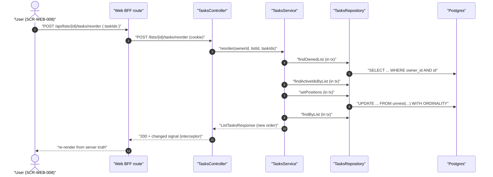

# Technical Design: FEAT-014 — Reorder active tasks within a list

> Feature from: docs/implementation-plan.md · Epic: EPIC-E — Tasks (`tasks` module)
> Implements: FR-TASK-012 · binds NFR-PERF-001, NFR-USE-004, NFR-USE-003 · also
> FR-AUTHZ-001..005 · must not regress FR-TASK-003/011 (FEAT-010/012's sections),
> FR-TASK-009/010 (FEAT-012's transitions), FR-TASK-014 (FEAT-013's restore) or
> FR-LIST-005 (FEAT-009's counts)
> Realizes: UC-010 — the *organize* half (main 2's "drags the task to reorder it
> among active tasks" and main 3's persistence). The *edit* half was FEAT-011.
> Screens: SCR-WEB-008 — designed by ui-design
> Status: Draft · Date: 2026-08-01

## 1. Intent

The list view has shown tasks in creation order since FEAT-010, and every
feature since has left that order alone. This slice makes the order the
**user's**: a manual arrangement of the active tasks in a list, persisted
server-side so it is the same order on every device (FR-TASK-012). It is the
last FR in EPIC-E and the last deferral standing in the two artifacts that
named it — `TASK_COLUMNS`' "FEAT-014 still to add to it", and
`list-view.tsx`'s drag handle, "omitted rather than faked … now down to its
last deferral".

It changes one column, one `ORDER BY`, and one INSERT, and adds one endpoint.
It does **not** touch sort *options* (SRS §3.1.6's alternatives are FR-SRCH
work, already shipped in FEAT-015 with their own keys) and it does not reorder
completed tasks — FR-TASK-012 says *active*, and the completed section's order
is FEAT-012's answer to FR-TASK-011.

## 2. Codebase context

Surveyed live at `cf89857`. What this design conforms to:

- **Last migration: 011** (`1721580000000_smart-view-index.js`, FEAT-016). The
  `tasks` table is migration 007's, extended by 009 (`due_at`, `priority`) —
  **it has no ordering column today**; active order is `created_at ASC`
  (`TasksRepository.findByList`, FEAT-010 D4).
- **The reorder pattern already exists in this repo**: FEAT-009 built
  `POST /lists/reorder` — whole-vector submission, set-equality check in the
  service, dense `0..n-1` rewrite via `unnest(...) WITH ORDINALITY` inside one
  transaction (`ListsRepository.setPositions`), full collection returned. This
  feature is that pattern applied to tasks, and deliberately does not invent a
  second one (D2).
- **Module seam**: `modules/tasks` may not import `modules/lists`
  (`.dependency-cruiser.cjs`, ADR-001). `TasksRepository.findOwnedList` reads
  the `lists` table directly — the established exception (FEAT-010 D8) — and
  this feature adds no new cross-module traffic.
- **Ownership is structural**: every statement in `TasksRepository` carries
  `WHERE owner_id = $1`; unknown / not-owned / non-uuid / soft-deleted all
  collapse into one uniform 404 (FEAT-009 D3, FEAT-011 §3.1). Kept verbatim.
- **Errors**: domain errors in `tasks.errors.ts`, mapped to HTTP in the
  controller, rendered as the `ApiError` envelope by the global filter.
  `TaskFieldInvalidError(field, requirement)` already generalizes
  "some named field failed its rule" → `400 validation_failed` with
  `fields[]` (FEAT-011 D4) — this feature reuses it rather than minting a
  fifth error class (D7).
- **Realtime**: `TasksController` is annotated
  `@UseInterceptors(ChangeSignalInterceptor)` at class level, so **every route
  it gains — including this one — publishes the per-user `changed` signal on
  success and nothing on a thrown error** (FEAT-019 D8). Its own header comment
  named FEAT-014 as one of the writes it was built to cover. No new wiring.
- **Web tier**: server components render the list view; mutations go through
  BFF routes under `apps/web/src/app/api/**` that forward the browser `cookie`
  and relay status + JSON verbatim (`app/api/lists/reorder/route.ts` is the
  model). A jest + RTL runner now exists for `apps/web` (added after FEAT-013's
  "no web unit-test runner" note — `smart-view.spec.tsx` et al. are the model).

**Document-vs-code divergence:** none found for this feature. One
document-vs-document tension is recorded in §8 (UC-010 says "drags";
design.md §5 requires a keyboard alternative; FEAT-009 D5 shipped lists'
reorder menu-driven) — it is ui-design's to resolve, and the contract below
serves either mechanism unchanged.

## 3. API contracts

### 3.1 `POST /lists/{listId}/tasks/reorder` — persist a manual order

Authenticated (`SessionGuard`; FR-AUTHZ-001). Lands on `TasksController`, whose
base path is already `lists/:listId/tasks`, so the new handler is
`@Post('reorder')`. **No route-order hazard**: the sibling routes are `@Get()`
and `@Post()` on the empty sub-path, and single-task routes live on the
separate `TaskItemController` (`/tasks/:id`) — unlike FEAT-009, which had to
declare `/lists/reorder` before `/lists/:id`.

- **Request** `ReorderTasksRequest`: `{ taskIds: string[] }` — the caller's
  **complete set of active, non-deleted task ids in that list**, in the desired
  order. Shape validated by `ReorderTasksDto`
  (`@IsArray()`, `@ArrayNotEmpty()`, `@IsUUID('4', { each: true })`, one
  message: *"Send your task ids in the order you want."*), mirroring
  `ReorderListsDto`. Set-equality is the service's job — only it can look the
  tasks up.
- **Success `200`** `ListTasksResponse` — the **full list view** in its new
  order (`list`, `active`, `completed`), so the client re-renders from the
  server's truth rather than its optimistic guess (D6). The same reason
  `POST /lists/reorder` returns the whole collection.
- **`400 validation_failed`**, field `taskIds` — one message for duplicate,
  missing, extra and foreign ids alike: *"Send every active task in this list
  exactly once, in the order you want."* One message so the response can never
  disclose that an unrecognized id exists for someone else (FR-AUTHZ-002/003;
  FEAT-009 D3's rule). Shape failures are the DTO's own
  `validation_failed` on the same field.
- **`404 list_not_found`** — the list id is unknown, owned by another user, or
  not a uuid; byte-identical in all three cases (`assertLookupId` before the
  query, then `findOwnedList`), exactly as `GET`/`POST` on this controller
  already behave.
- **`401 unauthenticated`** — no/invalid session cookie, from the guard.
- **Idempotent.** Submitting the same vector twice yields the same stored
  positions and the same response body; the whole vector is rewritten, so
  positions cannot drift or go sparse (D2).
- **Side effect**: one `changed` realtime signal on success, inherited from the
  controller's interceptor — the "persist across devices" half of FR-TASK-012's
  *observable* behaviour (the *authoritative* half is that the order lives in
  Postgres, not the client).
- **NFR-PERF-001**: one transaction, two statements (rewrite, then re-read the
  view). No per-row round trips.

### 3.2 Contract additions to existing responses

`TaskSummary` gains **`position: number`** — the 0-based rank of the task
within its list's active order. Purely additive; the field was reserved in the
shared contract's own comment ("FEAT-014 adds `position`"), and every existing
consumer reads by name (D8). It is returned by every endpoint that returns a
`TaskSummary` (list view, detail, create, complete/reopen, delete/restore,
search results, smart views) because they all map through the same
`toSummary`/row projection — the alternative, a second projection, is the drift
those single sources exist to prevent.

Completed and soft-deleted tasks carry their **stored** position (D4); the
number is only *meaningful* for active tasks, and no client is asked to
interpret it beyond rendering order.

### 3.3 Web BFF route

`apps/web/src/app/api/lists/[id]/tasks/reorder/route.ts` (POST) — forwards the
browser `cookie`, relays status + JSON verbatim, `cache: "no-store"`. Byte-for-
byte the shape of `app/api/lists/reorder/route.ts`.

## 4. Schema changes

**Migration 012 — `1721590000000_task-manual-order.js`.** One column and one
backfill, inside the **Task** entity the architecture's conceptual model
already owns (arch §8 Data; §12 Glossary). No new entity, no boundary change →
no architecture escalation.

| Change | Definition |
| :-- | :-- |
| `ALTER TABLE tasks ADD COLUMN position` | `integer NOT NULL DEFAULT 0` |
| backfill | `position` = row number − 1 **per `(owner_id, list_id)`**, ordered `created_at ASC, id ASC` |
| index | **none** — see D9 |

The backfill is chosen so that **every existing list keeps exactly the order it
has today**: `created_at ASC, id ASC` is the order `findByList` returns active
tasks in right now, so the migration is invisible to users and to FEAT-010's
verified tests (AC-13). It ranks *all* of the list's rows, completed and
soft-deleted included, so no two rows in a list share a position at rest —
which is what keeps a reopen (D4) and a restore landing somewhere
deterministic.

No uniqueness constraint on `(list_id, position)`: reorder rewrites the whole
active vector inside a transaction, and completed rows retain positions the
active rewrite does not renumber, so uniqueness would be a constraint the
design deliberately does not maintain — the same call FEAT-009 made for
`lists.position`.

**Down:** `pgm.dropColumns("tasks", ["position"])`. Reversible with no data
loss for anything outside this feature — the manual order itself is lost, which
is what dropping it means.

## 5. Component design

Every change is inside `modules/tasks` and the web tier.

**`packages/shared`** — `reorderTasksPath(listId)` (`${listTasksPath(listId)}/reorder`),
`ReorderTasksRequest`, and `position` on `TaskSummary`.

**`TasksRepository`** (`tasks.repository.ts`)
- `TASK_COLUMNS` gains `position`; `TaskRow`/`TaskRowShape`/`toTaskRow` gain the
  field. One projection stays one projection.
- `findByList` — the active branch of the `ORDER BY` changes from `created_at`
  to `position`:
  ```
  ORDER BY (completed_at IS NOT NULL) ASC,
           CASE WHEN completed_at IS NULL THEN position END ASC,
           CASE WHEN completed_at IS NULL THEN created_at END ASC,
           completed_at DESC,
           id ASC
  ```
  `created_at` is retained as the **tiebreaker** behind `position`, not
  replaced: it is what makes a reopened task's landing spot deterministic (D4)
  and what keeps the order stable if two rows ever share a position. The
  completed branch is untouched.
- `create` — appends: the INSERT takes
  `position = (SELECT COALESCE(MAX(position) + 1, 0) FROM tasks WHERE owner_id = $1 AND list_id = $2)`
  as a scalar sub-select in the same statement (still one round trip; FR-TASK-012's
  "new tasks appended to the active order by default"). The MAX is over **all**
  of the list's rows, deleted included (D5).
- `setPositions(tx, ownerId, listId, orderedIds)` — new; the `unnest(...) WITH
  ORDINALITY` rewrite `ListsRepository.setPositions` already demonstrates, with
  `list_id = $2` added to the `WHERE` so a task id from another of the caller's
  lists cannot be renumbered here.
- `findActiveIdsByList(ownerId, listId, tx)` — new; the active, non-deleted id
  set the service compares against. A dedicated statement rather than reusing
  `findByList` because the check needs ids only, and it runs inside the
  transaction.

**`TasksService`** (`tasks.service.ts`)
- `reorder(ownerId, listId, taskIds)`: `assertLookupId(listId)` →
  `db.transaction`: `findOwnedList` (→ `ListNotFoundError`), duplicate check,
  set-equality against `findActiveIdsByList` (→
  `TaskFieldInvalidError('taskIds', …)`), `setPositions`, then re-read via the
  existing `listView` composition inside the same transaction. Structurally
  `ListsService.reorder`, with the extra list-ownership hop tasks always take
  first.
- The service takes `DbService` as a constructor dependency for the first time
  in this module (it currently holds only the repository) — the same shape
  `ListsService` has had since FEAT-009.

**`TasksController`** (`tasks.controller.ts`) — `@Post('reorder')`, `@HttpCode(200)`,
`ReorderTasksDto` body, `toHttp` unchanged (it already maps
`ListNotFoundError` → 404 and `TaskFieldInvalidError` → 400 with the named
field).

**Web** — `apps/web/src/components/list-view.tsx` gains the reorder affordance
on `task-row` per ui-design's manifest, which means the active section becomes
(or gains) a client component; the BFF route of §3.3; `router.refresh()` after
a successful move, and an inline error on failure, exactly as `lists-nav.tsx`
does for lists.

**Skeleton stubs replaced:** none — the walking skeleton is long retired
(migration 008). What this feature closes are two *named deferrals*:
`TASK_COLUMNS`' comment and `list-view.tsx`'s omitted drag handle.



## 6. Acceptance criteria

- **AC-1 (FR-TASK-012; UC-010 main 2–3).** `POST /lists/{listId}/tasks/reorder`
  with the list's active task ids in a new order returns `200` with `active` in
  exactly that order, and a fresh `GET /lists/{listId}/tasks` returns the same
  order — the order is **persisted**, not echoed.
- **AC-2 (FR-TASK-012 "across devices").** A second authenticated session for
  the same user, issued independently of the one that reordered, sees the new
  order on its first read — the order lives on the server, with no client state
  involved.
- **AC-3 (FR-TASK-012 note).** A task created after a reorder appears **last**
  in the active order, and the existing order is unchanged by the creation.
- **AC-4 (FR-TASK-012).** Submitting the same vector twice returns the same
  body both times, and the stored positions are dense `0..n-1` over the list's
  active tasks after each call (idempotent, drift-free).
- **AC-5 (FR-AUTHZ-002/003; FEAT-009 D3's rule).** A vector that duplicates an
  id, omits one of the list's active tasks, adds a completed / soft-deleted /
  other-list task, or names a task belonging to another user is refused
  `400 validation_failed` on field `taskIds` with a **single, identical**
  message in every case — and nothing is written (the order is unchanged
  afterwards).
- **AC-6 (FR-AUTHZ-002/003).** An unknown list id, another user's list id, and
  a non-uuid list id each return `404 list_not_found` with byte-identical
  bodies.
- **AC-7 (FR-AUTHZ-001).** Without a valid session cookie the endpoint returns
  `401` and writes nothing.
- **AC-8 (FR-TASK-003/011, FR-TASK-009 — no regression).** Reordering leaves
  the completed section's order untouched; completing a task removes it from
  the active order while the remaining active tasks keep their relative order;
  the list's `activeTaskCount` (FR-LIST-005) is unaffected by a reorder.
- **AC-9 (FR-TASK-010 — no regression).** Reopening a completed task returns it
  to the active section at its **stored** position, ordered deterministically
  against tasks sharing that position by `created_at ASC, id ASC` — no error,
  no 500, no non-deterministic result across repeated reads.
- **AC-10 (FR-TASK-014 — no regression).** A restored task (FEAT-013) reappears
  in the active order at its stored position by the same rule, and a task
  created while it was deleted does not take its number.
- **AC-11 (NFR-PERF-001).** The reorder handler issues **one** transaction and
  no per-row statements, and completes server-side within 300 ms for a list of
  50 active tasks; the list view's own read stays within the same bound after
  the `ORDER BY` change.
- **AC-12 (NFR-USE-004; design.md §5 keyboard).** The reorder affordance on
  SCR-WEB-008 is **fully keyboard operable** — a pointer-only drag with no
  keyboard equivalent fails this criterion — and its controls carry accessible
  names, meet the 44px touch target, and show the focus ring.
- **AC-13 (FR-TASK-012; migration).** Against a database holding tasks created
  before migration 012, the first list view after the migration returns the
  **same order it returned before** (creation order), and every row has a
  distinct position within its list.
- **AC-14 (FR-SRCH-001..008 — no regression).** Search results and the four
  smart views are unaffected by a reorder: they are cross-list and sort by
  their own keys (`created_at` / `due_at`), which this feature does not touch.
- **AC-15 (NFR-USE-003).** A failed reorder (network or `400`) leaves the
  rendered list in a coherent state and surfaces an explicit error message
  rather than a silently-reverted or half-applied order.

## 7. Decisions

**D1 — `tasks.position` (an integer column), not an ordering table.**
Driver: FR-TASK-012 needs one rank per task per list; the Task entity already
owns everything else about a task (arch §8 Data), and `lists.position` set the
precedent one table over. A join/ordering table would be a new noun the domain
vocabulary does not have — the thing the schema-ownership rule forbids
inventing locally. Rejected: `float`/fractional ranks (LexoRank-style), which
buy O(1) single-row moves at the cost of rebalancing logic and a
non-obvious column; at MVP list sizes the whole-vector rewrite is simpler and
exactly matches the pattern already in the repo. Consequence: a move costs one
UPDATE over the list's active rows.

**D2 — The client submits the complete active vector; the server rewrites
`0..n-1`.** Driver: FEAT-009 D2 made this call for lists and the reasoning
carries verbatim — it is what makes the operation idempotent and keeps
positions dense. Rejected: a `{ taskId, toIndex }` patch, which is smaller on
the wire but needs the server to reconstruct the client's assumed order to
interpret it, and silently corrupts when the client's view is stale.
Consequence: a stale client is *told* (400) rather than allowed to apply a
move against an order it no longer has.

**D3 — The vector is the *active* set only.** Driver: FR-TASK-012 says
"reorder **active** tasks", and FR-TASK-011 already fixed the completed
section's order (most recently completed first) — including completed tasks
would mean two conflicting orders over one column. Consequence: completed rows
keep whatever position they last held; `setPositions` never renumbers them.

**D4 — Reopen and restore land at the *stored* position; neither writes
`position`.** Driver: FEAT-012's `setCompletion` and FEAT-013's `setDeletion`
are **verified, accepted** contracts, and their designs are explicit that
restore returns a task to "its original list and status … nothing has to be
reconstructed". Adding a position write to them would change accepted
behaviour to serve a criterion that does not ask for it. A stored position can
collide with a renumbered active row; the `created_at ASC, id ASC` tiebreaker
makes the result deterministic, which is what AC-9/AC-10 assert. Rejected:
"reopen appends to the end" — it is a *second* rule about where tasks go,
and it silently discards the arrangement the user made before completing the
task. Consequence: a reopened task appears next to where it used to be, not
necessarily at an exact index — the honest behaviour for an order the user
last expressed before the task left the section.

**D5 — `create` takes `MAX(position) + 1` over *all* the list's rows, deleted
included.** Driver: if the MAX ignored soft-deleted rows, a task created while
another sat deleted would take its number, and FEAT-013's restore would bring
back a colliding row. Counting everything makes positions monotonic at insert.
Consequence: positions are dense only immediately after a reorder, and merely
increasing between reorders — which is all the `ORDER BY` needs.

**D6 — The response is the full `ListTasksResponse`.** Driver: FEAT-009's
reorder returns the full collection so the client re-renders from server truth
(FR-LIST-008's "persist the chosen order"); the same argument holds here, and
returning the view the client is already rendering avoids a second round trip
after every move. Consequence: the reorder response and `GET` share one shape
and one code path — AC-1's "fresh GET returns the same" is a real assertion
about the store, not about two serializers agreeing.

**D7 — Reuse `TaskFieldInvalidError`, mint no new error class.** Driver: the
class already carries `(field, requirement)` and the controller already renders
it as `validation_failed` + `fields[]` (FEAT-011 D4); a `TaskOrderInvalidError`
would be a fifth class with an identical HTTP mapping. Rejected: mirroring
`ListOrderInvalidError` for symmetry — symmetry with the *response* is what
matters, and that is preserved. Consequence: `tasks.errors.ts` is unchanged.

**D8 — `position` is added to `TaskSummary` for every endpoint, not just the
list view.** Driver: one row projection (`TASK_COLUMNS`) and one wire mapper
(`toSummary`) serve all seven task-returning endpoints; a position-only variant
would be the drift those single sources exist to prevent, and the shared
contract already reserved the field. Consequence: search results and smart-view
rows carry a `position` they do not sort by — documented in the contract as
meaningful only within a list's active order.

**D9 — No new index in this migration.** Driver: `tasks_active_by_list_idx`
(partial, on `list_id`, active-only) already narrows the list view's read to
one list's active rows, and the sort has been an unindexed top-N over that
handful since FEAT-010 — the `ORDER BY` key changing from `created_at` to
`position` does not change the plan shape or the row count. Adding
`(list_id, position)` speculatively would be gold-plating of exactly the kind
FEAT-016 D3 disciplined itself against by measuring first. Consequence: the
verification task **measures** the list view under NFR-PERF-001 and records the
number; if it exceeds the bound, the index is added *then*, with the
measurement that justified it.

## 8. Escalations & open items

- **No architecture escalation.** One column inside the existing Task entity;
  no new entity, no ownership or consistency-boundary change (§4).
- **No plan correction.** The plan's FEAT-014 row (FR-TASK-012, UC-010,
  SCR-WEB-008, "task reorder endpoint", Task) matches this design exactly.
- **Open for ui-design — the reorder mechanism.** Three documents point in
  slightly different directions and one of them is the *design system*, so
  this is a decision, not a gap: UC-010 main 2 says "drags the task"; design.md
  §4 gives `task-row` a drag handle at `≥lg`; design.md §5 requires
  drag-reorder to have a keyboard alternative (move up/down); and FEAT-009 D5
  shipped lists' reorder **menu-driven only** (move up / move down), which is
  the accessible baseline this product already has and tests. **The contract in
  §3 serves any of them unchanged** — every mechanism produces a complete
  ordered vector. ui-design owns the choice; AC-12 binds it to full keyboard
  operability whichever way it goes, and a drag-only implementation fails
  acceptance.
- **Not in scope, recorded so it is not mistaken for an omission:** sort
  *options* (SRS §3.1.6) belong to FR-SRCH and shipped in FEAT-015 with their
  own keys; smart views (FEAT-016) are cross-list and keep their own order
  (AC-14); FR-TASK-012 scopes manual order to *within a list*, so moving a task
  *between* lists is not this feature's (no FR asks for it in the MVP).
