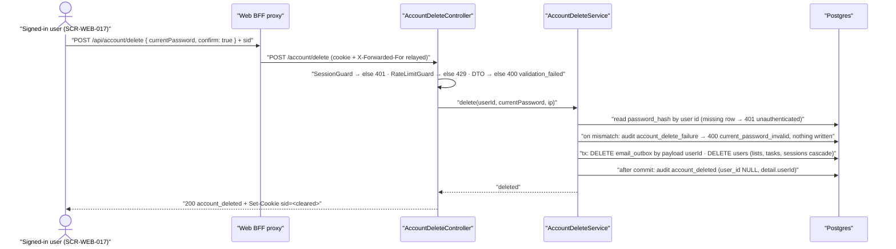

# Technical Design: FEAT-018 — Delete account (confirm + password re-entry)

> Feature from: docs/implementation-plan.md §3 · Epic: EPIC-G — Account Data & Privacy (`account-data` module)
> Implements: FR-DATA-003, FR-DATA-004, FR-DATA-005, FR-DATA-006, NFR-USE-002 (partial), NFR-COMP-001 (partial) · Realizes: UC-016 · Screens: SCR-WEB-017, SCR-WEB-014 (designed by ui-design)
> Status: Draft · Date: 2026-08-01

## 1. Intent

A signed-in user permanently destroys their account and everything the product
holds for them — lists, tasks (including the soft-deleted ones), profile,
preferences and every live session — after re-entering their password and
confirming explicitly (FR-DATA-003, FR-DATA-004, FR-DATA-005). The address they
registered with becomes free to register again. It is the second half of EPIC-G's
privacy pair: FEAT-017 gave the user a way to keep their data, and this feature
is the one that takes it away, which is why the plan sequenced export first
(NFR-COMP-001).

It is next because Phase 4 opens with FEAT-017 (verified) and continues here;
only FEAT-020 (the purge job) remains after it.

## 2. Codebase context

Surveyed at commit `ce8b610` (migration 012, `1721590000000_task-manual-order`).
What this design conforms to:

**Module shape.** `account-data` already exists — FEAT-017 minted it
(controller + service + repository + framework-free errors + `toHttp` in the
controller, module registered in `app.module.ts`). This feature is the second
capability in that module, and `src/modules/README.md` already reserves the row
(`account-data` | FR-DATA-* | FEAT-017, FEAT-018). No new module.

**Contract conventions in force** (unchanged from FEAT-017 §2, restated only
where this feature leans on them):
- Paths and wire types live in `@todo/shared`; both tiers import them.
- Error envelope `ApiError { statusCode, code, message, fields? }`, rendered by
  the global `HttpExceptionFilter`.
- Authenticated routes carry class-level `@UseGuards(SessionGuard)` and read the
  caller through `@CurrentUser()`; the subject is **never** taken from the body
  (FR-AUTHZ-001/004).
- Password-verifying routes additionally carry `RateLimitGuard`
  (`auth.controller.ts` change-password) and translate a bad current password to
  **400 `current_password_invalid`**, not 401 (FEAT-006 D3).
- Cookie writes go through `session.constants.ts`
  (`sessionCookieOptions` / `clearSessionCookieOptions`); the sign-out
  controller is the model for clearing.

**Current schema** (migrations 001–012) — and this is the part that matters
most here, because three earlier features already built this feature's
mechanism:
- `lists.owner_id → users(id) ON DELETE CASCADE` (migration 002)
- `tasks.owner_id → users(id) ON DELETE CASCADE` and
  `tasks.list_id → lists(id) ON DELETE CASCADE` (migration 006)
- `sessions.user_id → users(id) ON DELETE CASCADE` — whose migration comment
  reads *"delete-account terminates sessions (FR-DATA-005)"* (migration 005)
- `audit_log.user_id → users(id) ON DELETE SET NULL` — *"preserve the security
  log past account deletion"* (migration 005)
- `users_email_key` — a **unique index on `users.email`**, so removing the row
  is itself the act that frees the address (FR-DATA-005); there is no
  "disassociate" step to write.
- `email_outbox` — **no foreign key to `users`**. Rows carry `recipient` (the
  user's email address) and `payload` jsonb `{ token, userId }`. Nothing
  cascades them; §4 and D5 deal with this.
- `auth_rate_buckets` — keyed `(ip, route, window_start)`. Holds no user
  reference and is deliberately left alone (deleting an account must not reset
  an attacker's throttle).

**Cross-module reality that shapes §5.** `npm run boundaries` forbids
`modules/account-data` importing `modules/auth` — so `PasswordHasher`, which
today lives at `modules/auth/password-hasher.ts`, is not reachable from this
feature's code. Reading another module's *tables* is established and allowed
(FEAT-017 §2; `search` reads `lists`), so reading `users.password_hash` from
this module's own repository is fine — it is only the Argon2id verification
*code* that needs a home both modules can see. D2 resolves it.

**Divergence found:** none. The documents and the code agree; the cascades the
architecture and prior migrations promised are all present and correct.

## 3. API contracts

### 3.1 `POST /account/delete`

Deletes the **caller's own** account. Single-subject, like the export: no id in
the path, the query or the body, so no request shape exists that addresses
another account (FR-AUTHZ-004).

| | |
| :-- | :-- |
| Path constant | `ACCOUNT_DELETE_PATH = "/account/delete"` (`@todo/shared`) |
| Method | `POST` |
| Auth | `SessionGuard` (FR-AUTHZ-001) + `RateLimitGuard` per IP (D9) |
| Idempotency | Not idempotent by design; a repeat lands on `401` (the session died with the account — D6's concurrency note) |
| Side effects | Irreversible deletion; all sessions revoked; session cookie cleared |

**Request body**

```jsonc
{
  "currentPassword": "…",  // required, non-empty; the caller's current password
  "confirm": true          // required; must be the literal true (D3)
}
```

Field name `currentPassword` is inherited verbatim from `ChangePasswordRequest`
(FEAT-006) — the same fact, so the same name.

**Success — `200`**

```jsonc
{ "status": "account_deleted" }
```

plus `Set-Cookie` clearing the session cookie
(`clearSessionCookieOptions`, the sign-out mechanism — FEAT-004). The response
body is small and deliberately says nothing about what was deleted: the account
is gone, and a count of destroyed rows is data about a user we no longer hold.

**Errors**

| Status | `code` | When | Traces to |
| :-- | :-- | :-- | :-- |
| 400 | `validation_failed` | `currentPassword` missing/empty, or `confirm` is not the literal `true`; `fields[]` names the offender | FR-DATA-004; NFR-USE-002 |
| 400 | `current_password_invalid` | the password does not verify — **nothing is deleted**; `fields[{ field: "currentPassword" }]` | FR-DATA-004; UC-016 alt 3a |
| 401 | `unauthenticated` | no session cookie, expired, revoked — **or** the session resolved but its user row is already gone (a concurrent second delete) | FR-AUTHZ-001; UC-016 precondition |
| 429 | `rate_limited` (+ `retryAfterSeconds`) | per-IP window exceeded | NFR-SEC-006; D9 |
| 500 | `internal_error` | the deletion transaction failed — it rolled back, so the account is intact | NFR-REL-004 |

There is no 404 and no 403: the only subject is the caller, and "your account is
gone" is returned as 401 because to a caller it is the same fact as an invalid
session (the rule `AccountNotFoundError` already carries from FEAT-017 §3.1).

### 3.2 Shared types (`@todo/shared`, FEAT-018 block)

```ts
export const ACCOUNT_DELETE_PATH = "/account/delete";

export interface DeleteAccountRequest {
  currentPassword: string;
  /** Must be the literal `true` — the explicit confirmation FR-DATA-004
   *  requires of the *system*, not only of the screen (D3). */
  confirm: true;
}

export interface DeleteAccountResponse {
  status: "account_deleted";
}
```

`current_password_invalid` is **not** re-minted: the existing
`AUTH_ERROR_CODES.currentPasswordInvalid` is reused, because it is the same
condition FEAT-006 named. `ACCOUNT_EXPORT_FORMAT_VERSION` stays `1` — this
feature changes no export shape (FEAT-017 §8 watch item 2, explicitly
discharged).

## 4. Schema changes

**None — and here is why.**

Every table this feature must empty already cascades from `users`, by
construction, in migrations written by FEAT-001, FEAT-003 and FEAT-009 that
named FR-DATA-005 and delete-account in their comments:

| Rows | Mechanism | Entity |
| :-- | :-- | :-- |
| `lists` | `owner_id` FK `ON DELETE CASCADE` | List |
| `tasks` | `owner_id` FK `ON DELETE CASCADE` (and `list_id` cascade behind it) — includes soft-deleted rows, which are ordinary rows here | Task |
| `sessions` | `user_id` FK `ON DELETE CASCADE` → FR-DATA-005 termination | Session |
| `users` | the `DELETE` itself; the unique `users_email_key` frees the address | User |
| `audit_log` | `user_id` FK `ON DELETE SET NULL` — rows survive, anonymized (NFR-SEC-009 retention; D6) | audit_log |

The one table with no FK is `email_outbox` (EmailOutbox). Its rows hold the
user's email address in `recipient` and their id in `payload->>'userId'`, so
"all associated data" (FR-DATA-003) and data minimization (NFR-COMP-001) are not
satisfied by the cascade alone. They are deleted explicitly inside the same
transaction (D5):

```sql
DELETE FROM email_outbox WHERE payload->>'userId' = $1;
```

No index is added for that predicate: it runs once, per account deletion, over a
table the FEAT-020 purge path keeps small — adding an index to serve the rarest
statement in the system would be gold-plating (revisit if the outbox ever grows
unbounded).

**Rollback story:** nothing to roll back — there is no migration. The absence is
itself a design claim, and AC-2 is what proves it (every table empty after one
`DELETE`, with no application-level per-table deletes to keep in step).

## 5. Component design

### 5.1 API

```
apps/api/src/
  common/crypto/password-hasher.ts        ← MOVED from modules/auth (D2)
  modules/account-data/
    account-delete.controller.ts          ← new: POST /account/delete
    account-delete.service.ts             ← new: verify → delete → audit
    account-delete.repository.ts          ← new: credential read + the deletion tx
    dto/delete-account.dto.ts             ← new: class-validator DTO
    account-data.errors.ts                ← extended: CurrentPasswordInvalidError
    account-data.module.ts                ← extended: new providers
```

**`AccountDeleteRepository`** — two statements, no cleverness:
- `findCredential(userId): Promise<{ passwordHash: string } | null>` —
  `SELECT password_hash FROM users WHERE id = $1`; `null` when the row is gone.
- `deleteAccount(userId): Promise<boolean>` — one `db.transaction`:
  `DELETE FROM email_outbox WHERE payload->>'userId' = $1`, then
  `DELETE FROM users WHERE id = $1`, returning whether the user row was
  actually deleted (`rowCount === 1`). Everything else falls out of the FK
  cascades inside the same transaction, which is what makes the whole
  destruction atomic (ADR-003): if any of it fails, none of it happened.

**`AccountDeleteService`** — the order is the design:
1. `findCredential`; `null` → `AccountNotFoundError` (→ 401).
2. `hasher.verify(passwordHash, currentPassword)`; false → record
   `account_delete_failure` (carrying `userId` — the user still exists) and
   throw `CurrentPasswordInvalidError` (→ 400). **Nothing has been written.**
3. `deleteAccount(userId)`; a `false` return (someone else deleted it between
   steps 1 and 3) → `AccountNotFoundError` (→ 401).
4. **After the commit**, record `account_deleted` with `userId: null` and
   `detail: { userId }` — see D6; the FK makes any other shape impossible.

**`AccountDeleteController`** — a second `@Controller('account')` class beside
`AccountExportController`, `@UseGuards(SessionGuard, RateLimitGuard)`, `@HttpCode(200)`.
On success it clears the session cookie via
`res.clearCookie(SESSION_COOKIE, clearSessionCookieOptions(config.cookieSecure))`
and returns `{ status: 'account_deleted' }`. `toHttp` maps the two domain errors
onto §3.1. **No `ChangeSignalInterceptor`** — D7.



**Audit events** added to `AUDIT_EVENTS` (`common/audit/audit.service.ts`):
`accountDeleted: 'account_deleted'` and
`accountDeleteFailure: 'account_delete_failure'`. Neither ever carries the
email, the password, or any list/task content — the rule FEAT-017's
`data_exported` set.

### 5.2 Web

```
apps/web/src/
  app/api/account/delete/route.ts            ← BFF proxy (cookie + XFF in, Set-Cookie out)
  lib/account-delete.ts                      ← requestAccountDelete(): typed result, never throws
  app/settings/security/delete/page.tsx      ← SCR-WEB-017 (server component, requireSession)
  components/delete-account.tsx              ← client island: the form + the four states
  app/settings/security/page.tsx             ← SCR-WEB-014: a third HubRow, last
```

The BFF proxy is the change-password proxy's shape, not the export's: it
forwards the session cookie **and** `x-forwarded-for` (the limiter and the audit
row need the real client IP) and relays `Set-Cookie` back so the *cleared*
cookie lands on the web origin.

`requestAccountDelete({ currentPassword })` returns
`{ ok: true } | { ok: false; reason: "invalid_password" | "unauthenticated" | "rate_limited" | "failed" }`
— typed, never throwing, mirroring `lib/account-export.ts` (NFR-REL-004).

**The confirmation is rendered in place, not navigated to (D10).** After a
`200` the session no longer exists, so any server round-trip — a `router.push`
to a protected route, a `router.refresh()` — would resolve no session and
redirect to `/signin`, replacing the "your data has been removed" message
FR-DATA-006 requires with a sign-in form. The island therefore switches to its
`confirmed` state from client state alone and offers an explicit link to
`/signin`. ui-design owns the screen; this constraint is a contract on it.

**The pre-deletion warning needs no new endpoint (D8).** The existing
`GET /lists` already returns `taskCount` per list, which counts *every* task
including soft-deleted ones — exactly the set that is about to be destroyed —
so SCR-WEB-017 can quantify the loss from a contract that has been in place
since FEAT-009.

**Skeleton stubs replaced:** none — the walking skeleton had no delete path.
The comments in `app/settings/security/page.tsx` (*"delete account (FEAT-018)
later"*, *"the card never grows a trailing rule as FEAT-018 appends its own"*)
and in `account-data.module.ts` / `account-data.errors.ts` (*"FEAT-018's
concern"*) are the placeholders this feature discharges.

## 6. Acceptance criteria

| AC | Statement | Traces to |
| :-- | :-- | :-- |
| AC-1 | **Given** a signed-in user, **when** they `POST /account/delete` with their correct `currentPassword` and `confirm: true`, **then** the response is `200 { "status": "account_deleted" }` and carries a `Set-Cookie` that clears the session cookie. | FR-DATA-003; UC-016 main 4–5 |
| AC-2 | **Given** a user holding several lists, active, completed **and** soft-deleted tasks, and more than one live session, **when** the deletion succeeds, **then** the `users`, `lists`, `tasks` and `sessions` rows for that user are all gone — zero rows on every one of those tables — after a single `DELETE FROM users`. | FR-DATA-003; §4 |
| AC-3 | **Given** the same user signed in on a **second device**, **when** the account is deleted from the first, **then** the second device's next authenticated request answers `401 unauthenticated`. | FR-DATA-005; UC-016 main 4 |
| AC-4 | **Given** a deleted account, **when** someone registers with **the same email address**, **then** registration succeeds (`201`) — the address is free and the new account shares no rows with the old one. | FR-DATA-005 |
| AC-5 | **Given** a signed-in user, **when** they post a **wrong** `currentPassword`, **then** the response is `400 current_password_invalid` with `fields[].field === "currentPassword"`, **and** nothing is deleted: their user, lists, tasks and sessions are all still present and their session still authenticates. | FR-DATA-004; UC-016 alt 3a |
| AC-6 | **Given** a signed-in user, **when** they post a correct password but omit `confirm` or send `confirm: false`, **then** the response is `400 validation_failed` naming `confirm`, and nothing is deleted. Likewise for a missing or empty `currentPassword`. | FR-DATA-004; NFR-USE-002; D3 |
| AC-7 | **Given** no session cookie, an expired one, or one revoked by sign-out, **when** `POST /account/delete` is called with a valid-looking body, **then** the response is `401 unauthenticated` and no account is deleted. | FR-AUTHZ-001; UC-016 precondition |
| AC-8 | **Given** two accounts each holding lists and tasks, **when** one is deleted, **then** the other's user, list, task, session and outbox rows are untouched and its session still authenticates. | FR-AUTHZ-002/003; FR-DATA-003 |
| AC-9 | **Given** a user with pending **and** already-sent `email_outbox` rows, **when** their account is deleted, **then** no `email_outbox` row referencing that user (`payload->>'userId'`) or their address survives, and another user's outbox rows are untouched. | FR-DATA-003; NFR-COMP-001; D5 |
| AC-10 | **Given** a deletion whose transaction fails part-way (e.g. the `users` delete raises), **then** nothing is deleted — the user, their lists, tasks and sessions are all still present, the caller's session still works, and the response is `500 internal_error`. | ADR-003; NFR-REL-004 |
| AC-11 | **Given** a successful deletion, **then** exactly one `account_deleted` audit row exists for it, it **survives** the deletion (row present after the transaction), it carries the user id in `detail` with `user_id` NULL, and it contains no email address, password or list/task content. **And** an `AuditService` whose write throws still yields `200` — the account is deleted either way. | NFR-SEC-009; D6 |
| AC-12 | **Given** a wrong-password attempt, **then** exactly one `account_delete_failure` audit row is appended, carrying the user id and the reason category — never the submitted password. | NFR-SEC-009; UC-016 alt 3a |
| AC-13 | **Given** repeated `POST /account/delete` attempts from one IP past the configured window maximum, **then** the response is `429 rate_limited` carrying `retryAfterSeconds`. | NFR-SEC-006; FR-AUTH-018 (by extension); D9 |
| AC-14 | **Given** an account at the NFR-SCAL-002 ceiling — 100 lists and 5,000 tasks — **when** it is deleted, **then** the request completes server-side within **2 s** and leaves zero rows on every one of that user's tables. | NFR-SCAL-002 |
| AC-15 | **Given** the delete screen (SCR-WEB-017) **before** confirming, **then** it states in plain language that deletion is permanent and the data cannot be recovered, quantifies what will be destroyed (lists and tasks), and offers a way to export first; **and after** a successful deletion it renders a confirmation that the account and data have been removed. | FR-DATA-006; UC-016 main 2, 5 |
| AC-16 | **Given** SCR-WEB-017, **when** the user submits a wrong password, **then** the screen renders its password-error state naming the failure, stays on the screen with the account intact, and lets them retry; **when** the user cancels instead, **then** nothing is submitted and nothing changes. | UC-016 alt 3a, alt 2a; NFR-USE-003; NFR-REL-004 |
| AC-17 | **Given** a successful deletion in the browser, **then** the confirmation is visible **while signed out** (no navigation to a protected route intervenes), and the following navigation lands on `/signin` rather than an authenticated screen. | FR-DATA-006; D10 |
| AC-18 | **Given** the Security & account hub (SCR-WEB-014), **then** it offers a **last** row reaching SCR-WEB-017, keyboard-reachable, visually marked as the destructive action, and SCR-WEB-017 links back. | UC-016 main 1; SCR-WEB-014 |
| AC-19 | Every new or changed web surface conforms to design.md §5 **in both themes**: text on `--color-danger-subtle` uses `--color-danger-text` (≥ 4.5:1 measured composited), every interactive element shows the 2px `--color-focus-ring` on `:focus-visible`, and any icon-only control is ≥ 44×44px at a touch viewport. | NFR-USE-004; DEF-006, DEF-009, DEF-011, DEF-012 |

## 7. Decisions

**D1 — Hard delete via one `DELETE FROM users`, leaning on the existing FK
cascades.**
*Driver:* FR-DATA-003 ("immediately removing the account and all associated
data"; SRS note: *irreversible, no grace period in the MVP*), and the cascades
that FEAT-001/003/009 already wrote naming this feature.
*Rejected:* application-level per-table deletes — a second, hand-maintained
inventory of "everything owned by a user" that silently rots the next time a
table is added. Also rejected: soft-deleting the user (FEAT-013's task pattern),
which would keep the email occupied and contradict FR-DATA-005.
*Consequence:* the correctness of this feature is the correctness of the schema's
FKs, so AC-2 asserts emptiness table by table rather than trusting the cascade.

**D2 — `PasswordHasher` is promoted from `modules/auth/` to
`common/crypto/`.**
*Driver:* `npm run boundaries` forbids `account-data` importing `auth`; FR-DATA-004
requires this module to verify a password; NFR-SEC-005 requires exactly one
Argon2id configuration in the system. This is the same promotion
`common/authz/sessions.repository.ts` already made, whose header comment names
*"delete-account"* as a future caller.
*Rejected:* calling `argon2.verify` directly here (two hashing configurations,
one of which will drift); moving the endpoint into `modules/auth` (splits
FR-DATA-* across two modules and contradicts the README's reservation).
*Consequence:* a mechanical import-path change in `auth.service.ts`,
`auth.module.ts` and ~8 auth spec files, plus `password-hasher.spec.ts` moving
with the class. No behavior change, no contract change — but it *is* a change
to a verified feature's internals, so the auth suite is part of this feature's
green bar.

**D3 — The body requires a literal `confirm: true` beside the password.**
*Driver:* FR-DATA-004 says *the system* shall require an explicit confirmation —
not the screen. A confirmation that exists only as a dialog is a property of one
client; encoding it in the contract makes it testable at the API and means no
caller destroys an account with a single password field.
*Rejected:* password-only (confirmation unverifiable server-side); typing a magic
phrase like `DELETE` (a UI affordance, and one the SRS never asked for).
*Consequence:* AC-6; a 400 rather than a deletion when a client forgets it.

**D4 — A bad password is `400 current_password_invalid`, not `401`.**
*Driver:* FEAT-006 D3, verbatim: on an authenticated route a 401 means "your
session is gone" and every client redirects to sign-in — which would throw the
user out of the flow and lose the screen's state for a recoverable typo.
*Consequence:* the code is reused from `AUTH_ERROR_CODES`, not re-minted.

**D5 — `email_outbox` rows are deleted explicitly, keyed on
`payload->>'userId'`.**
*Driver:* the table has no FK to `users` (§2), and its rows hold the user's email
address; FR-DATA-003 ("all associated data") and NFR-COMP-001 (data
minimization) both reach it. Keying on the id rather than `recipient` stays
exact after the address is re-registered by someone else.
*Rejected:* leaving them (retained PII for a deleted account, and a pending
verification email that would be delivered to a freed address); adding an FK
with a cascade (a schema change to a table the worker owns, for one statement).
*Consequence:* AC-9; a `DELETE` with no supporting index, argued in §4.

**D6 — The `account_deleted` audit row carries `user_id: NULL` and
`detail: { userId }`, and is written after the commit.**
*Driver:* `audit_log.user_id` is a foreign key. An insert naming the just-deleted
user would be rejected outright, and `AuditService` swallows its own errors —
so the naive version silently records **nothing** for the single most
security-relevant event in the product (NFR-SEC-009 names account deletion
explicitly). Writing it before the delete does not help either: the cascade's
`SET NULL` would blank the column moments later.
*Rejected:* dropping the FK (weakens every other audit row); writing the email
into `detail` (retaining the identifier the deletion was supposed to release).
*Consequence:* the deletion is recorded as "an account with this pseudonymous id
was deleted, from this IP, at this time". Note the honest limit: the same
cascade anonymizes that user's *earlier* audit rows, so the id no longer joins
to anything — the surviving value is the event and its timing, which is what
retention is for. Recorded as a watch item in §8.

**D7 — No Realtime `changed` broadcast on deletion.**
*Driver:* the other devices' cue is session revocation — their next request is a
`401` and the client redirects to sign-in (FEAT-006's established behavior). The
architecture (§8) is explicit that Realtime is a best-effort optimization and
never a source of truth; hanging a security-relevant effect off it would invert
that. There is also nothing left to refetch.
*Consequence:* `AccountDeleteController` carries no `ChangeSignalInterceptor`, the
same as the export controller and for a different reason.

**D8 — The pre-deletion warning quantifies the loss from `GET /lists`.**
*Driver:* NFR-USE-002 and FR-DATA-006 want the user to know what they are
destroying; `ListSummary.taskCount` already counts every task in a list
including soft-deleted ones, which is precisely the doomed set (FEAT-009 D8
minted it for exactly this kind of confirmation).
*Rejected:* a new "deletion preview" endpoint — a whole contract for a number
the client already has.

**D9 — The endpoint is rate-limited per IP.**
*Driver:* it verifies a password, so it is a credential-guessing surface;
FEAT-006 applied the same guard to change-password as defense in depth
(NFR-SEC-006). This is a deliberate contrast with FEAT-017 D10, which left the
export unthrottled — the export verifies no credential.
*Consequence:* AC-13; the per-IP axis is inherited with its known limitation
(FEAT-017 §8 watch item 1 still stands: no per-user axis exists).

**D10 — The post-deletion confirmation is client-rendered, never navigated to.**
*Driver:* FR-DATA-006 requires informing the user **after** deletion, at the exact
moment their session stops existing; every server-rendered screen in the
authenticated zone redirects to `/signin` when the session does not resolve
(`requireSession`, FEAT-006 ui-design D4).
*Rejected:* a public `/account-deleted` route — a new unauthenticated screen the
UX inventory never minted (SCR-WEB-017's own `confirmed` state is the designed
answer), reachable by anyone at any time.
*Consequence:* AC-17, and a hard constraint handed to ui-design: the island must
not `router.refresh()` or push to a protected route after success.

## 8. Escalations & open items

**Architecture amendments filed:** none. No new entity, no ownership change, no
boundary change. D2 moves a class *within* the API's own cross-cutting layer,
which is the layer's purpose.

**Plan corrections suggested:** none. The plan's FEAT-018 row (FRs, UC, screens,
endpoint, data) matches this design as designed; the folder slug is
`FEAT-018-delete-account`.

**Discharged from FEAT-017 §8:** watch item 2 — this feature changes no export
shape, so `ACCOUNT_EXPORT_FORMAT_VERSION` correctly stays `1`. Watch item 3
(no import path) is why AC-15 requires the screen to offer export first.

**Carried defects that bind implementation** (not this feature's to fix):

- **DEF-002 (open)** — the api suite is ~8% flaky, and *not* parallel-only. Run
  it serially: `npm test -w @todo/api -- --runInBand`. A red parallel run must be
  re-checked serially before it is attributed to this feature.
- **DEF-006 / DEF-009 / DEF-011 / DEF-012 (closed, guarded)** — the danger-tint
  pairing, the `:focus-visible` ring, the 44px touch target, and the
  both-themes/compositing contrast measurement in `e2e/tests/contrast.ts`. New
  UI must be born conforming; AC-19 is where that is checked, **in both
  themes**.

**Watch items** (recorded, not actioned):

1. **Deletion anonymizes the account's audit history** (D6). `SET NULL` blanks
   `user_id` on every earlier row for that user, so post-deletion the security
   log can no longer reconstruct who did what before the deletion. That is a
   defensible privacy posture and it is the choice FEAT-003 already made — but
   it is worth stating plainly, because NFR-SEC-009's 90-day retention now means
   90 days of *unattributable* rows for deleted accounts.
2. **`auth_rate_buckets` and lockout state are deliberately not cleared.**
   Deleting an account must not hand an attacker a throttle reset; a re-registration
   of the same address inherits the IP's current window. Intentional, and the
   reason there is no AC asserting the opposite.
3. **No undo, no grace period, no export-on-delete.** The SRS is explicit
   (FR-DATA-003 note). If product ever wants a 30-day tombstone, it is a
   requirements amendment, not a local change — the schema would need the
   email freed *without* the row gone, which this design deliberately does not
   support.
4. **FEAT-020 (purge job) is unaffected.** It sweeps `tasks.deleted_at` past 30
   days; a deleted account leaves it no rows to find. No coordination needed.
