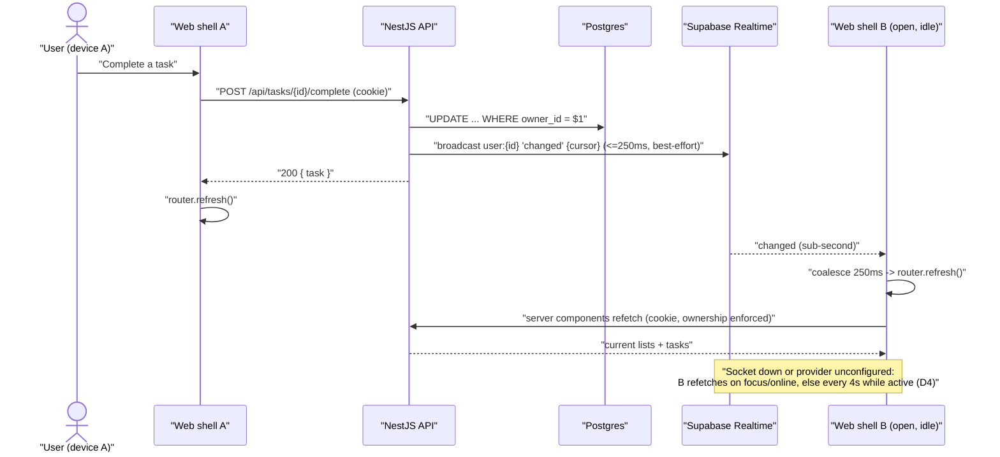

# Technical Design: FEAT-019 — Realtime cross-device sync

> Feature from: docs/implementation-plan.md §3 (EPIC-B — Platform & Sync) · Epic:
> Platform & Sync (`realtime` cross-cutting block)
> Implements: **NFR-PERF-004** (change visible on another online device < 5 s) ·
> binds NFR-REL-004 (graceful degradation), NFR-SCAL-003 (stateless app tier),
> NFR-PERF-001 (must not push writes past 300 ms), NFR-SEC-001/NFR-MAINT-003
> (secret handling), NFR-OBS-001 · also FR-AUTHZ-001/002/003 (the token is
> session-scoped and mints nothing a caller asks for)
> Realizes: UC-009 / UC-010 / UC-011 — the **sync aspect** only; every one of those
> use cases' own behaviour already shipped in FEAT-010/011/012
> Constrains: **ADR-006** (Supabase Realtime as a per-user signal, not a data
> path), ADR-002, ADR-004, ADR-005, C-5, C-6
> Screens: SCR-WEB-008 (live refresh) and, by construction, every authenticated
> screen inside the shell — see §8 on the plan's screen list and on SCR-WEB-009
> Status: Draft · Date: 2026-07-29

## 1. Intent

Every write in the system is currently visible only to the device that made it.
A task created on a laptop stays invisible on the phone until that phone is
reloaded — FEAT-013 §8 recorded exactly this ("Realtime is FEAT-019's"). This
slice closes it, and it is the last of the Phase-2 risk items: ADR-006 is the
one architectural decision that reaches outside our own containers into a
managed service we have never called.

It builds the two halves ADR-006 specifies and nothing more:

1. **A content-free per-user change signal.** On every successful write the API
   publishes `changed` to the Broadcast channel `user:{id}` — a cursor and
   nothing else. No task, no title, no id. Even a mis-scoped channel leaks
   nothing, which is the property that lets us use Realtime without Supabase Auth
   or RLS over our data (ADR-005, ADR-006).
2. **Signal-then-refetch on the client.** The web shell subscribes to its own
   channel with a short-lived token the API mints, and on a signal refetches
   **through the authenticated API** — which stays the sole enforcer of ownership.

And it ships the third thing ADR-006 names but the loop has never needed:
**the degradation path**. Refetch on focus/visibility/reconnect plus an adaptive
poll is what makes NFR-PERF-004 hold when the socket is down — and, today, when
no Supabase project is configured at all (§8). That is not a consolation prize:
it is the portability substitute ADR-006 deliberately retained, and building it
here means the *only* thing a provider swap costs later is one adapter.

**This feature adds no user-visible surface.** Nothing is inserted, no indicator,
no badge — the screen simply becomes current. §5 says where the one invisible
island mounts; ui-design's job is to confirm that and to rule on nothing (§8).

## 2. Codebase context

Surveyed live at head (post-FEAT-013; last migration **009**; API modules =
`auth`, `lists`, `tasks`; `common/*` = `authz`, `audit`, `rate-limit`,
`http-exception.filter`). The design conforms to and reuses:

- **There is no `realtime` code of any kind yet** — no module, no stub, no
  dependency. `@supabase/*` appears in no `package.json`; the API's runtime deps
  are Nest + `pg` + `argon2` + validation. This feature creates the block the
  architecture §5 already names under cross-cutting concerns.
- **No Supabase project is provisioned.** `DATABASE_URL` is the local
  docker-compose Postgres in dev, CI and E2E; `deploy/*.yaml` carry placeholder
  env refs and have never been applied. This is the single largest constraint on
  this slice and it shapes D2, D4 and the whole of §8 — not a detail, a premise.
- **`SessionGuard` attaches `req.user`** (`common/authz/session.guard.ts`) and
  `@CurrentUser()` reads it, failing loudly if the guard is absent. Both the
  token endpoint and the change-signal interceptor (D8) stand on that.
- **The ten mutating routes this feature must cover**, all already behind
  `SessionGuard`: `POST /lists`, `POST /lists/reorder`, `PATCH /lists/:id`,
  `DELETE /lists/:id` (ListsController); `POST /lists/:listId/tasks`
  (TasksController); `PATCH /tasks/:id`, `POST /tasks/:id/complete`,
  `POST /tasks/:id/reopen`, `DELETE /tasks/:id`, `POST /tasks/:id/restore`
  (TaskItemController).
- **`AuditService` is the best-effort-collaborator precedent** — *"a logging
  failure must never break the operation that triggered it"*, swallowing and
  logging its own errors. The publisher is written to the same contract (D3), and
  for a stronger reason: audit is a record, sync is an optimization.
- **`common/*` is importable by every module; `modules/*` may not import each
  other** (`.dependency-cruiser.cjs` `no-cross-module`). A publisher that both
  `lists` and `tasks` call therefore *must* live in `common/` — the boundary rule
  and the architecture's own placement agree (D2).
- **Config conventions** (`infra/config.ts`): a typed `AppConfig`, every field
  `process.env.X ?? <safe local default>`, no secrets committed (NFR-MAINT-003).
  Cloud values arrive as Cloud Run env vars at deploy time.
- **Web data flow is server-rendered.** `app/lists/[id]/page.tsx` is a
  `force-dynamic` server component; the browser mutates through the BFF proxies
  in `app/api/**/route.ts` (cookie forwarded, status + JSON relayed verbatim) and
  then calls **`router.refresh()`** — `task-checkbox.tsx`, `undo-snackbar.tsx`,
  `list-dialog.tsx` are all the same shape. **There is no client-side data store
  to reconcile**, which is why D1 can be as simple as it is.
- **`ShellFrame`** (`components/shell-frame.tsx`) is already `"use client"` and
  wraps every authenticated screen via the server-side `AppShell`. It is the
  natural and only mount point that is authenticated-zone-only (D7, AC-10).
- **`router.refresh()` preserves client state** — the pattern's whole basis in
  `task-checkbox.tsx` ("client state survives a refresh, so the box does not
  flicker"). AC-9 turns that inherited property into an assertion, because this
  feature is the first to fire refreshes the user did not ask for.
- **Divergence found: one, and it is documentary.** Architecture §6.2's sequence
  diagram draws device B refetching with `GET /tasks?since=cursor` — an endpoint
  that does not exist, was never planned, and has no FR. ADR-006's decision text
  says only *"refetches the affected data through the authenticated NestJS API"*,
  which `router.refresh()` does exactly. D1 follows the ADR and records the
  diagram as illustrative; §8 proposes the one-line correction.

**Depends on:** FEAT-003 (sessions — the token is minted off one), FEAT-009 /
FEAT-010 / FEAT-011 / FEAT-012 / FEAT-013 (the writes worth signalling).
**Consumed later by:** FEAT-014, FEAT-008, FEAT-015, FEAT-016 — all of which
inherit sync **for free** if D8's interceptor is honoured, and none of which need
to know this feature exists.

## 3. API contracts

One new endpoint. **No existing contract changes shape** — every FEAT-009..013
response, path and error code is untouched, so no prior suite is edited.

```ts
/** GET /realtime/token — connection parameters for the caller's own channel.
 *  `enabled: false` is the honest answer when no provider is configured; it is
 *  not an error, and the client falls back rather than retrying (D4). */
type RealtimeTokenResponse =
  | { enabled: false }
  | {
      enabled: true;
      /** Supabase project URL the client opens the socket against. */
      url: string;
      /** The project's publishable (anon) key — public by design; never the
       *  service-role key, which stays server-side (D5). */
      publishableKey: string;
      /** Short-lived HS256 JWT: sub = the session user, role = authenticated. */
      token: string;
      /** Always `user:{session user id}` — server-derived, never requested. */
      channel: string;
      /** ISO-8601 UTC expiry; the client re-mints at 80% of the lifetime. */
      expiresAt: string;
    };
```

### 3.1 `GET /realtime/token` — mint a channel-scoped Realtime token

- **Auth:** `SessionGuard`. The subject is **always** `@CurrentUser().id`; the
  request carries no parameters at all — no body, no query, no user id. There is
  nothing a caller can say that changes what it gets, which is what makes
  AC-6 assertable rather than aspirational (FR-AUTHZ-002/003).
- **Success `200`** `RealtimeTokenResponse`:
  - **configured** (`REALTIME_PROVIDER=supabase`) → `enabled: true` with a JWT
    signed HS256 over `SUPABASE_JWT_SECRET`, claims
    `{ sub: <user id>, role: "authenticated", iat, exp }`, `exp = now + TTL`
    (default 30 min, D5), and `channel = "user:" + <user id>`.
  - **unconfigured** (default, `REALTIME_PROVIDER=none`) → `{ enabled: false }`,
    and **nothing is minted** — no secret is read, no token is created, so a
    misconfigured environment cannot leak a half-usable credential.
- **Errors:**
  | Status | code | When | Trace |
  | :-- | :-- | :-- | :-- |
  | `401` | `unauthenticated` | No / expired / revoked session cookie | FR-AUTHZ-001 |
- **Not rate-limited**, consistent with every data endpoint: FR-AUTH-018 /
  NFR-SEC-006 scope throttling to auth endpoints. The client mints roughly twice
  an hour per tab.
- **Zero SQL of its own.** The session guard's lookup is the only statement on
  the path (the accounting FEAT-010 AC-8 established).
- **The token is not a session.** It is accepted by Supabase Realtime and by
  nothing else: the API authenticates on the `sid` cookie alone and has no code
  path that reads a bearer token (AC-6).

### 3.2 The signal (an outbound contract, not an endpoint)

Published by the API to Supabase Realtime after a successful write:

| Field | Value |
| :-- | :-- |
| topic | `user:{ownerId}` |
| event | `changed` |
| payload | `{ "cursor": "<ISO-8601 UTC instant>" }` |
| private | `true` |

Transport: `POST {SUPABASE_URL}/realtime/v1/api/broadcast` with the service-role
key in the `apikey` header and a single-element `messages` array. **The payload
is the whole contract** — a cursor and nothing else (AC-7). Nothing that could
identify a task, a list, an email, or even *which kind* of change happened
crosses this boundary. `cursor` exists for ADR-006 fidelity, log correlation and
a future `since`-refetch; the client does **not** use it to suppress work (D6).

## 4. Schema changes

**None.** No table, column or index is added or altered, and `migrations/` is
untouched. This feature stores nothing: the signal is transient, the token is
computed from the session that already exists, and the client's sync state lives
in a browser tab. The conceptual model (arch §8, ADR-003) is not approached, let
alone changed — **no architecture amendment** (§8).

One piece of SQL *is* delivered, and deliberately **not** as a migration:

- **`deploy/supabase/realtime-authorization.sql`** — the RLS policy on
  Supabase's own `realtime.messages` table that makes private channels
  topic-scoped, so a client holding a valid token for user A cannot subscribe to
  user B's channel:

  ```sql
  -- Applied against a provisioned Supabase project at setup, NOT by node-pg-migrate.
  CREATE POLICY "own user channel only"
    ON realtime.messages FOR SELECT TO authenticated
    USING ( realtime.topic() = 'user:' || (auth.jwt() ->> 'sub') );
  ```

  It lives under `deploy/` for the reason D9 gives: `migrations/` must keep
  applying to a plain Postgres (C-6, and the local docker DB every test run uses),
  and there is no `realtime` schema there. `deploy/` is the repo's existing home
  for "written, not applied" (deploy/README.md).

## 5. Component design

### API — `apps/api/src/common/realtime/` (new, cross-cutting)

- **`realtime.publisher.ts`** — the port, framework-free:
  ```ts
  interface ChangeSignal { userId: string; cursor: string }
  interface RealtimePublisher { publishChanged(userId: string): Promise<void> }
  ```
  Contract: **never throws, never blocks past its timeout**. The write it
  follows is already committed; a sync failure must degrade latency, never the
  operation (arch §8 resilience, D3).
- **`noop-realtime.publisher.ts`** — the default (`REALTIME_PROVIDER=none`).
  Returns immediately. Every local run, every CI run and every test suite uses
  it, exactly as `LogEmailPort` does for FEAT-007.
- **`supabase-realtime.publisher.ts`** — one `fetch` to the broadcast endpoint
  (§3.2) with `AbortSignal.timeout(REALTIME_PUBLISH_TIMEOUT_MS)`, a **circuit
  breaker** (3 consecutive failures → skip publishing for 30 s, then one probe),
  and structured JSON logs on failure and on breaker transitions (NFR-OBS-001).
  No Supabase SDK server-side: `fetch` against a documented HTTP endpoint keeps
  the API dependency-free and the coupling one file (D10).
- **`realtime-token.service.ts`** — HS256 minting with `node:crypto`
  (`createHmac`), base64url header/payload/signature. No JWT dependency: the
  repo already hand-rolls token crypto in `verification-token.service.ts`, and
  one HMAC is smaller than a library (D5). Exposes `mint(userId)` →
  `{ token, expiresAt, channel }` and, for tests, a `verify` helper.
- **`change-signal.interceptor.ts`** — `NestInterceptor` applied at the
  **controller** level. On a non-`GET` request that completes without throwing,
  it calls `publishChanged(req.user.id)` and only then lets the response go
  (D3/D8). An exception path publishes nothing, so a `400`/`404`/`401` never
  signals.
- **`realtime.controller.ts`** — `@Controller('realtime')`, `@Get('token')`,
  `@UseGuards(SessionGuard)`, returning §3.1. The first controller under
  `common/` — D2 says why that is the right seam rather than a `modules/realtime`
  that `lists` and `tasks` would then be forbidden to import.
- **`realtime.module.ts`** — provides the publisher via a factory bound to
  `AppConfig.realtimeProvider`, exports the publisher + interceptor, declares the
  controller. Imported by `AppModule`, `ListsModule` and `TasksModule`.

- **`infra/config.ts`** gains, all with safe local defaults (NFR-MAINT-003):
  `realtimeProvider` (`REALTIME_PROVIDER`, default `none`), `supabaseUrl`,
  `supabaseServiceRoleKey`, `supabasePublishableKey`, `supabaseJwtSecret`,
  `realtimeTokenTtlMinutes` (default 30), `realtimePublishTimeoutMs` (default
  250). The two secrets are read **only** here and in the two files above.

- **`modules/lists/lists.module.ts`, `modules/tasks/tasks.module.ts`** — import
  `RealtimeModule`; the three data controllers gain
  `@UseInterceptors(ChangeSignalInterceptor)` at class level. **No service, no
  repository and no route handler changes** — ten write paths covered by three
  lines (D8).

### Web — `apps/web/src/`

- **`app/api/realtime/token/route.ts`** — BFF proxy in the established shape
  (forward `cookie`, relay status + JSON verbatim). The browser never learns the
  API's address (ADR-002).
- **`lib/sync-schedule.ts`** — the pure, framework-free scheduler: given
  `{ connected, visible, msSinceActivity }` it returns the next poll delay —
  `null` when connected or hidden, **4 s** while visible and active, **30 s**
  after 2 minutes idle (D4). Deliberately free of React and of `window` so it is
  unit-testable the moment the web tier has a runner (§8).
- **`lib/realtime-client.ts`** — the Supabase coupling, one file: fetch the
  token, `createClient(url, publishableKey)`, `realtime.setAuth(token)`,
  `channel(channel, { config: { private: true } })`, `on('broadcast', { event:
  'changed' }, …)`, `subscribe()`. Re-mints and re-authenticates at 80% of the
  TTL; on `CHANNEL_ERROR`/`TIMED_OUT`/`CLOSED` it reports disconnected (the
  scheduler takes over) and retries with backoff. Behind a factory so the
  provider can be swapped or faked.
- **`components/sync-provider.tsx`** — `"use client"`, renders **nothing**.
  Owns: the debounce/coalesce window (250 ms), the `router.refresh()` call, the
  `visibilitychange` / `focus` / `online` listeners (each triggering an immediate
  refresh), the activity listeners feeding the scheduler, and the fallback timer.
  When `/api/realtime/token` answers `{ enabled: false }` it never opens a socket
  and runs on the fallback alone — the default configuration today.
- **`components/shell-frame.tsx`** — mounts `<SyncProvider />` once. Nothing else
  in the web tier changes: no screen, no component, no style (D7).
- **Test seam:** when `NEXT_PUBLIC_SYNC_TEST_HOOK` is set (dev/E2E only, absent
  in production builds), the provider exposes `window.__todoSync.signal()` so
  Playwright can drive the signal→refresh path deterministically without a
  socket. D4 explains why this is the honest way to get AC-1 under automation
  given §8's provisioning gap.



## 6. Acceptance criteria

- **AC-1 (NFR-PERF-004; UC-009/010/011 sync aspect — the signal path).** With a
  signal delivered to a second signed-in browser context, that context's list
  view reflects a change made in the first — a created task, a completed task, a
  deleted task, a renamed list and its counts — **within 5 s and with no user
  action**, without a full page navigation. Driven end-to-end through the
  provider's signal entry point (§5's test seam), so the client half — coalesce,
  refresh, re-render, sidebar counts — is asserted in a real browser. The socket
  *transport* itself is covered by AC-1b.
- **AC-1b (ADR-006 transport — staged, not local).** Against a provisioned
  Supabase project: a write on device A causes device B to receive `changed` on
  `user:{id}` and converge within 5 s; a client holding user A's token cannot
  subscribe to `user:{B}` (the §4 policy applied). This criterion is **explicitly
  not satisfiable in CI today** (§8) — it is a staging checklist with a recorded
  result, and acceptance verification should treat an unrun AC-1b as an open item
  rather than as a pass.
- **AC-2 (NFR-PERF-004 + NFR-REL-004 — the fallback path, fully local).** With
  `REALTIME_PROVIDER=none` (the default) or after the socket drops, a second
  signed-in context still converges on the same changes **within 5 s** while it is
  visible and active, and converges **immediately** (< 1 s, no timer wait) on
  window focus, on tab visibility returning, and on the `online` event. After 2
  minutes without activity the poll backs off to 30 s, and while the tab is
  hidden it does not poll at all — asserted at the scheduler, so "adaptive" is a
  measured property and not a comment.
- **AC-3 (the signal follows every write, and only writes).** Each of the ten
  mutating routes (§2) publishes **exactly one** signal, to
  `user:{owner id of the session}`, after the write succeeds. A request that
  fails validation (`400`), authorization (`401`) or lookup (`404`) publishes
  **none**. `GET` routes publish none. Asserted against a fake publisher at the
  controller surface, route by route — a new write route added later without a
  signal is what this criterion exists to catch.
- **AC-4 (NFR-PERF-001, NFR-REL-004 — sync never breaks or slows a write).** With
  the broadcast endpoint returning `500`, refusing connections, and hanging past
  the timeout: every write still returns its normal success response with an
  unchanged body, the response is not delayed beyond the configured timeout
  (250 ms) in the hanging case, and after 3 consecutive failures the breaker trips
  so subsequent writes pay **nothing** for 30 s. Measured: p95 write latency with
  a healthy publisher stays inside NFR-PERF-001's 300 ms.
- **AC-5 (§3.1 token).** Authenticated, configured: `200 { enabled: true, … }`
  where the JWT verifies under the configured secret, `sub` equals the session
  user's id, `role` is `authenticated`, `exp - iat` equals the configured TTL,
  `expiresAt` agrees with `exp`, and `channel` is `user:{sub}`. Unconfigured:
  `200 { enabled: false }` with **no token field present** and the signing secret
  never read. Unauthenticated (absent / expired / revoked cookie):
  `401 unauthenticated`, byte-identical to every other guarded route's.
- **AC-6 (FR-AUTHZ-002/003 — scoping is structural).** The endpoint accepts no
  parameter of any kind; with user B's session it mints `user:{B}` and there is
  no request shape that makes it mint `user:{A}`. The minted token is rejected as
  authentication by every API endpoint (presenting it as a bearer token or as a
  `sid` cookie yields `401`), so a leaked Realtime token grants a socket and
  nothing else.
- **AC-7 (ADR-006 — content-free signal).** The exact serialized broadcast body
  contains only the topic, the event name `changed`, `private: true` and
  `{ cursor }`. It contains no task id, list id, title, email, or change type —
  asserted on the captured request body, not on the call arguments.
- **AC-8 (NFR-MAINT-003 / secret hygiene).** `SUPABASE_SERVICE_ROLE_KEY` and
  `SUPABASE_JWT_SECRET` are read only inside `infra/config.ts` and
  `common/realtime/*`, appear in no response body and no log line (including the
  failure logs of AC-4), and appear nowhere in the built web client. The browser
  receives only the publishable key and its own short-lived token.
- **AC-9 (refresh is non-disruptive — the new risk this feature creates).** A
  signal arriving while the user is typing in the quick-add composer leaves the
  input's text and focus untouched; one arriving with the delete confirm dialog
  or the list dialog open leaves it open with its state; one arriving mid-write
  does not roll back an optimistic control. Two or more signals inside 250 ms
  cause **one** refresh, not two.
- **AC-10 (scope — authenticated zone only).** On `/signin`, `/signup`,
  `/verify` and `/reset-password` no token is requested, no socket opens and no
  poll runs. Signing out stops both (the shell unmounts). Hidden tabs hold no
  timer (AC-2).
- **AC-11 (NFR-OBS-001).** Publish failures, timeouts and breaker open/close
  transitions emit one structured JSON log line each, carrying the reason and the
  user id but never the payload or a secret; a healthy publish logs nothing (a
  line per write is noise at 1k concurrent users, NFR-SCAL-001).
- **AC-12 (no regression).** Every FEAT-001..013 suite passes unmodified, no
  existing contract changes shape, `npm run boundaries` is clean (the new
  `common/realtime` is imported by both data modules; no `modules/*` imports
  another), and with `REALTIME_PROVIDER` unset the system behaves exactly as it
  did before this feature — the default configuration is the pre-feature one plus
  the fallback refresh.

## 7. Decisions

- **D1 — The client refetches with `router.refresh()`; no `since`-cursor
  endpoint is built.** Driver: the web tier is server-rendered with
  `force-dynamic` and has **no client-side data store**, so "refetch the affected
  data through the authenticated API" (ADR-006's own words) is precisely one call
  that re-renders the route — list, counts, sidebar, open detail panel — through
  the cookie-authenticated API that already enforces ownership. Rejected:
  `GET /tasks?since=cursor` as drawn in arch §6.2 (a new endpoint, a new contract,
  a new pagination story and a client merge layer, all to save bytes at a data
  scale of one user's lists — and it would be the client's *second* way to read
  tasks, immediately divergent from the first); client-side subscription to
  Postgres changes (ADR-006 rejected it on security grounds — it needs RLS we do
  not use). Consequence: the signal carries a cursor that the current client does
  not spend, kept for ADR fidelity, log correlation and the day a `since` refetch
  is worth building. Documentary consequence in §8: arch §6.2's diagram is
  illustrative, not the contract.
- **D2 — The publisher is cross-cutting (`common/realtime`), controller and
  all.** Driver: `lists` and `tasks` both need it and `no-cross-module` forbids
  either importing a `modules/realtime` — the boundary rule and architecture §5's
  own placement ("Cross-cutting: … `realtime` (per-user change broadcaster)")
  point the same way. The token endpoint then lives beside its minter rather than
  in a capability module that owns no capability. Rejected: `modules/realtime`
  with the publisher re-exported through `common` (two homes for one concern, and
  the boundary checker would pass while the design lied); duplicating a
  module-local publisher in each data module (the `auth`-copies-`lists.repository`
  pattern, which is right for a *query* and wrong for a shared outbound port).
  Consequence: the first controller under `common/` — called out here so review
  reads it as deliberate. `common/` now means "cross-cutting", not "no HTTP".
- **D3 — The publish is awaited, with a hard 250 ms cap, and its failures are
  swallowed.** Driver: two facts pulling against each other. Cloud Run may
  throttle CPU once a response is sent (arch §9 ADR-004's own constraint), so a
  fire-and-forget promise can simply never run — the classic way a signal quietly
  stops arriving in production but works locally. Meanwhile NFR-PERF-001 gives
  writes a 300 ms server-side budget. Awaiting inside the request keeps the work
  on allocated CPU (and matches arch §6.2, which broadcasts before responding);
  the timeout plus the breaker keeps a sick Realtime from spending that budget —
  after 3 failures, writes pay nothing at all. Rejected: fire-and-forget (the
  throttling hazard above); no timeout (one hung dependency degrades every write);
  publishing from the worker via an outbox row (durable and ADR-007-shaped, but it
  buys durability for a signal that is explicitly best-effort, and adds up to a
  minute of latency to a 5 s requirement). Consequence: a healthy publish costs
  ~10–30 ms on the write path, measured by AC-4; a broken one costs at most
  250 ms three times per 30 s.
- **D4 — The degradation path ships in this slice, and it is what makes
  NFR-PERF-004 hold today.** Driver: no Supabase project exists (§2, §8), so a
  socket-only feature would deliver *nothing* runnable and its requirement would
  be unverifiable end to end. ADR-006 already names refetch-on-focus/reconnect
  and light polling as the retained fallback; building it here means the feature
  is real in every environment, the NFR is met in the default configuration, and
  a provider swap later costs exactly one adapter (C-6). Shape: no polling while
  connected; **4 s** while visible and active (leaving room for the round trip
  inside 5 s); **30 s** after 2 minutes idle; **nothing** while hidden; immediate
  refetch on focus / visibility / `online`. Rejected: a fixed 5 s poll always
  (marginal against the requirement and pure load at 1k concurrent users —
  NFR-SCAL-001, and the reason the original polling ADR was superseded); no
  fallback at all (fails NFR-REL-004 and leaves this slice unverifiable);
  long-polling or SSE from our own API (a stateful component ADR-006 deferred).
  Consequence: an unconfigured deployment converges in ≤ 5 s on active tabs at the
  cost of one lightweight refetch every 4 s per active tab — recorded, not hidden,
  and the reason `REALTIME_PROVIDER=supabase` is worth configuring.
- **D5 — The API mints the token itself: HS256 with `node:crypto`, 30-minute TTL,
  service-role key never leaves the server.** Driver: ADR-006 assigns the minting
  to NestJS; the claims Supabase Realtime needs are three (`sub`, `role`, `exp`),
  and one `createHmac` is smaller and more auditable than a JWT dependency — the
  same reasoning that has `verification-token.service.ts` hand-rolling its token
  crypto. A 30-minute lifetime bounds a leaked token far below the 30-day session
  (FR-AUTH-016) while costing two mints an hour per tab. Rejected: handing the
  browser the service-role key (a full-database credential in a client bundle —
  not a trade-off, a defect); a session-length Realtime token (a 30-day
  credential that no revocation path touches — sign-out revokes the session, not
  a JWT); adding `jsonwebtoken`/`jose` (a dependency for one HMAC). Consequence:
  the client must re-mint on a timer (80% of TTL) and on reconnect — owned by
  `lib/realtime-client.ts`, and the reason `expiresAt` is on the wire.
- **D6 — Signals are coalesced, never dropped.** Driver: asymmetric costs. A
  duplicate refresh costs one cheap refetch; a dropped refresh leaves a stale
  screen, which is the exact failure the feature exists to prevent — so the cursor
  is **not** used to suppress refreshes, and no ordering assumption is made about
  signals that may cross API instances with unsynchronized clocks. A 250 ms
  debounce collapses bursts (a reorder, a cascade delete) into one refresh.
  Rejected: cursor-based suppression (correctness risk for a bandwidth saving);
  self-echo suppression via a client id echoed through the signal (it would touch
  every BFF proxy to add a header, to save the originating tab exactly one
  coalesced refresh — recorded as considered and declined, revisit if write
  volume ever makes it visible). Consequence: the tab that made a write refreshes
  twice — once from its own optimistic path, once ~250 ms later from the echo.
- **D7 — One invisible island, mounted in `ShellFrame`; no connection indicator,
  no "new changes" prompt.** Driver: `ShellFrame` is already a client component
  wrapping every authenticated screen and nothing else, which gives AC-10 for
  free; and design.md specifies **no** sync, offline, stale or connection
  component — inventing one is ui-design's call to refuse, not this skill's to
  make. Rejected: mounting in the root layout (would run on `/signin` and the
  auth screens — a socket for a user who has none); a per-screen hook (five mount
  points and a sixth forgotten); a visible "reconnecting" badge (no design.md
  component, no FR, and NFR-REL-004's "clear error state" is about failed *user
  actions*, which keep their existing inline errors). Consequence: sync failure is
  silent by design — the screen simply updates later. §8 records a stale-state
  indicator as a candidate post-MVP requirement rather than a gap found later.
- **D8 — Signals are emitted by a controller-level interceptor, not by ten
  service calls.** Driver: coverage that survives the next feature. Ten explicit
  call sites are ten chances to forget, and FEAT-014 (reorder), FEAT-008
  (profile) and FEAT-016 each add more; three `@UseInterceptors` lines cover
  every current and future write on those controllers, and the exception path
  publishes nothing without anyone remembering to check. Rejected: publishing
  inside each service method (the forgettable version — and it would put an
  outbound HTTP concern inside domain services that are otherwise pure); a
  **global** interceptor (it would signal on sign-in, sign-out and password
  change — writes that change no synced data, on the one path where an extra
  outbound call is least welcome); publishing from the repository (the wrong
  layer entirely). Consequence: the signal is emitted where ownership is known
  (`req.user`) but *what* changed is not — which is exactly the content-free
  contract §3.2 wants, and one more reason the payload has nothing in it.
- **D9 — The Supabase authorization policy is delivered under `deploy/`, not in
  `migrations/`.** Driver: `migrations/` runs against the local docker Postgres in
  every dev and CI run and must stay plain-Postgres portable (C-6); there is no
  `realtime` schema there, so the policy would fail every migration run and would
  be the first non-portable statement in a chain the architecture promises is
  `pg_dump`-portable. `deploy/` is already the home for configuration that is
  written and applied by hand (deploy/README.md). Rejected: an environment-guarded
  migration (`IF EXISTS` around a provider-specific schema — portable-looking and
  silently a no-op locally, which is worse than explicit); skipping the policy on
  the grounds that the signal is content-free (true, and still: a channel a
  stranger can join is a leak of *activity timing*, and defense in depth is the
  cheap half of ADR-006's security story). Consequence: provisioning has a manual
  step, recorded in §8 and in the deploy README, and AC-1b is the criterion that
  proves it was taken.
- **D10 — `@supabase/supabase-js` is a **web** dependency only; the API speaks
  HTTP.** Driver: the API needs one `POST` to a documented endpoint — a fetch and
  a timeout — while the client needs the Phoenix/WebSocket protocol, reconnection
  and auth refresh, which is exactly what the SDK is for and precisely what
  nobody should hand-roll. Keeping the SDK out of the API also keeps the whole
  server-side coupling inside one file (§5). Rejected: the SDK on both sides (a
  dependency and a client lifecycle in a stateless request handler); a hand-rolled
  WebSocket client on the web (weeks of protocol work to avoid one dependency
  ADR-006 already accepted). Consequence: the API's Supabase coupling is one
  `fetch` call whose external contract is verified at implementation time against
  the live documentation (§8), and portability stays a one-file swap.

## 8. Escalations & open items

- **No architecture amendment.** No entity, no boundary, no schema — the
  `realtime` cross-cutting block, the per-user channel, the minted token and the
  signal-then-refetch pattern are all ADR-006's own text, and §5 builds them where
  arch §5 places them.
- **No requirements amendment.** NFR-PERF-004 is implemented as written; no FR is
  added, changed or reinterpreted.
- **🚩 The blocking-ish gap: no Supabase project is provisioned, so AC-1b cannot
  be verified here.** Everything in this design runs and is tested with
  `REALTIME_PROVIDER=none` (fallback path, AC-2) and against a stub broadcast
  endpoint (AC-3/AC-4/AC-7), and the client half is driven end-to-end through the
  test seam (AC-1). What **cannot** be proven in this repo today is the socket
  itself: that Supabase accepts our minted token, that the private-channel policy
  scopes topics, and that delivery is sub-second. This is a **provisioning
  decision for the user**, not something implementation may work around:
  either (a) provision a Supabase project and supply the four env values, and
  AC-1b runs as a recorded staging check, or (b) accept the slice with AC-1b
  explicitly open — a documented, honest partial. Recommended: (b) now, (a) before
  first deploy, since ADR-006 is a first-deploy dependency anyway. Acceptance
  verification must not treat AC-1b as passed on the strength of AC-1.
- **External contract to confirm at implementation time.** The broadcast endpoint
  shape (`POST /realtime/v1/api/broadcast`, `messages[]` with
  `topic`/`event`/`payload`, `private` flag and `apikey` header) and the private-
  channel client calls (`realtime.setAuth`, `config.private`) were taken from
  Supabase's current published documentation, not from a live call. The
  implementer must re-check them against the docs before writing the adapter —
  this is the one place in the design where an external party owns the contract.
- **Plan touchpoint tightened — screens.** The plan lists SCR-WEB-008 **and
  SCR-WEB-009** for FEAT-019. SCR-WEB-009 (Smart Views) **does not exist yet** —
  it is FEAT-016's, unbuilt — so it cannot be touched here; it inherits sync
  automatically when it is built, because D8's interceptor and D7's single mount
  point are screen-agnostic. This design therefore claims SCR-WEB-008 (live
  refresh) and, by construction, every screen inside the shell. Suggested plan
  correction (implementation-planning owns the row): drop SCR-WEB-009 from
  FEAT-019's Screens cell, or annotate it "inherited when built". Nothing is
  blocked on it.
- **ui-design has almost no surface here, and that is the finding.** This feature
  adds no component, no state and no visual change (D7): its ui-design pass should
  be a **confirmation** — that a silent background refresh needs no affordance,
  that no connection/stale indicator is invented against design.md, and that
  `docs/design-manifest.json` is unchanged — plus one genuine ruling: whether the
  refresh must respect `prefers-reduced-motion` in any way (design.md §3 motion),
  which this design assumes it need not, since nothing animates.
- **`apps/web` still has no unit-test runner — and this is the fifth case,
  materially worse than the previous four.** FEAT-012 and FEAT-013 §8 both flagged
  it; here the untestable code is **timing logic the NFR depends on**
  (`lib/sync-schedule.ts` is pure and 30 lines, and would be a dozen assertions in
  any runner). Playwright can prove convergence but proves back-off and idle
  behaviour slowly and flakily. **Recommendation, and it is a real one: stand the
  web unit runner up as a foundations task before this slice is implemented** —
  otherwise AC-2's back-off half is asserted at E2E cost. Implementation may
  proceed either way; the design deliberately isolates the pure module so the
  runner can be added before *or* after without changing production code.
- **DEF-002 is open and shapes how this feature's suites are run.** The api suite
  still fails ~7–8% of parallel runs (`docs/defects.md`); run
  `npm test -w @todo/api -- --runInBand` and re-check any red parallel run
  serially before attributing it to this feature.
- **DEF-006 is open and unrelated.** Five shipped inline-alert sites remain at
  3.95:1. This feature adds no alert and must not be the slice that quietly fixes
  them — it is a web-tier accessibility pass with its own defect row.
- **The E2E harness gains a second browser context.** AC-1/AC-2 need two
  signed-in "devices". The existing specs are single-context; the new spec must
  create two contexts with separate storage state, and must keep the FEAT-009
  rate-limit trap in mind (the webServer sets no `AUTH_RATELIMIT_MAX`, so two
  registrations per run bring the per-IP limiter closer — clear
  `auth_rate_buckets` for `::1` rather than weakening a test).
- **A stale-state indicator is a candidate post-MVP requirement, not a gap.** With
  D7, a device whose socket is down and whose tab is hidden is simply out of date
  until it is looked at. That is what ADR-006 chose ("a Realtime outage degrades
  sync latency, it does not lose data"), recorded here so a later "why didn't it
  update" is a known trade-off with an owner (requirements), not a defect.
- **Carried, unresolved, and still not this feature's to fix** (FEAT-009/013
  acceptance minors): the hard-coded `44` touch-target literals, the E2E harness's
  missing `AUTH_RATELIMIT_MAX` override, and the `apps/api/tsconfig.json`
  spec-typing debt.

Verification: clean (self-check per Phase 5 — **NFR-PERF-004** covered by AC-1,
AC-1b and AC-2 and by T6/T7/T8, with AC-1b's staging limit stated rather than
papered over; NFR-REL-004 by AC-2/AC-4 and T3/T6/T7; NFR-PERF-001 by AC-4 and T3;
NFR-SCAL-003 by the design holding no server-side connection state at all (the
socket is Supabase's — ADR-004/ADR-006) and by AC-11's log-volume rule;
NFR-MAINT-003/NFR-SEC by AC-5/AC-6/AC-8 and T2/T5; NFR-OBS-001 by AC-11 and T3;
FR-AUTHZ-001/002/003 by AC-5/AC-6 and T5; UC-009/010/011's sync aspect maps to §3.2
and AC-1/AC-2 — their own flows shipped in FEAT-010/011/012 and are not re-opened;
every cited FR/UC/NFR/ADR/SCR/DEF ID resolves in `docs/srs.md`,
`docs/use-cases.md`, `docs/architecture.md`, `docs/ux-foundations.md`,
`docs/design.md`, `docs/defects.md` and the plan, except SCR-WEB-009 which
resolves but is unbuilt and is therefore excluded above; no schema change and no
new entity, so the conceptual model is untouched and no architecture amendment is
owed; `GET /realtime/token` collides with no existing route (no controller
currently serves `/realtime`); the one new dependency is web-only (D10) and the
API gains none; `common/realtime` is imported by `lists`, `tasks` and `AppModule`
only, so `no-cross-module` holds; no existing exported shape changes, so no prior
feature's contract breaks and no compat story is owed; tasks are ordered, each
with a done-when, and cover every criterion including AC-1b's staging checklist).
