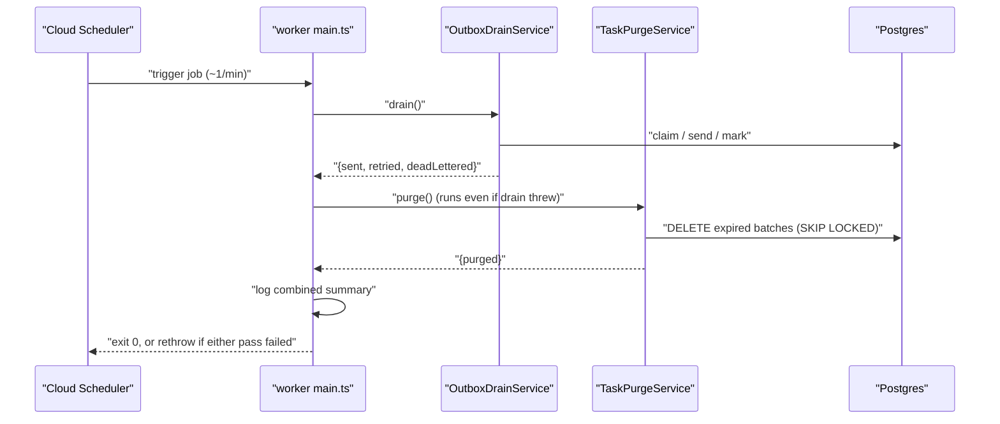

# Technical Design: FEAT-020 — Soft-deleted task purge job

> Feature from: docs/implementation-plan.md · Epic: EPIC-B — Platform & Sync
> Implements: FR-TASK-015 · Realizes: UC-012 (alternate flow 3a — the *purge*
> half; the soft-delete/undo half is FEAT-013's) · Screens: — (backend-only; no
> ui-design)
> Status: Draft · Date: 2026-08-02

## 1. Intent

FEAT-013 made task deletion recoverable: a delete stamps `tasks.deleted_at` and
the row survives, restorable indefinitely. That is deliberately half of UC-012 —
alternate flow 3a says the un-undone task is *permanently purged after the
retention period, after which it cannot be restored* (FR-TASK-015). This feature
closes that half: the existing Cloud Run Job (ADR-007) gains a purge pass that
hard-deletes tasks whose retention clock has run out, alongside the outbox drain
it already runs. It is the last feature in the plan's build sequence, and the
one that makes the 30-day retention rule in SRS §3.4 real rather than declared.

## 2. Codebase context

Surveyed 2026-08-02 @ repo head (post-FEAT-018, branch `implementation`).

- **Worker** (`apps/worker/`): a NestJS **standalone** app (Cloud Run Job).
  `main.ts` loads env (`loadEnv()`, DEF-007), builds an application context,
  runs `OutboxDrainService.drain()` once, closes the app, ends the shared pool,
  and logs a completion line. Its header comment names this feature verbatim:
  *"(FEAT-020 will add the soft-delete purge alongside.)"* — that comment is the
  stub pointer this feature resolves. FEAT-007's design §5 says the same.
- **The `CleanupService` no-op stub is gone.** FEAT-007 removed it (its T7).
  There is no purge stub left to fill — this feature adds a service beside the
  drain, it does not replace one. Anyone reading FEAT-007's §5 expecting a
  `CleanupService` to extend will not find it; that is the divergence to know.
- **DB access**: raw `pg` via `getPool()` (`src/infra/db.ts`). The worker does
  **not** use the API's `DbService`. Repositories take a `Pool` in the
  constructor and issue parameterized SQL (`OutboxRepository`).
- **Config**: `readConfig()` (`src/config.ts`) is a **pure read** of
  `process.env` with local defaults, called once at boot by `WorkerModule`'s
  `WORKER_CONFIG` factory (the DEF-008 shape). No file loading (DEF-007).
- **Schema**: `tasks` (migration 007, `lists-management`) carries
  `deleted_at timestamptz NULL` — commented *"soft delete (arch §8 Data;
  FEAT-013 writes it)"*. Migration 012 (`task-manual-order`) added
  `position`. **Last migration is 012**; this feature's is 013.
- **No FK anywhere references `tasks(id)`** — verified by grep across
  `migrations/`. A hard `DELETE` of a task row cascades to nothing and is
  blocked by nothing. The two indexes on `tasks` (`tasks_owner_list_idx`,
  `tasks_active_by_list_idx`) both exclude soft-deleted rows from the partial
  one; **no index covers `deleted_at`** today.
- **FEAT-013 explicitly deferred that index here** (its design §7 D-note:
  *"No index for the purge sweep yet. FEAT-020 will scan
  `WHERE deleted_at < now() - interval '30 days'` and that feature owns the
  index decision"*). Taken up in §4/D5.
- **Conventions inherited**: batched claim/act loops with a `MAX_ITERATIONS`
  safety cap (`OutboxDrainService`); `FOR UPDATE SKIP LOCKED` so overlapping job
  runs never contend (`OutboxRepository.claimDue`); `make_interval(...)` for SQL
  time arithmetic; structured JSON logs through Nest `Logger` (NFR-OBS-001);
  a `{counts}` summary object returned *and* logged per pass; worker tests are
  Jest integration specs against local Postgres, schema applied by
  `apps/worker/test/global-setup.js`.
- **Divergence found**: one, recorded above (the `CleanupService` stub named by
  FEAT-007's §5 no longer exists). Nothing else; documents and code agree.

**Depends on:** FEAT-013 (writes the `deleted_at` this feature reads — its
design §4/D3 establishes that `deleted_at` is *the retention clock* and is
**not** re-stamped on a repeat delete, so the window cannot be silently
extended), FEAT-007 (the job process, its config/module/entrypoint shape).
**Affects:** FEAT-014's `restore` path only at the boundary — once a row is
purged, restore is a uniform `404 task_not_found`, which is FEAT-013's already
designed behavior for an unknown id (its §3 error table names "already purged"
as one of the four collapsed cases). No FEAT-013 code changes.

## 3. Interfaces (no HTTP API — a batch job)

FEAT-020 exposes **no HTTP endpoint** and adds **no shared contract**. Like
FEAT-007, its "contract" is the job's behavior plus one internal seam:

**`TaskPurgeService.purge(): Promise<PurgeResult>`**
```ts
interface PurgeResult { purged: number; }
```
Run once per job invocation, after the outbox drain. Idempotent in the only
sense that matters: a second run with nothing expired deletes nothing and
returns `{ purged: 0 }`.

**Job entrypoint**: `main.ts` runs `OutboxDrainService.drain()` **then**
`TaskPurgeService.purge()`, both in the same invocation, each independent of the
other's failure (D4). Cloud Scheduler re-triggers ~every minute (ADR-007).

**The one API-observable consequence** is not new code but a state transition:
after purge, `POST /tasks/{id}/restore` — FEAT-013's contract — answers
`404 task_not_found`. That is the observable form of FR-TASK-015's *"after which
they cannot be restored"*, and AC-4 verifies it against the real endpoint.

## 4. Schema changes

Migration **013** (`migrations/1721600000000_task-purge-index.js`) — **no
columns, no tables**: one partial index on the existing **Task** entity
(architecture §5/§8). Physical realization only; the conceptual model is
untouched, so **no architecture amendment**.

| object | definition |
| :-- | :-- |
| `tasks_purge_due_idx` | `CREATE INDEX tasks_purge_due_idx ON tasks (deleted_at) WHERE deleted_at IS NOT NULL` |

The predicate matters as much as the key. Soft-deleted rows are a small minority
of `tasks` at any moment (they live at most 30 days, and most tasks are never
deleted), so a **partial** index stays tiny and is written to only on delete and
restore — the full index would carry a row per task for a scan that only ever
wants the deleted ones. `deleted_at` as the key gives the range scan
`deleted_at < :cutoff` directly, in oldest-first order, which is also the
purge's batch order.

**Down:** drop the index. Nothing else — the migration adds no data and destroys
none, so its down is exactly lossless (unlike migration 012's).

## 5. Component design

New under `apps/worker/src/purge/` (mirroring `src/outbox/`'s two-file shape):

- **`purge.repository.ts`** — `PurgeRepository`, raw `pg`, one operation:

  ```sql
  DELETE FROM tasks
   WHERE id IN (
     SELECT id FROM tasks
      WHERE deleted_at IS NOT NULL
        AND deleted_at < now() - make_interval(days => $1)
      ORDER BY deleted_at
      LIMIT $2
      FOR UPDATE SKIP LOCKED
   )
  ```
  `purgeExpired({ retentionDays, limit }): Promise<number>` returns `rowCount`.
  Three properties are load-bearing and each is asserted by a test:
  `deleted_at IS NOT NULL` (an active or completed task is never touched, no
  matter how old — AC-3); strict `<` against a `now()`-relative cutoff (the row
  purges the instant it passes the window, AC-1/AC-2); `FOR UPDATE SKIP LOCKED`
  (overlapping job runs partition the work instead of blocking or
  double-deleting — the convention `claimDue` established, AC-7).

- **`task-purge.service.ts`** — `TaskPurgeService.purge()`: loop
  `purgeExpired(batch)` until it returns 0, bounded by a
  `MAX_ITERATIONS = 1000` safety cap (the `OutboxDrainService` shape), summing
  into `{ purged }`; logs the structured summary
  `{"msg":"task purge complete","purged":N}` (NFR-OBS-001).

- **`config.ts`** (extended) — two settings, defaults holding the SRS §3.4
  value: `taskRetentionDays` ← `TASK_RETENTION_DAYS` (default **30**),
  `purgeBatchSize` ← `PURGE_BATCH_SIZE` (default **500**). Documented in
  `.env.example` beside the `EMAIL_*` block.

- **`worker.module.ts`** (extended) — `PurgeRepository` (inject `Pool`) and
  `TaskPurgeService` (inject `PurgeRepository`, `WORKER_CONFIG`), wired in the
  same `useFactory` style as the outbox providers.

- **`main.ts`** (extended) — runs both passes, each guarded so one failure does
  not skip the other (D4), then rethrows if either failed so the job's exit code
  stays honest:



**Stub replaced:** the forward reference in `apps/worker/src/main.ts:11`
(*"FEAT-020 will add the soft-delete purge alongside"*) — the comment is
resolved and rewritten to describe what the job now does. No `CleanupService`
exists to remove (§2).

**Nothing in `apps/api` or `apps/web` changes.** The only API-side artifact this
feature adds is a test (AC-4).

## 6. Acceptance criteria

- **AC-1 (FR-TASK-015; UC-012 alt-3a).** Given a task soft-deleted longer ago
  than the retention window, When `purge()` runs, Then the row is permanently
  gone from `tasks` (a `SELECT` by id returns zero rows).
- **AC-2 (FR-TASK-015 window; FR-TASK-014).** Given a task soft-deleted *within*
  the window, When `purge()` runs, Then the row still exists and is still
  restorable — the purge respects the retention period rather than draining
  everything soft-deleted.
- **AC-3 (FR-TASK-013 boundary).** Given tasks with `deleted_at IS NULL` — both
  active and completed — created long before the window, When `purge()` runs,
  Then none of them are deleted. Age alone never purges; only the retention
  clock does.
- **AC-4 (FR-TASK-015 irreversibility; FR-TASK-014's limit).** Given a task's
  row has been purged, When its owner calls `POST /tasks/{id}/restore`, Then the
  API answers `404` with `task_not_found` — the same uniform shape FEAT-013's §3
  specifies for an unknown id. Restore is impossible after purge, which is the
  observable meaning of "cannot be restored".
- **AC-5 (FR-TASK-015 coverage).** A soft-deleted task that had been *completed*
  before deletion purges on the same rule as one that was active — `completed_at`
  does not exempt a row.
- **AC-6 (retention configurable; SRS §3.4, which marks 30 days *(confirm)*).**
  The window is read from `TASK_RETENTION_DAYS` and defaults to **30** days; a
  run configured with a different window purges by that window.
- **AC-7 (batching and concurrency safety).** Given more expired rows than one
  batch holds, When `purge()` runs, Then all of them are purged across
  successive batches, and the loop is bounded by the safety cap; two overlapping
  purge passes neither block each other nor double-count deletions
  (`FOR UPDATE SKIP LOCKED`).
- **AC-8 (NFR-OBS-001).** Each purge pass emits one structured JSON log line
  carrying the `purged` count, and the job's completion line reports both
  passes' summaries.
- **AC-9 (ADR-007 — one job, two independent passes).** In a single job
  invocation the drain runs and the purge runs; a thrown failure in either pass
  does not prevent the other from running, and the process still exits non-zero
  when either failed.
- **AC-10 (NFR-PERF-001 pressure — the every-minute scan).** `EXPLAIN` of the
  purge's selection query shows it using `tasks_purge_due_idx`, not a sequential
  scan of `tasks`.
- **AC-11 (FR-AUTHZ blast radius).** A purge run deletes only expired
  soft-deleted task rows: other users' tasks, other tasks in the same list, and
  every row in `lists` and `users` are untouched.

## 7. Decisions

- **D1 — Retention window is configuration with a 30-day default, not a
  constant.** Driver: SRS §3.4 marks the 30-day figure *(confirm)* and Appendix B
  Q6 leaves the retention numbers as proposed defaults. Config lets the number be
  answered by ops rather than by an amendment, while the default keeps the SRS
  value as shipped behavior. Rejected: hard-coding `interval '30 days'` (turns an
  unconfirmed number into a code change).
- **D2 — Hard `DELETE`, batched, oldest first.** Driver: FR-TASK-015 says
  *permanently purge*; architecture §8 Data says *"the worker hard-deletes rows
  past 30 days"*. Batching bounds the transaction and the lock footprint on the
  pooler (arch §8 Data, connection management). Oldest-first matches the index
  order, so batches are sequential index ranges. Rejected: a single unbounded
  `DELETE` (unbounded lock/WAL burst on a backlog), and any "archive table"
  (that would be a new entity — an architecture escalation — for a requirement
  that asks for destruction, not relocation).
- **D3 — `FOR UPDATE SKIP LOCKED`, matching the outbox claim.** Driver: Cloud
  Scheduler can overlap runs when one is slow, and ADR-007 already accepted that
  possibility for the drain. Skipping locked rows lets a second run make progress
  on other batches instead of blocking behind the first. Rejected: a plain
  `DELETE ... LIMIT` (correct but blocking), and an advisory lock around the whole
  pass (serializes the job for no gain here).
- **D4 — Drain first, purge second, failures independent, exit code honest.**
  Driver: SW-002's spirit — the user-facing pass (email latency) should not be
  delayed by a maintenance sweep, and ADR-007 puts both in one job precisely so
  neither needs its own schedule. Each pass is wrapped; both always attempt; if
  either threw, the error is rethrown after both ran, so Cloud Run's
  `maxRetries: 3` sees a real failure. A retry re-running an already-successful
  drain is harmless (nothing left pending) and an already-successful purge is
  likewise a no-op. Rejected: aborting the run on the drain's failure (a broken
  email provider would silently stop retention forever — exactly the coupling
  ADR-007 exists to avoid).
- **D5 — Ship the partial index with the feature, and prove it.** Driver:
  FEAT-013 §7 deferred this decision here explicitly. This case is not FEAT-014's
  (D9, "measure first, add it later"): there the sort was a top-N over a handful
  of rows an existing partial index had already narrowed, whereas here an
  unindexed predicate would seq-scan **the whole `tasks` table** — every task of
  every user — once a minute, forever, to find a handful of expired rows. The
  cost grows with total tasks while the result set does not. The index is
  therefore included in migration 013, and AC-10/T6 make the claim falsifiable by
  reading the plan rather than asserting it in prose.
  **Measured (T6, 20,040 tasks — 20,000 live, 40 expired):** with the index,
  `Index Scan using tasks_purge_due_idx`, 43 buffers, 0.13 ms. Without it,
  `Seq Scan` + `Sort`, 20,000 *"Rows Removed by Filter"*, 372 buffers, 1.64 ms —
  ~12× the buffers and ~12× the time at a corpus this small, and the seq-scan
  side grows with total tasks while the index side tracks only the expired set.
  The claim holds.
- **D6 — Purge broadcasts no Realtime signal.** Driver: FEAT-019's `changed`
  signal exists so another device can refetch a *visible* change (NFR-PERF-004).
  A purged row was already invisible on every device — it was soft-deleted, and
  every read path filters `deleted_at`. Nothing a client could refetch differs.
  Adding a broadcast would also mean the worker taking a dependency on the
  realtime module it has never had. Rejected: broadcasting per purge run.
- **D7 — Purge is global, not per-user.** Driver: it is a system retention
  sweep, not a user operation; there is no session, no owner scope, and
  FR-AUTHZ's ownership guard governs API request paths, not batch maintenance.
  AC-11 bounds the blast radius by assertion instead.

## 8. Escalations & open items

- **No architecture amendment.** The Task entity, its `deleted_at` soft-delete,
  and "the worker hard-deletes rows past 30 days" are all already in the
  architecture (§8 Data, ADR-007). This feature adds one index and one service —
  physical realization inside an owned entity.
- **Divergence recorded (§2), not escalated:** FEAT-007's design §5 refers to a
  `CleanupService` stub for this feature to extend; FEAT-007's own T7 removed it.
  Reality wins — this feature adds a sibling service. No document is amended for
  a stale forward-reference in a completed feature's design.
- **OPEN (inherited, not blocking) — SRS Appendix B Q6:** the 30-day retention
  figure is still marked *(confirm)*. D1 makes it configuration so the answer,
  whenever it lands, is an env var rather than a code change or an amendment.
- **NOTE — no E2E task is owed.** The architecture names no critical flows in a
  cross-cutting Testing entry (it has no testing entry at all), so the E2E
  obligation computes empty — the same legitimate skip FEAT-007 recorded. The
  feature is also unreachable from a browser: it has no screens and no endpoint,
  and Playwright cannot invoke a Cloud Run Job. UC-012's user-facing half is
  already covered by `e2e/tests/delete-restore.spec.ts` (FEAT-013). AC-4, the one
  API-observable criterion, is verified in the API's integration suite instead.
- **NOTE — how AC-4 is tested honestly.** The API suite cannot run the worker.
  T7 therefore reproduces the purge's *only* effect — the row's disappearance —
  with a direct `DELETE` against the same row, then asserts the restore contract.
  That the effect is the right one is what T3 proves independently against the
  real repository. The split is recorded here so acceptance verification reads it
  as designed composition rather than a substituted assertion.
