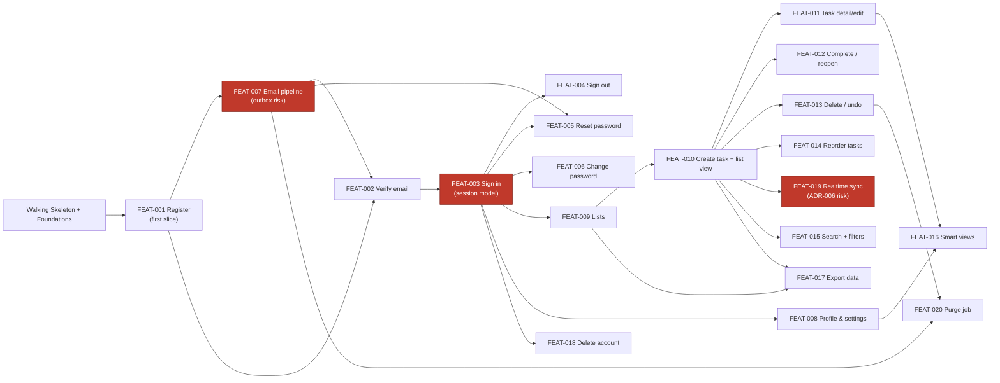
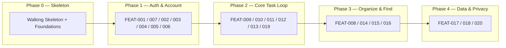

# Implementation Plan: To-Do List Application

> Status: Draft · Last updated: 2026-07-20
> Inputs: docs/srs.md (v1.0) · docs/use-cases.md · docs/architecture.md ·
> docs/ux-foundations.md — **all four found**; full-fidelity plan. Design system:
> docs/design.md + docs/tokens.json (referenced, never restated).

## 1. Overview

This plan builds the **To-Do List Application** — a private, multi-user, web-based
personal task manager (capture → organize → complete, with cloud sync across
devices). The architecture is a TypeScript modular monolith: a Next.js web tier
and a NestJS API on Cloud Run, backed by Supabase-managed Postgres, with Supabase
Realtime for cross-device sync and a transactional outbox + scheduled worker for
email and cleanup.

**Plan shape.** One straight sequence grouped into five phases — a walking
skeleton, then Auth & Account, the Core Task Loop, Organize & Find, and Data &
Privacy. It is right-sized for a solo/pair team (constraint C-3).

**Ordering priority (assumption — confirm).** The sequence optimizes for reaching
a **demoable MVP milestone** while **pulling the two architecturally-flagged risks
forward**: Supabase Realtime channel-scoping (ADR-006) and the outbox/worker email
path (ADR-007) are de-risked in the first two phases rather than late. Within those
constraints, MoSCoW priority from the SRS breaks ties (Must before Should).

**MVP cut line.** All **Must**-priority FRs land by the end of Phase 3. Phase 4
(export, delete-account, purge) completes the Must privacy set; the remaining
Should items (task reorder, resend, filter-combine, smart-view niceties) are
interleaved and can slip below the line without blocking a demoable product.

## 2. Walking Skeleton

The thinnest end-to-end path that proves the system **runs and deploys**, before
any feature.

**What's real**
- Two Cloud Run services — Next.js web + NestJS API — plus the Cleanup/Outbox
  Cloud Run Job wired to Cloud Scheduler, all deploying through the real CI/CD
  pipeline to a live environment (ADR-002/004).
- Supabase Postgres reached through the Supavisor pooler; a first versioned
  migration runs on deploy (ADR-003).
- A trivial end-to-end operation: web calls `GET /healthz/ping` on the API, which
  writes+reads one row through the pooler and returns — proving
  web → API → domain → Postgres → back over HTTPS. Liveness is the
  dependency-free `GET /healthz` (NFR-OBS-002) that does not touch the DB — both
  live in the health module. (The `/healthz/ping` proof is scaffolding, removed
  once the first real slice lands.)
- The **UI shell** (SCR-WEB-007) with the design system wired in — shadcn/ui,
  Lucide icons, `design.md`/`tokens.json` tokens, light + dark theme, the
  sidebar/content/detail layout frame — plus the generic **Error / Not Found**
  page (SCR-WEB-019). Screens land in this shell.
- Secrets as Cloud Run environment variables set at deploy time (Supabase creds,
  JWT secret, email API key); nothing in source (NFR-MAINT-003). See architecture
  §8 rev 3.

**What's stubbed**
- All business logic and domain endpoints (auth beyond a placeholder, lists,
  tasks, search, account-data).
- Email delivery (outbox table may exist; the worker's send path is a no-op until
  FEAT-007).
- Realtime broadcast (channel not yet minted until FEAT-019).
- Real screens beyond the shell and error page.

**Done when** a request flows end-to-end (web → API → Postgres → back) in a
deployed environment, the CI/CD pipeline is green with rolling zero-downtime
deploy (NFR-REL-005), and the design-system-wired shell renders in both themes.

## 3. Epic & Feature Breakdown

Epics align to the architecture's NestJS modules / building blocks (§5). Features
are vertical slices; `FEAT-NNN` IDs are minted here in definition order and are
immutable (never renumbered/recycled; removals tombstone). Near features
(Phases 1–2) are detailed; far ones carry a title plus touchpoints.

### EPIC-A — Auth & Identity (`auth` module)

| ID | Feature | FRs | UCs | Screens | Blocks/Endpoints | Data |
| :- | :------ | :-- | :-- | :------ | :--------------- | :--- |
| FEAT-001 | Register account + bootstrap Inbox + enqueue verification email | FR-AUTH-001..005, FR-LIST-003, NFR-SEC-003/005 (partial) | UC-001 | SCR-WEB-001, SCR-WEB-002 | API: `POST /auth/register`; auth module; outbox writer; Web sign-up form | User, List (Inbox), EmailOutbox |
| FEAT-002 | Verify email + resend | FR-AUTH-006, FR-AUTH-007 (partial), FR-AUTH-008, NFR-SEC-004 (partial) | UC-002 | SCR-WEB-003, SCR-WEB-002 | API: `GET /auth/verify`, `POST /auth/verify/resend`; outbox writer | User, EmailOutbox |
| FEAT-003 | Sign in — session, lockout, rate-limit | FR-AUTH-007 (partial), FR-AUTH-009, FR-AUTH-010, FR-AUTH-016, FR-AUTH-018, FR-AUTH-019, FR-AUTHZ-001 (partial), NFR-SEC-006/007 | UC-003 | SCR-WEB-004 | API: `POST /auth/login`; session issuance (opaque token cookie, ADR-005); rate-limit/lockout store | User, Session |
| FEAT-004 | Sign out | FR-AUTH-011 | UC-004 | SCR-WEB-007 (shell sign-out), SCR-WEB-010 | API: `POST /auth/logout` | Session |
| FEAT-005 | Forgot / reset password | FR-AUTH-012, FR-AUTH-013, FR-AUTH-014, FR-AUTH-017 (partial), NFR-SEC-004 (partial) | UC-005 | SCR-WEB-005, SCR-WEB-006 | API: `POST /auth/forgot`, `POST /auth/reset`; outbox writer; session invalidation | User, Session, EmailOutbox |
| FEAT-006 | Change password (signed-in) | FR-AUTH-015, FR-AUTH-017 (partial) | UC-006 | SCR-WEB-015, SCR-WEB-014 | API: `POST /auth/change-password`; session invalidation | User, Session |

### EPIC-B — Platform & Sync (cross-cutting building blocks: `outbox`, `email`, `realtime`, worker)

| ID | Feature | FRs | UCs | Screens | Blocks/Endpoints | Data |
| :- | :------ | :-- | :-- | :------ | :--------------- | :--- |
| FEAT-007 | Email delivery pipeline — outbox drain worker + `EmailPort` adapter | FR-AUTH-005 (delivery), FR-AUTH-013 (delivery); SW-001/002 | UC-001, UC-005 (exception flows) | — | Cleanup/Outbox Cloud Run Job; Cloud Scheduler; `EmailPort`; external Email Service (ADR-007) | EmailOutbox |
| FEAT-019 | Realtime cross-device sync — per-user broadcast + client refetch | (NFR-PERF-004) | UC-009/010/011 (sync aspect) | SCR-WEB-008, SCR-WEB-009 (live refresh) | API mints scoped Realtime token + broadcasts `changed` on write; Web subscribes `user:{id}` (ADR-006) | (signal only; no row data) |
| FEAT-020 | Soft-deleted task purge job | FR-TASK-015 | UC-012 (retention) | — | Cleanup/Outbox Job purge path (ADR-007) | Task |

### EPIC-C — Profile & Settings (`profile` module)

| ID | Feature | FRs | UCs | Screens | Blocks/Endpoints | Data |
| :- | :------ | :-- | :-- | :------ | :--------------- | :--- |
| FEAT-008 | View/edit profile — display name, timezone, theme | FR-PROF-001..005, NFR-LOC-001 (partial) | UC-007 | SCR-WEB-013 | API: `GET/PATCH /profile` | User (profile fields) |

### EPIC-D — Task Lists (`lists` module)

| ID | Feature | FRs | UCs | Screens | Blocks/Endpoints | Data |
| :- | :------ | :-- | :-- | :------ | :--------------- | :--- |
| FEAT-009 | List management — create, rename, reorder, delete (cascade), counts, Inbox rules | FR-LIST-001, FR-LIST-002, FR-LIST-004, FR-LIST-005, FR-LIST-006, FR-LIST-007, FR-LIST-008, FR-LIST-009 (partial), NFR-USE-002 (partial) | UC-008 | SCR-WEB-011, SCR-WEB-007 (sidebar) | API: `GET/POST /lists`, `PATCH/DELETE /lists/{id}`, reorder | List, Task (cascade) |

### EPIC-E — Tasks (`tasks` module)

| ID | Feature | FRs | UCs | Screens | Blocks/Endpoints | Data |
| :- | :------ | :-- | :-- | :------ | :--------------- | :--- |
| FEAT-010 | Create task + list view (active/completed) | FR-TASK-001, FR-TASK-002, FR-TASK-003 (partial), FR-LIST-009 (partial), NFR-USE-001 (partial) | UC-009 | SCR-WEB-008, SCR-WEB-018 | API: `POST /lists/{id}/tasks`, `GET /lists/{id}/tasks`; quick-add composer | Task, List |
| FEAT-011 | Task detail — edit title, due date, priority, overdue indication | FR-TASK-004, FR-TASK-005, FR-TASK-006, FR-TASK-007, FR-TASK-008, NFR-LOC-001 (partial) | UC-010 | SCR-WEB-010 | API: `GET/PATCH /tasks/{id}`; due-date-picker, priority-selector | Task |
| FEAT-012 | Complete / reopen task | FR-TASK-003 (partial), FR-TASK-009, FR-TASK-010, FR-TASK-011 | UC-011 | SCR-WEB-008, SCR-WEB-010 | API: `POST /tasks/{id}/complete`, `POST /tasks/{id}/reopen` | Task |
| FEAT-013 | Delete / restore task (soft-delete + undo) | FR-TASK-013, FR-TASK-014, NFR-USE-002 (partial) | UC-012 | SCR-WEB-008 (undo-snackbar) | API: `DELETE /tasks/{id}`, `POST /tasks/{id}/restore` | Task |
| FEAT-014 | Reorder active tasks within a list | FR-TASK-012 | UC-010 | SCR-WEB-008 | API: task reorder endpoint | Task |

### EPIC-F — Search, Filter & Smart Views (`search` module)

| ID | Feature | FRs | UCs | Screens | Blocks/Endpoints | Data |
| :- | :------ | :-- | :-- | :------ | :--------------- | :--- |
| FEAT-015 | Keyword search + status/due filters + empty states + pagination | FR-SRCH-001, FR-SRCH-002, FR-SRCH-003, FR-SRCH-004, FR-SRCH-005, FR-SRCH-006, FR-SRCH-009, NFR-PERF-003, NFR-USE-003 (partial) | UC-013 | SCR-WEB-012 | API: `GET /search` (query + filters, paginated); command-search | Task, List |
| FEAT-016 | Smart views — Today / Upcoming / Overdue / All | FR-SRCH-007, FR-SRCH-008, FR-SRCH-006 (partial) | UC-014 | SCR-WEB-009 | API: `GET /views/{today\|upcoming\|overdue\|all}` | Task, List |

### EPIC-G — Account Data & Privacy (`account-data` module)

| ID | Feature | FRs | UCs | Screens | Blocks/Endpoints | Data |
| :- | :------ | :-- | :-- | :------ | :--------------- | :--- |
| FEAT-017 | Export personal data (JSON) | FR-DATA-001, FR-DATA-002, NFR-COMP-001 (partial) | UC-015 | SCR-WEB-016, SCR-WEB-014 | API: `POST /account/export` | User, List, Task |
| FEAT-018 | Delete account (confirm + password re-entry) | FR-DATA-003, FR-DATA-004, FR-DATA-005, FR-DATA-006, NFR-USE-002 (partial), NFR-COMP-001 (partial) | UC-016 | SCR-WEB-017, SCR-WEB-014 | API: `POST /account/delete`; session termination; email disassociation | User, List, Task, Session |

**Coverage check result.** Every non-tombstoned **Must**-priority FR is
implemented by a slice above or placed in Engineering Foundations (§6); every
inventory screen SCR-WEB-001..019 is touched by a slice or by the skeleton/
foundations shell. No open coverage gaps — see §7 for the ledger. (No requirements
or screens are tombstoned in the sources.)

## 4. Build Sequence

Order is set by **dependency** first (auth and the identity/session model gate
every authenticated slice; lists gate tasks; tasks gate search/views and the
purge job), then **risk pulled forward** (the outbox path and Realtime scoping are
built in Phases 1–2, not last), with **MoSCoW** as the tiebreaker.

**Phase 0 — Walking Skeleton + Foundations.** §2 skeleton and the §6 foundations
(CI/CD, environments, authz guard, security baseline, design system, observability).

**Phase 1 — Auth & Account (identity foundation, highest dependency + outbox risk).**
FEAT-001 (register — **the first vertical slice**) → FEAT-007 (email pipeline,
making verification/reset delivery real and de-risking ADR-007) → FEAT-002
(verify) → FEAT-003 (sign in) → FEAT-004 (sign out), FEAT-005 (reset), FEAT-006
(change password). Reaches "a verified user can sign in and out."

**Phase 2 — Core Task Loop + Realtime de-risk (MVP core value).** FEAT-009 (lists)
→ FEAT-010 (create task + list view) → FEAT-011 (detail/edit) → FEAT-012
(complete/reopen) → FEAT-013 (delete/undo); FEAT-019 (Realtime sync) pulled in
here to break ADR-006 early against real writes.

**Phase 3 — Organize & Find + Profile (completes the Must set).** FEAT-008
(profile/timezone/theme) → FEAT-015 (search + filters) → FEAT-016 (smart views);
FEAT-014 (task reorder, Should) interleaved.

**Phase 4 — Data & Privacy + cleanup.** FEAT-017 (export) → FEAT-018
(delete account) → FEAT-020 (purge job).

Phases beyond the near term are a **living order, not a fixed commitment**
(see §7) — re-sequence as shipped slices teach us.

### Dependency graph

### Phase / milestone view

## 5. First Vertical Slice — FEAT-001: Register account + bootstrap Inbox

**Chosen** as the first slice because it is the first real thing built after the
skeleton, is genuinely demonstrable end-to-end, and is the entry point every other
flow depends on. It deliberately touches the **flagged risks**: it writes the first
transactional record through Supabase (user + Inbox list + verification outbox row
in one transaction, ADR-003/007), exercises password hashing (NFR-SEC-005) and the
breach-checked policy (NFR-SEC-003), and stands up the outbox pattern (ADR-007) so
its main uncertainty surfaces in week one. It is narrow (one form, one endpoint) yet
proves the architecture and design system work together on something real.

**User flow exercised.** ux-foundations Flow 1 (Sign up & verify, first half),
realizing UC-001: a Visitor opens Sign Up, submits email + password, and — on valid,
unique input — an unverified account is created, the default Inbox list is
provisioned, a verification email is enqueued, and a "check your email" notice is
shown.

**Acceptance criteria** (from FR statements + UC-001 flow):
- A Visitor can register with an email and a password (FR-AUTH-001).
- Registration is rejected if the email (compared case-insensitively) already exists,
  with a generic "already in use" message offering sign-in/reset — no disclosure
  beyond that (FR-AUTH-002, UC-001 alt 3a).
- A malformed email is rejected at registration (FR-AUTH-003).
- The password must satisfy the policy (≥ 10 chars, not breached); a failing password
  shows the specific requirement and lets the visitor retry (FR-AUTH-004,
  NFR-SEC-003, UC-001 alt 3b).
- On success the account is created **unverified**, a default list named "Inbox" is
  provisioned for it, and a single-use, time-limited verification email is enqueued
  in the same transaction (FR-AUTH-005, FR-LIST-003; delivery is FEAT-007).
- The password is stored only as a salted adaptive hash (NFR-SEC-005); the UI shows
  a "check your email" confirmation (SCR-WEB-002).
- If the email step's downstream delivery is unavailable, the account is still
  created and the outbox row persists for retry — registration does not fail
  (SW-002, UC-001 exception 5a).

**Screens it renders — handoff to `ui-design`:** **SCR-WEB-001** (Sign Up; states:
default, validating, field-error) and **SCR-WEB-002** (Verify Email — Notice; states:
default, resend-sent, rate-limited). These SCR IDs are the input to the downstream
**ui-design** step.

**Endpoints / data / contract needs — handoff to `detailed-design`:**
- `POST /auth/register` — body `{ email, password }`; returns a neutral
  "check your email" result (201). Enforces email-format, uniqueness
  (case-insensitive), and password policy; hashes the password (Argon2id/bcrypt).
- Transaction writes: **User** (unverified), **List** (the default "Inbox",
  owner = new user), **EmailOutbox** (verification intent with a single-use,
  time-limited token per NFR-SEC-004).
- Rate-limiting applies to the registration endpoint (FR-AUTH-018) via the
  foundations rate-limit infrastructure.
These contract/data needs are the input to the downstream **detailed-design** step.

## 6. Engineering Foundations

Stood up with the skeleton (Phase 0), derived from the architecture's cross-cutting
concepts (§8) and ux-foundations. Cross-cutting FRs placed here carry their IDs.

- **Repo & conventions.** Single repo, shared TypeScript types across web/API
  (ADR-002); enforced module boundaries via lint/dependency rules (ADR-001).
- **CI/CD & environments.** CI runs tests on every change, gating merge/release
  (NFR-MAINT-002); dev/staging/prod on the same container images with per-env
  config and **separate Supabase project each** (§7 deployment); rolling
  zero-downtime deploys (NFR-REL-005); versioned DB migrations run on deploy.
- **Authorization guard (cross-cutting).** Ownership guard scoping every data query
  to `owner_id = current_user`, uniform not-found for missing-or-forbidden,
  server-authoritative — **FR-AUTHZ-001, FR-AUTHZ-002, FR-AUTHZ-003, FR-AUTHZ-004,
  FR-AUTHZ-005**. Built with the first authenticated slice, exercised by all.
- **Security baseline (NFR-SEC-*).** TLS/HTTPS redirect (NFR-SEC-001), encryption
  at rest (NFR-SEC-002), Argon2id/bcrypt password hashing (NFR-SEC-005), password
  policy + breach check (NFR-SEC-003), opaque session cookies + CSRF + rotation
  (NFR-SEC-007), DB-backed rate-limit/lockout infra (NFR-SEC-006), OWASP Top 10
  practices + dependency scanning (NFR-SEC-008, NFR-SEC-010), and the **security
  audit log** for sign-in/password/deletion events retained ≥ 90 days
  (**NFR-SEC-009**). Secrets externalized as Cloud Run env vars (NFR-MAINT-003).
- **Observability (NFR-OBS-*).** Structured JSON logging (NFR-OBS-001), `/healthz`
  (NFR-OBS-002), latency/error metrics + alerting (NFR-OBS-003).
- **Design system & accessibility.** shadcn/ui + Lucide + `design.md`/`tokens.json`
  wired into the shell, light + dark themes; **WCAG 2.2 AA best-practice bar**
  (keyboard operability, focus, contrast, 44px targets, reduced-motion) —
  NFR-USE-004; destructive-action confirmations (NFR-USE-002) and universal
  loading/empty/error states (NFR-USE-003) as shared conventions.
- **Localization/time.** All timestamps stored UTC, displayed in the user's
  timezone (NFR-LOC-001); user-facing strings externalized, English-only MVP
  (NFR-LOC-002).
- **Portability & scale.** Containerized, stateless, horizontally scalable app tier
  (NFR-PORT-001, NFR-SCAL-003); provider touchpoints (email, secrets, scheduler,
  Realtime) behind thin adapters.
- **Test strategy.** Automated coverage ≥ 70% on core modules (auth, list/task
  CRUD), gated in CI (NFR-MAINT-001/002).

## 7. Risks & Assumptions

**Open coverage gaps:** none. Every Must-priority FR is in a slice or foundations;
every screen SCR-WEB-001..019 is touched. Ledger of the non-obvious placements:

- FR-AUTHZ-001..005 → **Foundations** (ownership guard, cross-cutting) — legitimate
  per the slicing guide; exercised by all authenticated slices.
- FR-LIST-003 (auto-create Inbox) → FEAT-001 (registration bootstrap), not FEAT-009.
- FR-TASK-015 (purge) → FEAT-020 (worker job), separate from soft-delete FEAT-013.
- SCR-WEB-007 (App Shell) and SCR-WEB-019 (Error/Not Found) → **walking skeleton /
  foundations shell**, framing all app slices.
- SCR-WEB-014 (Security & Account hub) → touched by FEAT-006, FEAT-017, FEAT-018.
- SCR-WEB-018 (Onboarding empty state) → FEAT-010 (first-run list view).

**Sequencing risks & assumptions.**
- **Ordering-priority assumption.** The "demoable MVP, risk-forward" priority (§1)
  is an inferred default; if the real driver is *fastest possible demo* or
  *unblock a specific downstream*, Phases 2–4 re-order.
- **ADR-006 Realtime channel scoping.** Pulled into Phase 2 deliberately — a
  token-scoping bug causes at worst spurious refetches (signals are content-free),
  but the mint path must be explicitly tested. Fallback: refetch-on-focus / light
  polling (portable substitute) if Realtime is unavailable.
- **ADR-007 outbox latency.** Email arrives within the scheduler interval
  (seconds–a minute); acceptable for verification/reset. Monitor the dead-letter
  count. FEAT-001 is demonstrable (account + Inbox created, "check your email"
  shown) even before FEAT-007 delivery is fully green.
- **Two managed providers in the uptime budget.** NFR-REL-001 (99.9%) depends on
  both Cloud Run and Supabase; the **Supabase plan tier must include PITR + HA** to
  satisfy NFR-REL-002/003 — confirm before launch (architecture Risks §11).
- **Postgres connection pressure** under Cloud Run fan-out even with Supavisor;
  monitor pool saturation.
- **SRS Appendix B open items** (email provider, NFR numeric targets, offline
  scope, WCAG commitment) remain product-owner confirmations; none blocks Phase 0–2.

**Living order.** Detail is front-loaded on Phases 0–2; Phases 3–4 are a planned
order, not a fixed commitment — re-sequence as construction proceeds.

---

*Handoffs from the first slice (FEAT-001): screens SCR-WEB-001, SCR-WEB-002 →
**ui-design**; endpoints/data/contract (`POST /auth/register`; User, List, EmailOutbox)
→ **detailed-design**.*
