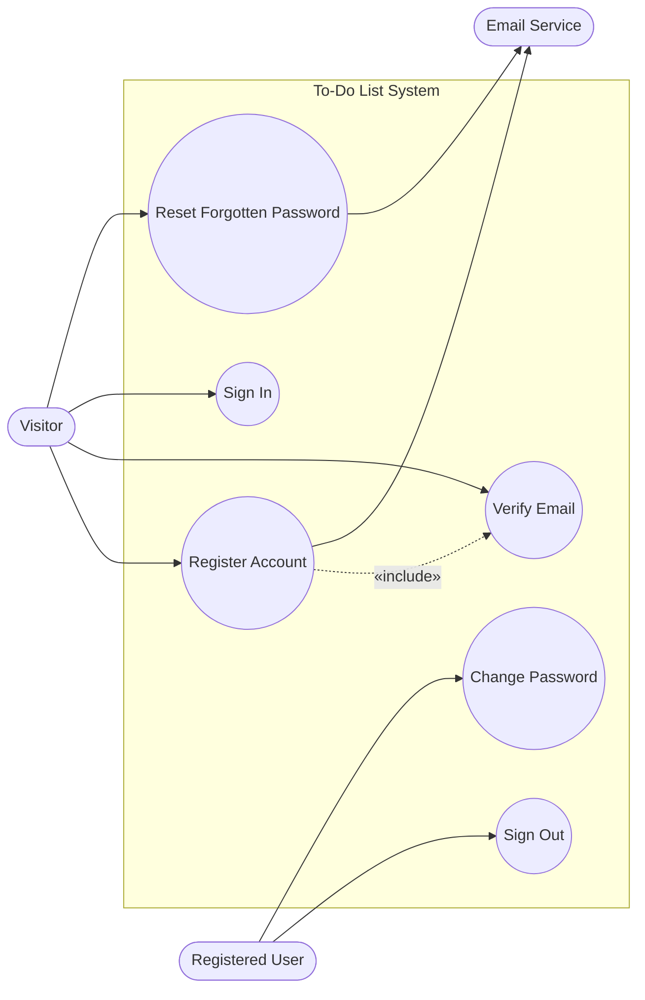
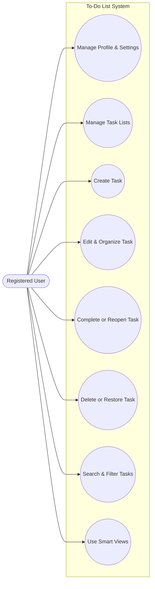
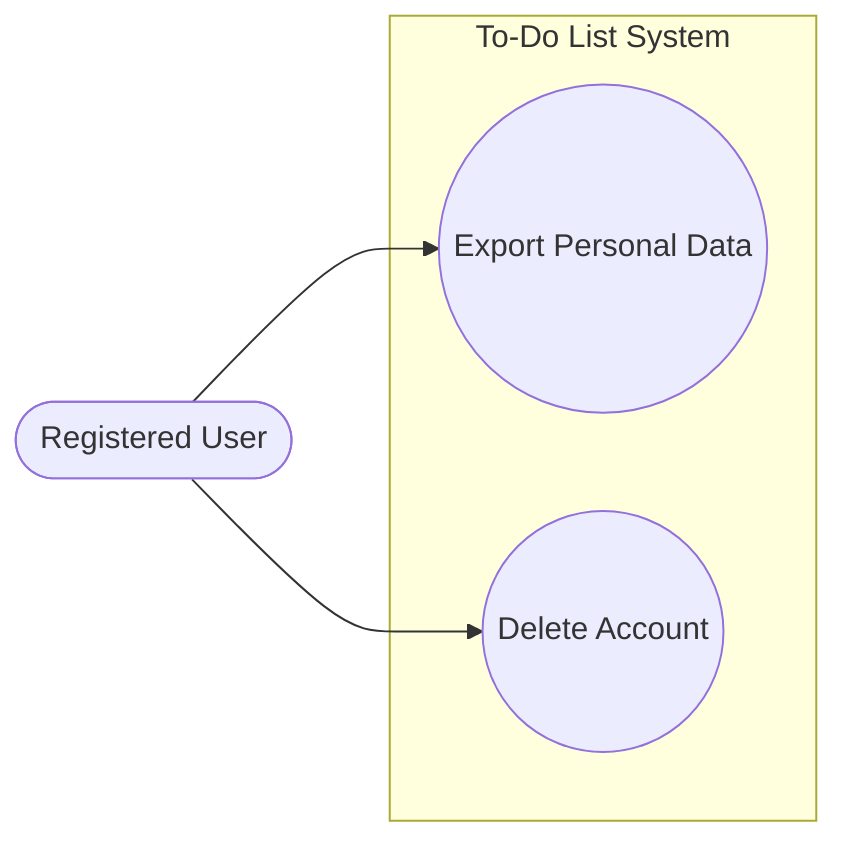

# Use-Case Specifications: To-Do List Application

> Companion to `docs/srs.md` (v0.1). Use-case-centric; each use case traces back
> to functional requirement IDs. Last updated: 2026-07-15.

**Actors**
- **Visitor** — an unauthenticated person; can only register, verify, sign in, or
  request a password reset.
- **Registered User** — an authenticated end user who owns and manages their own
  private lists and tasks.
- **Email Service** — external supporting system that delivers verification and
  password-reset messages.

**Cross-cutting note.** Authorization requirements FR-AUTHZ-001..005 (authenticated
access and per-user ownership enforcement) apply to *every* use case performed by
a Registered User and are not restated in each flow; they are exercised by all of
UC-006 through UC-016.

---

## Diagram 1 — Authentication & Account

### UC-001: Register a new account
- **ID:** UC-001
- **Actors:** Visitor (primary), Email Service (secondary)
- **Description:** A visitor creates an account so they can access the system.
- **Preconditions:** The visitor is not authenticated.
- **Postconditions (success):** An unverified account exists; a default "Inbox"
  list is created; a verification email has been sent.
- **Traces to:** FR-AUTH-001, FR-AUTH-002, FR-AUTH-003, FR-AUTH-004, FR-AUTH-005,
  FR-LIST-003, NFR-SEC-003

**Main success scenario**
1. Visitor opens the registration page.
2. Visitor submits email and password.
3. System validates email format, password strength policy, and email uniqueness.
4. System creates the account in an unverified state and provisions the default Inbox list.
5. System sends a verification email (UC-002).
6. System shows a "check your email" confirmation.

**Alternate flows**
- 3a. Email already registered → System shows an error and offers sign-in / reset (no disclosure beyond a generic "already in use").
- 3b. Password fails policy → System shows the specific policy requirement and lets the visitor retry.

**Exception flows**
- 5a. Email Service unavailable → System records the pending verification, queues the email for retry, and informs the visitor delivery may be delayed.

### UC-002: Verify email address
- **ID:** UC-002
- **Actors:** Visitor (primary)
- **Description:** A visitor confirms ownership of their email to activate the account.
- **Preconditions:** An unverified account exists.
- **Postconditions (success):** The account is marked verified and can sign in.
- **Traces to:** FR-AUTH-006, FR-AUTH-007, FR-AUTH-008, NFR-SEC-004

**Main success scenario**
1. Visitor opens the verification link from the email.
2. System validates the link is authentic and unexpired.
3. System marks the account verified.
4. System confirms success and directs the visitor to sign in.

**Alternate flows**
- 2a. Link expired/invalid → System shows an error and offers to resend a new verification email (FR-AUTH-008), rate-limited.

**Exception flows**
- 3a. Account already verified → System shows an informational message and directs to sign-in.

### UC-003: Sign in
- **ID:** UC-003
- **Actors:** Visitor (primary)
- **Description:** A verified user authenticates to access their tasks.
- **Preconditions:** A verified account exists; the user is not signed in.
- **Postconditions (success):** An authenticated session is established.
- **Traces to:** FR-AUTH-007, FR-AUTH-009, FR-AUTH-010, FR-AUTH-016, FR-AUTH-018,
  FR-AUTH-019, FR-AUTHZ-001

**Main success scenario**
1. Visitor opens the sign-in page.
2. Visitor submits email and password.
3. System verifies the credentials.
4. System establishes an authenticated session and opens the user's task views.

**Alternate flows**
- 3a. Invalid credentials → System shows a generic failure that does not reveal whether the email exists.
- 3b. Account not yet verified → System prompts to verify and offers to resend (UC-002).

**Exception flows**
- 3c. Too many failed attempts → System temporarily locks/throttles sign-in for the account and informs the user how to proceed (FR-AUTH-019).
- 2a. Rate limit exceeded → System throttles further attempts per FR-AUTH-018.

### UC-004: Sign out
- **ID:** UC-004
- **Actors:** Registered User (primary)
- **Description:** A user ends their authenticated session.
- **Preconditions:** The user is signed in.
- **Postconditions (success):** The session is terminated server-side.
- **Traces to:** FR-AUTH-011

**Main success scenario**
1. User selects sign out.
2. System invalidates the current session.
3. System returns the user to the signed-out landing/sign-in page.

### UC-005: Reset a forgotten password
- **ID:** UC-005
- **Actors:** Visitor (primary), Email Service (secondary)
- **Description:** A user who cannot sign in regains access by resetting their password.
- **Preconditions:** The user is not signed in.
- **Postconditions (success):** The password is changed; existing sessions are invalidated.
- **Traces to:** FR-AUTH-012, FR-AUTH-013, FR-AUTH-014, FR-AUTH-017, FR-AUTH-018,
  NFR-SEC-003, NFR-SEC-004

**Main success scenario**
1. Visitor opens "forgot password" and submits their email.
2. System shows a neutral confirmation regardless of whether the email exists.
3. If registered, System sends a single-use, time-limited reset link.
4. Visitor opens the link and submits a new password.
5. System validates the link and the password policy, updates the password, and invalidates existing sessions.
6. System confirms and directs the user to sign in.

**Alternate flows**
- 4a. Link expired/used → System shows an error and offers to request a new link.
- 4b. New password fails policy → System shows the requirement and lets the user retry.

**Exception flows**
- 3a. Email Service unavailable → System queues the reset email for retry.

### UC-006: Change password
- **ID:** UC-006
- **Actors:** Registered User (primary)
- **Description:** A signed-in user changes their password.
- **Preconditions:** The user is signed in.
- **Postconditions (success):** The password is updated; other sessions are invalidated.
- **Traces to:** FR-AUTH-015, FR-AUTH-017, NFR-SEC-003

**Main success scenario**
1. User opens security settings and chooses to change password.
2. User submits current password and a new password.
3. System verifies the current password and validates the new password policy.
4. System updates the password and invalidates all other sessions.
5. System confirms the change.

**Alternate flows**
- 3a. Current password incorrect → System shows an error without changing anything.
- 3b. New password fails policy → System shows the requirement and lets the user retry.

---

## Diagram 2 — Task Management

### UC-007: Manage profile & settings
- **ID:** UC-007
- **Actors:** Registered User (primary)
- **Description:** A user views and updates their display name, timezone, and theme.
- **Preconditions:** The user is signed in.
- **Postconditions (success):** Updated settings are persisted and synced across devices.
- **Traces to:** FR-PROF-001, FR-PROF-002, FR-PROF-003, FR-PROF-004, FR-PROF-005

**Main success scenario**
1. User opens profile/settings.
2. System displays current email (read-only), display name, timezone, and theme.
3. User edits display name, timezone, and/or theme and saves.
4. System validates and persists the changes and applies them.

**Alternate flows**
- 3a. Display name invalid (empty/too long) → System shows a validation error and lets the user retry.
- 4a. Timezone changed → System recomputes due/overdue status against the new timezone.

### UC-008: Manage task lists
- **ID:** UC-008
- **Actors:** Registered User (primary)
- **Description:** A user creates, renames, reorders, and deletes lists that group their tasks.
- **Preconditions:** The user is signed in.
- **Postconditions (success):** The user's set of lists and their order reflect the changes.
- **Traces to:** FR-LIST-001, FR-LIST-002, FR-LIST-004, FR-LIST-005, FR-LIST-006,
  FR-LIST-007, FR-LIST-008, FR-LIST-009

**Main success scenario**
1. User views their lists, each with its active-task count.
2. User creates a new list by entering a name.
3. System validates the name and adds the list (appended to the order).
4. User optionally renames a list, reorders lists, or deletes a non-default list.
5. System persists each change and syncs across devices.

**Alternate flows**
- 3a. Name empty/too long → System shows a validation error.
- 4a. Delete a list containing tasks → System warns that all contained tasks will be permanently deleted and requires confirmation before deleting (FR-LIST-007).

**Exception flows**
- 4b. Attempt to delete the default (Inbox) list → System prevents deletion and explains the list cannot be removed (FR-LIST-004).

### UC-009: Create a task
- **ID:** UC-009
- **Actors:** Registered User (primary)
- **Description:** A user adds a new task to a list, optionally with a due date/time and priority.
- **Preconditions:** The user is signed in; at least one list exists (Inbox always does).
- **Postconditions (success):** A new active task exists in the chosen list.
- **Traces to:** FR-TASK-001, FR-TASK-002, FR-TASK-006, FR-TASK-008, FR-LIST-009

**Main success scenario**
1. User enters a task title (choosing a list, defaulting to Inbox).
2. User optionally sets a due date/time and priority.
3. System validates the title and creates the task as active in the chosen list.
4. System shows the task in the list's active section.

**Alternate flows**
- 3a. Title empty/too long → System shows a validation error and does not create the task.

### UC-010: Edit & organize a task
- **ID:** UC-010
- **Actors:** Registered User (primary)
- **Description:** A user edits a task's details and arranges its position within a list.
- **Preconditions:** The user is signed in and owns the task.
- **Postconditions (success):** The task's details and/or order reflect the changes.
- **Traces to:** FR-TASK-004, FR-TASK-005, FR-TASK-006, FR-TASK-007, FR-TASK-008,
  FR-TASK-012

**Main success scenario**
1. User opens a task's details.
2. User edits the title, due date/time, and/or priority, or drags the task to reorder it among active tasks.
3. System validates and persists the changes and updates overdue indication as needed.

**Alternate flows**
- 2a. Due date/time cleared → System removes the due date and any overdue indication.
- 3a. Title invalid → System shows a validation error and preserves the prior value.

### UC-011: Complete or reopen a task
- **ID:** UC-011
- **Actors:** Registered User (primary)
- **Description:** A user marks a task done, or reopens a completed task.
- **Preconditions:** The user is signed in and owns the task.
- **Postconditions (success):** The task's completion status is toggled accordingly.
- **Traces to:** FR-TASK-003, FR-TASK-009, FR-TASK-010, FR-TASK-011

**Main success scenario**
1. User marks an active task complete.
2. System records the completion timestamp, clears overdue indication, and moves the task to the completed (collapsed) section.
3. User optionally expands completed tasks and reopens one.
4. System returns the reopened task to active status and clears its completion timestamp.

### UC-012: Delete or restore a task
- **ID:** UC-012
- **Actors:** Registered User (primary)
- **Description:** A user deletes a task and can undo the deletion within the retention window.
- **Preconditions:** The user is signed in and owns the task.
- **Postconditions (success):** The task is soft-deleted (recoverable) or restored.
- **Traces to:** FR-TASK-013, FR-TASK-014, FR-TASK-015

**Main success scenario**
1. User deletes a task.
2. System soft-deletes the task, removes it from normal views, and offers an undo affordance.
3. User optionally chooses undo/restore.
4. System restores the task to its original list and status.

**Alternate flows**
- 3a. User does not undo → The task remains soft-deleted and is permanently purged after the retention period (FR-TASK-015), after which it cannot be restored.

### UC-013: Search & filter tasks
- **ID:** UC-013
- **Actors:** Registered User (primary)
- **Description:** A user finds tasks by keyword and narrows results by status and due date.
- **Preconditions:** The user is signed in.
- **Postconditions (success):** Matching tasks (excluding soft-deleted) are displayed.
- **Traces to:** FR-SRCH-001, FR-SRCH-002, FR-SRCH-003, FR-SRCH-004, FR-SRCH-005,
  FR-SRCH-006, FR-SRCH-009

**Main success scenario**
1. User enters a keyword and/or selects status and due-date filters.
2. System matches titles across all the user's lists and applies the filters conjunctively.
3. System displays matching tasks with their list and status, paginating large result sets.

**Alternate flows**
- 2a. No matches → System shows a clear empty-state message (FR-SRCH-006).

### UC-014: Use smart views
- **ID:** UC-014
- **Actors:** Registered User (primary)
- **Description:** A user reviews aggregated cross-list views (Today, Upcoming, Overdue, All).
- **Preconditions:** The user is signed in.
- **Postconditions (success):** The selected smart view lists matching active tasks across all lists.
- **Traces to:** FR-SRCH-007, FR-SRCH-008

**Main success scenario**
1. User selects a smart view (Today, Upcoming, Overdue, or All).
2. System computes membership in the user's timezone, excluding completed and soft-deleted tasks.
3. System displays the aggregated tasks with their originating list.

**Alternate flows**
- 2a. View is empty → System shows a clear empty-state message.

---

## Diagram 3 — Data & Privacy

### UC-015: Export personal data
- **ID:** UC-015
- **Actors:** Registered User (primary)
- **Description:** A user downloads all of their lists and tasks in a portable format.
- **Preconditions:** The user is signed in.
- **Postconditions (success):** A JSON export of the user's data is produced and downloaded.
- **Traces to:** FR-DATA-001, FR-DATA-002

**Main success scenario**
1. User requests a data export.
2. System compiles the user's lists and their active and completed tasks into JSON.
3. System provides the export for download.

**Alternate flows**
- 2a. Large dataset → System prepares the export and makes it available (may process in the background) without blocking further use.

### UC-016: Delete account
- **ID:** UC-016
- **Actors:** Registered User (primary)
- **Description:** A user permanently deletes their account and all associated data.
- **Preconditions:** The user is signed in.
- **Postconditions (success):** The account and all data are permanently removed; sessions are terminated; the email is freed for re-registration.
- **Traces to:** FR-DATA-003, FR-DATA-004, FR-DATA-005, FR-DATA-006

**Main success scenario**
1. User chooses to delete their account.
2. System warns that deletion is permanent and irreversible and requests confirmation plus current-password re-entry.
3. User confirms and re-enters their password.
4. System verifies the password, permanently deletes the account and all data, terminates all sessions, and disassociates the email.
5. System shows a final confirmation that the data has been removed.

**Alternate flows**
- 3a. Password incorrect → System aborts deletion and shows an error; nothing is deleted.
- 2a. User cancels → System aborts with no changes.
