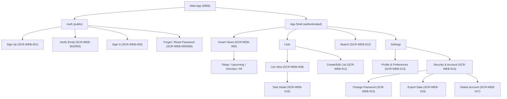
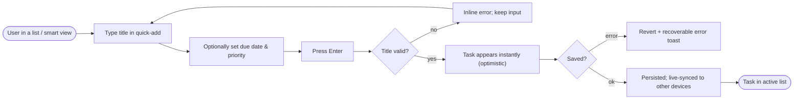
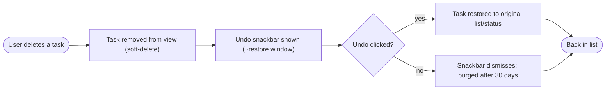
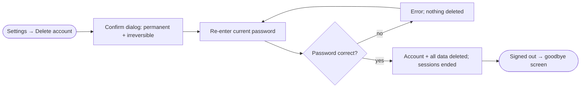

# UX Foundations: To-Do List Application

> Status: Draft · Last updated: 2026-07-15
> Sources: docs/srs.md (v1.0) · docs/architecture.md · docs/use-cases.md
> Design system: **docs/design.md + docs/tokens.json** (single source of truth for
> all design values — this document references, never restates)

## 1. Overview

A multi-user, web-based personal task manager where each user privately manages
tasks organized into named lists, with due dates, priorities, search, and smart
views. This document defines the UX structure and design foundations.

**UI surfaces (1):**
- **Web App** (`WEB`) — the responsive web application, for the Registered User
  (day-to-day task management) and the Visitor (account access). The only surface;
  the SRS excludes an in-app admin console for the MVP.

**Design-source mode:** research — a "Fresh Calm" direction (teal + amber),
proposed and confirmed. Component framework: **shadcn/ui**; icons: **Lucide**.

---

## Part A — Shared Core (summary; authority lives in design.md)

### A1. Brand and visual direction
Fresh, friendly, and calm — a light productivity tool that keeps focus on the
tasks. Cool-white surfaces, a confident teal for action/completion, warm amber
for small emphasis, rounded corners, soft shadows, adaptive density, and
first-class light **and** dark themes (FR-PROF-004). Full visual personality:
**design.md §1**. Provenance (research mode, confirmed direction): **design.md §9**.

### A2. Voice and tone
**Playful, warm, and brief**, flexing down to plain and reassuring for errors and
destructive actions. "Inbox zero. Go enjoy your day. 🎉" — but never a joke in a
delete confirmation. Full microcopy rules and do/don't pairs: **design.md §6**.

### A3. Design language summary
A cool-neutral slate palette on near-white surfaces with a teal primary and amber
accent; Inter across a modular 8-step type scale; a 4px-based spacing system;
8–12px radii and soft shadows; adaptive (comfortable→compact) density. **Tokens:
design.md §2 / tokens.json. Components and states: design.md §4.** No values here.

### A4. Accessibility standard
Built to **WCAG 2.2 AA** (contrast, visible focus, 44px touch targets, full
keyboard operability, semantic structure, reduced-motion) as the working
guideline. Per **NFR-USE-004** the MVP commits to accessibility *best practices*
rather than formal AA certification; the system is nonetheless built to AA so
that bar stays reachable (see Part D). Realizes **NFR-USE-002** (confirm
destructive actions) and **NFR-USE-003** (loading/empty/error states everywhere).
Mechanical rules: **design.md §5**.

### A5. Cross-surface principles
Product-wide interaction rules (single surface today, but the conventions that
keep behavior predictable):
- **Optimistic updates.** User actions (add, complete, edit) reflect instantly;
  the server reconciles, and cross-device changes arrive via live sync
  (architecture ADR-006). On failure, revert and show a recoverable error
  (NFR-REL-004).
- **Destructive actions are always confirmed** (NFR-USE-002) — delete list, delete
  account, and delete-list-with-tasks use a `confirm-dialog`; account deletion also
  re-enters the password (FR-DATA-004).
- **Soft-delete has undo.** Deleting a task shows an undo snackbar for the restore
  window (FR-TASK-013/014).
- **Consistent terminology & iconography.** Task, List, Inbox, and the smart-view
  names (Today, Upcoming, Overdue, All) are used verbatim everywhere; one icon per
  concept (Lucide).
- **Every data view has loading / empty / error states** with context-specific,
  playful empty copy (NFR-USE-003).

---

## Part B — Surfaces

### B1. Web App — surface code `WEB`

#### Users and primary jobs
Traced to SRS §2.3:
- **Registered User** (SRS §2.3, primary persona) — broad technical range; wants
  speed and reliability. Jobs: (1) capture a task in seconds; (2) organize tasks
  into lists; (3) set due dates & priorities and stay on top of what's due; (4)
  complete/reopen tasks; (5) find tasks via search and smart views; (6) manage
  profile, preferences, and account (export/delete).
- **Visitor** (SRS §2.3, unauthenticated) — jobs: register, verify email, sign in,
  recover a forgotten password.
- **Operator** (SRS §2.3, out-of-band) — no UI in the MVP.

Device/responsive target: fully responsive web, 320px → desktop, latest two major
browsers (NFR-COMPAT-001/002); pointer and touch; light + dark themes.

#### Information architecture & navigation
Two zones: a **public auth zone** (no shell) and an **authenticated app shell**.
The app shell is a persistent left **sidebar** (drawer < md) listing the smart
views and the user's lists (with counts), a main **content column** showing the
selected view with a pinned quick-add, and a slide-in **task-detail panel**
(full-screen < md). Settings is a distinct area reached from the sidebar footer.
Navigation model rationale: a sidebar suits list-switching and scales to many
lists better than top nav; smart views sit above lists as the default entry points.



#### Key user flows

**Flow 1 — Sign up & verify [UC-001, UC-002].**
```mermaid
flowchart LR
    start(["Visitor opens Sign Up"]) --> form["Enter email + password"]
    form --> valid{"Valid & email free?"}
    valid -->|"no"| err["Show field error / offer sign-in"]
    err --> form
    valid -->|"yes"| create["Account created; Inbox provisioned"]
    create --> notice["'Check your email' notice (SCR-WEB-002)"]
    notice --> click["Visitor clicks email link"]
    click --> linkok{"Link valid & unexpired?"}
    linkok -->|"no"| resend["Expired result → resend (SCR-WEB-003)"]
    resend --> notice
    linkok -->|"yes"| verified["Verified → Sign In (SCR-WEB-004)"]
    verified --> done(["Signed in → app shell"])
```

**Flow 2 — Create a task [UC-009].**


**Flow 3 — Delete & undo a task [UC-012].**


**Flow 4 — Delete account [UC-016].**


#### Screen / page inventory

**The primary handoff to implementation-planning.** IDs are stable and never
renumbered. States listed are the ones each screen must design for.

| ID | Screen | Purpose | Key states | Traces (UC) |
| :-- | :----- | :------ | :--------- | :---------- |
| SCR-WEB-001 | Sign Up | Register with email + password | default, validating, field-error | UC-001 |
| SCR-WEB-002 | Verify Email — Notice | "Check your email" + resend | default, resend-sent, rate-limited | UC-001, UC-002 |
| SCR-WEB-003 | Verify Email — Result | Landing from the email link | success, expired/invalid | UC-002 |
| SCR-WEB-004 | Sign In | Authenticate | default, error, unverified-prompt | UC-003 |
| SCR-WEB-005 | Forgot Password | Request a reset link | default, submitted (neutral) | UC-005 |
| SCR-WEB-006 | Reset Password | Set a new password from link | default, invalid/expired, success | UC-005 |
| SCR-WEB-007 | App Shell | Sidebar + content + detail host | loading, ready | (frame for all app UCs) |
| SCR-WEB-008 | List View | Tasks within a selected list + quick-add | loading, empty, populated, error | UC-009/010/011/012 |
| SCR-WEB-009 | Smart View | Today / Upcoming / Overdue / All aggregate | loading, empty, populated | UC-014 |
| SCR-WEB-010 | Task Detail | View/edit a task (panel / full-screen) | loading, viewing, editing, error | UC-004/010/011 |
| SCR-WEB-011 | Create/Edit List | Create, rename, delete a list (dialog) | default, validation-error, delete-confirm | UC-008 |
| SCR-WEB-012 | Search | Keyword search + filters overlay | idle, loading, results, empty | UC-013 |
| SCR-WEB-013 | Settings — Profile & Preferences | Display name, timezone, theme | default, saving, error | UC-007 |
| SCR-WEB-014 | Settings — Security & Account | Hub: change password, export, delete | default | UC-006/015/016 |
| SCR-WEB-015 | Change Password | Set a new password while signed in | default, error, success | UC-006 |
| SCR-WEB-016 | Export Data | Confirm + download JSON export | default, preparing, ready | UC-015 |
| SCR-WEB-017 | Delete Account | Confirm + password re-entry + delete | default, password-error, confirmed | UC-016 |
| SCR-WEB-018 | First-run / Onboarding | New account with only Inbox — encourage first task | default (empty) | UC-001/009 |
| SCR-WEB-019 | Error / Not Found | 404 and generic error page | not-found, generic-error | (system) |

#### Surface-specific components
Beyond the shared core (full specs in **design.md §4**): `app-shell`,
`sidebar-nav-item` (with count + selected state), `task-row` (checkbox, title,
due chip, priority dot, drag handle), `quick-add` composer, `task-detail-panel`,
`due-date-picker`, `priority-selector`, `list-picker`, `command-search`, and the
`undo-snackbar` variant of toast.

#### Token overrides
No palette or scale overrides — the single surface uses the core directly. The one
surface-level rule is **adaptive density** (comfortable/touch by default, compact
row heights ≥ lg with a pointer), specified in **design.md §3**. This is a
responsive behavior of the core tokens, not a separate token set.

---

## Part D — Open Questions and Risks

- **Accessibility commitment (Q).** The system is built to WCAG 2.2 AA, but the SRS
  (NFR-USE-004) commits only to best-practice, not formal AA conformance. Confirm
  whether formal AA becomes a post-MVP goal (SRS Appendix B, Q5). No design change
  either way — this is a testing/commitment decision.
- **Empty-state / illustration style** is undefined (icon-led placeholders
  assumed). Decide an illustration approach before building onboarding and empty
  states (design.md Known Gaps).
- **Adaptive-density breakpoint** (where rows compact) defaulted to `lg` — validate
  with real content once lists are populated.
- **Onboarding depth.** MVP assumes a light first-run empty state (SCR-WEB-018),
  not a guided wizard (onboarding was not a specified capability area). Confirm
  that a single encouraging empty state is sufficient.
- **Smart-view + list nav density.** Users with many lists may need
  grouping/collapse in the sidebar; not designed for the MVP — revisit if list
  counts grow.
- **Assumption:** Inter as the UI font (licensing/loading is an implementation
  choice; see design.md Known Gaps).
